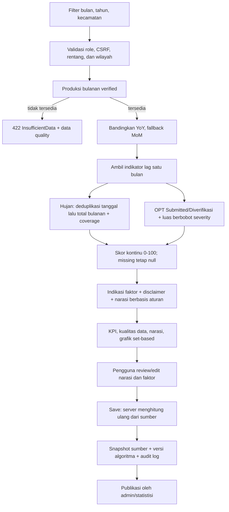
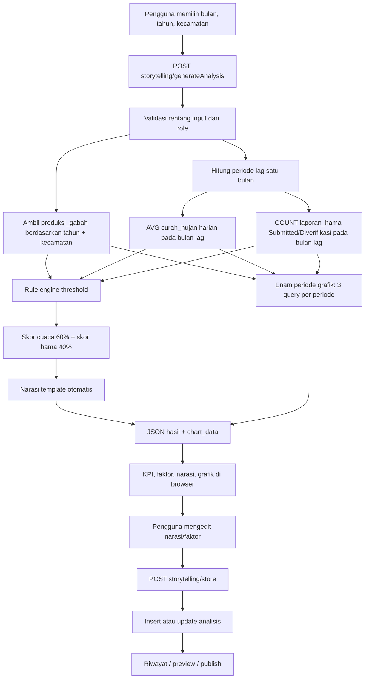

# Audit Logika Fitur Data Storytelling

Tanggal audit: 11 Agustus 2026  
URL: `http://localhost/jagapadi-3509/storytelling`  
Lingkup: logika bisnis, aliran data, transformasi server/client, ketahanan data, performa, dan keandalan hasil analisis.

> Status dokumen: bagian temuan di bawah merekam baseline sebelum perbaikan.
> Remediasi algoritma versi `2.0.0` telah diterapkan dan diverifikasi pada tanggal
> yang sama; ringkasannya ada pada bagian 0.

## 0. Status Remediasi

| Temuan baseline | Perbaikan yang diterapkan | Verifikasi | Status |
|---|---|---|---|
| Hujan harian dibandingkan ambang bulanan | Deduplikasi per tanggal, `AVG` antar-observasi pada hari yang sama, lalu `SUM` menjadi mm/bulan; coverage minimal 70% | Boundary dan outlier unit test; integration fixture | Selesai |
| Produksi tahunan dipakai sebagai produksi bulanan | Migration menambahkan `bulan`; analisis hanya memakai baris bulanan `verified`; data tahunan lama tetap `NULL` dan tidak difabrikasi | Insufficient-data integration test | Selesai |
| Tidak ada outcome perubahan | Hitung YoY, dengan fallback MoM, beserta persentase dan periode pembanding | Integration test dan snapshot persistensi | Selesai |
| Missing diubah menjadi nol | Missing dipropagasikan sebagai `null`; periode tanpa outcome/indikator minimum mengembalikan `InsufficientData` | Unit dan HTTP 422 test | Selesai |
| Skor diskontinu/bias faktor pertama | Skor kontinu, dibatasi 0-100, bobot dinormalisasi berdasarkan indikator tersedia, dan faktor kombinasi didukung | 8 unit test / 17 assertion | Selesai |
| Klaim sebab/korelasi tidak didukung | Output dan UI diubah menjadi “indikasi hubungan”; disclaimer eksplisit bahwa hasil bukan bukti kausalitas | Pemeriksaan response/view | Selesai |
| Grafik tidak diinisialisasi dan memakai N+1 | `initChart()` dipanggil; seri 1-24 bulan diambil lewat tiga query set-based | JavaScript syntax check dan integration test | Selesai |
| Save mempercayai payload client | Client hanya mengirim periode, override, dan narasi final; service menghitung ulang semua angka di server | Create/update integration test | Selesai |
| Update/publish/detail/API rusak | Jalur create, update, publish, detail riwayat, statistik, dan seluruh adapter API diimplementasikan | Integration test dan authenticated HTTP smoke test | Selesai |
| Query full scan | Index komposit produksi, hujan, dan OPT ditambahkan | `EXPLAIN` memakai `idx_story_*` dan estimasi 1/31/1 baris | Selesai |
| State lama/XSS/error handling client | Filter berubah menandai hasil stale, tombol dinonaktifkan, request balapan diabaikan, output dinamis di-escape/text node, timeout konsisten | Review deterministik dan HTTP smoke test | Selesai |

Hasil regresi akhir: **33 test, 113 assertion, seluruhnya lulus** pada PHP
8.2.32. Smoke test terautentikasi menghasilkan page `200`, chart `200`, data tidak
lengkap `422`, statistik API berhasil, dan mutasi API tanpa CSRF ditolak `403`.
Fixture pengujian dijalankan di dalam transaksi dan di-rollback; pemeriksaan akhir
menunjukkan tidak ada baris fixture produksi bulanan atau analisis yang tertinggal.

### Dependensi Data yang Tetap Harus Dipenuhi

Database lokal saat verifikasi mempunyai `0` baris produksi bulanan terverifikasi.
Migration sengaja tidak membagi atau menyalin angka tahunan ke 12 bulan karena itu
akan menghasilkan data palsu. Sampai pipeline/import resmi mengisi kombinasi
`kecamatan_id + tahun + bulan + status=verified`, fitur akan menampilkan pesan
“data tidak cukup” secara benar, bukan membuat interpretasi menyesatkan.

Threshold versi 2.0.0 masih berupa rule bisnis awal. Sebelum hasil dipakai untuk
kebijakan resmi, threshold hujan/OPT perlu dikalibrasi lewat backtest terhadap
riwayat produksi bulanan yang representatif. Coverage pelaporan OPT juga belum
tersedia, sehingga nol laporan tidak dianggap sebagai bukti nol serangan.

### Alur Aktif Setelah Remediasi

## 1. Ringkasan Eksekutif

Fitur saat ini **belum layak dipakai sebagai dasar interpretasi sebab perubahan produksi**. Antarmuka dan struktur respons telah membentuk alur storytelling, tetapi keluaran analisis tidak memenuhi klaim bisnis "menjelaskan mengapa produksi naik atau turun" karena:

1. outcome produksi tidak dihitung sebagai perubahan bulanan; sumber `produksi_gabah` hanya memiliki dimensi tahun dan kecamatan;
2. seluruh 1.333 kelompok data hujan kecamatan-bulan lokal jatuh di bawah ambang kering karena rata-rata hujan harian dibandingkan dengan ambang yang tampak dimaksudkan sebagai total bulanan;
3. tidak ada perhitungan korelasi atau kausalitas; implementasi hanya rule engine berbasis threshold tetap;
4. data hilang diubah menjadi angka nol dan kemudian dianggap sebagai kekeringan ekstrem;
5. grafik tidak pernah diinisialisasi di client;
6. update analisis dan publikasi memanggil metode yang tidak tersedia;
7. penyimpanan mempercayai hasil analisis yang dikirim ulang oleh client, sehingga skor dan fakta dapat dimanipulasi.

Status terhadap kriteria utama:

| Dimensi | Status | Kesimpulan |
|---|---|---|
| Akurasi | Gagal | Dimensi waktu dan satuan tidak kompatibel; missing data diperlakukan sebagai fakta |
| Keandalan | Gagal | Grafik, update, dan publish memiliki jalur rusak; state client dapat tercampur |
| Kecepatan | Perlu perbaikan | Default masih berjalan pada volume lokal, tetapi query hujan full scan dan grafik memakai pola N+1 |
| Kesesuaian bisnis | Gagal | Tidak menghitung kenaikan/penurunan produksi dan tidak mengukur hubungan statistik |
| Keamanan integritas | Gagal | Server menerima skor, indikator, dan narasi otomatis dari client tanpa rekalkulasi |

## 2. Metodologi dan Batasan Audit

Audit dilakukan melalui:

- penelusuran controller, service, view, JavaScript, route, dan migration;
- pemeriksaan skema dan kualitas database lokal secara read-only;
- eksekusi langsung fungsi skor melalui reflection dengan skenario normal, boundary, outlier, dan missing data;
- `EXPLAIN` terhadap tiga query utama;
- lint PHP 8.2 dan pemeriksaan sintaks JavaScript;
- pembukaan URL melalui browser lokal.

Browser diarahkan ke login karena tidak ada sesi autentikasi yang diberikan. Audit tidak mencoba membaca cookie atau menggunakan kredensial yang tidak diberikan. Oleh sebab itu, interaksi UI setelah login belum diuji secara end-to-end; temuan client setelah login ditetapkan dari alur kode deterministik.

## 3. Peta Alur Fitur

Catatan: node grafik, update, dan publish tidak sepenuhnya berfungsi pada implementasi aktual; rinciannya terdapat pada temuan.

## 4. Dependensi dan Transformasi Data

| Sumber | Granularitas aktual | Filter yang diterapkan | Transformasi | Pemakaian |
|---|---|---|---|---|
| `master_kecamatan` | Kecamatan | ID pilihan pengguna | Lookup nama; fallback pencocokan nama pada hujan | Filter dan narasi |
| `produksi_gabah` | Kecamatan-tahun; dapat lebih dari satu baris/status | `tahun`, `kecamatan_id`; **tanpa status** | `SUM(luas_panen)`, `SUM(produksi_total)`, rasio kedua sum | KPI luas panen dan narasi |
| `curah_hujan` | Tanggal-lokasi/sumber | Bulan/tahun lag dan `(kecamatan_id = ? OR lokasi LIKE ?)` | `AVG`, `MIN`, `MAX`, jumlah baris dan jumlah nilai >300 | Faktor cuaca dan skor |
| `laporan_hama` | Laporan kejadian | Bulan/tahun lag, kecamatan, status Submitted/Diverifikasi | Count per tingkat keparahan, sum luas, daftar OPT | Faktor hama dan skor |
| `analisis_produksi_bulanan` | Bulan-tahun-kecamatan | Unique periode/wilayah | Menyimpan sebagian snapshot hasil | Riwayat dan publikasi |
| Browser | State hasil terakhir | Filter UI | Animasi KPI, overlay tiga seri, edit narasi | Interpretasi pengguna |

Tidak ditemukan normalisasi statistik, koreksi outlier, standardisasi satuan, deduplikasi observasi, penilaian kelengkapan data, confidence interval, correlation coefficient, atau model kausal.

## 5. Temuan Prioritas

### P0 — Rata-rata hujan harian dibandingkan dengan ambang bulanan

Service menghitung `AVG(curah_hujan)` per baris harian, tetapi threshold menggunakan 50/200/300 mm. Pada database lokal:

- 40.579 baris hujan;
- 1.333 kelompok kecamatan-bulan;
- minimum rata-rata kelompok: 0,0058 mm;
- maksimum rata-rata kelompok: 18,8261 mm;
- **1.333 dari 1.333 kelompok** berada di bawah 50 mm;
- tidak ada satu kelompok pun pada band 50–200, 200–300, atau >300.

Dampak: semua periode dengan data hujan lokal dianggap kering/cuaca ekstrem. Skor cuaca tipikal untuk rata-rata 5,6 adalah 92/100. Faktor cuaca mendominasi hasil walaupun data sebenarnya dapat mewakili curah hujan harian normal.

Referensi: `DataStoryService.php:20-21`, `217`, `333-340`, `377-388`.

Rekomendasi:

1. tentukan definisi variabel: total hujan bulanan (`SUM`) atau rata-rata harian;
2. jika memakai total bulanan, gunakan `SUM(curah_hujan)` setelah deduplikasi tanggal/stasiun;
3. jika memakai rata-rata harian, kalibrasi ulang threshold dalam mm/hari;
4. lebih baik gunakan anomali terhadap klimatologi kecamatan-bulan: `(nilai - median historis) / MAD` atau persentil;
5. simpan satuan, jumlah hari tersedia, cakupan tanggal, dan sumber data pada output.

### P0 — Analisis “bulanan” memakai produksi tahunan dan mengabaikan bulan

Query produksi hanya memakai `tahun` dan `kecamatan_id`; parameter `$bulan` tidak masuk query. Skema `produksi_gabah` juga tidak mempunyai bulan atau tanggal panen. Akibatnya:

- memilih Januari atau Desember pada kecamatan/tahun yang sama menghasilkan angka produksi identik;
- enam batang produksi pada grafik dalam satu tahun mengulang total tahunan yang sama;
- data tahunan dibandingkan dengan hujan/hama satu bulan tertentu, sehingga dimensi waktu tidak kompatibel;
- sistem tidak pernah menghitung perubahan produksi dari periode pembanding.

Lebih jauh, query tidak memfilter status. Data lokal berisi 62 baris verified, 82 pending, dan 67 rejected. Contoh kecamatan 24 tahun 2023 menghasilkan luas 6.997,23 dari status pending/rejected, sedangkan luas verified adalah 0.

Dampak: grafik dan narasi dapat menyatakan sebab suatu “perubahan bulanan” yang tidak pernah dihitung dan bersumber dari data yang belum valid atau ditolak.

Referensi: `DataStoryService.php:133-170`, `StorytellingController.php:504-516`, schema `produksi_gabah`.

Rekomendasi:

1. buat migration untuk outcome bulanan yang eksplisit (`periode_bulan` atau `tanggal_panen`) bila data memang tersedia;
2. gunakan hanya data `verified` untuk analisis resmi;
3. hitung outcome seperti perubahan month-over-month, year-over-year, atau deviasi dari baseline musiman;
4. jika data produksi hanya tahunan, ubah fitur menjadi analisis tahunan dan agregasikan faktor eksogen ke periode agronomis yang sesuai.

### P0 — Missing data dianggap sebagai kekeringan ekstrem

Saat hujan tidak tersedia, service mengembalikan nilai 0 dan `has_data=false`. Rule engine dan skor mengabaikan `has_data`, membaca 0 sebagai hujan <50, lalu menetapkan “Cuaca Ekstrem”. Skenario uji missing data menghasilkan:

- skor cuaca 95;
- skor hama 0;
- skor total 57;
- rule utama secara deterministik menjadi kekeringan/cuaca ekstrem.

Data produksi yang hilang juga tetap menghasilkan narasi “Luas panen ... tercatat 0 Ha” dan penyebab tertentu, bukan status “tidak cukup data”.

Rekomendasi: gunakan `null`, bukan nol, untuk missing; hentikan analisis jika outcome tidak ada; keluarkan `insufficient_data` jika coverage indikator tidak memenuhi ambang; jangan menghasilkan faktor atau skor tanpa data minimum.

### P0 — Klaim korelasi/kausalitas tidak didukung perhitungan

Label halaman menyebut “Analisis Kausalitas” dan grafik disebut “Korelasi”, tetapi implementasi:

- tidak menghitung korelasi Pearson/Spearman;
- tidak menghitung perubahan outcome;
- tidak memakai periode pembanding atau baseline;
- tidak mengontrol musim, luas tanam, varietas, irigasi, atau faktor perancu;
- tidak menguji signifikansi atau confidence;
- hanya memilih faktor dari urutan `if` dengan prioritas cuaca.

Rule cuaca diperiksa sebelum hama, sehingga ketika keduanya tinggi, cuaca selalu menjadi “penyebab utama”. Ini adalah prioritas kode, bukan bukti dominasi data.

Rekomendasi: sampai metodologi tervalidasi, ubah istilah menjadi “indikasi faktor terkait”. Definisikan outcome, feature lag, baseline, minimum sample, serta metode validasi sebelum menggunakan istilah kausalitas.

### P1 — Grafik tidak pernah diinisialisasi

`initChart()` didefinisikan tetapi tidak dipanggil oleh `init()`. `updateChart()` langsung kembali ketika `state.correlationChart` masih null. Canvas tersedia, tetapi tidak pernah memiliki instance Chart.js.

Dampak: panel grafik kosong meskipun endpoint mengirim `chart_data`.

Referensi: `storytelling-dashboard.js:72-88`, `198`, `487-496`.

Rekomendasi: panggil `initChart()` setelah cache DOM dan sebelum data pertama dimuat; tambahkan widget test yang memastikan instance chart dan tiga dataset terisi.

### P1 — Jalur update dan publish memanggil metode yang tidak ada

- `DataStoryService::saveAnalysis()` memanggil `updateAnalysis()`, tetapi kelas tidak mendefinisikan metode tersebut.
- `StorytellingController::publish()` memanggil `publishAnalysis()`, tetapi controller tidak mendefinisikannya.
- keduanya menangkap `Exception`, sedangkan pemanggilan metode tidak tersedia melempar `Error`; respons berpotensi menjadi fatal/HTML, bukan JSON terkontrol.

Dampak: penyimpanan kedua untuk periode yang sama dan proses publikasi gagal.

Referensi: `DataStoryService.php:489-514`, `StorytellingController.php:271-315`.

### P1 — Penyimpanan mempercayai payload analisis dari browser

Browser mengirim ulang seluruh `state.currentAnalysis`. Controller hanya memeriksa keberadaan enam field level atas, lalu service menyimpan nilai periode, luas, faktor, skor, indikator, dan narasi otomatis dari client.

Dampak: pengguna yang memiliki akses dapat mengubah skor atau angka melalui request manual. Hasil tersimpan tidak lagi mempunyai integritas atau reproduktibilitas.

Rekomendasi:

- client hanya mengirim periode, wilayah, faktor override, dan narasi final;
- server mengambil ulang sumber data dan menghitung ulang seluruh indikator/skor dalam transaksi;
- simpan versi algoritma, waktu snapshot, source IDs/checksum, coverage, dan actor;
- validasi nested schema, range skor, enum, kepemilikan wilayah, dan panjang narasi.

### P1 — Narasi final tidak tersimpan saat create dan state dapat tercampur

Migration menyediakan `narasi_final`, controller membersihkannya, tetapi `createAnalysis()` tidak memasukkan kolom itu. Selain itu:

- hasil analisis baru hanya menyalin narasi otomatis ke editor bila editor masih kosong;
- setelah analisis pertama, analisis kedua dapat mempertahankan narasi final lama;
- perubahan filter hanya memperbarui grafik, sedangkan KPI/narasi/currentAnalysis tetap hasil lama;
- preview mengambil nama kecamatan dari filter saat ini tetapi periode/skor dari currentAnalysis lama.

Dampak: pengguna dapat menyimpan atau mencetak narasi yang berasal dari periode/wilayah berbeda.

Rekomendasi: ikat state pada immutable analysis key `(bulan,tahun,wilayah)`; tandai hasil stale saat filter berubah; reset editor pada analisis baru atau minta konfirmasi; cegah save/preview sampai analisis sesuai filter aktif.

### P1 — Fungsi statistik dan publikasi tidak konsisten dengan schema

`getInitialStats()` membaca `is_published`, sedangkan tabel hanya memiliki `status_analisis`. Query gagal dan fallback selalu mengembalikan nol. Tombol riwayat `viewAnalysis()` hanya melakukan `console.log`. API storytelling alternatif di `app/controllers/Api/StorytellingController.php` seluruhnya masih `notImplemented`.

Rekomendasi: pilih satu surface API resmi; samakan kontrak dengan schema; implementasikan detail, update, publish, dan test transisi status.

### P1 — Skor mempunyai diskontinuitas besar pada boundary

Hasil uji fungsi skor aktual:

| Skenario | Hujan | Skor cuaca | Skor total tanpa hama |
|---|---:|---:|---:|
| Missing dipetakan ke nol | 0 | 95 | 57 |
| Tipikal data lokal | 5,6 | 92 | 55 |
| Tepat di bawah batas kering | 49,99 | 70 | 42 |
| Tepat pada batas kering | 50 | 10 | 6 |
| Referensi normal | 150 | 20 | 12 |
| Tepat 300 | 300 | 50 | 30 |
| Tepat di atas 300 | 300,01 | 60 | 36 |
| Outlier + hama maksimum | 10.000 | 100 | 100 |

Perubahan 0,01 mm di sekitar 50 menurunkan skor cuaca 60 poin. Skor juga bukan monotonic risk di rentang normal: 50 memberi 10, sedangkan 150 memberi 20.

Rekomendasi: gunakan fungsi kontinu yang tervalidasi, idealnya percentile/anomaly berbasis distribusi lokal. Tambahkan property-based test untuk continuity, monotonicity per sisi optimum, bounds 0–100, dan missing propagation.

### P2 — Outlier dan kualitas sumber tidak ditangani

AVG mentah sensitif terhadap duplikasi dan outlier. Kolom `satuan` dan `sumber_data` ada tetapi tidak difilter atau dinormalisasi. Tidak ada validasi jumlah hari, kelengkapan satu bulan, satu observasi per tanggal/stasiun, maupun konflik antar-sumber.

Rekomendasi: canonicalize ke mm, deduplikasi berdasarkan sumber/lokasi/tanggal, agregasi stasiun secara eksplisit, winsorize atau median/MAD bila tepat, dan tampilkan coverage/quality badge.

### P2 — Jumlah laporan hama mengukur aktivitas pelaporan, bukan paparan risiko

Threshold hama memakai count absolut per kecamatan. Kecamatan besar atau petugas aktif akan tampak lebih berisiko. `total_luas_serangan` dihitung tetapi tidak digunakan dalam faktor/skor.

Rekomendasi: gunakan severity-weighted affected area, rasio terhadap luas tanam/panen, deduplikasi kejadian, dan indikator coverage pelaporan. Kalibrasi threshold per wilayah/musim.

### P2 — Query hujan full scan dan grafik memakai N+1

`EXPLAIN` database lokal menunjukkan query hujan bertipe `ALL`, tanpa possible key, membaca sekitar 39 ribu baris. Penyebab utama:

- `MONTH(tanggal)` dan `YEAR(tanggal)` tidak sargable;
- kondisi `OR lokasi LIKE '%nama%'`;
- kolom `kecamatan_id` aktual tidak memiliki index aktif.

Grafik enam bulan menjalankan tiga query per periode (18 query), di luar query analisis utama. Parameter `months` tidak dibatasi, sehingga endpoint dapat dipaksa menjalankan jumlah query arbitrer.

Rekomendasi:

- gunakan rentang `tanggal >= :start AND tanggal < :end`;
- selesaikan mapping kecamatan saat ingestion, bukan fuzzy LIKE saat analisis;
- index komposit `curah_hujan(kecamatan_id, tanggal)` dan `laporan_hama(kecamatan_id, tanggal, status)`;
- ambil seluruh seri enam bulan dengan satu grouped query per sumber;
- clamp `months`, misalnya 1–24;
- ukur p50/p95 latency dan cache berdasarkan filter + versi data.

### P2 — Rendering client membuka risiko XSS

Pesan error server, narasi final, dan data riwayat dimasukkan melalui `innerHTML` tanpa escaping. Walaupun akses dibatasi, narasi final memang input pengguna dan recent analyses berasal dari database.

Rekomendasi: bangun DOM dengan `textContent`, escape output, dan hapus inline `onclick`. Pertahankan CSP yang membatasi script inline bila arsitektur memungkinkan.

### P3 — Detail operasional tidak konsisten

- timeout fetch adalah 30 detik, tetapi warning loading baru muncul setelah lima menit sehingga tidak pernah tercapai;
- `BASE_URL` sudah berakhiran slash namun JavaScript menambahkan slash lagi;
- pesan existing analysis menyebut dapat menyimpan sebagai analisis baru, padahal unique key dan service menerapkan upsert;
- langkah log ditulis “Step 6/5”.

## 6. Hasil Uji Robustness

| Skenario | Hasil aktual | Penilaian |
|---|---|---|
| Data normal sintetis, hujan 150, tanpa hama | Skor total 12 | Formula berjalan, tetapi threshold belum terkalibrasi terhadap data lokal |
| Data lokal tipikal, hujan rata-rata 5,6 | Skor total 55 dan rule kekeringan | Salah dimensi/satuan |
| Outlier hujan 10.000 + 100 laporan berat | Skor dibatasi 100 | Tidak overflow, tetapi outlier tidak ditandai dan dapat mendominasi |
| Hujan tidak tersedia | Skor total 57; dianggap kering | Gagal membedakan missing dari zero |
| Produksi tidak tersedia | Narasi tetap dapat dibuat dengan 0 Ha | Harusnya insufficient data |
| Boundary 49,99 → 50 | Skor total 42 → 6 | Diskontinuitas tidak stabil |
| Januari | Lag berpindah ke Desember tahun sebelumnya | Rollover kode benar |
| Produksi pending/rejected | Tetap ikut SUM | Melanggar integritas analisis resmi |
| Save kedua periode sama | Memanggil metode tidak tersedia | Gagal |
| Publish | Memanggil metode tidak tersedia | Gagal |
| Grafik | Chart instance null | Gagal render |

## 7. Evaluasi Tujuan Bisnis

Tujuan yang dinyatakan adalah membantu statistisi menjelaskan mengapa produksi naik/turun. Implementasi belum memenuhi tujuan tersebut karena outcome “naik/turun” tidak dihitung sama sekali. Sistem hanya menyebut luas panen total tahunan dan memilih salah satu label dari hujan/hama bulan sebelumnya.

Posisi yang aman untuk versi saat ini adalah **prototype rule-based narrative**, bukan mesin analisis kausal. Hasil tidak boleh dipublikasikan sebagai pernyataan resmi tanpa review manusia dan indikator kualitas data.

## 8. Rekomendasi Arsitektur Analisis

### Tahap 1 — Stabilkan fitur

1. Perbaiki init grafik, update, publish, penyimpanan narasi final, schema stats, dan detail riwayat.
2. Tolak analisis saat outcome tidak tersedia.
3. Propagasikan missing sebagai `null` dan `insufficient_data`.
4. Filter produksi verified.
5. Rekalkulasi server-side saat save.
6. Tambahkan contract test controller–service–JavaScript.

### Tahap 2 — Selaraskan data

1. Tetapkan grain analisis: bulanan atau tahunan.
2. Tambah migration periode produksi jika grain bulanan dipilih.
3. Buat tabel/fact view terkurasi untuk produksi, cuaca, OPT, dan coverage.
4. Simpan lineage: sumber, versi import, waktu ekstraksi, satuan, dan status verifikasi.
5. Definisikan data minimum per periode dan wilayah.

### Tahap 3 — Metodologi yang dapat dipertanggungjawabkan

Contoh desain bulanan:

- outcome: `% perubahan produksi YoY` atau deviasi dari median musiman;
- hujan: total bulanan, jumlah hari hujan, dry spell, extreme-day percentile, anomaly klimatologi;
- OPT: luas terdampak berbobot severity / luas tanam;
- lag: 1–3 bulan sesuai fase agronomi, bukan hanya lag tetap satu bulan;
- metode: model interpretable atau scoring tervalidasi dengan backtest;
- output: kontribusi faktor, confidence, coverage, kualitas data, dan disclaimer asosiasi.

Gunakan istilah “indikasi hubungan” sampai evaluasi temporal dan kontrol confounder mendukung klaim lebih kuat.

### Tahap 4 — Performa dan observability

1. Ganti query per bulan dengan agregasi set-based.
2. Tambahkan index komposit sesuai query.
3. Catat durasi per sumber, rows scanned, cache hit, dan penyebab insufficient data.
4. Tetapkan target, misalnya p95 generate <2 detik pada 24 bulan dan error rate <1%.
5. Cache hasil hanya dengan versioned data fingerprint dan invalidasi saat ingestion/verifikasi berubah.

## 9. Test Suite yang Disarankan

### Unit

- rainfall aggregation dan unit conversion;
- missing propagation;
- month/year rollover;
- score bounds, continuity, dan monotonicity;
- factor selection tanpa bias urutan;
- narrative untuk normal, outlier, missing, dan insufficient data;
- status production filter;
- client state invalidation saat filter berubah.

### Integration

- fixture normal lengkap;
- data duplikat antar-sumber;
- outlier ekstrem;
- bulan tanpa hujan/hama/produksi;
- pending/rejected tidak masuk;
- save pertama, update, publish, archive;
- payload client yang dimanipulasi ditolak atau direkalkulasi;
- query count dan latency threshold.

### End-to-end

- login role yang diizinkan;
- pilih filter → generate → KPI/grafik/narasi konsisten;
- ubah filter menandai hasil lama sebagai stale;
- save dan reload riwayat;
- preview tidak mencampur wilayah/periode;
- error JSON, timeout, dan session expiry tidak menghasilkan layar rusak.

## 10. Artefak yang Diaudit

- `app/controllers/StorytellingController.php`
- `app/services/DataStoryService.php`
- `app/views/storytelling/index.php`
- `public/js/storytelling-dashboard.js`
- `app/models/MasterKecamatan.php`
- `app/controllers/Api/StorytellingController.php`
- `database/migrations/2026-01-01_create_analisis_produksi_bulanan.sql`
- `backend/database/migrations/015_create_produksi_gabah_and_bps.sql`
- `database/migrations/2026_08_01_add_kecamatan_id_to_curah_hujan.php`
- `index.php` dan `config/web_routes.php`

## 11. Kesimpulan

Fitur memiliki fondasi UI dan orkestrasi data yang dapat dikembangkan, tetapi logika analisis saat ini menghasilkan bias cuaca ekstrem secara sistemik, mencampur granularitas tahunan dan bulanan, serta belum menghitung korelasi/kausalitas. Prioritas pertama bukan penyempurnaan narasi, melainkan memperbaiki definisi data dan outcome, missingness, integritas penyimpanan, dan jalur fungsi yang rusak. Setelah itu barulah threshold/model dapat dikalibrasi dan divalidasi dengan backtest.
