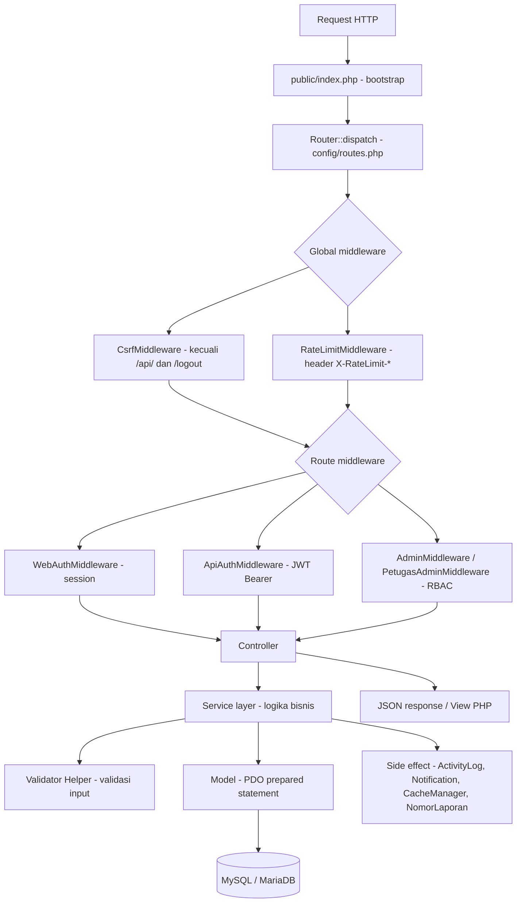
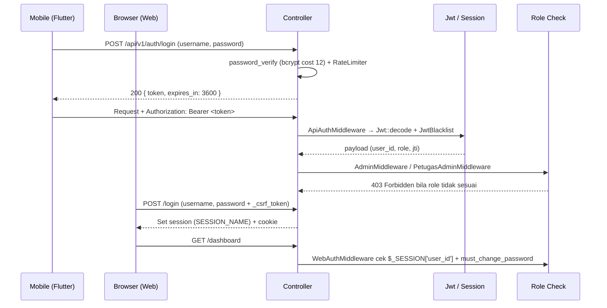
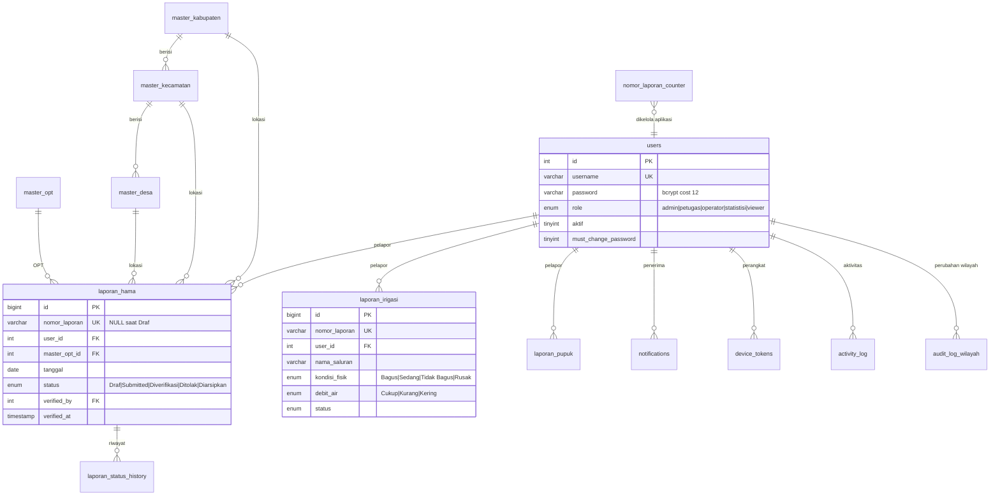
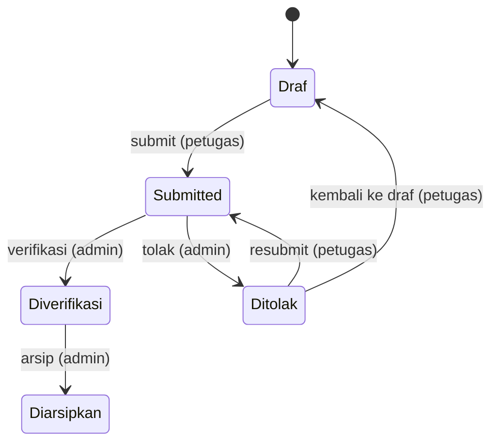

# Dokumentasi Backend JAGAPADI

> **Versi dokumen**: 1.0.0
> **Status**: Sesuai kode pada `main` (Migrasi 001–021, API v1, Playwright E2E 167/167 lulus)
> **Audience**: Developer, QA, Operator

---

# 1. Ringkasan Produk

## Apa yang dikerjakan aplikasi

JAGAPADI (Jember Agrikultur Gapai Prestasi Digital) adalah sistem pelaporan pertanian untuk Kabupaten Jember. Petugas lapangan membuat dan mengirim laporan serangan hama/OPT, kondisi irigasi, penggunaan pupuk, hasil panen, cuaca, serta ketersediaan alat-sarana melalui aplikasi mobile Flutter (API JWT). Admin memverifikasi laporan yang masuk melalui web admin (session + CSRF), lalu hasilnya ditampilkan sebagai statistik, peta, dan data ekspor di dashboard.

## Masalah yang diselesaikan

Proses pelaporan kondisi pertanian yang sebelumnya manual dan tersebar distandarkan menjadi satu alur digital: draf tersimpan di server (offline-first), laporan memiliki status yang dapat diaudit (`Draf → Submitted → Diverifikasi/Ditolak → Diarsipkan`), setiap laporan memiliki nomor unik, dan statistik hanya menghitung laporan yang valid (draf tidak ikut serta secara default).

## Siapa penggunanya

| Pengguna | Akses |
|----------|-------|
| Admin | Verifikasi laporan, kelola master wilayah & OPT, dashboard penuh, ekspor |
| Petugas | CRUD laporan milik sendiri (draf/submit/resubmit), tidak boleh verifikasi |
| Operator | Membuat laporan (sama seperti petugas) |
| Statistisi | Membaca dashboard/statistik/ekspor |
| Viewer | Hanya membaca |
| API client | Mobile Flutter (JWT Bearer) |

## Batasan scope

- Tidak ada modul manajemen pengguna penuh di web (belum terlihat di `config/routes.php`; hanya ganti password & profil).
- Push notification FCM berjalan dalam mode `NullPushNotifier` (nonaktif) sampai `FCM_ENABLED=true` dan `FCM_SERVER_KEY` diisi (lihat `backend/app/Services/Push/`).
- Mobile Flutter berada di `mobile/` dan tidak dibahas mendalam di dokumen ini.
- Tidak ada queue/job worker dan cron scheduler; semua proses berjalan sinkron dalam satu request.

---

# 2. Arsitektur

## 2.1 Diagram alur request



## 2.2 Pola yang dipakai

| Pola | Implementasi |
|------|--------------|
| MVC ringan (tanpa framework) | `app/Controllers/{Api,Web}`, `app/Models`, `app/Views`; autoload PSR-4 `App\` → `backend/app/` |
| Service layer | `app/Services/*Service.php` — memuat semua logika bisnis (validasi transisi status, generate nomor, notifikasi, cache) |
| Validator helper | `app/Helpers/*Validator.php` — `validateDraft()` vs `validateSubmit()` per jenis laporan |
| Middleware chain | `app/Middleware/` — dieksekusi berurutan oleh `Router::runMiddleware()` (global → route) |
| Front controller | `public/index.php` + rewrite `.htaccess` ke `index.php` |
| Cache file | `Core/CacheManager.php` — serialized file di `storage/cache`, TTL default 300 detik |
| Tidak ada event/queue/repository | Semua pemanggilan sinkron |

## 2.3 Alur autentikasi dan otorisasi



- **Web**: session PHP + CSRF token (field `_csrf_token` atau header `X-CSRF-TOKEN`). `CsrfMiddleware` mengecualikan `/logout` dan seluruh `/api/`.
- **API**: JWT HS256 (`Core/Jwt.php`), klaim `iat`, `exp` (default `JWT_EXPIRY=3600`), `jti` acak (untuk blacklist). `ApiAuthMiddleware` memuat user ke `$GLOBALS['auth_user']`.
- **Ownership**: layanan laporan hanya mengambil data milik user pemilik untuk role non-admin (`LaporanHama::findAccessibleById`, dsb.).

## 2.4 Integrasi eksternal

| Integrasi | Status di kode | File |
|-----------|----------------|------|
| Firebase Cloud Messaging (push) | Nonaktif default (`NullPushNotifier`); aktif bila `FCM_ENABLED=true` | `app/Services/Push/{PushNotifierInterface,NullPushNotifier,FcmPushNotifier}.php`, `app/Models/DeviceToken.php` |
| Tile peta OpenStreetMap (Leaflet) | Diizinkan via CSP `img-src https://*.tile.openstreetmap.org` | `public/index.php` (header CSP), view dashboard |
| Data BPS / produksi gabah | Tabel seed dari migrasi (belum ada API publik) | `database/migrations/015_create_produksi_gabah_and_bps.sql`, `017_alter_data_pertanian_bps_add_columns.sql` |
| PWA (manifest + service worker) | Aset statis | `public/manifest.json`, `public/sw.js` |

---

# 3. Prasyarat dan Instalasi

## 3.1 Prasyarat

| Komponen | Versi | Catatan |
|----------|-------|---------|
| PHP | 8.2+ | Extension wajib: `pdo_mysql`, `mbstring`, `fileinfo`, `json`; `gd` atau `imagick` bila kompresi gambar aktif |
| Composer | 2.x | Untuk dependency `pclzip/pclzip` (produksi) dan `phpunit/phpunit ^11` (dev) |
| Database | MySQL 8.0+ / MariaDB 10.6+ | Charset `utf8mb4`, collation `utf8mb4_unicode_ci` |
| Node.js (opsional) | 18+ | Hanya untuk suite E2E Playwright di `e2e/` |
| Web server | PHP built-in (local) / Apache cPanel (production) | Document root = `backend/public` |

## 3.2 Langkah instalasi (local, Laragon)

```bash
git clone <repository-url> jagapadi-3509
cd jagapadi-3509/backend

# 1. Dependency
composer install

# 2. Konfigurasi
cp .env.example .env
# lalu isi DB_NAME=jagapadi_local, DB_USER, DB_PASS, JWT_SECRET (min 64 karakter)

# 3. Buat database
mysql -u root -e "CREATE DATABASE IF NOT EXISTS jagapadi_local CHARACTER SET utf8mb4 COLLATE utf8mb4_unicode_ci;"

# 4. Migrasi & seed (seed hanya untuk APP_ENV=local/development)
php scripts/migrate.php
php scripts/seed.php

# 5. Jalankan server
php -S localhost:8080 -t public
```

> Catatan: proyek ini tidak memakai Laravel, sehingga tidak ada `php artisan key:generate`. `JWT_SECRET` dibuat manual:
> `php -r "echo bin2hex(random_bytes(32));"`

## 3.3 Checklist verifikasi

| No | Cek | Cara |
|----|-----|------|
| 1 | Aplikasi terbuka | Buka `http://localhost:8080/login` → muncul form login |
| 2 | Login berhasil | Login sebagai admin / petugas → redirect ke `/dashboard` |
| 3 | Migrasi jalan | `php scripts/migrate.php` tidak error; tabel `schema_migrations` berisi 21 baris |
| 4 | Health check | `curl http://localhost:8080/api/v1/health` → `{"success":true,...,"database":"connected"}` |

---

# 4. Konfigurasi

## 4.1 Variabel lingkungan (`backend/.env.example`)

| Nama | Wajib | Contoh | Dampak jika salah |
|------|-------|--------|-------------------|
| `APP_NAME` | Opsional | `JAGAPADI` | Nama tampilan pada response/health |
| `APP_ENV` | Wajib | `local` / `production` | `production` memblokir `scripts/seed.php`; memengaruhi perilaku debug |
| `APP_DEBUG` | Wajib | `false` di produksi | `true` di produksi membocorkan detail error |
| `APP_BASE_URL` | Wajib | `http://localhost:8080` / `https://domain.tld` | Basis URL notifikasi & link |
| `APP_TIMEZONE` | Opsional | `Asia/Jakarta` | Waktu `created_at`, `nomor_laporan`, log |
| `DB_DRIVER` | Wajib | `mysql` | Driver PDO; selain mysql tidak didukung |
| `DB_HOST` | Wajib | `127.0.0.1` | Aplikasi tidak dapat terhubung DB |
| `DB_PORT` | Opsional | `3306` | Koneksi DB gagal bila salah |
| `DB_NAME` | Wajib | `jagapadi_local` | Semua query salah database / 500 |
| `DB_USER` / `DB_PASS` | Wajib | `root` / `(kosong)` | Koneksi DB ditolak |
| `DB_CHARSET` | Opsional | `utf8mb4` | Karakter non-ASCII korup bila diganti |
| `JWT_SECRET` | **Wajib** | 64+ karakter acak | `Core/Jwt.php` melempar `RuntimeException` bila < 32 karakter atau masih placeholder |
| `JWT_EXPIRY` | Opsional | `3600` | Masa berlaku token (detik) |
| `SESSION_NAME` | Opsional | `jagapadi_session` | Nama cookie sesi |
| `LOGIN_MAX_ATTEMPTS` | Opsional | `5` | Ambang brute-force login |
| `LOGIN_DECAY_SECONDS` | Opsional | `900` | Jendela waktu percobaan login (detik) |
| `TRUSTED_PROXIES` | Opsional | `127.0.0.1,::1` | Klien IP salah saat di belakang proxy |
| `APP_LOG_LEVEL` | Opsional | `debug` | Volume log di `storage/logs` |
| `CORS_ALLOWED_ORIGINS` | Opsional | `https://app.domain.tld` | Kosong = default dev (`localhost:8080`, `localhost:3000`, `10.0.2.2:8080`); request lintas-origin ditolak bila origin tidak terdaftar |
| `FCM_ENABLED` | Opsional | `false` | `true` tanpa key membuat push gagal |
| `FCM_SERVER_KEY` / `FCM_PROJECT_ID` | Opsional | — | Hanya dipakai saat FCM aktif; **jangan commit** |

## 4.2 File konfigurasi penting

| File | Peran | Kapan diubah |
|------|-------|--------------|
| `backend/config/routes.php` | Daftar seluruh route web & API + middleware | Saat menambah endpoint baru |
| `backend/.env` | Kredensial & parameter runtime (tidak pernah di-commit) | Saat deploy/ganti environment |
| `backend/phpunit.xml` | Konfigurasi PHPUnit (env `testing`) | Saat menambah test suite |
| `backend/composer.json` | Autoload PSR-4 `App\`, script `test`/`lint` | Saat menambah dependency/script |
| `backend/public/index.php` | Bootstrap: Env, Logger, CacheManager, header keamanan, CORS, CSP | Saat mengubah kebijakan keamanan/CORS |

---

# 5. Struktur Kode

## 5.1 Folder/file penting

| Path | Tanggung jawab | Jangan diubah jika… |
|------|----------------|---------------------|
| `backend/public/index.php` | Front controller, bootstrap, security headers, CORS, CSP | Ingin mengubah alur boot aplikasi |
| `backend/config/routes.php` | Registrasi seluruh route + middleware | Menambah route tanpa mengikutinya |
| `backend/app/Core/Router.php` | Pencocokan route `{param}` + eksekusi middleware berantai | Tidak memahami pola middleware global |
| `backend/app/Core/{Env,Database,Request,Response,ErrorHandler,Logger,CacheManager,Jwt,Security,Model}.php` | Infrastruktur dasar | Tidak ingin memutus kontrak yang dipakai semua controller |
| `backend/app/Controllers/Api/` | Handler API v1 (JSON, JWT) | Mengubah format envelope response |
| `backend/app/Controllers/Web/` | Handler web server-rendered (session, view) | Mengubah alur flash message/redirect |
| `backend/app/Services/` | Logika bisnis: status, nomor, notifikasi, cache, ekspor | Melewati validasi transisi status |
| `backend/app/Helpers/` | Validator per jenis laporan + utilitas (upload, CSV, status, nomor) | Mengubah aturan validasi tanpa disepakati |
| `backend/app/Models/` | Query PDO per tabel (prepared statement) | Memperkenalkan SQL mentah dari input |
| `backend/app/Middleware/` | CSRF, rate limit, auth web/API, RBAC | Menonaktifkan proteksi |
| `backend/app/Views/` | Template PHP server-rendered | Menghapus `htmlspecialchars()` pada output |
| `backend/database/migrations/` | Skema DB versi 001–021 | Mengubah migrasi yang sudah dieksekusi |
| `backend/database/seeds/` | Data master awal (SQL) | Menjalankan otomatis di produksi |
| `backend/scripts/{migrate,seed,lint,reset_passwords}.php` | Utilitas CLI | Menjalankan seed saat `APP_ENV=production` (sudah diblokir) |
| `backend/storage/{logs,cache}` | Log aplikasi & cache file (TTL 300 detik) | Menyimpan di luar folder ini (runtime) |

## 5.2 Pemetaan alur fitur utama

| Fitur | Route | Controller | Service | Model | View/Output |
|-------|-------|------------|---------|-------|-------------|
| Login web | `POST /login` | `Web\AuthController::login` | (inline) | `User` | redirect `/dashboard` |
| Login API | `POST /api/v1/auth/login` | `Api\AuthController::login` | (inline + `RateLimiter`) | `User` | JSON `{token, user}` |
| Buat draf hama | `POST /api/v1/laporan-hama` | `Api\LaporanHamaController::store` | `LaporanHamaService::createDraft` | `LaporanHama` | JSON `201 {id, status}` |
| Submit hama | `POST /api/v1/laporan-hama/{id}/submit` | `Api\LaporanHamaController::submit` | `LaporanHamaService::submitDraft` | `LaporanHama` + `NomorLaporanGenerator` + `nomor_laporan_counter` | JSON `200 {status: Submitted}` |
| Verifikasi | `POST /api/v1/laporan-hama/{id}/verifikasi` | `Api\LaporanHamaController::verify` | `LaporanHamaService::verify` | `LaporanHama`, `ActivityLog`, `Notification` | JSON `200 {status: Diverifikasi}` |
| Statistik dashboard | `GET /api/v1/dashboard/stats` | `Api\DashboardController::stats` | `DashboardService::stats` (+ `CacheManager`) | agregat SQL | JSON `{data}` |
| Ekspor CSV | `GET /api/v1/export/hama?format=csv` | `Api\ExportController::exportHama` | `ExportService` + `CsvWriter` | `LaporanHama` | File CSV (`Content-Disposition`) |
| Notifikasi | `GET /api/v1/notifications` | `Api\NotificationController::index` | `NotificationService` | `Notification` | JSON list |

---

# 6. Model Data

## 6.1 Konvensi

- Tabel `snake_case` (jamak untuk `users`, singular untuk lainnya per migrasi aktual), PK `id`, FK `fk_{tabel}_{kolom}`, index `idx_*`, unique `uk_*`, check `ck_*`.
- Charset `utf8mb4`/`utf8mb4_unicode_ci`, engine InnoDB, FK `ON DELETE RESTRICT` (kecuali `notifications`/`device_tokens` → `CASCADE`).
- Timestamp `created_at`/`updated_at` (DATETIME/TIMESTAMP, auto-update). Soft delete `deleted_at` didefinisikan di blueprint, tetapi **tidak terlihat di migrasi 001–021**.
- `nomor_laporan` **NULL saat Draf**, diisi saat submit.

## 6.2 ER diagram (entitas utama)



## 6.3 Tabel inti

### `users` (migrasi 003 + 012)
- **Tujuan**: akun semua role.
- **Kolom penting**: `username` (unique), `password` (bcrypt cost 12 — `User::hashPassword()`), `role` ENUM(`admin`,`petugas`,`operator`,`statistisi`,`viewer`) default `petugas`, `aktif`, `must_change_password`.
- **Relasi**: 1-N ke laporan, notifications, device_tokens, activity_log.
- **Validasi**: `PasswordValidator` (min 8, huruf besar/kecil, angka, karakter khusus) saat ganti password.

### `master_kabupaten` → `master_kecamatan` → `master_desa` (migrasi 002)
- **Tujuan**: hierarki wilayah (kode BPS di kolom `kode`).
- **Relasi**: kabupaten 1-N kecamatan 1-N desa. Kecamatan memiliki `latitude`/`longitude` (migrasi 013) dan index spasial (migrasi 019).
- **Catatan bisnis**: validator memaksa kabupaten = Jember (kode `3509`) pada laporan.

### `master_opt` (migrasi 004 + 016)
- **Tujuan**: master Organisme Pengganggu Tanaman.
- **Kolom penting**: `nama_opt`, `jenis` ENUM(`hama`,`penyakit`,`gulma`), `etl_acuan`, `foto_url`, `aktif`.
- **Akses**: write hanya admin.

### `laporan_hama` (migrasi 005) & `laporan_irigasi` (migrasi 006)
- **Tujuan**: laporan serangan OPT & kondisi irigasi.
- **Kolom penting**: `nomor_laporan` (unique, NULL saat draf), `user_id`, `tanggal`, `kabupaten/kecamatan/desa_id`, `latitude`/`longitude` (CHECK -90..90 / -180..180), `status`, `verified_by`, `verified_at`, `catatan_verifikasi`, `ip_pengirim`.
- **Field spesifik**: hama → `master_opt_id`, `tingkat_keparahan` ENUM(`Ringan`,`Sedang`,`Berat`), `luas_serangan` (CHECK 0..9999.99), `populasi`; irigasi → `nama_saluran`, `daerah_irigasi`, `kondisi_fisik` ENUM(`Bagus`,`Sedang`,`Tidak Bagus`,`Rusak`), `debit_air` ENUM(`Cukup`,`Kurang`,`Kering`).
- **Index**: `user_id`, `status`, `tanggal`, `kecamatan_id`, kombinasi `(status,tanggal)`.
- **Validasi**: `LaporanHamaValidator::validateDraft()` (tidak wajib apa pun, hanya format) vs `validateSubmit()` (wajib: tanggal, master_opt_id, kabupaten/kecamatan/desa, tingkat_keparahan, luas_serangan, populasi, dan **foto_url**).

### `laporan_pupuk`, `laporan_panen`, `laporan_cuaca`, `laporan_alat_sarana` (migrasi 021)
- **Tujuan**: empat jenis laporan tambahan, pola kolom identik dengan `laporan_hama` plus field spesifik (contoh pupuk: `jenis_pupuk`, `dosis`, `satuan_dosis`, `metode_aplikasi`).
- **Prefix nomor**: `LP`, `LPA`, `LC`, `LAS`.

### `notifications` (migrasi 009) & `device_tokens` (migrasi 010)
- Notifikasi in-app: `type` (`laporan_submitted`, `laporan_verified`, `laporan_rejected`, `laporan_resubmitted`, `laporan_archived`), `read_at` NULL = belum dibaca, `data_json` berisi `web_path`/`api_path`. FK `user_id` **CASCADE**.
- Device token FCM unik per token, FK CASCADE.

### `activity_log` (migrasi 007) & `audit_log_wilayah` (007/015)
- Log aksi (login, logout, aksi laporan) dan audit perubahan master wilayah (INSERT/UPDATE/DELETE dengan `data_lama`/`data_baru` JSON).

### `nomor_laporan_counter` (migrasi 007)
- Counter atomik per `(prefix, tanggal)`; dipakai `NomorLaporanGenerator` dalam transaksi. Format nomor: `{PREFIX}-{YYYYMMDD}-{0001}`.

### `laporan_status_history` (migrasi 020)
- Riwayat setiap perubahan status laporan.

## 6.4 Mesin transisi status (`app/Helpers/LaporanStatus.php`)



| Dari | Ke | Actor | Kode |
|------|-----|-------|------|
| Draf | Submitted | petugas | `submit` |
| Submitted | Diverifikasi / Ditolak | admin | `verifikasi` / `tolak` |
| Diverifikasi | Diarsipkan | admin | `archive` |
| Ditolak | Submitted / Draf | petugas | `resubmit` |

Aturan turunan: draf **tidak bisa** diverifikasi (`isVerifiable()` hanya `Submitted`); hanya `Draf`/`Ditolak` yang bisa diedit petugas; laporan hanya bisa diarsipkan dari `Diverifikasi`.

---

# 7. Modul dan Fitur

## 7.1 Auth Web

- **Tujuan**: login/logout admin & staf via browser.
- **Aktor**: semua role. **Permission**: publik untuk login; `WebAuthMiddleware` untuk halaman lain.
- **Alur**: GET `/login` → submit `POST /login` (username, password, `_csrf_token`) → `password_verify` → set session → redirect `/dashboard`. Bila `must_change_password=1`, semua halaman selain `/password/change` dan `/logout` redirect ke form ganti password.
- **Endpoint**: `GET /login`, `POST /login`, `GET|POST /logout` → `Web\AuthController`.
- **Validasi**: username & password wajib; percobaan gagal dibatasi `LOGIN_MAX_ATTEMPTS` dalam `LOGIN_DECAY_SECONDS` (HTTP 429).
- **Error**: 401/redirect login dengan `flash_error`; 429 terlalu banyak percobaan.
- **Side effect**: `ActivityLog::log('login'/'logout')`.
- **Uji manual**: login salah 5× → lihat pesan rate limit; logout → akses `/dashboard` → redirect `/login`.

## 7.2 Auth API (JWT)

- **Tujuan**: autentikasi mobile Flutter.
- **Endpoint**: `POST /api/v1/auth/login` (publik), `POST /api/v1/auth/refresh`, `POST /api/v1/auth/logout`, `POST /api/v1/auth/change-password`, `GET /api/v1/me` (semua `ApiAuthMiddleware`).
- **Alur**: login → `{token, token_type:"Bearer", expires_in}`; klaim `exp` = `iat + JWT_EXPIRY`; logout mencatat aktivitas (tidak ada revoke token stateless, kecuali blacklist `jti` via `JwtBlacklist`).
- **Error**: 401 `Unauthenticated` (tanpa token), 401 `TokenInvalid` (token rusak/expired/blacklist), 422 `ValidationError`, 429 rate limit.
- **Uji manual**:
  ```bash
  curl -s -X POST http://localhost:8080/api/v1/auth/login \
    -H "Content-Type: application/json" \
    -d '{"username":"admin","password":"<password>"}'
  ```

## 7.3 Laporan (Hama, Irigasi, Pupuk, Panen, Cuaca, Alat-Sarana)

- **Tujuan**: siklus hidup laporan: draf → submit → verifikasi → (arsip / tolak → resubmit).
- **Aktor**: petugas/operator/admin membuat; admin verifikasi; petugas pemilik hanya akses milik sendiri.
- **Alur bisnis**:
  1. `POST` (body `action:"draft"`) → simpan draf (status `Draf`, `nomor_laporan` NULL).
  2. `PUT` untuk memperbarui draf (hanya status `Draf`/`Ditolak`).
  3. `POST /submit` — menggabungkan data draf + payload, divalidasi `validateSubmit()` (termasuk **`foto_url` wajib**), transisi `Draf→Submitted`, generate `nomor_laporan` via counter atomik, buat notifikasi ke admin.
  4. Admin `POST /verifikasi` (`catatan`) → `Diverifikasi`; atau `POST /tolak` (`alasan` min 10 karakter) → `Ditolak`.
  5. Petugas `POST /resubmit` dari `Ditolak` → `Submitted`.
  6. Admin `POST /archive` dari `Diverifikasi` → `Diarsipkan`.
- **Endpoint (pola sama untuk 6 jenis, prefix `/api/v1/laporan-{jenis}`)**:
  `GET` list, `POST` store, `GET/{id}`, `PUT/{id}`, `DELETE/{id}`, `POST/{id}/submit`, `POST/{id}/verifikasi` (admin), `POST/{id}/tolak` (admin), `POST/{id}/archive` (admin), `POST/{id}/resubmit`, `POST/{id}/foto`, `POST/{id}/foto/delete`. Web: `/laporan-hama*`, `/laporan-irigasi*` (hama juga `/laporan` alias).
- **Validasi**: `app/Helpers/Laporan*Validator.php` — draft longgar, submit ketat (tanggal valid, wilayah valid & Jember, nilai ENUM, foto wajib).
- **Side effect**: `ActivityLog`, notifikasi in-app (`NotificationService`), invalidasi cache dashboard (`DashboardService::invalidateCache()`), upload foto (`SecureImageUploader`), generate nomor.
- **Error umum**: 422 validasi (foto wajib saat submit, alasan < 10 karakter saat tolak), 409 transisi status tidak diizinkan, 403 bukan pemilik/bukan admin, 404 tidak ditemukan.
- **Uji manual**:
  ```bash
  TOKEN=$(curl -s -X POST http://localhost:8080/api/v1/auth/login -H "Content-Type: application/json" -d '{"username":"petugas01","password":"<password>"}' | jq -r .data.token)

  # draf
  curl -s -X POST http://localhost:8080/api/v1/laporan-hama \
    -H "Authorization: Bearer $TOKEN" -H "Content-Type: application/json" \
    -d '{"action":"draft","tanggal":"2026-08-16","lokasi":"Blok C"}'

  # submit (foto wajib)
  curl -s -X POST http://localhost:8080/api/v1/laporan-hama/1/submit \
    -H "Authorization: Bearer $TOKEN" -H "Content-Type: application/json" \
    -d '{"foto_url":"https://cdn.jagapadi.id/foto/x.jpg"}'
  ```

## 7.4 Dashboard & Statistik

- **Tujuan**: KPI, chart, peta.
- **Aktor**: semua role login.
- **Endpoint API**: `GET /api/v1/dashboard/stats`, `GET /api/v1/dashboard/charts/{hama,irigasi}`, `GET /api/v1/dashboard/map/{hama,irigasi}` (GeoJSON). Web: `/dashboard`, `/dashboard/stats.json`, `/dashboard/charts/*.json`, `/dashboard/map/*`.
- **Kebijakan draf**: semua endpoint agregat mendukung `?include_draft=true|false`, default **false**.
- **Cache**: `DashboardService` memakai `CacheManager` (file, TTL `CACHE_TTL = 300` detik); diinvalidasi saat status laporan berubah.
- **Uji manual**: `curl "http://localhost:8080/api/v1/dashboard/stats?include_draft=false" -H "Authorization: Bearer $TOKEN"`.

## 7.5 Ekspor

- **Tujuan**: unduh laporan CSV/XLSX (respek `include_draft`).
- **Aktor**: semua role login; petugas hanya data milik sendiri.
- **Endpoint**: `GET /api/v1/export/hama?format=csv`, `GET /api/v1/export/irigasi`; web `POST /export/hama`, `POST /export/irigasi`.
- **Implementasi**: `ExportService` + `CsvWriter` + `XlsxWriter`.
- **Error**: 422 format tidak valid.
- **Uji manual**: `curl "http://localhost:8080/api/v1/export/hama?format=csv" -H "Authorization: Bearer $TOKEN" -o hama.csv`.

## 7.6 Notifikasi

- **Tujuan**: notifikasi in-app saat event laporan; badge unread di web.
- **Endpoint**: `GET /api/v1/notifications`, `GET /api/v1/notifications/unread-count`, `POST /{id}/read`, `POST /read-all`, `DELETE /{id}`; web `/notifications*` dengan polling `.json`.
- **Side effect**: dibuat oleh service laporan (`laporan_submitted`, `laporan_verified`, `laporan_rejected`, `laporan_resubmitted`, `laporan_archived`).
- **Push**: `PushNotifierInterface` → default `NullPushNotifier`; `FcmPushNotifier` aktif bila `FCM_ENABLED=true`.

## 7.7 Master Wilayah & OPT

- **Tujuan**: kelola referensi wilayah dan OPT.
- **Aktor**: baca = semua terautentikasi; tulis = **admin only** (`AdminMiddleware`).
- **Endpoint API**: `/api/v1/wilayah/{kabupaten,kecamatan,desa}` (CRUD), `/api/v1/opt` (CRUD + `POST /{id}/foto`, `POST /{id}/foto/delete`). Web: `/wilayah*`, `/opt*`.
- **Side effect**: `AuditLogWilayah` mencatat INSERT/UPDATE/DELETE dengan snapshot JSON.
- **Uji manual**: `POST /api/v1/opt` dengan token petugas → 403; dengan token admin → 201.

## 7.8 Profil & Password

- **Tujuan**: lihat profil, ganti password.
- **Endpoint**: web `GET /profile` (`Web\ProfileController`), `GET|POST /password/change`; API `POST /api/v1/auth/change-password`.
- **Validasi**: `PasswordValidator` (min 8; huruf besar, kecil, angka, simbol).
- **Side effect**: `last_password_change_at` diperbarui, `must_change_password` di-nol-kan.

---

# 8. API

## 8.1 Konvensi umum

| Aspek | Aturan |
|-------|--------|
| Base URL | `http://localhost:8080/api/v1` (produksi: `https://domain.tld/api/v1`) |
| Format | JSON, charset utf-8 |
| Auth | `Authorization: Bearer <JWT>` (kecuali `/health`, `/auth/login`) |
| Envelope sukses | `{ "success": true, "message": "...", "data": {...}, "meta": {...} }` |
| Envelope error | `{ "success": false, "error": "<Code>", "message": "...", "errors": {...} }` |
| Kode error | `ValidationError`, `Unauthorized`, `Unauthenticated`, `Forbidden`, `NotFound`, `Conflict`, `ServerError`, `TooManyRequests`, `TokenInvalid`, `DatabaseUnavailable` |
| Pagination | `?page=1&per_page=15` (default 15, max 100) |
| Sorting | `?sort=created_at:desc` |
| Filter draft | `?include_draft=true|false` (default `false`) |
| Tanggal | ISO 8601 |
| Rate limit | 60 req/menit (autentikasi), 20 req/menit (guest); login gagal 5× / IP / 15 menit → 429 |

## 8.2 Contoh endpoint inti

### `POST /api/v1/auth/login` (publik)
```bash
curl -s -X POST http://localhost:8080/api/v1/auth/login \
  -H "Content-Type: application/json" \
  -d '{"username":"petugas01","password":"<password>"}'
```
```json
{
  "success": true,
  "message": "Login berhasil",
  "data": {
    "token": "eyJhbGciOiJIUzI1NiIs...",
    "token_type": "Bearer",
    "expires_in": 3600,
    "user": { "id": 2, "username": "petugas01", "role": "petugas", "is_active": 1, "must_change_password": false }
  }
}
```
Error: `401 Unauthorized` (kredensial salah), `422 ValidationError` (field kosong), `429 TooManyRequests`.

### `POST /api/v1/laporan-hama` (petugas/operator/admin)
```json
{
  "action": "draft",
  "tanggal": "2026-08-16",
  "master_opt_id": 1,
  "kabupaten_id": 1,
  "kecamatan_id": 1,
  "desa_id": 1,
  "tingkat_keparahan": "Ringan",
  "luas_serangan": 0.5,
  "populasi": 100,
  "lokasi": "Kebun Blok B"
}
```
Response `201`: `{ "success": true, "data": { "id": 123, "status": "Draf" } }`. Error `422` bila format tanggal tidak valid / wilayah tidak valid.

### `POST /api/v1/laporan-hama/{id}/submit`
Body `{"foto_url":"https://..."}` → `200 { status: "Submitted", nomor_laporan: "LH-20260816-0001" }`. Error `422` bila `foto_url` kosong; `409` bila status bukan `Draf`.

### `POST /api/v1/laporan-hama/{id}/verifikasi` (admin)
Body `{"catatan":"Diverifikasi"}` → `200 { status: "Diverifikasi" }`. Error `409` bila bukan `Submitted`, `403` bila role bukan admin.

### `GET /api/v1/dashboard/stats?include_draft=false`
`200` → `{ "success": true, "data": { "total": {...}, "byStatus": {...}, ... } }` (struktur detail mengikuti `DashboardService`).

### `GET /api/v1/export/hama?format=csv`
`200` file CSV dengan header `Content-Type: text/csv` dan `Content-Disposition`. Error `422` untuk format selain yang didukung.

### `GET /api/v1/notifications`
`200` → `{ "success": true, "data": [...], "meta": { "unread_count": n } }`.

## 8.3 Rate limit & versioning

- **Versioning**: prefiks path `/api/v1` (tidak ada header versioning).
- **Rate limit**: `RateLimitMiddleware` global; header respons `X-RateLimit-Limit`, `X-RateLimit-Remaining`, `X-RateLimit-Reset`; batas per URI-rule di `RateLimitMiddleware::resolveConfig()` dan `Helpers/RateLimiter.php`. Brute-force login dikonfigurasi `LOGIN_MAX_ATTEMPTS`/`LOGIN_DECAY_SECONDS`.

---

# 9. Keamanan

| Area | Implementasi | Lokasi |
|------|--------------|--------|
| CSRF | Token wajib pada POST/PUT/PATCH/DELETE web (field `_csrf_token` / header `X-CSRF-TOKEN`); `/api/*` dan `/logout` dikecualikan | `Middleware/CsrfMiddleware.php`, `Core/Security.php` |
| XSS | Semua output view lewat `htmlspecialchars()` / helper `e()` | `app/Views/*`, `Core/Security.php` |
| SQL injection | PDO prepared statements di seluruh `app/Models/*`; tanpa interpolasi input mentah | `Core/Database.php`, `Models/*` |
| Upload | Ekstensi `jpg/jpeg/png/webp`, MIME `image/jpeg|png|webp` via `finfo`, validasi magic bytes 12 byte, ukuran default ≤ 10 MB, dimensi ≤ 4096 px, nama file `bin2hex(random_bytes(16))` | `Helpers/SecureImageUploader.php` |
| Password | Hash bcrypt cost 12 (`User::hashPassword()`), verifikasi `password_verify`; policy ganti password | `Models/User.php`, `Helpers/PasswordValidator.php` |
| Session | Cookie `SESSION_NAME`, `must_change_password` gate, invalid session → redirect `/login` | `Middleware/WebAuthMiddleware.php` |
| JWT | HS256, `exp`, `jti` acak, blacklist revoked token; secret wajib ≥ 32 karakter | `Core/Jwt.php`, `Helpers/JwtBlacklist.php`, migrasi 011 |
| CORS | Origin di-allowlist (env `CORS_ALLOWED_ORIGINS`; default dev `localhost:8080/3000/10.0.2.2:8080`), preflight OPTIONS 204 | `public/index.php` |
| Security headers | `X-Content-Type-Options: nosniff`, `X-Frame-Options: DENY`, `Referrer-Policy`, CSP (`default-src 'self'`, tile OSM di `img-src`) | `public/index.php` |
| Rate limit | Header `X-RateLimit-*`; 429 pada pelanggaran; brute-force login 5×/15 menit | `Middleware/RateLimitMiddleware.php` |
| RBAC | `AdminMiddleware` (admin), `PetugasAdminMiddleware` (admin/petugas/operator), ownership di service/model | `Middleware/*`, `Services/*` |
| Mass assignment | Tidak ada framework fillable; controller/service menyusun kolom eksplisit per update | `Services/*Service.php` |

**Matrix role & endpoint (ringkas):**

| Endpoint group | admin | petugas | operator | statistisi | viewer |
|----------------|:-----:|:-------:|:--------:|:----------:|:------:|
| Baca laporan (semua) | ✅ | hanya milik sendiri | hanya milik sendiri | ✅ | ✅ |
| Tulis laporan (store/update/submit) | ✅ | ✅ | ✅ | ❌ | ❌ |
| Verifikasi / tolak / arsip | ✅ | ❌ | ❌ | ❌ | ❌ |
| Master wilayah & OPT (write) | ✅ | ❌ | ❌ | ❌ | ❌ |
| Dashboard / statistik / ekspor | ✅ | ✅ | ✅ | ✅ | ✅ |

**Hal yang belum diamankan (terlihat di kode):**
- `logout` GET maupun POST (GET logout mengubah state — hanya dikecualikan CSRF; ada juga POST).
- `jwt_blacklist` dipakai untuk revoked token, tetapi tidak semua logout mem-blacklist `jti` (logout hanya mencatat activity log per dokumentasi API).

---

# 10. Operasional

## 10.1 Backup

```bash
mysqldump -u root -p jagapadi_local > backup_$(date +%Y%m%d).sql
tar -czf storage_$(date +%Y%m%d).tar.gz backend/public/uploads backend/storage/logs
```

## 10.2 Log, cache, storage

| Item | Lokasi | Catatan |
|------|--------|---------|
| Log aplikasi | `backend/storage/logs/` | Level `APP_LOG_LEVEL` |
| Cache file | `backend/storage/cache/` | TTL 300 detik; `DashboardService::invalidateCache()` hapus prefix `dashboard:` |
| Upload foto | `backend/public/uploads/` | Pastikan writable; path publik diakses langsung |
| Queue/scheduler | Tidak ada | Semua proses sinkron; tidak ada cron internal |

## 10.3 Deploy (cPanel)

1. Salin kode (kecuali `.env`, `storage/`, `tests/`, `e2e/`) ke server.
2. Document root diarahkan ke `backend/public` (Apache `DocumentRoot`) — `.htaccess` sudah menangani rewrite.
3. `composer install --no-dev --optimize-autoloader` di `backend/`.
4. Buat `.env` dari `.env.example`: `APP_ENV=production`, `APP_DEBUG=false`, `APP_BASE_URL=https://domain.tld`, `JWT_SECRET` baru (64+ karakter acak), `DB_*` produksi, `CORS_ALLOWED_ORIGINS=https://domain.tld`.
5. Jalankan `php scripts/migrate.php` (jangan jalankan `seed.php` di produksi — sudah diblokir oleh skrip).
6. Set izin tulis `storage/logs`, `storage/cache`, `public/uploads`.
7. Verifikasi `/api/v1/health` dan `/login`.

## 10.4 Monitoring & health check

- `GET /api/v1/health` → `200 {database: "connected"}` atau `503 DatabaseUnavailable`.
- Pantau: `storage/logs/*`, respons 5xx di error log Apache, ukuran `storage/cache` (auto-clean pada TTL expired).

## 10.5 Troubleshooting

| Gejala | Penyebab mungkin | Cara cek | Perbaikan |
|--------|------------------|----------|-----------|
| Submit laporan 422 "Foto laporan wajib" | `foto_url` tidak dikirim saat submit | Periksa body request | Sertakan `foto_url` di body `POST .../submit` |
| Tolak laporan 422 | `alasan` < 10 karakter atau tidak dikirim | Lihat response `errors` | Kirim `alasan` min 10 karakter |
| Verifikasi 409 Conflict | Status laporan bukan `Submitted` | `GET /laporan-hama/{id}` | Hanya verifikasi status `Submitted` |
| API 401 `TokenInvalid` | Token expired / secret berubah / `JWT_SECRET` < 32 karakter | Cek `exp` token; cek `.env` | `POST /auth/refresh`; set `JWT_SECRET` valid |
| API 429 | Rate limit terpenuhi | Header `X-RateLimit-Remaining` | Tunggu reset; cek kode client untuk retry |
| Login web 429 / terkunci | Terlalu banyak percobaan gagal | `LOGIN_MAX_ATTEMPTS` di `.env` | Tunggu `LOGIN_DECAY_SECONDS` atau naikkan ambang |
| Halaman redirect terus ke `/login` | Session hilang / `must_change_password=1` | Cek cookie `SESSION_NAME` | Login ulang; ganti password bila wajib |
| Dashboard data lama | Cache file belum expired (TTL 300 dtk) | Lihat `storage/cache/dashboard:*` | Tunggu TTL atau invalidasi cache |
| Foto gagal upload | Bukan `jpg/jpeg/png/webp`, > 10 MB, > 4096 px, atau magic bytes tidak cocok | Cek pesan error upload | Gunakan gambar valid / perkecil dimensi |

---

# 11. Pengembangan

## 11.1 Konvensi penamaan & struktur class baru

- PHP PSR-12, `declare(strict_types=1)`, type hint ketat, indent 4 spasi, line ending LF, UTF-8.
- Nama class: `StudlyCase`; method `camelCase`; tabel/kolom DB `snake_case`.
- Struktur per fitur baru (lihat pola laporan): migrasi → `Models/` → `Helpers/*Validator` (draft vs submit) → `Services/*Service` (status, nomor, notifikasi, cache) → `Controllers/Api|Web` → route di `config/routes.php` → view (web) → test.

## 11.2 Cara menambah jenis laporan baru (pola yang sudah dipakai)

1. Buat migrasi SQL baru (jangan ubah migrasi lama yang sudah dieksekusi).
2. Buat model `LaporanXxx` mengikuti `LaporanHama`.
3. Buat `LaporanXxxValidator` (`validateDraft` longgar, `validateSubmit` ketat + `foto_url`).
4. Buat `LaporanXxxService` (createDraft, submitDraft, verify, reject, archive, resubmit, uploadFoto).
5. Daftarkan 12+ route API di `config/routes.php` dengan middleware yang sama (`ApiAuthMiddleware` + `AdminMiddleware` untuk verifikasi).
6. Tambahkan prefix baru ke `NomorLaporanGenerator::ALLOWED_PREFIXES` (bila nomor baru).
7. Tambahkan type notifikasi bila perlu; invalidasi cache dashboard di service.
8. Tambahkan test E2E mengikuti `e2e/tests-mobile-e2e/04-laporan-lainnya.spec.ts`.

## 11.3 Testing yang sudah ada

| Suite | Perintah | Cakupan |
|-------|----------|---------|
| PHPUnit (backend) | `cd backend && composer test` (alias `phpunit`) | Unit helper/service (folder `backend/tests`) |
| Lint | `cd backend && composer lint` (`php scripts/lint.php`) | PSR-12 |
| E2E Playwright (mobile) | `cd e2e && npx playwright test --config=playwright.mobile-e2e.config.js --project=desktop-control` | 168 kasus: auth/RBAC, CRUD 6 jenis laporan, dashboard/ekspor, notifikasi/profil, performa, keamanan, ketahanan offline |

Catatan E2E: `global-setup.js` login 5 role dan menyimpan `storageState` ke `e2e/auth/*.json`; backend harus berjalan (`php -S localhost:8080 -t public`); base URL bisa di-override `BASE_URL`/`API_BASE`.

## 11.4 Known issue / technical debt (terlihat di kode)

- **Testing tidak lengkap**: tidak ada test API untuk laporan pupuk/panen/cuaca/alat-sarana selain CRUD dasar dan satu workflow; endpoint `resubmit`/`archive`/upload foto belum tercakup E2E untuk semua jenis.
- **Hardcoded dev origin** di `public/index.php` saat `CORS_ALLOWED_ORIGINS` kosong (default aman untuk dev, harus diisi eksplisit di produksi).
- **Cache sederhana**: cache file tanpa lock; konkurensi tulis tinggi berpotensi race (dampak kecil untuk dashboard).
- **Stateless JWT**: logout tidak selalu blacklist `jti`; token tetap valid sampai `exp` (dibatasi blacklist bila dipakai).
- **Pola duplikasi**: enam service/validator laporan sangat mirip; refactor ke base class berisiko regresi, lakukan bertahap dengan test.

---

# A. Daftar Asumsi

1. Dokumentasi disusun dari kode pada branch kerja saat ini (`main`), migrasi 001–021, dan dokumen `docs/{BLUEPRINT,API,DATABASE,TUTORIAL_BUILD}.md`.
2. `scripts/seed.php` hanya boleh dijalankan di `APP_ENV=local/development` (diblokir otomatis di produksi).
3. Struktur data aktual `dashboard/stats`, `charts`, dan `map` mengikuti implementasi `DashboardService` (dokumen ini tidak menyalin seluruh payload karena sangat panjang; rujuk kode).
4. Format nomor laporan `{PREFIX}-{YYYYMMDD}-{NNNN}` sesuai `NomorLaporanGenerator`.
5. Role `operator`, `statistisi`, `viewer` ditambahkan melalui migrasi 012; perilaku RBAC spesifiknya mengikuti middleware (`PetugasAdminMiddleware` mengizinkan admin/petugas/operator menulis).

# B. Pertanyaan yang Masih Terbuka

1. Apakah `statistisi` dan `viewer` boleh mengakses halaman `/laporan-hama` (route web hanya `WebAuthMiddleware`, tanpa pembatasan role)? Perlu konfirmasi kebijakan bisnis.
2. Apakah ekspor mendukung format PDF? Kode hanya menunjukkan `CsvWriter`/`XlsxWriter` dan query `format=csv`; status PDF tidak ditemukan di kode.
3. Soft delete `deleted_at` disebut di blueprint tetapi tidak ditemukan di migrasi 001–021 — apakah penghapusan benar-benar hard delete?
4. Apakah `jwt_blacklist` digunakan pada logout? Implementasi saat ini mencatat activity log; konfirmasi kebutuhan revoke token.
5. Password seed untuk akun demo: `API.md` memakai contoh `ChangeMe*!123`, E2E memakai `Jember3509` (via `scripts/reset_passwords.php`) — konfirmasi kredensial resmi yang didokumentasikan untuk publik.

# C. File Dokumentasi Lanjutan yang Disarankan

| File | Isi |
|------|-----|
| `docs/CHANGELOG.md` | Riwayat rilis per migrasi & fitur |
| `docs/RUNBOOK.md` | Prosedur operasional harian: backup, rotasi log, insiden 5xx/429 |
| `docs/API_POSTMAN_COLLECTION.json` | Collection Postman/Insomnia untuk semua endpoint v1 (ada `docs/API.md` sebagai dasar) |
| `docs/DEPLOY_CHECKLIST.md` | Checklist deployment cPanel satu halaman (referensi `docs/DEPLOY.md` yang sudah ada) |
