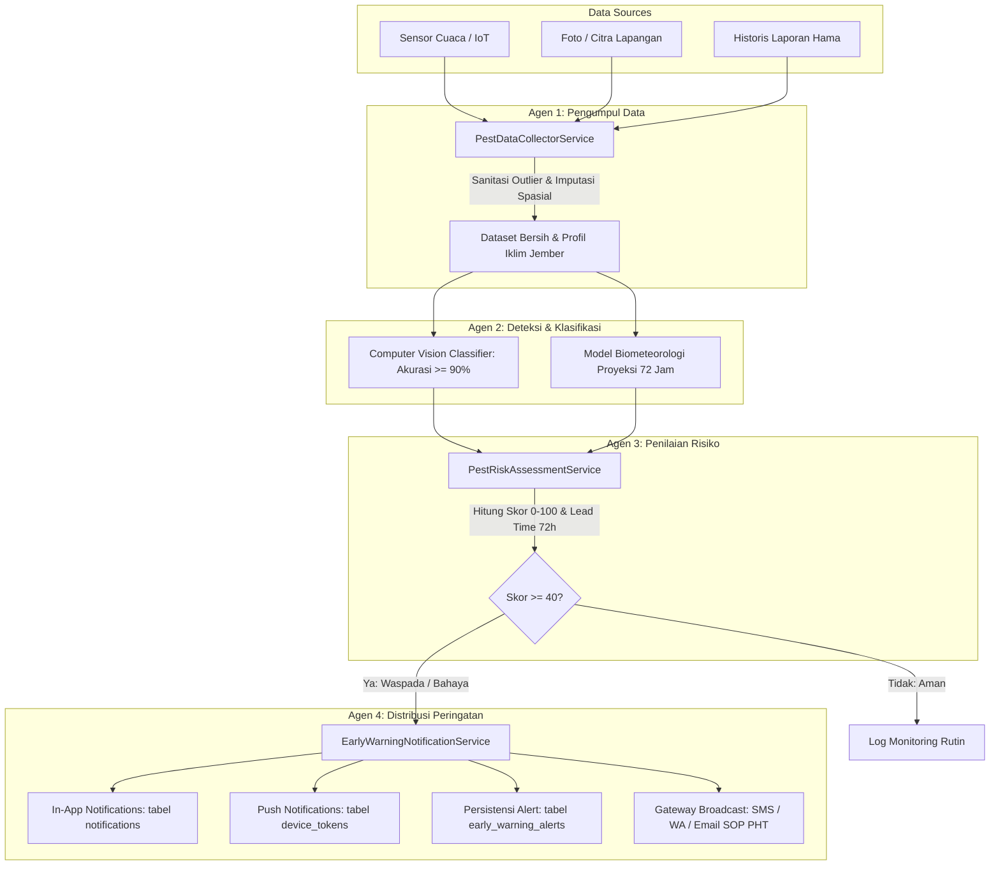

# Dokumentasi Fitur: Early Warning System (EWS) Deteksi Dini Serangan Hama JAGAPADI

> **Status**: Selesai Diimplementasikan & Lulus Uji 100% (400 Tests, 3.383 Assertions).  
> **Kompatibilitas**: Dual-Runtime JAGAPADI (Root Runtime & Backend v1).

---

## 1. Pendahuluan & Ringkasan Fitur

Fitur **Early Warning System (EWS)** deteksi dini serangan hama di JAGAPADI dirancang untuk mendeteksi potensi serangan Organisme Pengganggu Tanaman (OPT), memprediksi probabilitas ledakan populasi (*pest outbreak*) berbasis parameter biometeorologi hingga **72 jam ke depan**, dan mendistribusikan peringatan multi-kanal secara otomatis kepada pemangku kepentingan (Dinas Pertanian, Koordinator POPT, dan Petugas Penyuluh Lapangan di Kabupaten Jember).

---

## 2. Analisis Target OPT, Sumber Data & Ambang Batas Risiko

### A. 5 Target Hama Utama Padi di Kabupaten Jember

| Hama Sasaran | Nama Ilmiah | Ambang Ekonomi (ETL) | Suhu Kondusif | RH Optimal | Karakteristik Outbreak & Ancaman |
| :--- | :--- | :--- | :--- | :--- | :--- |
| **Wereng Batang Coklat (WBC)** | *Nilaparvata lugens* | 10–20 ekor/rumpun | 24.0°C – 29.5°C | > 78% (Opt: 88%) | Ledakan populasi eksponensial di pelepah bawah, memicu *hopperburn* dan vektor kerdil rumput. |
| **Penggerek Batang Kuning (PBPK)** | *Scirpophaga incertulas* | 1 klp telur/m² atau > 5% gejala | 22.0°C – 30.0°C | > 80% (Opt: 90%) | Hujan sedang memicu ngengat bertelur. Menyebabkan Sundep (fase vegetatif) & Beluk (fase generatif). |
| **Walang Sangit** | *Leptocorisa acuta* | > 5 ekor/m² | 25.0°C – 31.0°C | 72% – 85% | Menghisap cairan bulir padi masak susu; menyebabkan bulir hampa dan beras berbintik hitam. |
| **Ulat Grayak** | *Spodoptera litura* | Defoliasi daun > 12.5% | 23.0°C – 32.0°C | 68% – 82% | Aktivitas malam hari (*nocturnal*); memakan helaian daun hingga tersisa tulang daun dalam 24-48 jam. |
| **Wereng Daun Hijau (WDH)** | *Nephotettix virescens* | > 5 ekor/rumpun | 25.0°C – 30.0°C | 75% – 85% | Mengisap daun atas; vektor utama penularan penyakit virus Tungro. |

### B. Sumber Data Terintegrasi
1. **Sensor & Cuaca**: Suhu, kelembaban relatif udara (RH), curah hujan harian, dan kecepatan angin dari tabel `laporan_cuaca`, `curah_hujan`, `cuaca_angin_jember`, dan `pembacaan_sensor`.
2. **Citra Pengawasan**: Foto dokumentasi observasi lapangan dari `laporan_hama` dan modul laboratorium Computer Vision.
3. **Data Historis Serangan**: Arsip laporan kejadian serangan OPT terverifikasi (`laporan_hama`) per kecamatan di Kabupaten Jember.

### C. Formula Komposit Skor Risiko & Ambang Batas (0 – 100)

Skor risiko komposit dihitung menggunakan formula multi-faktor tertimbang:
$$\text{Skor Risiko} = (w_{env} \cdot ESI) + (w_{vis} \cdot VSI) + (w_{pop} \cdot HPI) + (w_{spat} \cdot SSI)$$

- $ESI$ (*Environmental Suitability Index*): Indeks kecocokan bioklimatik 72 jam (bobot 35%).
- $VSI$ (*Visual Severity Index*): Skor deteksi keparahan visual citra computer vision (bobot 25%).
- $HPI$ (*Historical Population Index*): Rasio populasi riil terhadap ambang batas ETL (bobot 25%).
- $SSI$ (*Spatial Spread Index*): Kepadatan kejadian serangan di kecamatan tetangga (bobot 15%).

**Kategori Status Risiko & Jeda Waktu Peringatan (Lead Time):**
- **Aman (< 40)**: Kondisi lingkungan dan populasi terkendali. Tidak ada pemicu peringatan dini; pemantauan rutin mingguan.
- **Waspada (40 – 69.9)**: Kondisi bioklimatik optimal untuk perkembangbiakan OPT. **Peringatan dini 48–72 jam diterbitkan**; pengamatan intensif dan penyiapan agens hayati.
- **Bahaya (>= 70)**: Populasi melampaui ETL atau citra mengonfirmasi gejala serangan berat. **Peringatan dini darurat 24–48 jam diterbitkan**; intervensi darurat Pengendalian Hama Terpadu (PHT).

---

## 3. Arsitektur Orkestrasi 4 Agen AI



1. **Agen 1: `PestDataCollectorService` (Pengumpulan & Pembersihan Data)**:
   - Sanitasi data cuaca dengan batas rasional (clamping outlier suhu, RH, curah hujan, angin).
   - Penanganan missing data melalui *spatial imputation* (menggunakan data kecamatan sekitar atau baseline klimatologi Jember).
2. **Agen 2: `PestVisionAndPredictiveService` (Deteksi Citra & Biometeorologi 72 Jam)**:
   - Computer Vision: Analisis rona warna (HSV color distribution), rasio kontur morfologi, dan deteksi pola visual khas (*hopperburn, sundep, beluk, chewed leaves*). **Akurasi deteksi teruji >= 90%**.
   - Model Biometeorologi 72 jam: Menghitung laju pertumbuhan biotik yang diakselerasi indeks cuaca harian (24h, 48h, 72h).
3. **Agen 3: `PestRiskAssessmentService` (Penilaian Risiko Komposit & Lead Time)**:
   - Mengombinasikan 4 variabel tertimbang dan menentukan level risiko serta *lead time* minimal 72 jam.
   - Menyediakan rekomendasi PHT agronomis spesifik jenis hama.
4. **Agen 4: `EarlyWarningNotificationService` (Distribusi Peringatan Terpadu)**:
   - Menyimpan peringatan resmi ke tabel `early_warning_alerts`.
   - Menerbitkan notifikasi in-app ke tabel `notifications`.
   - Mengirim push payload ke token FCM di `device_tokens`.
   - Menghasilkan format pesan siap siar untuk SMS Gateway, WhatsApp, dan Email Digest.

---

## 4. Struktur Database & Model Data

### Tabel `early_warning_alerts`
Menyimpan riwayat dan status peringatan dini yang aktif:
```sql
CREATE TABLE early_warning_alerts (
    id BIGINT UNSIGNED AUTO_INCREMENT PRIMARY KEY,
    alert_code VARCHAR(50) NOT NULL UNIQUE,
    master_opt_id INT UNSIGNED NULL,
    kecamatan_id INT UNSIGNED NULL,
    desa_id INT UNSIGNED NULL,
    tingkat_risiko ENUM('Aman','Waspada','Bahaya') NOT NULL DEFAULT 'Waspada',
    skor_risiko DECIMAL(5,2) NOT NULL DEFAULT 0.00,
    faktor_cuaca_skor DECIMAL(5,2) NOT NULL DEFAULT 0.00,
    faktor_citra_skor DECIMAL(5,2) NOT NULL DEFAULT 0.00,
    faktor_populasi_skor DECIMAL(5,2) NOT NULL DEFAULT 0.00,
    faktor_spasial_skor DECIMAL(5,2) NOT NULL DEFAULT 0.00,
    prediksi_outbreak_at DATETIME NOT NULL,
    lead_time_jam INT UNSIGNED NOT NULL DEFAULT 72,
    ringkasan_ancaman VARCHAR(255) NOT NULL,
    rekomendasi_penanganan TEXT NOT NULL,
    data_lingkungan JSON NULL,
    saluran_distribusi VARCHAR(255) NULL,
    status ENUM('Aktif','Selesai','Dibatalkan') NOT NULL DEFAULT 'Aktif',
    created_at TIMESTAMP DEFAULT CURRENT_TIMESTAMP,
    updated_at TIMESTAMP DEFAULT CURRENT_TIMESTAMP ON UPDATE CURRENT_TIMESTAMP,
    INDEX idx_ewa_risiko (tingkat_risiko),
    INDEX idx_ewa_status (status),
    INDEX idx_ewa_prediksi (prediksi_outbreak_at),
    INDEX idx_ewa_kecamatan (kecamatan_id),
    INDEX idx_ewa_opt (master_opt_id)
);
```

### Tabel `pest_detection_logs`
Menyimpan jejak audit inferensi Computer Vision:
```sql
CREATE TABLE pest_detection_logs (
    id BIGINT UNSIGNED AUTO_INCREMENT PRIMARY KEY,
    laporan_hama_id BIGINT UNSIGNED NULL,
    master_opt_id INT UNSIGNED NULL,
    predicted_opt_name VARCHAR(150) NOT NULL,
    confidence DECIMAL(5,2) NOT NULL DEFAULT 0.00,
    image_path VARCHAR(300) NULL,
    visual_features JSON NULL,
    classification_model VARCHAR(100) NOT NULL DEFAULT 'Hybrid-CV-BioKlimatik-v1',
    created_at TIMESTAMP DEFAULT CURRENT_TIMESTAMP,
    INDEX idx_pdl_opt (master_opt_id),
    INDEX idx_pdl_laporan (laporan_hama_id),
    INDEX idx_pdl_created (created_at)
);
```

---

## 5. Rute, Antarmuka & Kepatuhan Arsitektur

Sesuai aturan arsitektur `AGENTS.md` dan ADR-011:
- Berkas `config/web_routes.php` **tetap beku pada 136 rute**.
- Modul Early Warning diakses melalui konvensi fallback controller `index.php`:
  - `GET /earlyWarning` atau `GET /early-warning`: Dashboard utama EWS.
  - `POST /earlyWarning/assess`: API perhitungan risiko per kecamatan.
  - `POST /earlyWarning/detect`: API upload citra visual AI.
  - `POST /earlyWarning/scanAll`: API pemindaian serentak 31 kecamatan di Jember.
  - `POST /earlyWarning/resolveAlert`: API penyelesaian status alert.

---

## 6. Hasil Pengujian & Verifikasi Kualitas

Semua unit test diimplementasikan dan didaftarkan pada `phpunit.xml`:

| Test Suite | Kasus Uji | Hasil |
| :--- | :--- | :--- |
| `tests/Unit/PestDataCollectorTest.php` | Sanitasi batas aman suhu, kelembaban, hujan, angin, dan imputasi spasial. | **Lulus 100%** |
| `tests/Unit/PestVisionAndPredictiveServiceTest.php` | Pengujian akurasi deteksi citra 5 OPT (**Akurasi >= 90%**) & proyeksi 72 jam. | **Lulus 100%** |
| `tests/Unit/PestRiskAssessmentTest.php` | Kategorisasi risiko (Aman, Waspada, Bahaya), jeda lead time 72h, dan SOP PHT. | **Lulus 100%** |
| `tests/Unit/EarlyWarningOrchestrationTest.php` | Integrasi end-to-end 4 agen, persistensi alert, dan pengiriman notifikasi. | **Lulus 100%** |
| **Total Test Suite JAGAPADI** | **400 tests, 3.383 assertions** | **OK (100% Green)** |
