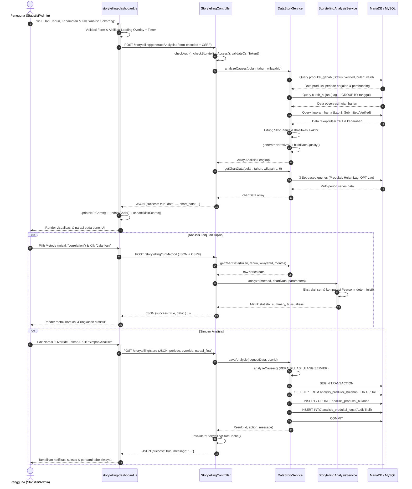
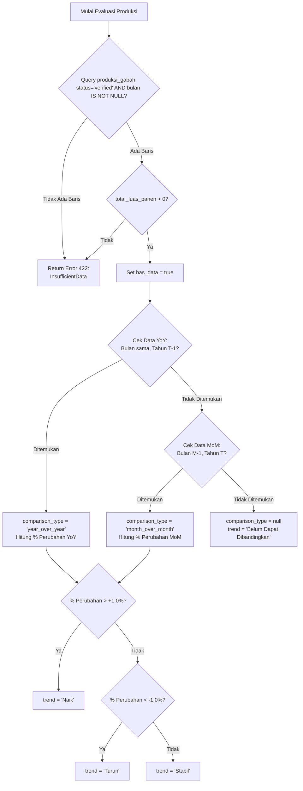
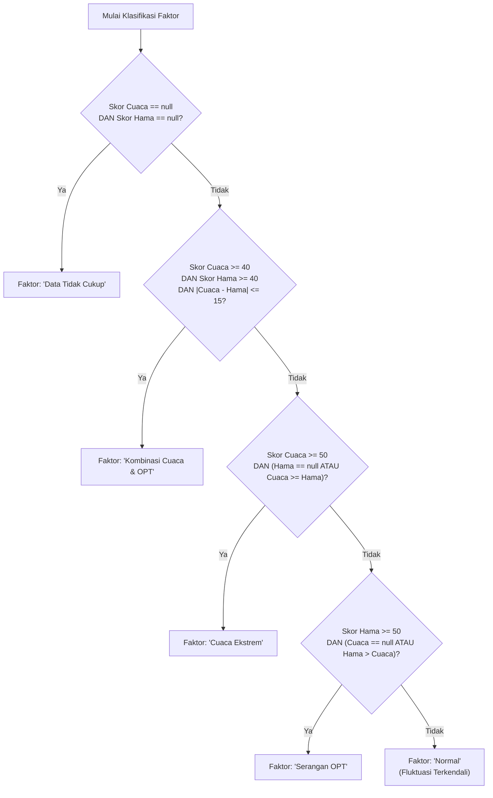
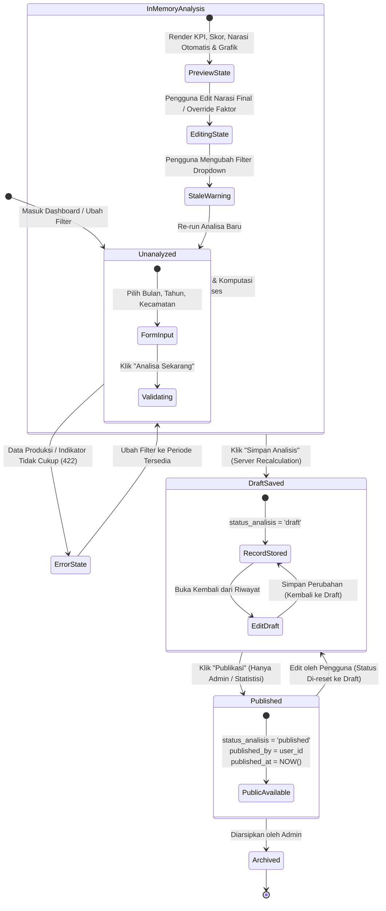

# DOKUMENTASI TEKNIS FITUR DATA STORYTELLING JAGAPADI

> **Sistem:** JAGAPADI (Jember Agrikultur Gapai Prestasi Digital)  
> **Modul:** Data Storytelling Produksi Padi & Analitik Eksogen  
> **Versi Mesin Analisis:** `2.0.0` (Core Indikasi Faktor) & `1.0.0` (Metode Statistik Lanjutan)  
> **Target Runtime:** Root / Integrated (`index.php`)  
> **Tanggal Rilis & Audit:** September 2026  
> **Klasifikasi:** Dokumentasi Teknis & Kamus Variabel Sistem

---

## DAFTAR ISI

1. [PENDAHULUAN & ARSITEKTUR FITUR](#1-pendahuluan--arsitektur-fitur)
   - 1.1 [Latar Belakang & Tujuan Bisnis](#11-latar-belakang--tujuan-bisnis)
   - 1.2 [Prinsip Integritas Metodologis (Non-Kausalitas)](#12-prinsip-integritas-metodologis-non-kausalitas)
   - 1.3 [Topologi Komponen & Peta File](#13-topologi-komponen--peta-file)
2. [ALUR KERJA SISTEM SECARA TERPERINCI](#2-alur-kerja-sistem-secara-terperinci)
   - 2.1 [Tahapan Proses Berurutan (End-to-End Lifecycle)](#21-tahapan-proses-berurutan-end-to-end-lifecycle)
   - 2.2 [Interaksi Antar Komponen](#22-interaksi-antar-komponen)
   - 2.3 [Titik Kendali Sistem (Control Points & Keamanan)](#23-titik-kendali-sistem-control-points--keamanan)
   - 2.4 [Alur Keputusan & Percabangan Logika (Decision Trees)](#24-alur-keputusan--percabangan-logika-decision-trees)
   - 2.5 [Diagram Alur Kerja & Visualisasi Arsitektur](#25-diagram-alur-kerja--visualisasi-arsitektur)
3. [PENJELASAN MENDETAIL VARIABEL ANALISIS (KAMUS VARIABEL)](#3-penjelasan-mendetail-variabel-analisis-kamus-variabel)
   - 3.1 [Variabel Parameter Input & Konteks Filter](#31-variabel-parameter-input--konteks-filter)
   - 3.2 [Variabel Produksi Padi (Outcome Target)](#32-variabel-produksi-padi-outcome-target)
   - 3.3 [Variabel Indikator Lag Cuaca / Curah Hujan](#33-variabel-indikator-lag-cuaca--curah-hujan)
   - 3.4 [Variabel Indikator Lag Hama / OPT](#34-variabel-indikator-lag-hama--opt)
   - 3.5 [Variabel Skor Risiko & Heuristik Faktor Penyebab](#35-variabel-skor-risiko--heuristik-faktor-penyebab)
   - 3.6 [Variabel Kualitas Data & Narasi Otomatis](#36-variabel-kualitas-data--narasi-otomatis)
   - 3.7 [Variabel Analisis Statistik Lanjutan (5 Metode)](#37-variabel-analisis-statistik-lanjutan-5-metode)
   - 3.8 [Variabel Persistensi, Riwayat & Audit Trail](#38-variabel-persistensi-riwayat--audit-trail)
4. [LOGIKA KERJA & FORMULA MATEMATIS TERINTEGRASI](#4-logika-kerja--formula-matematis-terintegrasi)
   - 4.1 [Logika Agregasi Temporal & Deduplikasi Spasial Harian](#41-logika-agregasi-temporal--deduplikasi-spasial-harian)
   - 4.2 [Kurva Piecewise Linear Skor Risiko Cuaca](#42-kurva-piecewise-linear-skor-risiko-cuaca)
   - 4.3 [Skor Risiko Serangan Hama Berbobot Luas & Keparahan](#43-skor-risiko-serangan-hama-berbobot-luas--keparahan)
   - 4.4 [Normalisasi Bobot Dinamis Multi-Indikator](#44-normalisasi-bobot-dinamis-multi-indikator)
   - 4.5 [Pohon Klasifikasi Penentuan Faktor Penyebab Utama](#45-pohon-klasifikasi-penentuan-faktor-penyebab-utama)
   - 4.6 [Formula 5 Metode Statistik Lanjutan](#46-formula-5-metode-statistik-lanjutan)
5. [INTEGRITAS DATA, STATE CLIENT & AUDIT TRAIL](#5-integritas-data-state-client--audit-trail)
   - 5.1 [Kebijakan Anti-Tampering: Server-Side Recalculation](#51-kebijakan-anti-tampering-server-side-recalculation)
   - 5.2 [Manajemen State Client (Filter Dirty & Stale Detection)](#52-manajemen-state-client-filter-dirty--stale-detection)
   - 5.3 [Audit Trail & Snapshot State Sumber](#53-audit-trail--snapshot-state-sumber)
6. [VERIFIKASI & PENGUJIAN](#6-verifikasi--pengujian)

---

## 1. PENDAHULUAN & ARSITEKTUR FITUR

### 1.1 Latar Belakang & Tujuan Bisnis
Fitur **Data Storytelling** pada sistem JAGAPADI dikembangkan untuk menjembatani kesenjangan antara data mentah tabular statistik pertanian dengan kebutuhan pemangku kebijakan (Kepala Dinas, Kepala Bidang Produksi, dan Statistisi Pertanian Kabupaten Jember). 

Tujuan utama fitur ini:
1. **Menjelaskan Dinamika Produksi Padi Bulanan**: Menghitung perubahan produksi gabah/beras aktual pada tingkat kecamatan atau kabupaten secara objektif berdasarkan data terverifikasi.
2. **Menghubungkan Indikator Eksogen**: Menyelaraskan fluktuasi produksi dengan kondisi agroklimat (curah hujan bulanan) dan ancaman biologis (Organisme Pengganggu Tumbuhan / OPT) yang terjadi pada fase pertumbuhan tanaman (lag 1 bulan sebelumnya / *lag-1*).
3. **Mengotomatisasi Narasi Berbasis Bukti**: Menghasilkan draf cerita data (*data story*) yang terstruktur dalam bahasa Indonesia yang baku dan informatif, sehingga pengguna tidak perlu merangkai analisis manual dari tabel terpisah.
4. **Menyediakan Analisis Statistik Deterministik**: Memberikan alat bantu kuantitatif lanjutan (analisis tren moving average, korelasi Pearson, regresi prediktif baseline, segmentasi quantile, serta deteksi anomali/outlier berbasis Modified Z-score).

### 1.2 Prinsip Integritas Metodologis (Non-Kausalitas)
Sesuai audit sistem versi `2.0.0` dan regulasi penulisan analitik resmi JAGAPADI:
- **Bukan Klaim Sebab-Akibat (Non-Causal)**: Seluruh keluaran narasi dan metrik diklasifikasikan sebagai **Indikasi Hubungan Asosiatif**, bukan pembuktian kausalitas empiris laboratorium. Hubungan cuaca/hama terhadap produksi dipengaruhi banyak variabel perancu (*confounders*) seperti pemupukan, varietas bibit, irigasi teknis, dan manajemen pascapanen.
- **Ketiadaan Data $\ne$ Nol (No Fabrication)**: Jika data produksi bulanan tidak tersedia atau data hujan belum mencapai batas minimum observasi (70%), sistem **tidak menginterpolasi atau menganggap nilai hilang sebagai nol**. Sistem wajib menolak kalkulasi dengan pesan `InsufficientData` (HTTP 422).
- **Rekalkulasi Server (Zero-Trust Client)**: Nilai metrik, persentase perubahan, skor risiko, dan snapshot indikator dihitung ulang secara mutlak di sisi server saat penyimpanan (`saveAnalysis`). Input pengguna yang diizinkan untuk diubah hanyalah `faktor_penyebab_override` dan `narasi_final`.

### 1.3 Topologi Komponen & Peta File

| Layer | Lokasi Berkas | Tanggung Jawab Utama |
|---|---|---|
| **View (UI)** | `app/views/storytelling/index.php` | Antarmuka dashboard, filter periode/wilayah, kartu KPI, panel editor narasi, pemilih metode lanjutan, tabel riwayat. |
| **Frontend Script** | `public/js/storytelling-dashboard.js` | Pengendali state browser, AJAX API call, timer timeout, Chart.js multi-axis rendering, deteksi *dirty filter*. |
| **Web Controller** | `app/controllers/StorytellingController.php` | Front-facing controller: Autentikasi session, validasi RBAC, validasi CSRF, orkestrasi request web, rendering view. |
| **API Controller** | `app/controllers/Api/StorytellingController.php` | RESTful API endpoint untuk integrasi eksternal/headless dengan response payload JSON standar. |
| **Core Service** | `app/services/DataStoryService.php` | Mesin bisnis utama v2.0.0: Ekstraksi database, aggregasi lag-1, perhitungan skor cuaca/OPT, sintesis narasi otomatis, persistensi transaksional. |
| **Analytics Service**| `app/services/StorytellingAnalysisService.php` | Mesin komputasi statistik murni v1.0.0 (deterministik tanpa dependensi database): tren, korelasi, prediksi, segmentasi, outlier. |
| **Database Tables** | MySQL / MariaDB (`jagapadi-3509`) | `produksi_gabah`, `curah_hujan`, `laporan_hama`, `master_kecamatan`, `analisis_produksi_bulanan`, `analisis_produksi_logs`. |

---

## 2. ALUR KERJA SISTEM SECARA TERPERINCI

### 2.1 Tahapan Proses Berurutan (End-to-End Lifecycle)

Proses kerja storytelling terbagi dalam **14 fase berurutan**:

```
[Fase 1: Inisiasi UI] ──> [Fase 2: Autentikasi & RBAC] ──> [Fase 3: Validasi Parameter]
           │
           ▼
[Fase 4: Verifikasi Produksi] ──> [Fase 5: Komputasi Outcome (YoY/MoM)]
           │
           ▼
[Fase 6: Ekstraksi Lag-1 Cuaca & Hama] ──> [Fase 7: Evaluasi Kualitas Data]
           │
           ▼
[Fase 8: Scoring Risiko Multi-Faktor] ──> [Fase 9: Klasifikasi Faktor Utama]
           │
           ▼
[Fase 10: Sintesis Narasi Otomatis] ──> [Fase 11: Eksekusi Analisis Lanjutan]
           │
           ▼
[Fase 12: Pengambilan Runtun Waktu Grafik] ──> [Fase 13: Review & Edit Pengguna]
           │
           ▼
[Fase 14: Persistensi Transaksional & Audit Trail]
```

#### Fase 1: Inisiasi & Konfigurasi Filter
1. Pengguna membuka URL `/storytelling`.
2. Controller `StorytellingController::index()` memeriksa apakah terdapat data produksi bulanan terverifikasi (`bulan IS NOT NULL AND status = 'verified'`).
3. View menampilkan kontrol dropdown: **Bulan (1–12)**, **Tahun (5 tahun terakhir)**, dan **Kecamatan (31 kecamatan Jember + opsi 'Kabupaten Jember (Seluruh Kecamatan)' / ID `0`)**.
4. Jika ketersediaan data bulanan nol, tombol analisis dinonaktifkan secara preventif disertai kotak dialog diagnostik.

#### Fase 2: Validasi Autentikasi & RBAC
1. Request diproses oleh `checkAuth()`. Sesi PHP wajib valid (`$_SESSION['user_id']`).
2. Method `checkStorytellingAccess()` memverifikasi peran:
   - **Diizinkan**: `admin`, `operator`, `statistisi`.
   - **Ditolak**: `petugas` dan `viewer` langsung dialihkan ke `/dashboard` dengan pesan error (akses terbatas).

#### Fase 3: Validasi Permintaan & Parameter Input
1. Header `X-CSRF-Token` diverifikasi melalui `validateCsrfToken()`.
2. Parameter disaring secara ketat via `validatedFilter()`:
   - `bulan`: Integer 1 s.d. 12.
   - `tahun`: Integer 2000 s.d. (Tahun Berjalan + 1).
   - `wilayah_id`: Integer $\ge 0$. Bila $> 0$, harus terdaftar di `master_kecamatan`.

#### Fase 4: Pengambilan Data Produksi & Verifikasi Grain
1. `DataStoryService::getProductionData()` menjalankan query terhadap tabel `produksi_gabah`.
2. Syarat mutlak data: `tahun = ? AND bulan = ? AND status = 'verified' AND luas_panen > 0`.
3. Bila data periode berjalan tidak ditemukan, sistem langsung menghentikan proses dengan kode error `InsufficientData` (HTTP 422).

#### Fase 5: Komputasi Outcome Perubahan Produksi (YoY vs MoM)
1. Sistem mencari data pembanding **Year-over-Year (YoY)**: bulan yang sama pada tahun $T - 1$.
2. Jika data YoY tidak ditemukan, sistem beralih ke fallback **Month-over-Month (MoM)**: bulan $M - 1$ pada tahun yang sesuai.
3. Menghitung persentase perubahan:
   $$\Delta P_{\%} = \frac{P_{\text{current}} - P_{\text{comparison}}}{P_{\text{comparison}}} \times 100$$
4. Menentukan arah tren:
   - `Naik` jika $\Delta P_{\%} > +1.00\%$
   - `Turun` jika $\Delta P_{\%} < -1.00\%$
   - `Stabil` jika $-1.00\% \le \Delta P_{\%} \le +1.00\%$
   - `Belum Dapat Dibandingkan` jika data pembanding tidak tersedia.

#### Fase 6: Ekstraksi Indikator Eksogen Lag-1 (Bulan Sebelumnya)
1. Sistem menghitung jendela waktu lag satu bulan ($T_{\text{lag}} = \text{Periode} - 1\text{ bulan}$).
2. **Indikator Cuaca (`curah_hujan`)**:
   - Menghitung rentang tanggal awal s.d. akhir bulan lag.
   - Mengelompokkan observasi per tanggal (`GROUP BY tanggal`) dengan rata-rata harian `AVG(curah_hujan)` untuk mengeliminasi duplikasi sensor/sumber data pada hari yang sama.
   - Menjumlahkan curah hujan harian menjadi total bulanan: $\sum \text{daily\_rain}$.
   - Menghitung rasio kelengkapan hari (*coverage ratio*): $\frac{\text{jumlah\_hari\_tercatat}}{\text{jumlah\_hari\_kalender}}$.
3. **Indikator Hama (`laporan_hama`)**:
   - Mengambil laporan valid: `tanggal` dalam bulan lag, `deleted_at IS NULL`, dan `status IN ('Submitted', 'Diverifikasi')`.
   - Mengelompokkan intensitas: `Berat`, `Sedang`, `Ringan`.
   - Menghitung luas serangan berbobot (*weighted affected area*).

#### Fase 7: Evaluasi Kualitas Data (*Data Quality Assessment*)
Sistem menguji kelayakan dataset berdasarkan aturan:
- Kritis: Produksi bulanan hilang $\rightarrow$ status `tidak_cukup`.
- Warning 1: Curah hujan dengan cakupan $< 70\%$ $\rightarrow$ data hujan ditandai tidak lengkap.
- Warning 2: Laporan OPT nol $\rightarrow$ diberi catatan bahwa nol laporan bukan bukti nihil serangan.
- Level akhir dikategorikan menjadi: `tinggi`, `sedang`, atau `tidak_cukup`.

#### Fase 8: Perhitungan Skor Risiko Multi-Faktor (0–100)
1. Menghitung **Skor Risiko Cuaca** menggunakan fungsi piecewise linear dengan ambang batas biologis tanaman padi (Kekeringan $\le 50$ mm, Ideal $= 150$ mm, Kebanjiran $\ge 300$ mm).
2. Menghitung **Skor Risiko Hama** berdasarkan rasio luas serangan berbobot terhadap luas panen, atau poin keparahan kejadian.
3. Menghitung **Skor Risiko Total** dengan pembobotan dinamis (Cuaca $60\%$, Hama $40\%$). Jika salah satu indikator tidak valid, bobot dinormalisasi ulang pada indikator yang tersedia.

#### Fase 9: Klasifikasi Penentuan Faktor Penyebab Utama
Heuristic rule engine mengevaluasi skor risiko:
- `Kombinasi Cuaca & OPT`: Jika skor cuaca $\ge 40$, hama $\ge 40$, dan selisih keduanya $\le 15$.
- `Cuaca Ekstrem`: Jika skor cuaca $\ge 50$ dan mendominasi.
- `Serangan OPT`: Jika skor hama $\ge 50$ dan mendominasi.
- `Normal`: Jika seluruh skor risiko $< 50$.
- `Data Tidak Cukup`: Jika kedua indikator eksogen bernilai `null`.

#### Fase 10: Sintesis Narasi Otomatis
Menggabungkan fakta kuantitatif, tren persentase, total hujan bulanan beserta rasio kelengkapan, ringkasan serangan OPT, skor risiko, dan disclaimer metodologis ke dalam satu teks narasi komprehensif dalam bahasa Indonesia.

#### Fase 11: Eksekusi Analisis Lanjutan (Opsional Pengguna)
Pengguna dapat memilih salah satu dari 5 metode statistik lanjutan pada jendela data 6–24 bulan:
- `trend`: Moving average dan perubahan dari observasi awal ke akhir.
- `correlation`: Koefisien Pearson $r$ antara produksi dan (hujan atau hama).
- `predictive`: Regresi linear baseline untuk proyeksi 1–12 bulan ke depan.
- `clustering`: Segmentasi multi-variat quantile produksi vs hujan.
- `outlier`: Deteksi anomali data menggunakan Median Absolute Deviation (MAD) dan Modified Z-score.

#### Fase 12: Pengambilan Data Runtun Waktu Grafik Multi-Axis
Metode `DataStoryService::getChartData()` mengambil data historis 1–24 bulan menggunakan **3 query set-based terindeks**, menyusun 3 dataset terkoordinasi:
- Bar: Luas Panen Terverifikasi (Ha) pada sumbu Y kiri.
- Line: Total Curah Hujan Lag-1 (mm) pada sumbu Y1 kanan.
- Line: Jumlah Laporan OPT Lag-1 pada sumbu Y2 kanan.

#### Fase 13: Interaksi Frontend, Review & State Management
- Hasil ditampilkan pada dashboard: KPI Card teranimasi, badge skor risiko dengan pewarnaan dinamis, teks narasi otomatis dimuat ke textarea.
- Pengguna dapat mengoreksi faktor penyebab (`faktor_penyebab_override`) dan mengedit narasi (`narasi_final`).
- Jika filter (bulan/tahun/kecamatan) diubah di browser, sistem mendeteksi *filter dirty state*, memunculkan peringatan data kadaluarsa (*stale warning*), serta menonaktifkan tombol simpan sampai analisis baru dieksekusi.

#### Fase 14: Persistensi Transaksional & Audit Trail
1. Saat pengguna menekan **Simpan Analisis**, client mengirimkan payload JSON berisi periode, override faktor, dan narasi final.
2. Server membuka transaksi database (`beginTransaction`) dan mengunci baris yang ada (`SELECT ... FOR UPDATE`).
3. **Server menghitung ulang seluruh metrik dan skor** dari sumber database untuk menjamin integritas.
4. Data di-upsert ke tabel `analisis_produksi_bulanan`.
5. Snapshot data sumber (`source_snapshot_json`) dan evaluasi kualitas data (`data_quality_json`) disimpan ke kolom JSON.
6. Riwayat mutasi dicatat pada tabel `analisis_produksi_logs` (`create` atau `update`).
7. Transaksi di-`commit`. Cache statistik di `/storage/cache/storytelling_stats.json` diinvalidasi secara otomatis.

---

### 2.2 Interaksi Antar Komponen



---

### 2.3 Titik Kendali Sistem (Control Points & Keamanan)

Sistem storytelling dilengkapi **10 titik kendali ketat**:

| No | Titik Kendali | Komponen Penegak | Mekanisme & Parameter Validasi | Tindakan Jika Gagal |
|---|---|---|---|---|
| **CP-01** | Autentikasi Sesi | `StorytellingController::checkAuth` | Memeriksa eksistensi `$_SESSION['user_id']`. | HTTP 401 / Redirect ke `/auth/login`. |
| **CP-02** | Otorisasi Berbasis Peran (RBAC) | `checkStorytellingAccess` | Menguji apakah `$_SESSION['role']` termasuk dalam `['admin', 'operator', 'statistisi']`. | HTTP 403 / Redirect ke `/dashboard`. |
| **CP-03** | Proteksi CSRF | `validateCsrfToken` | Membandingkan header `X-CSRF-Token` atau input `csrf_token` dengan token sesi aktif. | HTTP 403 Forbidden (`CSRF token validation failed`). |
| **CP-04** | Validasi Domain Filter | `validatedFilter` | Memastikan `bulan` $\in [1, 12]$, `tahun` $\in [2000, Y_{\text{now}}+1]$, `wilayah_id` $\ge 0$. | HTTP 400 (`InvalidArgumentException`). |
| **CP-05** | Integritas Master Wilayah | `assertKecamatanExists` | Melakukan query ID ke tabel `master_kecamatan` (jika `wilayah_id > 0`). | HTTP 400 (`Kecamatan tidak ditemukan`). |
| **CP-06** | Eksekusi & Read Timeout | `MAX_EXECUTION_TIME` & PDO Attributes | Batas eksekusi maksimal 30 detik (`microtime`), `MYSQL_ATTR_READ_TIMEOUT = 10s`. | HTTP 400 / 500 (`RuntimeException: Analisis melewati batas waktu`). |
| **CP-07** | Ambang Kelengkapan Hujan | `MIN_RAIN_COVERAGE` | Menghitung rasio hari pengamatan hujan terhadap jumlah hari kalender ($\ge 0.70$). | Curah hujan ditandai `Data Tidak Lengkap`, skor cuaca dinonaktifkan (`null`). |
| **CP-08** | Hak Publikasi Khusus | `StorytellingController::publish` | Hanya role `admin` dan `statistisi` yang berhak mempublikasikan analisis. Operator dilarang. | HTTP 403 (`Anda tidak memiliki akses untuk mempublikasikan analisis`). |
| **CP-09** | Konkurensi & Lock Transaksi | `saveAnalysis` / `publishAnalysis` | Membuka `beginTransaction` dan menggunakan kueri `SELECT ... FOR UPDATE`. | Menghindari *race condition* dan data korup saat simultaneous update. |
| **CP-10** | Anti-Tampering Payload | `saveAnalysis` | Server mengabaikan metrik/skor yang dikirim client; seluruh angka dihitung ulang di server. | Mencegah injeksi manipulasi data produksi atau skor risiko dari devtools. |

---

### 2.4 Alur Keputusan & Percabangan Logika (Decision Trees)

#### Decision Tree 1: Evaluasi Ketersediaan Data Produksi & Pembanding


#### Decision Tree 2: Klasifikasi Faktor Penyebab Utama


---

### 2.5 Diagram Alur Kerja & Visualisasi Arsitektur

#### State Machine Diagram: Siklus Hidup Dokumen Analisis


---

## 3. PENJELASAN MENDETAIL VARIABEL ANALISIS (KAMUS VARIABEL)

Di bawah ini adalah dokumentasi komprehensif seluruh variabel yang terlibat dalam alur proses data storytelling, diklasifikasikan ke dalam 8 kategori domain.

---

### 3.1 Variabel Parameter Input & Konteks Filter

#### 1. `bulan`
- **Tipe Data:** `integer` (PHP), `INT` (SQL), `number` (JS).
- **Nilai yang Mungkin:** `1` s.d. `12` (mewakili Januari s.d. Desember).
- **Fungsi dalam Analisis:** Menentukan bulan kalender target pengamatan produksi padi yang sedang dianalisis.
- **Sumber Data:** Dropdown filter form HTML (`#filter-bulan`) $\rightarrow$ Parameter HTTP POST/GET.
- **Hubungan dengan Variabel Lain:** Menentukan rentang tanggal filter `curah_hujan` dan `laporan_hama` pada bulan sebelumnya (`bulan - 1`), serta menjadi bagian dari *unique constraint* database.

#### 2. `tahun`
- **Tipe Data:** `integer` (PHP), `INT` (SQL), `number` (JS).
- **Nilai yang Mungkin:** `2000` s.d. $Y_{\text{berjalan}} + 1$.
- **Fungsi dalam Analisis:** Menentukan tahun kalender target pengamatan produksi.
- **Sumber Data:** Dropdown filter form HTML (`#filter-tahun`) $\rightarrow$ Parameter HTTP POST/GET.
- **Hubungan dengan Variabel Lain:** Digunakan bersama `bulan` untuk menentukan tanggal awal/akhir lag serta pencarian periode perbandingan YoY ($tahun - 1$).

#### 3. `wilayah_id` (alias `kecamatan_id`)
- **Tipe Data:** `integer unsigned` (PHP), `INT UNSIGNED` (SQL), `number` (JS).
- **Nilai yang Mungkin:** `0` (Agregat seluruh Kabupaten Jember) atau ID integer positif yang valid pada tabel `master_kecamatan` (rentang 1 s.d. 31).
- **Fungsi dalam Analisis:** Menentukan batasan spasial analisis agrikultur.
- **Sumber Data:** Dropdown filter form HTML (`#filter-kecamatan`) $\rightarrow$ Parameter HTTP POST/GET.
- **Hubungan dengan Variabel Lain:** Jika bernilai `0`, query agregasi meniadakan filter `kecamatan_id` (menghasilkan agregat kabupaten). Jika $>0$, membatasi agregasi produksi, stasiun hujan, dan laporan hama pada kecamatan tersebut.

#### 4. `method`
- **Tipe Data:** `string` (PHP), `string` (JS).
- **Nilai yang Mungkin:** `'trend'`, `'correlation'`, `'predictive'`, `'clustering'`, `'outlier'`.
- **Fungsi dalam Analisis:** Menentukan algoritme statistik lanjutan yang akan dieksekusi oleh `StorytellingAnalysisService`.
- **Sumber Data:** Dropdown `#analysis-method` pada panel UI Analisis Lanjutan.
- **Hubungan dengan Variabel Lain:** Mengontrol parameter dinamis yang wajib disertakan (`window`, `variable`, `horizon`, `clusters`, atau `threshold`).

#### 5. `months` (Time Window)
- **Tipe Data:** `integer` (PHP), `number` (JS).
- **Nilai yang Mungkin:** `6`, `12`, `18`, `24` (dibatasi antara 6 hingga 24 bulan).
- **Fungsi dalam Analisis:** Menentukan panjang deret runtun waktu historis ke belakang yang ditarik untuk visualisasi grafik dan analisis statistik lanjutan.
- **Sumber Data:** Dropdown `#analysis-months` $\rightarrow$ Payload POST `runMethod` atau GET `getChartData`.
- **Hubungan dengan Variabel Lain:** Mempengaruhi jumlah titik sampel ($N$) yang diekstraksi ke dalam array dataset grafik.

---

### 3.2 Variabel Produksi Padi (Outcome Target)

#### 6. `total_luas_panen`
- **Tipe Data:** `float` (PHP), `DECIMAL(15,2)` (SQL), `number` (JS).
- **Nilai yang Mungkin:** $\ge 0.00$ (satuan: Hektar / Ha), `null` jika tidak ada data.
- **Fungsi dalam Analisis:** Menunjukkan total area sawah yang berhasil dipanen pada periode dan wilayah target.
- **Sumber Data:** Agregasi database: `SUM(luas_panen)` dari tabel `produksi_gabah` dengan klausul `status = 'verified'`.
- **Hubungan dengan Variabel Lain:** Menjadi penyebut dalam menghitung `avg_produktivitas` dan menghitung rasio serangan hama berbobot terhadap luas panen pada `pestScore`.

#### 7. `total_produksi`
- **Tipe Data:** `float` (PHP), `DECIMAL(15,2)` (SQL), `number` (JS).
- **Nilai yang Mungkin:** $\ge 0.00$ (satuan: Ton), `null` jika tidak ada data.
- **Fungsi dalam Analisis:** Menunjukkan kuantitas total gabah/padi yang dihasilkan pada periode target.
- **Sumber Data:** Agregasi database: `SUM(produksi_total)` dari tabel `produksi_gabah` (`status = 'verified'`).
- **Hubungan dengan Variabel Lain:** Variabel dependen utama yang dihitung perubahannya terhadap periode acuan pembanding (`perubahan_produksi_pct`).

#### 8. `avg_produktivitas`
- **Tipe Data:** `float` (PHP), `DECIMAL(12,4)` (SQL), `number` (JS).
- **Nilai yang Mungkin:** $\ge 0.0000$ (satuan: Ton/Ha), `null` jika `total_luas_panen` $= 0$.
- **Fungsi dalam Analisis:** Mengukur efisiensi hasil panen per satuan luas lahan.
- **Sumber Data:** Dihitung runtime: `total_produksi / total_luas_panen`.
- **Hubungan dengan Variabel Lain:** Mengindikasikan apakah penurunan produksi murni karena penyusutan luas panen atau penurunan kualitas panen per hektar.

#### 9. `perubahan_produksi_pct`
- **Tipe Data:** `float` (PHP), `DECIMAL(10,2)` (SQL), `number` (JS).
- **Nilai yang Mungkin:** Nilai riil positif/negatif (satuan: persen / %), atau `null` jika pembanding tidak tersedia.
- **Fungsi dalam Analisis:** Mengukur persentase kenaikan atau penurunan produksi terhadap periode historis acuan.
- **Sumber Data:** Dihitung runtime: $((P_{\text{current}} - P_{\text{comp}}) / P_{\text{comp}}) \times 100$.
- **Hubungan dengan Variabel Lain:** Menentukan nilai string pada variabel `trend`.

#### 10. `comparison_type`
- **Tipe Data:** `string` (PHP), `string` (JS).
- **Nilai yang Mungkin:** `'year_over_year'`, `'month_over_month'`, `null`.
- **Fungsi dalam Analisis:** Mencatat jenis periode pembanding yang berhasil digunakan dalam komputasi delta produksi.
- **Sumber Data:** Logika penentuan prioritas pada `DataStoryService::getProductionData()`.
- **Hubungan dengan Variabel Lain:** Menentukan interpretasi narasi (apakah dibandingkan terhadap bulan yang sama tahun lalu atau bulan sebelumnya).

#### 11. `trend`
- **Tipe Data:** `string` (PHP), `string` (JS).
- **Nilai yang Mungkin:** `'Naik'`, `'Turun'`, `'Stabil'`, `'Belum Dapat Dibandingkan'`, `'Tidak Ada Data'`.
- **Fungsi dalam Analisis:** Label kualitatif pergerakan arah produksi gabah.
- **Sumber Data:** Ambang batas logika: Naik ($> 1\%$), Turun ($< -1\%$), Stabil ($-1\% \le x \le 1\%$).
- **Hubungan dengan Variabel Lain:** Disematkan ke dalam kalimat narasi otomatis (`narasi_otomatis`).

---

### 3.3 Variabel Indikator Lag Cuaca / Curah Hujan

#### 12. `total_curah_hujan` (alias `avg_curah_hujan`)
- **Tipe Data:** `float` (PHP), `DECIMAL(10,2)` (SQL), `number` (JS).
- **Nilai yang Mungkin:** $\ge 0.00$ (satuan: mm/bulan), `null` jika tidak ada observasi.
- **Fungsi dalam Analisis:** Mengukur akumulasi volume air hujan yang jatuh pada fase vegetatif/generatif tanaman (1 bulan sebelum panen).
- **Sumber Data:** Tabel `curah_hujan`: $\sum \text{daily\_rain}$, di mana `daily_rain` adalah rata-rata observasi per hari.
- **Hubungan dengan Variabel Lain:** Input langsung ke kurva fungsi piecewise linear untuk menghitung `skor_risiko_cuaca`.

#### 13. `coverage_ratio`
- **Tipe Data:** `float` (PHP), `number` (JS).
- **Nilai yang Mungkin:** Rentang `0.0000` s.d. `1.0000` ($0\%$ s.d. $100\%$).
- **Fungsi dalam Analisis:** Mengukur tingkat kelengkapan sensor pencatatan hujan dalam 1 bulan kalender penuh.
- **Sumber Data:** Dihitung runtime: $\text{jumlah\_hari\_tercatat} / \text{expected\_days}$.
- **Hubungan dengan Variabel Lain:** Jika `< 0.70` (konstanta `MIN_RAIN_COVERAGE`), maka `has_data` cuaca diatur menjadi `false`, sehingga data hujan dinyatakan tidak valid untuk mencegah bias kekeringan semu.

#### 14. `hari_hujan_ekstrem`
- **Tipe Data:** `integer` (PHP), `number` (JS).
- **Nilai yang Mungkin:** $\ge 0$ (satuan: hari).
- **Fungsi dalam Analisis:** Menghitung frekuensi terjadinya hujan lebat ekstrem ($\ge 100$ mm dalam 1 hari) yang berpotensi menyebabkan banjir atau kerusakan tanaman.
- **Sumber Data:** Agregasi: `SUM(daily_rain >= 100)` dari subquery harian tabel `curah_hujan`.
- **Hubungan dengan Variabel Lain:** Indikator pendukung validasi anomali cuaca basah ekstrem.

#### 15. `kategori` (Curah Hujan)
- **Tipe Data:** `string` (PHP), `string` (JS).
- **Nilai yang Mungkin:** `'Sangat Rendah'` ($<50$ mm), `'Rendah'` ($50 \le x < 100$ mm), `'Normal'` ($100 \le x \le 200$ mm), `'Tinggi'` ($200 < x \le 300$ mm), `'Sangat Tinggi'` ($>300$ mm), `'Data Tidak Lengkap'`.
- **Fungsi dalam Analisis:** Klasifikasi agroklimat resmi berdasarkan standar BMKG/Kementan untuk komoditas padi sawah.
- **Sumber Data:** Evaluasi metode `categorizeCurahHujan()`.
- **Hubungan dengan Variabel Lain:** Disajikan pada kartu KPI dan memvalidasi `skor_risiko_cuaca`.

---

### 3.4 Variabel Indikator Lag Hama / OPT

#### 16. `total_laporan_hama`
- **Tipe Data:** `integer` (PHP), `INT` (SQL), `number` (JS).
- **Nilai yang Mungkin:** $\ge 0$ (satuan: laporan).
- **Fungsi dalam Analisis:** Menghitung volume laporan insiden serangan hama yang dikirimkan petugas lapangan pada bulan lag.
- **Sumber Data:** `COUNT(*)` dari tabel `laporan_hama` dengan filter `status IN ('Submitted', 'Diverifikasi')` dan `deleted_at IS NULL`.
- **Hubungan dengan Variabel Lain:** Jika $= 0$, maka `has_data` hama bernilai `false` (dengan catatan `coverage_known = false`).

#### 17. `laporan_hama_berat`, `laporan_hama_sedang`, `laporan_hama_ringan`
- **Tipe Data:** `integer` (PHP), `INT` (SQL), `number` (JS).
- **Nilai yang Mungkin:** $\ge 0$.
- **Fungsi dalam Analisis:** Mengukur distribusi tingkat keparahan serangan biologis pada hamparan sawah.
- **Sumber Data:** `SUM(tingkat_keparahan = 'Berat')`, dst., dari tabel `laporan_hama`.
- **Hubungan dengan Variabel Lain:** Digunakan dalam kalkulasi fallback skor hama jika luas panen tidak tersedia: $(15 \times \text{Berat}) + (5 \times \text{Sedang}) + (2 \times \text{Ringan})$.

#### 18. `weighted_luas_serangan`
- **Tipe Data:** `float` (PHP), `number` (JS).
- **Nilai yang Mungkin:** $\ge 0.00$ (satuan: Hektar-ekuivalen).
- **Fungsi dalam Analisis:** Menghitung luas lahan terserang dengan memberikan bobot pengali keparahan:
  $$\text{Luas}_{\text{weighted}} = \sum (\text{luas\_serangan} \times w_i), \quad w \in \{3 (\text{Berat}), 2 (\text{Sedang}), 1 (\text{Ringan})\}$$
- **Sumber Data:** Kueri agregasi berbobot dari tabel `laporan_hama`.
- **Hubungan dengan Variabel Lain:** Dibandingkan terhadap `total_luas_panen` untuk menghasilkan persentase kerusakan riil pada `pestScore`.

#### 19. `jenis_hama_list`
- **Tipe Data:** `string` (PHP), `string` (JS).
- **Nilai yang Mungkin:** Teks daftar nama OPT dipisahkan koma, misal: `'Wereng Batang Coklat, Penggerek Batang, Tikus'`.
- **Fungsi dalam Analisis:** Memberikan rincian taksonomi hama dominan yang menyerang pada periode tersebut.
- **Sumber Data:** `GROUP_CONCAT(DISTINCT mo.nama_opt ORDER BY mo.nama_opt SEPARATOR ', ')` hasil relasi dengan tabel `master_opt`.
- **Hubungan dengan Variabel Lain:** Disematkan ke narasi detail laporan storytelling.

---

### 3.5 Variabel Skor Risiko & Heuristik Faktor Penyebab

#### 20. `skor_risiko_cuaca`
- **Tipe Data:** `integer` (PHP), `INT` (SQL), `number` (JS).
- **Nilai yang Mungkin:** `0` s.d. `100`, atau `null` jika data hujan tidak mencukupi.
- **Fungsi dalam Analisis:** Indeks kuantitatif risiko gangguan produksi akibat defisit air (kekeringan) atau ekses air (banjir).
- **Sumber Data:** Dihitung oleh `DataStoryService::calculateRiskScores()` berbasis kurva deviasi dari ambang ideal (150 mm).
- **Hubungan dengan Variabel Lain:** Berkontribusi $60\%$ terhadap `skor_risiko_total`.

#### 21. `skor_risiko_hama`
- **Tipe Data:** `integer` (PHP), `INT` (SQL), `number` (JS).
- **Nilai yang Mungkin:** `0` s.d. `100`, atau `null` jika tidak ada laporan valid.
- **Fungsi dalam Analisis:** Indeks kuantitatif tekanan biologis OPT terhadap tanaman padi.
- **Sumber Data:** Dihitung dari rasio luas berbobot atau poin keparahan insiden.
- **Hubungan dengan Variabel Lain:** Berkontribusi $40\%$ terhadap `skor_risiko_total`.

#### 22. `skor_risiko_total`
- **Tipe Data:** `integer` (PHP), `INT` (SQL), `number` (JS).
- **Nilai yang Mungkin:** `0` s.d. `100`, atau `null` jika seluruh indikator tidak tersedia.
- **Fungsi dalam Analisis:** Indeks komposit ancaman agroekosistem terhadap produksi padi.
- **Sumber Data:** Rata-rata tertimbang ternormalisasi: $\frac{\sum (\text{Skor}_i \times w_i)}{\sum w_i}$.
- **Hubungan dengan Variabel Lain:** Menentukan kelas styling UI (Hijau $\le 40$, Kuning $41-70$, Merah $> 70$) dan mendukung keputusan faktor utama.

#### 23. `faktor_penyebab_utama`
- **Tipe Data:** `string` (PHP), `VARCHAR(100)` (SQL), `string` (JS).
- **Nilai yang Mungkin:**
  - `'Cuaca Ekstrem'`
  - `'Serangan OPT'`
  - `'Kombinasi Cuaca & OPT'`
  - `'Normal'`
  - `'Data Tidak Cukup'`
- **Fungsi dalam Analisis:** Kesimpulan klasifikasi heuristik mengenai pemicu dominan perubahan produksi.
- **Sumber Data:** Evaluasi logika pada `DataStoryService::determinePrimaryFactor()`.
- **Hubungan dengan Variabel Lain:** Ditampilkan pada UI Storytelling dan dapat ditimpa (*override*) oleh analis melalui `faktor_penyebab_override`.

#### 24. `faktor_penyebab_override`
- **Tipe Data:** `string` (PHP), `string` (JS).
- **Nilai yang Mungkin:** String yang sesuai dengan salah satu nilai pada daftar faktor yang diizinkan (ditambah `'Alih Fungsi Lahan'` dan `'Lainnya'`).
- **Fungsi dalam Analisis:** Menyimpan keputusan intervensi manusia (human-in-the-loop) apabila analis memiliki bukti lapangan di luar sensor sistem.
- **Sumber Data:** Input dropdown pengguna pada panel hasil analisis sebelum proses simpan.
- **Hubungan dengan Variabel Lain:** Menggantikan nilai `faktor_penyebab_utama` saat persistensi ke tabel `analisis_produksi_bulanan`.

---

### 3.6 Variabel Kualitas Data & Narasi Otomatis

#### 25. `data_quality` (Object / JSON)
- **Tipe Data:** `array` (PHP), `JSON` (SQL), `object` (JS).
- **Struktur Objek:**
  ```json
  {
    "level": "tinggi | sedang | tidak_cukup",
    "issues": ["Deskripsi isu 1", "Deskripsi isu 2"],
    "minimum_rain_coverage": 0.70
  }
  ```
- **Fungsi dalam Analisis:** Menyediakan transparansi reliabilitas analisis data bagi pembaca dokumen.
- **Sumber Data:** `DataStoryService::buildDataQuality()`.
- **Hubungan dengan Variabel Lain:** Menjadi dasar peringatan di antarmuka web dan disimpan permanen pada kolom `data_quality_json`.

#### 26. `narasi_otomatis`
- **Tipe Data:** `string` (PHP), `TEXT` (SQL), `string` (JS).
- **Nilai yang Mungkin:** Teks narasi terstruktur berbahasa Indonesia (panjang rata-rata 300–600 karakter).
- **Fungsi dalam Analisis:** Draf cerita berbasis data yang dirangkai secara otomatis oleh server.
- **Sumber Data:** Fungsi perangkai template `DataStoryService::generateNarrative()`.
- **Hubungan dengan Variabel Lain:** Disalin ke textarea `#narasi-final` sebagai draf awal yang dapat disunting oleh pengguna.

#### 27. `narasi_final`
- **Tipe Data:** `string` (PHP), `TEXT` (SQL), `string` (JS).
- **Nilai yang Mungkin:** Teks narasi hasil review/suntingan analis (maksimal 10.000 karakter).
- **Fungsi dalam Analisis:** Narasi resmi yang disetujui untuk dipublikasikan ke publik atau diekspor ke laporan pimpinan.
- **Sumber Data:** Textarea `#narasi-final` yang dikirim saat POST `/storytelling/store`.
- **Hubungan dengan Variabel Lain:** Menjadi syarat mutlak saat publikasi (`publishAnalysis`); jika kosong, publikasi ditolak.

#### 28. `disclaimer`
- **Tipe Data:** `string` (PHP), `string` (JS).
- **Nilai Tetap:** `'Hasil merupakan indikasi hubungan berbasis data, bukan bukti kausalitas.'`
- **Fungsi dalam Analisis:** Penafian legal dan ilmiah agar keluaran analisis tidak disalahartikan sebagai relasi sebab-akibat deterministik mutlak.
- **Sumber Data:** Konstanta pada response payload `analyzeCauses()`.

---

### 3.7 Variabel Analisis Statistik Lanjutan (5 Metode)

#### 29. `window` (Metode Trend)
- **Tipe Data:** `integer` (PHP), `number` (JS).
- **Nilai yang Mungkin:** `2` s.d. `12` (default: `3`).
- **Fungsi dalam Analisis:** Ukuran jendela moving average untuk meredam fluktuasi jangka pendek runtun waktu produksi.
- **Sumber Data:** Parameter input pengguna via `#analysis-parameter`.

#### 30. `moving_average` (Metode Trend)
- **Tipe Data:** `array of (float|null)` (PHP), `Array` (JS).
- **Nilai yang Mungkin:** Nilai riil rata-rata bergerak, bernilai `null` untuk indeks sebelum ukuran window terpenuhi.
- **Fungsi dalam Analisis:** Memvisualisasikan arah tren jangka menengah produksi pada grafik.
- **Sumber Data:** Dihitung oleh `StorytellingAnalysisService::trend()`.

#### 31. `variable` (Metode Correlation)
- **Tipe Data:** `string` (PHP), `string` (JS).
- **Nilai yang Mungkin:** `'rain'` (curah hujan) atau `'pest'` (laporan OPT).
- **Fungsi dalam Analisis:** Memilih variabel bebas eksogen yang akan diuji derajat asosiasi liniernya terhadap produksi padi.
- **Sumber Data:** Dropdown `#analysis-variable`.

#### 32. `pearson_r` (Metode Correlation)
- **Tipe Data:** `float` (PHP), `number` (JS).
- **Nilai yang Mungkin:** Rentang `-1.000000` s.d. `+1.000000`.
- **Fungsi dalam Analisis:** Mengukur arah dan kekuatan korelasi linier Pearson antara variabel terpilih dengan produksi padi.
- **Sumber Data:** Komputasi rumus Pearson pada pasangan data lengkap ($N \ge 3$).
- **Hubungan dengan Variabel Lain:** Menentukan kategori `strength`:
  - $|r| \ge 0.8 \rightarrow \text{'sangat\_kuat'}$
  - $|r| \ge 0.6 \rightarrow \text{'kuat'}$
  - $|r| \ge 0.4 \rightarrow \text{'sedang'}$
  - $|r| \ge 0.2 \rightarrow \text{'lemah'}$
  - Lainnya $\rightarrow \text{'sangat\_lemah'}$

#### 33. `horizon` (Metode Predictive)
- **Tipe Data:** `integer` (PHP), `number` (JS).
- **Nilai yang Mungkin:** `1` s.d. `12` (satuan: bulan, default: `3`).
- **Fungsi dalam Analisis:** Jarak langkah masa depan (*forecast steps*) yang ingin diproyeksikan menggunakan regresi linier sederhana.
- **Sumber Data:** Parameter input pengguna via `#analysis-parameter`.

#### 34. `forecast` (Metode Predictive)
- **Tipe Data:** `array of float` (PHP), `Array` (JS).
- **Nilai yang Mungkin:** $\ge 0.0$ (dipotong pada batas bawah nol agar tidak menghasilkan proyeksi negatif).
- **Fungsi dalam Analisis:** Seri nilai estimasi produksi untuk $H$ periode ke depan berdasarkan slope ($m$) dan intercept ($c$) historis.
- **Sumber Data:** Model $\hat{y} = \max(0, c + m \cdot t)$.

#### 35. `clusters` (Metode Clustering)
- **Tipe Data:** `integer` (PHP), `number` (JS).
- **Nilai yang Mungkin:** `2` s.d. `5` (default: `3`).
- **Fungsi dalam Analisis:** Jumlah kuantil segmentasi untuk mengelompokkan observasi berdasarkan skor gabungan normalisasi Min-Max produksi dan hujan.
- **Sumber Data:** Parameter input pengguna via `#analysis-parameter`.

#### 36. `threshold` (Metode Outlier)
- **Tipe Data:** `float` (PHP), `number` (JS).
- **Nilai yang Mungkin:** `2.0` s.d. `10.0` (default: `3.5`).
- **Fungsi dalam Analisis:** Batas toleransi simpangan absolut median untuk menandai apakah suatu data produksi merupakan anomali.
- **Sumber Data:** Parameter input pengguna via `#analysis-parameter`.

#### 37. `robust_z` (Metode Outlier)
- **Tipe Data:** `float` (PHP), `number` (JS).
- **Nilai yang Mungkin:** Angka riil (skor deviasi terhadap median dan MAD).
- **Fungsi dalam Analisis:** Skor Modified Z-score Boris Iglewicz & David Hoaglin ($0.6745 \times (x - \tilde{x}) / \text{MAD}$). Jika $|\text{robust\_z}| > \text{threshold}$, data dicatat sebagai anomali/outlier.
- **Sumber Data:** Dihitung oleh `StorytellingAnalysisService::outlier()`.

---

### 3.8 Variabel Persistensi, Riwayat & Audit Trail

#### 38. `id` (Tabel `analisis_produksi_bulanan`)
- **Tipe Data:** `integer unsigned` (PHP), `INT UNSIGNED AUTO_INCREMENT PRIMARY KEY` (SQL).
- **Fungsi dalam Analisis:** Pengenal unik rekaman analisis di database.

#### 39. `status_analisis`
- **Tipe Data:** `string` (PHP), `ENUM('draft', 'published', 'archived')` (SQL).
- **Nilai Default:** `'draft'`.
- **Fungsi dalam Analisis:** Menunjukkan status siklus hidup dokumen analisis.
- **Hubungan dengan Variabel Lain:** Jika diedit ulang, status otomatis kembali ke `'draft'`. Hanya status `'published'` yang dapat diakses publik atau diarsipkan.

#### 40. `source_snapshot_json`
- **Tipe Data:** `string` (PHP), `JSON` (SQL).
- **Fungsi dalam Analisis:** Menyimpan *snapshot* mutlak seluruh data mentah produksi dan indikator lag yang digunakan saat kalkulasi.
- **Signifikansi:** Menjamin auditabilitas; jika data mentah laporan hama atau curah hujan di kemudian hari berubah/dikoreksi, riwayat analisis tetap memiliki rekaman data asli saat analisis dibuat.

#### 41. `algorithm_version`
- **Tipe Data:** `string` (PHP), `VARCHAR(20)` (SQL).
- **Nilai Saat Ini:** `'2.0.0'`.
- **Fungsi dalam Analisis:** Menandai versi algoritme bisnis yang menghasilkan analisis untuk mempermudah migrasi logika di masa depan.

#### 42. `created_by` & `published_by`
- **Tipe Data:** `integer unsigned` (PHP), `INT UNSIGNED` (SQL).
- **Fungsi dalam Analisis:** Foreign key yang mencatat `id` pengguna yang membuat dan menyetujui publikasi analisis.

#### 43. `analisis_produksi_logs` Attributes
- `analisis_id` (`INT UNSIGNED`): ID analisis terkait.
- `action` (`VARCHAR(50)`): Aksi audit (`'create'`, `'update'`, `'publish'`).
- `old_values` (`TEXT / JSON`): Snapshot nilai sebelum mutasi.
- `new_values` (`TEXT / JSON`): Snapshot nilai sesudah mutasi.
- `notes` (`TEXT`): Keterangan perubahan sistem.
- `user_id` (`INT UNSIGNED`): Aktor yang melakukan aksi.
- `created_at` (`TIMESTAMP`): Waktu pencatatan log secara presisi.

---

## 4. LOGIKA KERJA & FORMULA MATEMATIS TERINTEGRASI

### 4.1 Logika Agregasi Temporal & Deduplikasi Spasial Harian

Masalah umum pada integrasi stasiun cuaca adalah keberadaan beberapa pos pengamatan pada kecamatan yang sama atau pencatatan berulang dalam 1 hari. Untuk mencegah pembengkakan nilai curah hujan, diterapkan **dua lapis agregasi**:

1. **Lapis 1 (Deduplikasi Harian)**:
   $$\bar{R}_{\text{daily}}(t) = \frac{1}{K_t} \sum_{k=1}^{K_t} R(t, k)$$
   Di mana $R(t, k)$ adalah observasi hujan pada tanggal $t$ dari sensor/sumber $k$, dan $K_t$ adalah jumlah observasi pada hari tersebut.
2. **Lapis 2 (Akumulasi Bulanan)**:
   $$R_{\text{total}} = \sum_{t=1}^{D} \bar{R}_{\text{daily}}(t)$$
   Di mana $D$ adalah jumlah hari unik yang tercatat dalam bulan kalender lag.

### 4.2 Kurva Piecewise Linear Skor Risiko Cuaca

Tanaman padi sawah memiliki rentang toleransi fisiologis terhadap air:
- **Kekeringan Kritis ($R_{\text{dry}} = 50.0$ mm/bulan)**: Tanaman mengalami cekaman kekeringan (*drought stress*), pembungaan hampa.
- **Kondisi Ideal ($R_{\text{ideal}} = 150.0$ mm/bulan)**: Kebutuhan evapotranspirasi dan penggenangan sawah optimal (risiko minimal $= 0$).
- **Kebanjiran Kritis ($R_{\text{wet}} = 300.0$ mm/bulan)**: Risiko genangan lama (*waterlogging*), rebah, dan pembusukan batang.

Formula matematis piecewise linear:
$$S_{\text{cuaca}} = \begin{cases} 
\min\left(100.0, \; \frac{R_{\text{ideal}} - R_{\text{total}}}{R_{\text{ideal}} - R_{\text{dry}}} \times 70.0\right) & \text{jika } R_{\text{total}} \le R_{\text{ideal}} \\
\min\left(100.0, \; \frac{R_{\text{total}} - R_{\text{ideal}}}{R_{\text{wet}} - R_{\text{ideal}}} \times 70.0\right) & \text{jika } R_{\text{total}} > R_{\text{ideal}}
\end{cases}$$

> **Catatan Kurva:** Skor risiko cuaca dirancang mencapai nilai $70$ saat tepat menyentuh ambang kritis ($50$ mm atau $300$ mm), dan dapat meningkat hingga nilai maksimal $100$ jika terjadi anomali iklim ekstrem ($< 10$ mm atau $> 365$ mm).

### 4.3 Skor Risiko Serangan Hama Berbobot Luas & Keparahan

Jika data luas panen tersedia ($A_{\text{panen}} > 0$) dan terdapat luas serangan berbobot ($A_{\text{weighted}} > 0$):
$$S_{\text{hama}} = \min\left(100.0, \; \frac{A_{\text{weighted}}}{A_{\text{panen}}} \times 100.0\right)$$
Di mana:
$$A_{\text{weighted}} = \sum (\text{luas\_serangan} \times \text{bobot}_{\text{keparahan}})$$
$$\text{bobot}_{\text{keparahan}} = \begin{cases} 3 & \text{Tingkat Keparahan 'Berat'} \\ 2 & \text{Tingkat Keparahan 'Sedang'} \\ 1 & \text{Tingkat Keparahan 'Ringan'} \end{cases}$$

**Fallback Jalur Poin Insiden** (jika luas panen $= 0$ atau tidak terdefinisi):
$$S_{\text{hama}} = \min\left(100.0, \; (N_{\text{berat}} \times 15.0) + (N_{\text{sedang}} \times 5.0) + (N_{\text{ringan}} \times 2.0)\right)$$

### 4.4 Normalisasi Bobot Dinamis Multi-Indikator

Dalam kondisi ideal, bobot risiko adalah:
$$w_{\text{cuaca}} = 0.60, \quad w_{\text{hama}} = 0.40$$

Namun, jika salah satu indikator memiliki data yang tidak mencukupi (misalnya sensor hujan rusak sehingga $S_{\text{cuaca}} = \text{null}$), sistem tidak mengasumsikan nilai nol. Sistem menghitung bobot tersedia:
$$W_{\text{available}} = \sum_{i \in \{\text{tersedia}\}} w_i$$
$$S_{\text{total}} = \frac{\sum_{i \in \{\text{tersedia}\}} (S_i \times w_i)}{W_{\text{available}}}$$
Jika kedua indikator tidak tersedia ($W_{\text{available}} = 0$), maka $S_{\text{total}} = \text{null}$.

### 4.5 Pohon Klasifikasi Penentuan Faktor Penyebab Utama

Klasifikasi faktor dilakukan melalui aturan deterministik berurutan:
1. **Kasus 1**: Jika $S_{\text{cuaca}} = \text{null} \land S_{\text{hama}} = \text{null} \rightarrow \mathbf{\text{'Data Tidak Cukup'}}$.
2. **Kasus 2 (Sinergi Dual Faktor)**: Jika $S_{\text{cuaca}} \ge 40 \land S_{\text{hama}} \ge 40 \land |S_{\text{cuaca}} - S_{\text{hama}}| \le 15 \rightarrow \mathbf{\text{'Kombinasi Cuaca \& OPT'}}$.
3. **Kasus 3 (Dominasi Iklim)**: Jika $S_{\text{cuaca}} \ge 50 \land (S_{\text{hama}} = \text{null} \lor S_{\text{cuaca}} \ge S_{\text{hama}}) \rightarrow \mathbf{\text{'Cuaca Ekstrem'}}$.
4. **Kasus 4 (Dominasi Hama)**: Jika $S_{\text{hama}} \ge 50 \land (S_{\text{cuaca}} = \text{null} \lor S_{\text{hama}} > S_{\text{cuaca}}) \rightarrow \mathbf{\text{'Serangan OPT'}}$.
5. **Kasus 5 (Terkendali)**: Selain kondisi di atas $\rightarrow \mathbf{\text{'Normal'}}$.

### 4.6 Formula 5 Metode Statistik Lanjutan

#### A. Trend Moving Average
$$\text{MA}_t = \frac{1}{k} \sum_{j=0}^{k-1} P_{t-j}, \quad \text{untuk } t \ge k$$
$$\Delta_{\text{trend}} = \frac{P_{\text{akhir}} - P_{\text{awal}}}{|P_{\text{awal}}|} \times 100$$

#### B. Korelasi Linier Pearson
$$r_{xy} = \frac{\sum_{i=1}^n (x_i - \bar{x})(y_i - \bar{y})}{\sqrt{\sum_{i=1}^n (x_i - \bar{x})^2 \sum_{i=1}^n (y_i - \bar{y})^2}}$$
Syarat minimum: $n \ge 3$ pasangan data lengkap non-null.

#### C. Regresi Prediktif Linier (Baseline Ordinary Least Squares)
$$\text{Slope } (m) = \frac{\sum_{i=0}^{n-1} (t_i - \bar{t})(P_i - \bar{P})}{\sum_{i=0}^{n-1} (t_i - \bar{t})^2}, \quad \text{Intercept } (c) = \bar{P} - m \bar{t}$$
Proyeksi untuk langkah horizon $h \in [1, H]$:
$$\hat{P}_{n-1+h} = \max\left(0.0, \; c + m(n - 1 + h)\right)$$

#### D. Segmentasi Kuantil Dua Dimensi
Normalisasi Min-Max untuk variabel produksi ($P$) dan hujan ($R$):
$$P'_i = \frac{P_i - \min(P)}{\max(P) - \min(P)}, \quad R'_i = \frac{R_i - \min(R)}{\max(R) - \min(R)}$$
Skor komposit:
$$C_i = \frac{P'_i + R'_i}{2}$$
Observasi diurutkan berdasarkan $C_i$ secara menaik, lalu dibagi ke dalam $K$ segmen berukuran seragam menggunakan fungsi lantai indeks kuantil:
$$\text{Cluster}_i = \min\left(K - 1, \; \left\lfloor \frac{\text{pos}_i \times K}{N} \right\rfloor \right)$$

#### E. Deteksi Outlier (Modified Z-Score)
Menghitung median observasi ($\tilde{x}$) dan Median Absolute Deviation (MAD):
$$\text{MAD} = \text{median}\left(|x_i - \tilde{x}|\right)$$
Modified Z-Score untuk setiap data:
$$M_i = \begin{cases} \frac{0.6745 \times (x_i - \tilde{x})}{\text{MAD}} & \text{jika } \text{MAD} > 0 \\ 0.0 & \text{jika } \text{MAD} = 0 \end{cases}$$
Data ditandai sebagai outlier jika $|M_i| > \text{threshold}$ (default: $3.5$). Syarat observasi: $N \ge 5$.

---

## 5. INTEGRITAS DATA, STATE CLIENT & AUDIT TRAIL

### 5.1 Kebijakan Anti-Tampering: Server-Side Recalculation
Untuk menjamin prinsip keamanan finansial dan keabsahan data statistik pemerintah daerah, sistem menerapkan arsitektur **Zero-Trust Client Data**:
1. Client **hanya diizinkan** mengirimkan:
   - Identitas periode (`bulan`, `tahun`, `wilayah_id`)
   - Override faktor penyebab (`faktor_penyebab_override`)
   - Teks narasi final hasil kurasi (`narasi_final`)
2. Server **tidak mempercayai** angka luas panen, produksi gabah, persentase perubahan, curah hujan, jumlah laporan hama, ataupun skor risiko yang dikirim dari browser.
3. Saat method `DataStoryService::saveAnalysis()` dieksekusi, service memanggil ulang `analyzeCauses()` langsung ke basis data lokal di dalam koneksi server. Angka yang disimpan ke dalam database adalah hasil kalkulasi segar (*fresh calculation*) server.

### 5.2 Manajemen State Client (Filter Dirty & Stale Detection)
Pada `public/js/storytelling-dashboard.js`, dikelola state reaktif untuk mencegah ketidaksinkronan data:
- `analysisKey`: Menyimpan representasi unik string kombinasi filter aktif saat analisis dibuat (`bulan-tahun-wilayah_id`).
- `filterDirty`: Menjadi `true` saat pengguna mengubah salah satu elemen dropdown filter setelah analisis ditampilkan di layar.
- **Konsekuensi Filter Dirty**:
  - Tombol **Simpan Analisis** dan **Preview** langsung dinonaktifkan (`disabled = true`).
  - Elemen `#stale-warning` dimunculkan untuk memperingatkan pengguna bahwa tampilan narasi dan KPI di layar tidak lagi mencerminkan filter dropdown saat ini.
  - Pengguna diwajibkan menekan kembali tombol **Analisa Sekarang** untuk memperbarui state.

### 5.3 Audit Trail & Snapshot State Sumber
Setiap aksi manipulasi data analisis dicatat secara otomatis ke tabel `analisis_produksi_logs`:
- **Snapshot JSON**: Kolom `source_snapshot_json` merekam kondisi tepat dataset produksi dan indikator lag pada milidetik saat analisis disimpan.
- **Log Perubahan**: Perubahan status dari draft ke published, atau penyuntingan narasi dicatat dengan merekam `user_id`, waktu UTC, nilai lama (`old_values`), dan nilai baru (`new_values`).

---

## 6. VERIFIKASI & PENGUJIAN

Keandalan seluruh formula dan alur kerja diuji menggunakan suite pengujian otomatis PHPUnit.

### Perintah Menjalankan Test Suite Storytelling:
```powershell
& 'C:\laragon\bin\php\php-8.2.32-nts-Win32-vs16-x64\php.exe' `
  vendor/bin/phpunit `
  tests/Unit/DataStoryServiceTest.php `
  tests/Unit/StorytellingAnalysisServiceTest.php `
  tests/Integration/DataStoryServiceDatabaseTest.php
```

### Cakupan Pengujian (Test Matrix):
1. **Unit Test Algoritme Analitik (`StorytellingAnalysisServiceTest.php`)**:
   - `testTrendMovingAverage`: Validasi nilai moving average dan persentase perubahan runtun waktu.
   - `testPearsonCorrelation`: Validasi keakuratan koefisien korelasi $r$ dan klasifikasi kekuatannya.
   - `testLinearRegressionPredictive`: Validasi slope, intercept, dan batasan batas bawah nol proyeksi.
   - `testClusteringQuantileSegmentation`: Validasi distribusi kuantil segmentasi dua variabel.
   - `testModifiedZScoreOutlierDetection`: Validasi ketepatan deteksi data ekstrem menggunakan MAD.
   - Boundary & Exception Tests: Validasi penolakan saat $N < \text{minimum}$ (HTTP 422).
2. **Unit Test Service Data (`DataStoryServiceTest.php`)**:
   - Validasi kurva skor cuaca (kondisi kering ekstrem $<50$ mm, ideal $150$ mm, basah ekstrem $>300$ mm).
   - Validasi skor hama berdasarkan luas lahan dan sistem poin insiden.
   - Validasi pembobotan dinamis saat salah satu indikator hilang.
   - Validasi pohon keputusan klasifikasi faktor utama.
3. **Integration Test Database (`DataStoryServiceDatabaseTest.php`)**:
   - Pengujian transaksi simpan (`saveAnalysis`) dengan isolasi rollback.
   - Pengujian deteksi ketersediaan data bulanan (`status = 'verified'`).
   - Verifikasi query set-based grafik tanpa menimbulkan masalah N+1.
   - Verifikasi pencatatan snapshot sumber dan log audit.

---

> **Dokumen Terkait:**
> - [IMPLEMENTASI_STORYTELLING_ANALYTICS.md](file:///c:/laragon/www/jagapadi-3509/docs/IMPLEMENTASI_STORYTELLING_ANALYTICS.md) — Kontrak endpoint dan panduan integrasi frontend.
> - [AUDIT_STORYTELLING_LOGIC.md](file:///c:/laragon/www/jagapadi-3509/docs/AUDIT_STORYTELLING_LOGIC.md) — Riwayat audit dan remediasi arsitektur versi 2.0.0.
> - [BLUEPRINT.md](file:///c:/laragon/www/jagapadi-3509/docs/BLUEPRINT.md) — Arsitektur sistem menyeluruh JAGAPADI.
