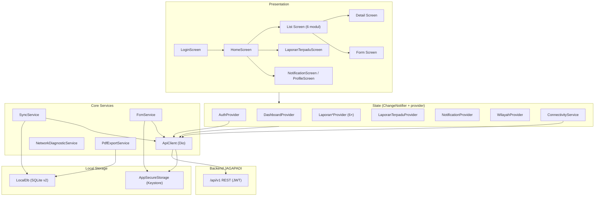
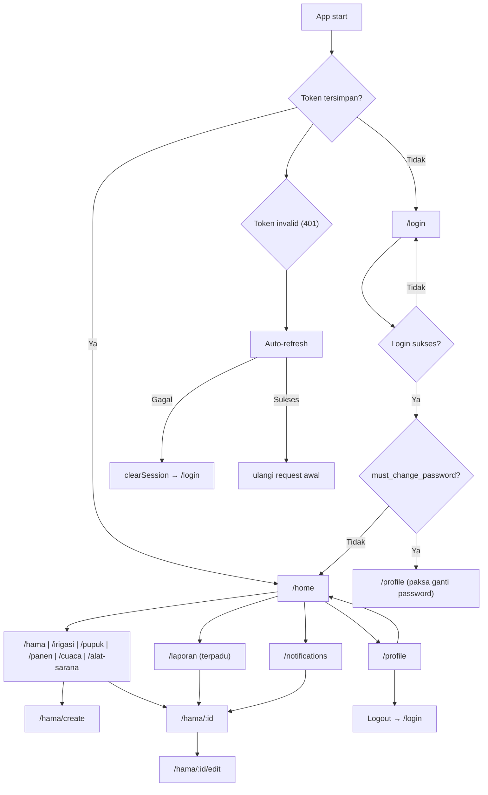
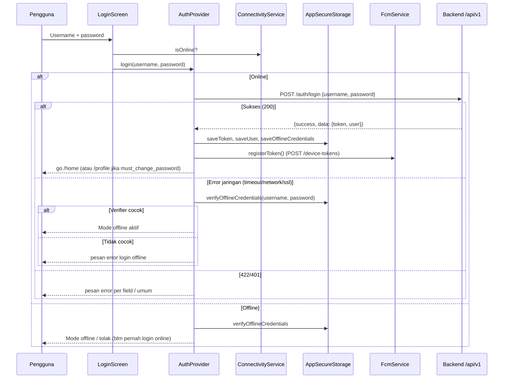
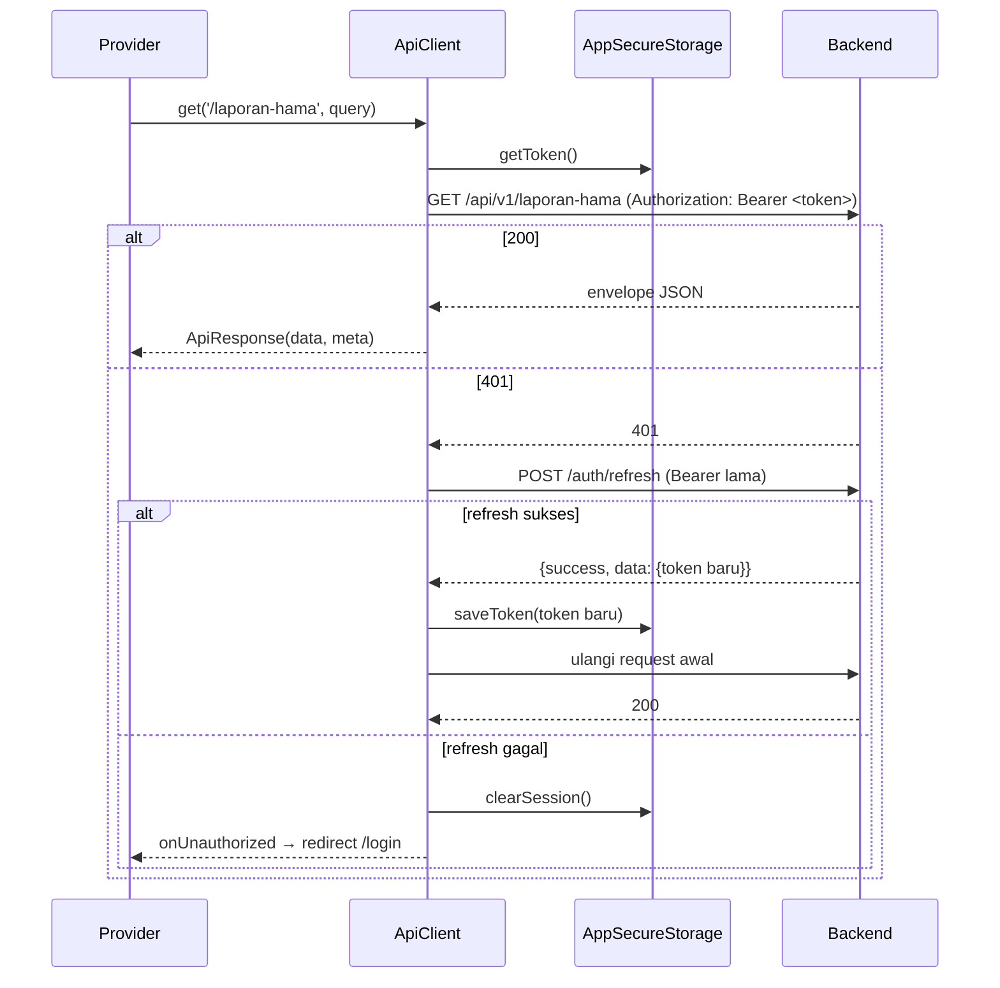
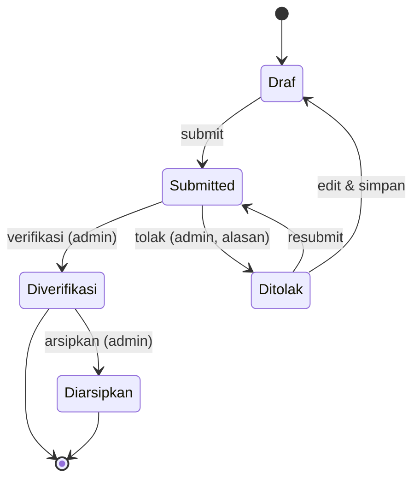
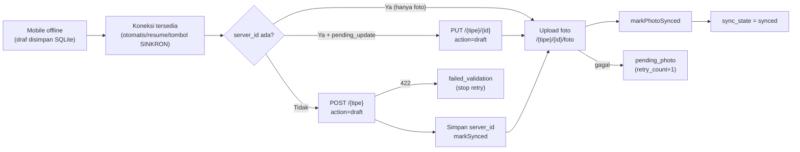
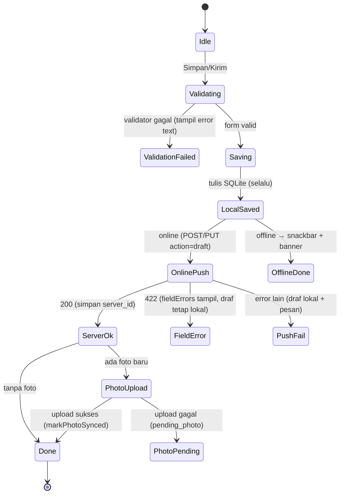
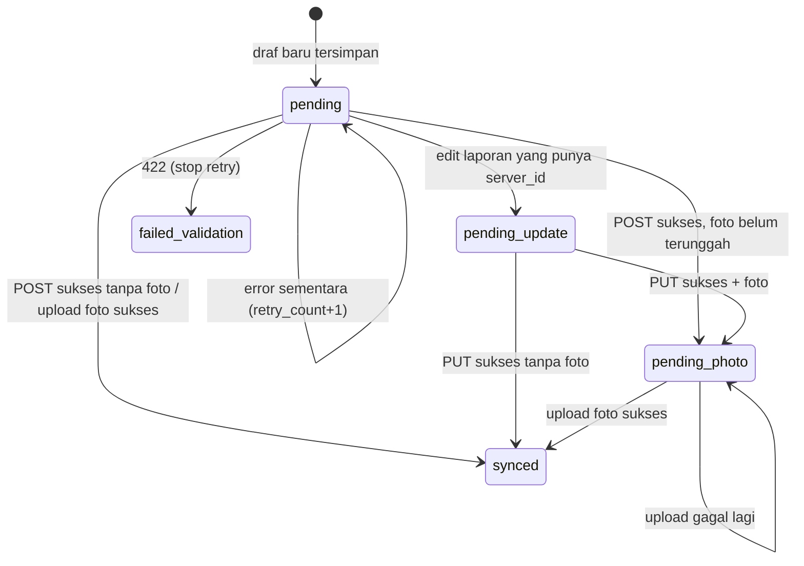

# Dokumentasi Teknis Aplikasi Mobile JAGAPADI

> **Aplikasi**: JAGAPADI Mobile — pelaporan pertanian Kabupaten Jember
> **Package**: `jagapadi_mobile` · **Versi**: `1.1.1+4` (`mobile/pubspec.yaml`)
> **Tanggal dokumentasi**: 16 Agustus 2026
> **Sumber**: source code `mobile/` (versi saat ini), `docs/API.md`, `docs/DOKUMENTASI_BACKEND.md`, berkas konfigurasi Android, unit/widget/integration test.
> **Prinsip penulisan**: fakta terverifikasi dari source code. Informasi yang tidak ditemukan ditulis **"Belum ditemukan pada source code"** atau **"Perlu dikonfirmasi"**. Setiap asumsi ditandai **"Asumsi:"**. Fitur dibedakan: ✅ sudah ada · 🔴 belum ada · 🟡 parsial/belum dapat diverifikasi.

---

## 1. Ringkasan Aplikasi Mobile

### 1.1 Nama dan Tujuan

JAGAPADI Mobile adalah aplikasi Flutter untuk pelaporan pertanian di Kabupaten Jember (Hama/OPT, Irigasi, Pupuk, Panen, Cuaca, serta Alat & Sarana), terhubung ke REST API backend JAGAPADI (`/api/v1`).

### 1.2 Masalah yang Diselesaikan

- Petugas lapangan kesulitan melapor kondisi pertanian secara cepat dari lokasi (foto + koordinat GPS).
- Koneksi internet di lapangan tidak stabil → aplikasi menyediakan **draf lokal offline** dan **login offline**.
- Admin membutuhkan antrean verifikasi dan alur status laporan yang jelas (Draf → Submitted → Diverifikasi/Ditolak → Diarsipkan).

### 1.3 Target Pengguna

| Role (backend) | Penggunaan di aplikasi |
|---|---|
| `admin` | Memverifikasi/menolak/mengarsipkan laporan; melihat antrean verifikasi |
| `petugas` | Membuat, menyimpan draf, mengirim, memperbaiki laporan |
| `operator`, `statistisi`, `viewer` | Tidak dibedakan di mobile; diperlakukan sama seperti non-admin 🟡 |

### 1.4 Platform yang Didukung

| Platform | Status |
|---|---|
| Android (minSdk 24 / targetSdk 35 / compileSdk 36, Application ID `com.jagapadi.app`) | ✅ |
| iOS | 🔴 Tidak ada folder `ios/` di repository — aplikasi saat ini **Android-only** |

### 1.5 Versi Flutter dan Dart

| Komponen | Versi |
|---|---|
| Dart SDK | `^3.0.0` (`pubspec.yaml`) |
| Flutter | 3.x (Material 3 aktif) |
| Java/Kotlin | 17 (`android/app/build.gradle`) |

### 1.6 Status Implementasi Saat Ini

- Seluruh modul inti terimplementasi: login (online/offline), 6 modul laporan, verifikasi admin, draf offline + sinkronisasi, laporan terpadu + ekspor PDF, notifikasi in-app + FCM (opsional), peta mini, tema Material 3, aksesibilitas.
- 18 berkas unit/widget test + 3 berkas integration test tersedia.
- `dist/` berisi 13 artefak APK (v1.0.0+1 s.d. 1.1.1+4, termasuk `--split-per-abi`).
- Dokumen `mobile/AUDIT_REPORT.md` (11-08-2026) **usang**: item TD-01 s.d. TD-07 dan kekurangan lain sudah ditangani di kode saat ini (rincian di bagian 24.4).

### 1.7 Batasan Scope

- Android hanya; tidak ada iOS, web, atau desktop.
- FCM default **nonaktif** (butuh `--dart-define=FCM_ENABLED=true` + `google-services.json` yang tidak ada di repository).
- Tidak ada crash reporting (Sentry/Crashlytics) dan analytics.
- Tidak ada pemetaan role di luar admin/non-admin.
- Laporan Terpadu hanya menggabungkan **hama + irigasi**.

### 1.8 Fitur Sudah / Belum / Belum Dapat Diverifikasi

| Fitur | Status |
|---|---|
| Login online (JWT) + auto-refresh token | ✅ |
| Login offline (verifier HMAC-SHA256, tanpa simpan password) | ✅ |
| 6 modul laporan: list/detail/form, draf, submit, verifikasi admin | ✅ |
| Draf lokal SQLite + sinkronisasi otomatis + tombol SINKRON manual | ✅ |
| Filter status/tanggal, pencarian (debounce 500 ms), infinite scroll | ✅ |
| Ekspor PDF (preview/simpan/bagikan) — hama, irigasi, terpadu | ✅ |
| GPS (akurasi tinggi, 2 percobaan × 12 dtk — hanya form hama) | ✅ (hama) / 🟡 (5 form lain sederhana) |
| Foto kamera (kompresi 1600 px, kualitas 85, ≤ 10 MB) | ✅ |
| Notifikasi in-app polling 60 dtk (foreground) | ✅ |
| Push notification FCM | 🟡 kode ada, nonaktif default |
| Peta mini OSM + tautan Google Maps di detail | ✅ |
| Peta/chart di dashboard | 🔴 |
| Multi-foto per laporan | 🔴 (satu foto) |
| Upload progress bar / cancel upload | 🔴 |
| Crash reporting & analytics | 🔴 |
| Validasi magic bytes foto | 🔴 (hanya ekstensi) |

---

## 2. Arsitektur Aplikasi

### 2.1 Struktur Folder Utama

```
mobile/
├── android/                    # Konfigurasi Android (manifest, gradle, network security)
├── lib/
│   ├── main.dart               # Entry point: izin notifikasi, FCM init
│   ├── app.dart                # Root widget: MultiProvider, lifecycle observer, auto-sync
│   ├── core/                   # Infrastruktur bersama
│   │   ├── api_client.dart     # Dio + JWT + refresh + retry + envelope + logging
│   │   ├── config.dart         # AppConfig: baseUrl, timeout, konstanta
│   │   ├── connectivity_service.dart   # isOnline vs isServerReachable
│   │   ├── error_handler.dart  # Pesan error per status HTTP + validasi foto
│   │   ├── local_db.dart       # SQLite local_drafts (skema v2)
│   │   ├── network_diagnostic.dart     # Diagnostik koneksi 4 tahap
│   │   ├── offline_credentials.dart    # Verifier password offline
│   │   ├── pdf_export_service.dart     # PDF A4 landscape
│   │   ├── router.dart         # go_router + auth guard + fallback route
│   │   ├── secure_storage.dart # flutter_secure_storage wrapper
│   │   ├── sync_service.dart   # Sinkronisasi draf → server
│   │   ├── theme.dart          # Token desain Material 3
│   │   ├── fcm/fcm_service.dart        # FCM lifecycle + deep link
│   │   └── widgets/            # 10 widget bersama (banner, date, foto, peta, dsb.)
│   └── features/
│       ├── auth/               # login screen, AuthProvider, model User
│       ├── home/               # home screen, DashboardProvider
│       ├── hama|irigasi|pupuk|panen|cuaca|alat_sarana/
│       │   ├── models/ providers/ screens/ (beberapa punya widgets/)
│       ├── laporan/            # laporan terpadu + filter + ekspor PDF
│       ├── notifications/      # provider + model + screen
│       ├── profile/            # profil & ubah password
│       └── wilayah/            # picker wilayah cascading
├── test/                       # 18 berkas unit/widget test
├── integration_test/           # 3 berkas integration test + fixtures/
├── scripts/                    # build_release.bat / .sh
├── dist/                       # Artefak APK hasil build
├── build-apk.bat|.ps1, run-emulator.*, run-physical-device.*, setup-dev-env.ps1, dll.
└── pubspec.yaml, analysis_options.yaml, AUDIT_REPORT.md, README.md
```

### 2.2 Lapisan Arsitektur (yang benar-benar dipakai)

| Lapisan | Komponen | Keterangan |
|---|---|---|
| Presentation/UI | `screens/`, `widgets/` | StatefulWidget + Form + Semantics |
| State management | `providers/` (ChangeNotifier + `provider` package) | Satu `ApiClient` dibagikan |
| Service | `core/*_service.dart` | API, sinkronisasi, konektivitas, PDF, FCM |
| Repository/data | **Tidak ada kelas repository terpisah** | Akses data langsung dari provider melalui `ApiClient` / `LocalDb` / `AppSecureStorage` |
| Local storage | `local_db.dart` (SQLite), `secure_storage.dart` | Draf + token/verifier |
| Networking | `api_client.dart` (Dio + interceptor) | JWT, refresh, retry, error classification |

**Catatan**: tidak ditemukan lapisan domain/use-case terpisah, DI container, repository pattern, BLoC/Riverpod/GetX, atau Clean Architecture di source code. Pola yang dipakai: **ChangeNotifier + Provider** untuk state, **service class** untuk logika, **factory `fromJson`** pada model.

### 2.3 Diagram Arsitektur



### 2.4 Pola Arsitektur yang Digunakan

1. **Provider sebagai facade layanan**: provider memanggil `ApiClient`/`LocalDb` langsung (tanpa repository layer).
2. **Envelope normalization** (`ApiResponse.fromJson`, `api_client.dart:24-48`): jika `data` berupa array, dibungkus `{data: [...], meta: {...}}` agar provider list aman.
3. **Single ApiClient** dibuat sekali di `_JagapadiAppState` (`app.dart`); `AuthProvider` punya instance sendiri dengan callback `onUnauthorized` → redirect `/login`.
4. **Service statis** untuk operasi global: `SyncService.syncPendingDrafts` (guard `_isSyncing`), `ErrorHandler` (helper statis).
5. **Factory pattern** pada model: `LaporanHama.fromJson`, `NotificationItem.fromJson` (mendukung key alternatif `title`/`judul`).

### 2.5 Dependency Injection

Tidak ada DI container. Dependency diberikan **melalui konstruktor provider** di `MultiProvider` (`app.dart`), dan `AuthProvider` menerima `AppRouter` via konstruktor. Callback `onLogoutCallback` dipakai untuk membersihkan cache provider lain tanpa circular dependency (`auth_provider.dart:20`).

### 2.6 Routing / Navigasi

- Router package: **`go_router` 14.x** (bukan named route bawaan Flutter) — detail di bagian 5.
- Navigasi memakai `context.push()` (tumpukan) dan `context.go()` (tab, mencegah stack menumpuk).

### 2.7 Error Handling

- `ApiClient._handleDioError` mengklasifikasi error: `TimeoutError`, `NetworkError`, `SslError`, `Cancelled`, atau parsing body HTTP (401/403/404/409/422/429/500/502/503/504).
- `ErrorHandler.getErrorMessage` memetakan ke pesan ramah pengguna (tabel lengkap di bagian 9.4).
- Error 422 ditampilkan **per field** (`_fieldErrors`) di form; error lain lewat SnackBar/banner.
- `LaporanTerpaduProvider` punya parsing error sendiri yang berbeda (lihat 21.8 — inkonsistensi).

### 2.8 Logging dan Monitoring

| Aspek | Status |
|---|---|
| Log HTTP (request/response/error) | ✅ `ApiClient._log` — **hanya aktif di `kDebugMode`** (`api_client.dart:395`) |
| Log sinkronisasi | ✅ `debugPrint` di `SyncService` |
| Crash reporting | 🔴 Tidak ada (Sentry/Crashlytics tidak ditemukan) |
| Analytics | 🔴 Tidak ada |

---

## 3. Teknologi dan Dependency

### 3.1 Tabel Dependency (dari `pubspec.yaml`)

| Komponen | Package | Versi | Fungsi | Status | Risiko/Catatan |
|---|---|---|---|---|---|
| HTTP client | `dio` | ^5.4.0 | Request API, interceptor, upload | ✅ dipakai | Retry POST otomatis; upload tanpa progress |
| State management | `provider` | ^6.1.1 | ChangeNotifier DI | ✅ dipakai | — |
| Routing | `go_router` | ^14.0.0 | Navigasi + auth guard | ✅ dipakai | — |
| Secure storage | `flutter_secure_storage` | ^9.0.0 | Token JWT, user, verifier | ✅ dipakai | — |
| Local database | `sqflite` | ^2.3.0 | Draf offline | ✅ dipakai | Payload JSON plaintext |
| Connectivity | `connectivity_plus` | ^6.0.3 | Deteksi jaringan | ✅ dipakai | Hanya sinyal, bukan konektivitas server |
| Location/GPS | `geolocator` | ^11.0.0 | Koordinat | ✅ dipakai | Tanpa `checkPermission` pada 5 form lain |
| Image picker | `image_picker` | ^1.0.7 | Kamera | ✅ dipakai | Khusus `ImageSource.camera`; kompresi 1600/85 |
| Permission | `permission_handler` | ^11.3.1 | Izin kamera | ✅ dipakai | — |
| Push notification | `firebase_core` | ^3.6.0 | FCM init | 🟡 default off | Butuh `google-services.json` |
| Push notification | `firebase_messaging` | ^15.1.3 | FCM | 🟡 default off | — |
| Maps | `flutter_map` + `latlong2` | ^7.0.0 / ^0.9.0 | Peta mini OSM | ✅ dipakai | Tile OSM; tanpa API key |
| URL launcher | `url_launcher` | ^6.2.5 | Buka Google Maps | ✅ dipakai | — |
| PDF | `pdf` + `printing` | ^3.10.0 / ^5.12.0 | Generate + preview PDF | ✅ dipakai | — |
| Share | `share_plus` | ^12.0.0 | Bagikan PDF | ✅ dipakai | — |
| File path | `path_provider` + `path` | ^2.1.0 / ^1.9.0 | Direktori dokumen | ✅ dipakai | — |
| Kripto | `crypto` | ^3.0.3 | HMAC-SHA256 verifier | ✅ dipakai | KDF manual (lihat 16.6) |
| Format | `intl` | ^0.20.2 | Tanggal id_ID | ✅ dipakai | — |
| JSON serialization | manual `fromJson` | — | — | ✅ dipakai | Tanpa `json_serializable` |
| Testing | `flutter_test`, `integration_test`, `flutter_lints` | ^3.0.1 | Unit/widget/integration | ✅ dipakai | — |
| Font | `google_fonts` | — | — | 🔴 tidak ada di pubspec | README keliru menyebutnya |
| Crash reporting | Sentry/Crashlytics | — | — | 🔴 tidak ada | — |
| Analytics | — | — | — | 🔴 tidak ada | — |

### 3.2 Kategori Penggunaan

- **Wajib/inti**: dio, provider, go_router, flutter_secure_storage, sqflite, connectivity_plus, geolocator, image_picker, permission_handler, intl, flutter_map, latlong2, url_launcher, pdf, printing, share_plus, path_provider, path, crypto.
- **Opsional (feature flag)**: firebase_core, firebase_messaging (aktif hanya jika `FCM_ENABLED=true`).
- **Deprecated/usang**: tidak ditemukan paket yang ditandai deprecated; `image_picker` `retrieveLostData` tetap dipakai untuk pemulihan foto.

---

## 4. Konfigurasi Environment

### 4.1 Konfigurasi yang Ditemukan (`lib/core/config.dart`)

| Konfigurasi | Nilai | Sumber |
|---|---|---|
| API base URL | `API_BASE_URL` (dart-define) > `http://10.0.2.2/jagapadi-3509/api/v1` (Android) > `http://localhost/jagapadi-3509/api/v1` | `config.dart:30-37` |
| API versioning | Via path `/api/v1` (terkandung dalam base URL) | — |
| Connect timeout | 20.000 ms | `config.dart:41` |
| Receive timeout | 30.000 ms | `config.dart:42` |
| Upload (send) timeout | 120.000 ms | `config.dart:43` |
| Polling notifikasi | 60 detik (foreground) | `config.dart:47` |
| Batas ukuran foto | 10 MB | `config.dart:51` |
| Retry maksimum (POST) | 2 | `config.dart:55` |
| Backoff retry | 1000 ms × attempt (linear) | `config.dart:56` |
| Health check | `$baseUrl/health` | `config.dart:61` |
| Allowed image format | jpg, jpeg, png, webp | `error_handler.dart:139` |
| Feature flag | `FCM_ENABLED` (default `false`) | `main.dart` |
| Map provider | OpenStreetMap tile (flutter_map) — tanpa API key | `mini_map_preview.dart` |
| Firebase | Belum dikonfigurasi (`google-services.json` tidak ada) | `android/app/` |
| Sentry/Crashlytics | Tidak ada | — |
| CORS/backend | Tidak dikelola di mobile | — |

### 4.2 Tabel Variabel Environment

| Variabel | Contoh nilai | Wajib/opsional | Digunakan di | Dampak jika salah | Aman di repo? |
|---|---|---|---|---|---|
| `API_BASE_URL` | `http://192.168.10.5/jagapadi-3509/api/v1` | Opsional (ada default) | `config.dart` | Semua request gagal / salah server | Ya (bukan secret) |
| `FCM_ENABLED` | `true` | Opsional (default false) | `main.dart`, `fcm_service.dart` | FCM init error saat true tanpa Firebase | Ya |
| `API_BASE_URL` (skrip build) | `https://jagapadi.jemberkab.go.id/api/v1` | Opsional | `scripts/build_release.bat` | APK produksi menunjuk server salah | 🟡 domain produksi perlu dikonfirmasi |
| `google-services.json` | (file Firebase) | Opsional | android/ | FCM tidak berfungsi | 🔴 TIDAK di repo (benar) |
| `key.properties` | (keystore) | Opsional | `build.gradle` | Release memakai debug signing | 🔴 TIDAK di repo (benar) |

**Catatan keamanan**: tidak ada token/password/private key yang tertanam di kode. Base URL default hanya IP LAN pengembangan.

### 4.3 Environment Development / Staging / Production

| Environment | Base URL | Cara pakai |
|---|---|---|
| Development (emulator) | `http://10.0.2.2/jagapadi-3509/api/v1` (default, port 80) | `flutter run` |
| Development (perangkat fisik) | `http://192.168.10.5/jagapadi-3509/api/v1` | `flutter run --dart-define=API_BASE_URL=...` |
| Production | `https://jagapadi.jemberkab.go.id/api/v1` | `scripts/build_release.bat` |
| Staging | 🔴 Belum ditemukan pada source code | — |

**Asumsi**: port 80 adalah port default Laragon (komentar `config.dart:19-21`). Integration test memakai port 8080 (`integration_test/fixtures/setup_test_data.dart`) — lihat ketidaksesuaian di bagian 21.

---

## 5. Struktur Navigasi

### 5.1 Tabel Route (`lib/core/router.dart`)

| Route | Screen | Tujuan | Role | Parameter | Dari | Ke | Kondisi khusus | Status |
|---|---|---|---|---|---|---|---|---|
| `/` (initial) | LoginScreen | Login | Semua | — | — | `/login` atau `/home` | Redirect sesuai token | ✅ |
| `/login` | LoginScreen | Login online/offline | Semua | — | Awal | `/home`, `/profile` (force) | `must_change_password` → `/profile` | ✅ |
| `/home` | HomeScreen | Beranda | Semua | — | Login | sub-halaman | — | ✅ |
| `/hama` | HamaListScreen | Daftar hama | Semua | `?status=` | Home/menu | detail/form | Admin: verifikasi | ✅ |
| `/hama/create` | HamaFormScreen | Buat laporan | Petugas/operator | — | List | — | — | ✅ |
| `/hama/:id` | HamaDetailScreen | Detail | Semua | id int | List/notif | edit | `_parseId` valid | ✅ |
| `/hama/:id/edit` | HamaFormScreen | Edit | Petugas | id int | Detail | — | Draf/Ditolak | ✅ |
| `/irigasi`, `/pupuk`, `/panen`, `/cuaca`, `/alat-sarana` (+ `/create`, `/:id`, `/:id/edit`) | masing-masing | Sama pola hama | Semua | — | — | — | — | ✅ |
| `/laporan` | LaporanTerpaduScreen | Laporan terpadu | Semua (petugas via menu) | — | Home (menu "Semua Laporan") | detail | Bottom nav tab 2 | ✅ |
| `/notifications` | NotificationScreen | Notifikasi in-app | Semua | — | Home | detail laporan | Tap item → detail | ✅ |
| `/profile` | ProfileScreen | Profil/ubah password | Semua | — | Home | — | Bottom nav tab 4 | ✅ |

### 5.2 Diagram Navigasi



### 5.3 Perilaku Navigasi

| Pertanyaan | Jawaban |
|---|---|
| Named route atau router package? | `go_router` 14.x (deklaratif, dengan `refreshListenable` + state `token` di `AppRouter`) |
| Deep link? | Route ID di-parse dengan `_parseId` (int) → layar `_InvalidRouteScreen` jika tidak valid; deep link FCM divalidasi whitelist entity (bagian 13.5) |
| Setelah login? | `/home`, kecuali `must_change_password` → `/profile` (force) |
| Token tidak valid? | 401 → auto-refresh → gagal → `AppSecureStorage.clearSession()` + redirect `/login` |
| Belum login? | Guard mengarahkan ke `/login` (kecuali sudah di `/login`) |
| Back navigation khusus? | Tab memakai `context.go` (bukan push) agar stack tidak menumpuk (`home_screen.dart:90-105`); form edit kembali dengan `Navigator.pop` |

---

## 6. Autentikasi dan Otorisasi

### 6.1 Alur Login (verifikasi dari `auth_provider.dart`, `login_screen.dart`)



### 6.2 Detail Teknis

| Aspek | Detail |
|---|---|
| Endpoint login | `POST /auth/login` |
| Format request | `{"username": "...", "password": "..."}` |
| Format response | `{success, message, data: {token, user}}` — `user` diparse oleh `User.fromJson` |
| Penyimpanan access token | `AppSecureStorage` (Android Keystore), key `jwt_token` |
| Refresh token | 🔴 **Tidak ada refresh token terpisah** — refresh memakai token lama (`POST /auth/refresh` dengan Bearer token lama, `api_client.dart:257-288`) |
| Token expiry | Dikenali saat API mengembalikan 401 → auto-refresh → ulangi request awal |
| Logout | `FcmService.unregisterToken()` → `POST /auth/logout` → `clearAll()` → redirect `/login`; `onLogoutCallback` membersihkan cache provider |
| Auto-login / session restore | `AuthProvider._loadSavedSession()` membaca token+user saat konstruktor; guard router hanya mengecek keberadaan token |
| Penanganan 401 | Auto-refresh satu kali; jika gagal → `clearSession` + `onUnauthorized` → `/login` |
| Penanganan 403 | Pesan: *"Aksi ini tidak diizinkan untuk akun Anda."* |
| Penanganan rate limit | 429 → *"Terlalu banyak permintaan. Silakan tunggu beberapa menit dan coba lagi."* |
| Login offline | Verifier HMAC-SHA256 (salt 32B, 20.000 iterasi, constant-time); ditolak jika `must_change_password`; wajib pernah login online di perangkat |

### 6.3 Perbedaan Role

| Role | UI mobile | Enforced di |
|---|---|---|
| `admin` | Kartu "Antrian Verifikasi", aksi Verifikasi/Tolak/Arsipkan, statistik tidak dimuat | Backend (mobile menyembunyikan UI) |
| `petugas` (dan lainnya) | Statistik sendiri, aksi kirim/edit | Backend |
| `operator`, `statistisi`, `viewer` | Tidak dibedakan (diperlakukan sebagai non-admin) 🟡 | Backend |

**Penting**: validasi/perbedaan UI di mobile **bukan pengganti validasi backend**. Seluruh otorisasi tetap harus ditegakkan di backend; mobile hanya UX. Role non-admin tetap bisa membuka layar aksi (mis. tombol admin tidak dirender, tetapi endpoint memproteksi via policy backend).

### 6.4 Sequence Diagram Request Terautentikasi



---

## 7. Modul Dashboard

### 7.1 KPI yang Ditampilkan

Kartu ringkasan **Aktif / Draf / Ditolak** — jumlah gabungan hama + irigasi (`home_screen.dart:152-161`). Admin tidak melihat statistik (kartu Antrian Verifikasi sebagai gantinya).

### 7.2 Tabel Widget Dashboard

| Widget (kelas) | Source data | Endpoint | Parameter | Format data | Kondisi tampil | Cara refresh | Penanganan error |
|---|---|---|---|---|---|---|---|
| `_HeroHeader` | `AuthProvider.user`, `NotificationProvider.unreadCount` | — | — | `User`, `int` | Selalu | — | Fallback nama "Pengguna" |
| `_FloatingSummaryCard` | `DashboardProvider.hamaStats` + `irigasiStats` | `GET /dashboard/stats` | `tahun=YYYY` (tahun berjalan) | `DashboardStats{total_aktif, total_draf, total_ditolak}` (fallback key `aktif/draf/ditolak`) | Non-admin | Pull-to-refresh, setelah SINKRON, `resumed` | Loading spinner; jika gagal angka menjadi 0 (error tidak ditampilkan eksplisit) 🟡 |
| `_SectionHeader` | `_syncing` lokal | — | — | — | Selalu | — | Snackbar hasil sinkron |
| `ConnectionErrorBanner` | `ConnectivityService` | Diagnostik `$baseUrl/health` | — | enum koneksi | Saat offline/server unreachable | Lifecycle + tombol "Coba Lagi" | Snackbar pesan diagnosa |
| `_FeatureCard` Antrian Verifikasi | `NotificationProvider.unreadCount` | `GET /notifications/unread-count` (polling 60 s) | — | `int` | Hanya admin | Polling/refresh | Badge 0 |
| `_MenuGrid` (9 entri) | Statis + `unreadCount` | — | — | — | Semua; "Semua Laporan" hanya non-admin | — | — |
| `NavigationBar` | `GoRouterState` | — | — | — | Semua | Route-aware (`_selectedNavIndex`) | — |

### 7.3 Perilaku Tambahan

- **Filter waktu/wilayah/jenis laporan di dashboard**: 🔴 tidak ada (tahun statistik otomatis tahun berjalan; belum ada UI pilih tahun).
- **Chart/peta**: 🔴 tidak ada.
- **Empty state**: kartu menampilkan 0; tidak ada empty state khusus.
- **Cache**: data statistik hanya di memori provider; tidak ada cache disk. Saat logout statistik tidak di-reset secara eksplisit (data lama bisa tampil untuk pengguna baru sampai `loadStats()` dipanggil) 🟡.
- **Offline**: saat mode offline, `loadStats()` gagal → angka 0; banner offline tampil.

---

## 8. Modul Laporan

### 8.0 Field Umum Semua Jenis Laporan

| Field | Label UI | Tipe | Wajib draf | Wajib submit | Nilai | Validasi mobile | Validasi backend | Pesan error mobile | Keterangan |
|---|---|---|---|---|---|---|---|---|---|
| `tanggal` | "Tanggal Laporan" (hama/irigasi/cuaca/alat), "Tanggal Pemupukan" (pupuk), "Tanggal Panen" (panen) | string `YYYY-MM-DD` | Ya (DateField) | Ya | 2020-01-01 s.d. H+1 | `DateField` validator | Sesuai `docs/API.md` 🟡 | "Tanggal ... wajib diisi" / "Format tanggal tidak valid" / "Tanggal di luar rentang yang diizinkan" | Picker id_ID, tampilan "d MMMM yyyy" |
| `kabupaten_id`, `kecamatan_id`, `desa_id` | Picker Wilayah | int | Tidak (opsional) | Tidak 🟡 | ID wilayah dari `/wilayah/*` | Race-guard provider | 🟡 | error per field dari 422 | Cascading; reset anak saat induk berubah |
| `latitude`, `longitude` | "Latitude" / "Longitude" | double (7 desimal di hama) | Tidak | Tidak | koordinat | Hanya dikirim jika terisi | 🟡 | — | Tombol "Ambil Lokasi GPS" |
| `catatan` | "Catatan Lapangan" | string | Tidak | Tidak | maks. 2000 (hama/irigasi); lainnya tanpa batas 🟡 | `maxLength` hanya hama & irigasi | 🟡 | — | — |
| `foto` | "Foto Laporan" | file multipart | Tidak | **Ya** (hama & irigasi cek klien; 4 tipe lain tidak dicek 🟡) | jpg/jpeg/png/webp ≤ 10 MB | `ErrorHandler.validatePhoto` + ukuran | wajib saat submit (`docs/API.md`) | "Foto laporan wajib disertakan..." / "Format foto harus berupa JPG, PNG, atau WEBP..." / "Ukuran foto (x MB) melebihi batas 10 MB." | Kamera saja, 1600 px, kualitas 85 |
| `status`, `nomor_laporan` | Badge status / nomor | string | — | — | `Draf|Submitted|Diverifikasi|Ditolak|Diarsipkan` | — | — | — | Nomor hanya ada saat Submitted |
| `verified_by`, `verified_at`, `catatan_verifikasi` | Info verifikasi | — | — | — | — | — | — | — | Diisi admin |

### 8.1 Laporan Hama/OPT

#### 8.1.1 Tujuan dan Role Pengguna
Melaporkan serangan hama/OPT di sawah. Petugas/operator membuat & mengirim; admin memverifikasi; semua role dapat melihat list/detail.

#### 8.1.2 Daftar Field Spesifik

| Field | Label UI | Tipe | Wajib draf | Wajib submit | Nilai diizinkan | Validasi mobile | Validasi backend | Pesan error | Keterangan |
|---|---|---|---|---|---|---|---|---|---|
| `master_opt_id` | "OPT" (search) | int | Tidak | Ya 🟡 | dari `GET /opt?aktif=1` | `OptSearchField` | wajib saat submit | error per field 422 | Pencarian dengan cache |
| `tingkat_keparahan` | "Tingkat Keparahan" | string | Tidak | Ya 🟡 | `Ringan|Sedang|Berat` | dropdown tanpa validator eksplisit 🟡 | ENUM wajib | — | — |
| `lokasi` | "Lokasi / Blok Sawah" | string | Tidak | Ya 🟡 | bebas | tanpa validator 🟡 | wajib | — | — |
| `luas_serangan` | "Luas Serangan (ha)" | double | Tidak | Tidak | desimal ≥ 0 | keyboard desimal; `double.tryParse` | 🟡 | — | Hanya dikirim jika terisi |
| `populasi` | "Populasi" | double | Tidak | Tidak | desimal ≥ 0 | sama | 🟡 | — | Hanya dikirim jika terisi |

#### 8.1.3 Validasi
- **Draf**: hanya `tanggal` yang wajib (DateField). Validator lain tidak eksplisit di kode 🟡 — backend yang menegakkan.
- **Submit**: klien mewajibkan foto + online; konfirmasi dialog menampilkan ringkasan (Tanggal, OPT, Keparahan, Luas, Lokasi).
- **Format**: tanggal di dalam rentang; angka di-parse dengan `tryParse` (input tidak valid diabaikan).
- **Bisnis**: GPS gagal → snackbar pesan; foto > 10 MB → blokir simpan.

#### 8.1.4 Sumber Dropdown, GPS, dan Foto
- OPT: `GET /opt?aktif=1` (cache per sesi, `clearOptCache()` saat logout).
- GPS: **paling lengkap** — cek layanan, izin (denied/deniedForever → pesan + "Buka Pengaturan"), 2 percobaan × 12 dtk dengan jeda 750 ms, akurasi `high`, format 7 desimal (`hama_form_screen.dart:86-152`).
- Foto: `FotoPicker` kamera.

#### 8.1.5 Status dan Endpoint
Endpoint: `/laporan-hama` (GET list/POST), `/laporan-hama/{id}` (GET/PUT/DELETE), `.../{id}/submit`, `/verifikasi`, `/tolak`, `/archive`, `/resubmit`, `/{id}/foto` (multipart). Status & transisi lihat 8.7.

#### 8.1.6 Perilaku Offline dan Error
- Simpan → tulis SQLite dulu, lalu POST/PUT `action:'draft'`; offline → banner "Mode Offline — Draf tersimpan aman di perangkat".
- Submit offline → snackbar; error server → "*<pesan>*\nDraf tersimpan lokal dan akan disinkronkan otomatis."
- Foto gagal upload → "Laporan tersimpan, tapi foto gagal diupload. Coba upload ulang di detail laporan."

#### 8.1.7 Contoh Alur Pengguna
1. Petugas membuka menu Hama/OPT → "Buat Laporan Hama".
2. Pilih tanggal, cari OPT, pilih wilayah, isi lokasi/keparahan/luas/populasi, "Ambil Lokasi GPS", foto kamera.
3. "Simpan Draf" (offline aman) atau "Kirim Laporan" (konfirmasi → submit).
4. Admin membuka `/hama?status=Submitted` → Verifikasi/Tolak (alasan ≥ 10 karakter) → Diverifikasi/Ditolak.
5. Ditolak → petugas "Edit & Perbaiki"/"Kirim Ulang". Diverifikasi → admin "Arsipkan".

### 8.2 Laporan Irigasi

#### 8.2.1 Tujuan dan Role
Melaporkan kondisi saluran irigasi. Sama pola role dengan 8.1.

#### 8.2.2 Daftar Field Spesifik

| Field | Label UI | Tipe | Wajib draf | Wajib submit | Nilai diizinkan | Validasi mobile | Validasi backend | Pesan error | Keterangan |
|---|---|---|---|---|---|---|---|---|---|
| `nama_saluran` | "Nama Saluran Irigasi" | string | Ya | Ya | bebas | validator "Nama saluran wajib diisi" | 🟡 | "Nama saluran wajib diisi" | — |
| `daerah_irigasi` | "Daerah Irigasi (opsional)" | string | Tidak | Tidak | bebas | — | 🟡 | — | Opsional |
| `kondisi_fisik` | "Kondisi Fisik Saluran" | string | Ya | Ya | `Bagus|Sedang|Tidak Bagus|Rusak` | dropdown + validator | ENUM `kondisi_fisik` (sama) | "Kondisi fisik wajib dipilih" | Cocok dengan backend |
| `debit_air` | "Debit Air" | string | Ya | Ya | `Cukup|Kurang|Kering` | dropdown + validator | ENUM `debit_air` (sama) | "Debit air wajib dipilih" | Cocok dengan backend |

#### 8.2.3–8.2.6 Ringkasan
- Validasi lain: `tanggal` wajib; GPS sederhana (`getCurrentPosition()` tanpa precheck izin); foto ≤ 10 MB; catatan `maxLength 2000`.
- Endpoint: `/laporan-irigasi...` (identik pola 8.1).
- Submit: cek online, dialog konfirmasi, pesan sukses "Laporan irigasi berhasil dikirim ke Admin ✓".
- Bug fix tercatat: `_localDraftId` mencegah duplikat draf lokal saat simpan berulang.

#### 8.2.7 Contoh Alur
1. Petugas → menu Irigasi → "Laporan Irigasi Baru" → isi saluran/daerah/wilayah/kondisi/debit/GPS/foto → Kirim.
2. Admin verifikasi dari list irigasi (`/irigasi?status=Submitted`).

### 8.3 Laporan Pupuk

#### 8.3.1 Tujuan dan Role
Mencatat penggunaan pupuk. Role sama.

#### 8.3.2 Daftar Field Spesifik

| Field | Label UI | Tipe | Wajib draf | Wajib submit | Nilai diizinkan | Validasi mobile | Validasi backend | Pesan error | Keterangan |
|---|---|---|---|---|---|---|---|---|---|
| `jenis_pupuk` | "Jenis Pupuk" | string | Ya | Ya | `Urea|NPK|Organik|Kompos|Lainnya` | dropdown + validator | 🟡 | "Jenis pupuk wajib dipilih" | — |
| `dosis_per_ha` | "Dosis (kg/ha)" | double | Tidak | Tidak | desimal | keyboard desimal | 🟡 | — | Opsional |
| `luas_pemupukan` | "Luas (ha)" | double | Tidak | Tidak | desimal | sama | 🟡 | — | Opsional |
| `metode_aplikasi` | "Metode Aplikasi" | string | Tidak | Tidak | `Tabur|Kocor|Semprot|Injeksi` | dropdown | 🟡 | — | Opsional |

#### 8.3.3–8.3.6 Ringkasan
- **Catatan**: form ini **tanpa `maxLength`** pada catatan; **tanpa cek foto saat submit** (klien) 🟡; tanpa Semantics label; tanpa GPS permission precheck; tombol 48 px.
- Pesan offline & sync: "Draf tersimpan di perangkat lokal (akan disinkronkan saat server siap)".
- Endpoint: `/laporan-pupuk...`.

### 8.4 Laporan Panen

#### 8.4.1 Tujuan dan Role
Mencatat hasil panen. Role sama.

#### 8.4.2 Daftar Field Spesifik

| Field | Label UI | Tipe | Wajib draf | Wajib submit | Nilai diizinkan | Validasi mobile | Validasi backend | Pesan error | Keterangan |
|---|---|---|---|---|---|---|---|---|---|
| `komoditas` | "Komoditas" | string | Ya | Ya | bebas | validator | 🟡 | "Komoditas wajib diisi" | — |
| `varietas` | "Varietas" | string | Tidak | Tidak | bebas | — | 🟡 | — | Opsional |
| `luas_panen` | "Luas Panen (ha)" | double | Ya | Ya | desimal ≥ 0 | validator "Wajib diisi" | 🟡 | "Wajib diisi" | — |
| `hasil_panen` | "Hasil (ton)" | double | Ya | Ya | desimal ≥ 0 | validator "Wajib diisi" | 🟡 | "Wajib diisi" | — |
| `musim_tanam` | "Musim Tanam" | string | Tidak | Tidak | `MT1|MT2|MT3` | dropdown | 🟡 | — | Opsional |

#### 8.4.3–8.4.6 Ringkasan
Sama pola 8.3: tanpa `maxLength` catatan, tanpa cek foto saat submit 🟡, GPS sederhana, endpoint `/laporan-panen...`.

### 8.5 Laporan Cuaca

#### 8.5.1 Tujuan dan Role
Melaporkan kondisi cuaca harian. Role sama.

#### 8.5.2 Daftar Field Spesifik

| Field | Label UI | Tipe | Wajib draf | Wajib submit | Nilai diizinkan | Validasi mobile | Validasi backend | Pesan error | Keterangan |
|---|---|---|---|---|---|---|---|---|---|
| `kondisi_cuaca` | "Kondisi Cuaca" | string | Ya | Ya | `Cerah|Berawan|Hujan Ringan|Hujan Lebat|Badai` | dropdown + validator | 🟡 | "Kondisi cuaca wajib dipilih" | — |
| `suhu_min`, `suhu_max` | "Suhu Min (°C)" / "Suhu Max (°C)" | double | Tidak | Tidak | desimal | keyboard desimal | 🟡 | — | Opsional |
| `curah_hujan` | "Curah Hujan (mm)" | double | Tidak | Tidak | desimal | sama | 🟡 | — | Opsional |
| `kelembaban` | "Kelembaban (%)" | double | Tidak | Tidak | desimal | sama | 🟡 | — | Opsional |
| `kecepatan_angin` | "Kecepatan Angin (km/j)" | double | Tidak | Tidak | desimal | sama | 🟡 | — | Opsional |

#### 8.5.3–8.5.6 Ringkasan
Sama pola 8.3; endpoint `/laporan-cuaca...`.

### 8.6 Laporan Alat & Sarana

#### 8.6.1 Tujuan dan Role
Melaporkan kondisi alat/sarana pertanian. Role sama.

#### 8.6.2 Daftar Field Spesifik

| Field | Label UI | Tipe | Wajib draf | Wajib submit | Nilai diizinkan | Validasi mobile | Validasi backend | Pesan error | Keterangan |
|---|---|---|---|---|---|---|---|---|---|
| `nama_alat` | "Nama Alat / Sarana" | string | Ya | Ya | bebas | validator | 🟡 | "Nama alat wajib diisi" | — |
| `jenis_sarana` | "Jenis Sarana" | string | Tidak | Tidak | `Traktor|Pompa Air|Gudang|Jalan Usaha Tani|Lainnya` | dropdown | 🟡 | — | Opsional |
| `kondisi` | "Kondisi" | string | Tidak | Tidak | `Baik|Rusak Ringan|Rusak Berat|Tidak Layak` | dropdown | 🟡 | — | Opsional |
| `kapasitas` | "Kapasitas" | string | Tidak | Tidak | bebas | — | 🟡 | — | Opsional |
| `tahun_pengadaan` | "Tahun Pengadaan" | int | Tidak | Tidak | angka | `int.tryParse` | 🟡 | — | Opsional |

#### 8.6.3–8.6.6 Ringkasan
Sama pola 8.3; endpoint `/laporan-alat-sarana...`.

### 8.7 Status Laporan dan Transisi yang Diizinkan

| Transisi | Aksi | Role | Endpoint |
|---|---|---|---|
| `Draf → Submitted` | Kirim Laporan | Petugas | `POST /{tipe}/{id}/submit` |
| `Submitted → Diverifikasi` | Verifikasi (opsional catatan) | Admin | `POST /{tipe}/{id}/verifikasi` |
| `Submitted → Ditolak` | Tolak (alasan ≥ 10 karakter) | Admin | `POST /{tipe}/{id}/tolak` |
| `Ditolak → Submitted` | Kirim Ulang | Petugas | `POST /{tipe}/{id}/resubmit` |
| `Ditolak → Draf` | Edit & Perbaiki → Simpan Draf | Petugas | `PUT /{tipe}/{id}` (`action:'draft'`) 🟡 (status kembali ke Draf tergantung backend) |
| `Diverifikasi → Diarsipkan` | Arsipkan | Admin | `POST /{tipe}/{id}/archive` |



**Aturan**: draf tidak bisa diverifikasi (backend); nomor laporan hanya dibuat saat Submitted; petugas hanya melihat laporan sendiri (backend policy) — semua ditegakkan di backend, UI mobile hanya menyesuaikan.

---

## 9. Form dan Validasi

### 9.1 Jenis Validasi yang Diterapkan

| Jenis | Implementasi | Status |
|---|---|---|
| Field wajib | Validator Form per field (lihat 8.x) | ✅ parsial (hama minim validator eksplisit) |
| Panjang teks | `maxLength: 2000` (hama & irigasi saja) | 🟡 |
| Angka | `keyboardType: numberWithOptions(decimal)` + `tryParse` saat payload | 🟡 tanpa rentang |
| Tanggal | `DateField`: format `yyyy-MM-dd`, rentang 2020–H+1 | ✅ |
| Koordinat | Hanya teks numerik; tanpa rentang geografis | 🟡 |
| Dropdown | Nilai enumerasi kode | ✅ |
| Foto | Ekstensi + ukuran ≤ 10 MB | ✅ (tanpa magic bytes) |
| Koneksi | `ConnectivityService.isOnline` sebelum submit | ✅ |
| Status laporan | Aksi di-gate role UI; backend menegakkan | ✅/backend |

### 9.2 Tabel Pesan Error (dari source code)

| Kondisi | Pesan ditampilkan | Sumber | Retry? | Tindakan pengguna |
|---|---|---|---|---|
| Username kosong | "Username wajib diisi" | `login_screen.dart:267` | — | Isi username |
| Password kosong | "Password wajib diisi" | `login_screen.dart:301` | — | Isi password |
| Login 401/422 | Pesan per field / "Login gagal. Periksa username dan password." | `auth_provider.dart:88-92` | Ya | Perbaiki input |
| Server tak terjangkau (login) | "...login offline belum tersedia untuk akun ini..." | `auth_provider.dart:132` | Ya | Cek server/koneksi |
| `must_change_password` offline | "Password wajib diubah saat online sebelum mode offline dapat digunakan." | `auth_provider.dart:120` | — | Login online & ganti password |
| Tanggal kosong | "{Label} wajib diisi" | `date_field.dart:133` | — | Pilih tanggal |
| Tanggal format salah | "Format tanggal tidak valid" | `date_field.dart:138` | — | Pilih via picker |
| Tanggal di luar rentang | "Tanggal di luar rentang yang diizinkan" | `date_field.dart:142` | — | Pilih 2020–H+1 |
| Foto format salah | "Format foto harus berupa JPG, PNG, atau WEBP. Ekstensi \"x\" tidak diizinkan." | `error_handler.dart:141` | — | Ganti foto |
| Foto > 10 MB | "Ukuran foto (x MB) melebihi batas 10 MB." | form ×2 | — | Kurangi resolusi/ganti foto |
| Submit tanpa foto | "Foto laporan wajib disertakan sebelum laporan dapat dikirim." | `hama_form_screen.dart:349` | — | Ambil foto |
| Submit offline | "Kirim laporan membutuhkan koneksi internet..." | form | Ya | Online dulu |
| Layanan lokasi mati | "Layanan lokasi belum aktif..." | `hama_form_screen.dart:92` | Ya | Nyalakan GPS |
| Izin lokasi ditolak | "Izin lokasi ditolak. Izinkan lokasi presisi..." | `hama_form_screen.dart:105` | — | Izinkan |
| Izin lokasi permanen | "Izin lokasi diblokir permanen..." | `hama_form_screen.dart:111` | — | Buka Pengaturan |
| GPS timeout | "GPS tidak memberi koordinat dalam 24 detik..." | `hama_form_screen.dart:145` | Ya | Area terbuka |
| GPS gagal (form lain) | "Gagal mengambil koordinat GPS" | form lain | Ya | Coba lagi |
| Izin kamera ditolak | "Izin kamera diperlukan untuk mengambil foto laporan." | `foto_picker.dart:70` | — | Izinkan |
| Kamera diblokir | "Izin kamera diblokir permanen..." | `foto_picker.dart:68` | — | Pengaturan |
| Kamera error | "Kamera gagal dibuka: ..." / pesan per kode | `foto_picker.dart:99-109` | Ya | Tutup app kamera lain |
| Alasan tolak < 10 karakter | Validasi klien di dialog tolak (≥ 10) | detail screen | — | Perpanjang alasan |
| 400 | "Permintaan tidak valid." | `error_handler.dart:33` | — | — |
| 401 | "Sesi Anda telah berakhir. Silakan login kembali." | `error_handler.dart:35` | auto-refresh | Login ulang |
| 403 | "Aksi ini tidak diizinkan untuk akun Anda." | `error_handler.dart:37` | — | Hubungi admin |
| 404 | "Data tidak ditemukan di server." | `error_handler.dart:39` | — | Cek data |
| 409 | "Terjadi konflik status laporan." | `error_handler.dart:41` | — | Refresh data |
| 422 | Gabungan pesan `errors` per field | `error_handler.dart:44-49` | Ya (perbaiki) | Perbaiki field |
| 429 | "Terlalu banyak permintaan. Silakan tunggu beberapa menit..." | `error_handler.dart:51` | Ya | Tunggu |
| 500/502 | "Terjadi kesalahan internal pada server. Coba lagi nanti." | `error_handler.dart:54` | Ya | Coba lagi |
| 503 | "Server sedang tidak tersedia (maintenance)..." | `error_handler.dart:57` | Ya | Tunggu |
| 504 | "Server tidak merespons (gateway timeout)..." | `error_handler.dart:59` | Ya | Coba lagi |
| Timeout koneksi | "Koneksi ke server timeout (>20s)..." | `api_client.dart:316` | POST: otomatis 2× | Cek jaringan |
| Network error | "Tidak dapat terhubung ke server (URL)..." | `api_client.dart:388` | POST: otomatis 2× | Cek jaringan |
| SSL | "Koneksi HTTPS gagal karena masalah sertifikat SSL..." | `api_client.dart:342` | — | Hubungi admin |
| Sync sebagian gagal | "{n} tersinkron, {m} gagal. Coba lagi." | `home_screen.dart:66` | Ya | Tekan SINKRON |

### 9.3 Klasifikasi Error

| Kategori | Deteksi | Penanganan |
|---|---|---|
| Validasi lokal | `Form.validate()` | Error text per field / snackbar |
| HTTP error | `statusCode` di envelope | `ErrorHandler.getErrorMessage` |
| Autentikasi (401) | interceptor | auto-refresh → login ulang |
| Otorisasi (403) | statusCode | pesan khusus |
| Jaringan | `NetworkError` | pesan + retry POST otomatis |
| Timeout | `TimeoutError` | pesan + retry POST |
| Server (5xx) | statusCode | pesan + snackbar |
| Upload | hasil `uploadFoto` | snackbar + `pending_photo` |
| Konflik sinkronisasi | 409/422 | pesan + `failed_validation` |
| Data tidak ditemukan (404) | statusCode | pesan |

---

## 10. Offline-First dan Sinkronisasi

### 10.1 Data yang Disimpan Lokal

- **SQLite `local_drafts`** (`jagapadi_drafts.db`, skema v2): payload JSON form, `foto_path`, `server_id`, `sync_state`, `photo_synced`, `last_error`, `retry_count`, `user_id` (scoping per user).
- **Secure storage**: token JWT, JSON user, verifier offline.
- **Memori provider**: cache wilayah, cache OPT, list statistik (hilang saat app di-kill).

### 10.2 Status Sinkronisasi

`sync_state`: `pending` (baru), `pending_update` (sudah punya `server_id`, perlu PUT), `pending_photo` (foto belum terunggah), `synced`, `failed_validation` (422 — berhenti retry otomatis).

### 10.3 Alur Sinkronisasi (`sync_service.dart`)



### 10.4 Kebijakan yang Ditemukan

| Aspek | Implementasi |
|---|---|
| Queue | Loop sekuensial draf unsynced (`created_at ASC`); guard `_isSyncing` mencegah sinkron ganda |
| Retry policy | `ApiClient.post`: 2× retry untuk `connectionTimeout`/`sendTimeout`/`connectionError`, delay 1000 ms × attempt (linear, **bukan** exponential backoff) |
| Upload foto tertunda | `pending_photo` diulang di sinkron berikutnya |
| Token expired offline | Tidak bisa di-refresh offline → permintaan gagal dan draf tetap `pending` (tidak ada antrean token) 🟡 |
| Duplikat laporan | Tercegah: jika `server_id != null` **tidak pernah POST ulang** — hanya upload foto (`sync_service.dart:107-129`) |
| Konflik perubahan | Tidak ada resolusi konflik/merge; PUT terakhir menang 🟡 |
| Tombol manual | "SINKRON" di beranda + tombol sinkron bottom nav + tombol di `LocalDraftsBanner` |
| Indikator online/offline | Banner offline (login & beranda), badge "Mode Offline" di hero, indikator sinkron di nav |
| Idempotency | 🔴 Tidak ada idempotency key; submit mengandalkan status laporan di server (409 untuk status invalid) |
| Tahu sudah sinkron? | `local_drafts_banner` hanya menampilkan draf `!= synced`; snackbar hasil sinkron (`SyncResult.synced/failed`); baris `synced` **tidak dihapus** (riwayat) 🟡 |

### 10.5 Pemicu Sinkronisasi Otomatis

1. `app.dart` — saat koneksi berubah menjadi online;
2. `app.dart` — saat aplikasi `resumed`;
3. Manual — tombol SINKRON / banner.

---

## 11. Upload Foto dan Media

| Aspek | Detail | Sumber |
|---|---|---|
| Sumber | **Kamera saja** (`ImageSource.camera`) | `foto_picker.dart:77` |
| Permission kamera | `Permission.camera` via `permission_handler`; pesan untuk denied/permanently denied + aksi "Pengaturan" | `foto_picker.dart:64-74` |
| Permission galeri | 🔴 Tidak digunakan (tidak ada picker galeri) | — |
| Format file | jpg, jpeg, png, webp (cek ekstensi) | `error_handler.dart:139` |
| Ukuran maksimum | 10 MB | `config.dart:51` |
| Resolusi maksimum | `maxWidth: 1600` px (lebar diskalakan) | `foto_picker.dart:78` |
| Kompresi | `imageQuality: 85` | `foto_picker.dart:79` |
| Thumbnail/preview | Pratinjau 180 px + label ukuran ("Ukuran: x MB") | `foto_picker.dart:181-264` |
| Upload | **Multipart** `POST /laporan-{tipe}/{id}/foto`, field `foto`, nama file `foto_<epoch>.jpg` | `api_client.dart:228-253` |
| Progress/cancel | 🔴 Tidak ada (tanpa callback progress, tanpa cancel) | — |
| Retry upload | Tidak ada retry dalam `uploadFoto`; kegagalan → snackbar + `pending_photo` (disinkron SyncService) | `api_client.dart`, `local_db.dart` |
| Penghapusan | Tombol hapus di pratinjau (lokal); `onClearExistingFoto` hanya menghapus referensi UI — 🔴 tidak ada endpoint hapus foto server | `foto_picker.dart:223-229` |
| Validasi MIME/magic bytes | 🔴 Hanya ekstensi; MIME ditentukan Dio dari file | — |
| Lokasi file sementara | Cache image_picker (`ImagePicker` internal) | — |
| Metadata EXIF | `requestFullMetadata: false` — metadata minimal | `foto_picker.dart:80` |
| Koneksi terputus saat upload | Error → snackbar "Laporan tersimpan, tapi foto gagal diupload..." + `pending_photo` | `hama_form_screen.dart:294-301` |
| Pemulihan foto hilang | `retrieveLostData()` saat `resumed`/init (foto kamera yang hilang setelah lifecycle) | `foto_picker.dart:43-58` |
| Berkas kosong | Cek `exists()` & `length() == 0` → "Berkas foto kamera kosong..." | `foto_picker.dart:84-87` |

---

## 12. Lokasi, GPS, dan Peta

| Aspek | Detail |
|---|---|
| Permission lokasi | `ACCESS_FINE_LOCATION` + `ACCESS_COARSE_LOCATION` di AndroidManifest; `geolocator` |
| Akurasi | Hama: `LocationAccuracy.high`, 2 percobaan × 12 dtk (jeda 750 ms); 5 form lain: `getCurrentPosition()` default |
| Pengambilan koordinat | Tombol "Ambil Lokasi GPS"; koordinat 7 desimal (hama); latitude/longitude **opsional** (dikirim hanya jika terisi) |
| Fallback GPS | Manual input teks koordinat (field tetap editable) |
| Lokasi wajib? | 🔴 Tidak — semua form memperlakukan koordinat opsional |
| Validasi wilayah Jember | 🔴 Tidak ada pengecekan batas koordinat; wilayah memakai dropdown `wilayah/kabupaten` (tidak dibatasi Jember di klien) 🟡 |
| Penyimpanan | Kolom `latitude`/`longitude` pada payload laporan (JSON), dikirim sebagai double |
| Tampilan peta | `MiniMapPreview`: flutter_map tile **OpenStreetMap**, zoom 14, non-interaktif; ketuk → buka Google Maps (`https://www.google.com/maps/search/?api=1&query=lat,lng`) |
| Lokasi palsu | 🔴 Tidak ada deteksi |
| Permission ditolak | Hama: pesan berjenjang (denied / deniedForever + "Buka Pengaturan"); form lain: hanya try/catch snackbar "Gagal mengambil koordinat GPS" 🟡 |

---

## 13. Notifikasi

### 13.1 Notifikasi In-App (`notification_provider.dart`)

| Aspek | Detail |
|---|---|
| Endpoint | `GET /notifications?limit=50`, `POST /notifications/{id}/read`, `POST /notifications/mark-all-read`, `GET /notifications/unread-count` |
| Polling | 60 detik, **hanya saat foreground** (`WidgetsBindingObserver`: `paused/hidden/inactive` → stop timer; `resumed` → lanjut + fetch sekali) |
| Badge unread | Satu sumber kebenaran: dihitung dari list lokal (fix BUG-M6); `unread-count` hanya refresh ringan |
| Mark as read | **Optimistic update** lokal lalu `POST .../read`; mark-all-read juga optimistic |
| Deep link | Item → navigasi detail: `entity` + `laporan_id` dari `data.data` (`notification_item.dart:29-30`), route `/hama/{id}` dsb. |
| Ketidaksesuaian | `POST /notifications/mark-all-read` **tidak cocok** dengan route backend `/api/v1/notifications/read-all` → kemungkinan 404 (lihat 24.2) |

### 13.2 Push Notification FCM (`fcm_service.dart`)

| Aspek | Detail |
|---|---|
| Provider | `firebase_core` + `firebase_messaging`; aktif hanya jika `--dart-define=FCM_ENABLED=true` (default **false**) |
| Izin | `POST_NOTIFICATIONS` diminta runtime di Android 13+ (`main.dart`) |
| Registrasi token | Login: `getToken()` → `POST /device-tokens {token, platform:'android'}`; `onTokenRefresh` → POST ulang; Logout → `DELETE /device-tokens` |
| Foreground | 🟡 Tidak ditemukan handler `onMessage` eksplisit — Perlu dikonfirmasi |
| Background | `fcmBackgroundHandler` top-level (log payload) |
| Terminated | `getInitialMessage()` → `_handleData` → navigasi detail |
| Klik notifikasi | `onMessageOpenedApp()` → navigasi detail |
| Deep link aman | Whitelist `entity` (`hama|irigasi|pupuk|panen|cuaca|alat_sarana`) + `laporan_id` numerik > 0 |
| Token invalid | `DELETE /device-tokens` saat logout; 🔴 tidak ada penanganan token invalid dari server (mis. 404/410) |
| Push belum aktif | Graceful: jika Firebase tak terkonfigurasi, FCM nonaktif diam-diam (try/catch) |

### 13.3 Jenis Event

`NotificationItem` mem-parse `title/judul`, `body/pesan`, `is_read/dibaca`, `created_at/tanggal`, dan `data.{entity, laporan_id}`. **Event tipe (`laporan_submitted`, `laporan_verified`, `laporan_rejected`, `laporan_resubmitted`, `laporan_archived`) tidak dipetakan eksplisit di mobile** 🟡 — aplikasi hanya membaca entity + laporan_id; teks event disediakan backend.

---

## 14. Integrasi API

### 14.1 Katalog Endpoint (pemanggil terverifikasi)

| Method | Endpoint | Auth | Role | Tujuan | Body/Query | Retry aman | Cacheable |
|---|---|---|---|---|---|---|---|
| POST | `/auth/login` | — | semua | Login | `{username, password}` | 🔴 (dikecualikan dari 401-refresh) | Tidak |
| POST | `/auth/refresh` | Bearer lama | semua | Refresh token | — | 🔴 | Tidak |
| POST | `/auth/logout` | JWT | semua | Logout | — | 🔴 | Tidak |
| POST | `/auth/change-password` | JWT | semua | Ganti password | `{current_password, new_password, new_password_confirmation}` | 🔴 | Tidak |
| GET | `/laporan-{tipe}` | JWT | semua | List (20/halaman) | `page, limit, status, q, include_draft=true` | 🔴 | 🟡 memori |
| POST | `/laporan-{tipe}` | JWT | petugas+ | Buat draf | payload + `action:'draft'` | ✅ (2×) | Tidak |
| GET | `/laporan-{tipe}/{id}` | JWT | semua | Detail | — | 🔴 | 🟡 memori |
| PUT | `/laporan-{tipe}/{id}` | JWT | petugas+ | Update draf | payload + `action:'draft'` | 🔴 | Tidak |
| DELETE | `/laporan-{tipe}/{id}` | JWT | petugas+ | Hapus | — | 🔴 | Tidak |
| POST | `/laporan-{tipe}/{id}/submit` | JWT | petugas+ | Submit | — | ✅ (2×) | Tidak |
| POST | `/laporan-{tipe}/{id}/verifikasi` | JWT | admin | Verifikasi | `{catatan?}` | ✅ (2×) | Tidak |
| POST | `/laporan-{tipe}/{id}/tolak` | JWT | admin | Tolak | `{alasan}` | ✅ (2×) | Tidak |
| POST | `/laporan-{tipe}/{id}/archive` | JWT | admin | Arsip | — | ✅ (2×) | Tidak |
| POST | `/laporan-{tipe}/{id}/resubmit` | JWT | petugas+ | Kirim ulang | — | ✅ (2×) | Tidak |
| POST | `/laporan-{tipe}/{id}/foto` | JWT | petugas+ | Upload foto | multipart `foto` | 🔴 | Tidak |
| GET | `/opt?aktif=1` | JWT | semua | Daftar OPT | `aktif=1` | 🔴 | ✅ memori |
| GET | `/wilayah/kabupaten` | JWT | semua | Kabupaten | — | 🔴 | ✅ memori |
| GET | `/wilayah/kecamatan` | JWT | semua | Kecamatan | `kabupaten_id` | 🔴 | ✅ memori |
| GET | `/wilayah/desa` | JWT | semua | Desa | `kecamatan_id` | 🔴 | ✅ memori |
| GET | `/dashboard/stats` | JWT | non-admin | Statistik | `tahun=YYYY` | 🔴 | 🟡 memori |
| GET | `/notifications` | JWT | semua | Notifikasi | `limit=50` | 🔴 | Tidak |
| GET | `/notifications/unread-count` | JWT | semua | Badge | — | 🔴 | Tidak |
| POST | `/notifications/{id}/read` | JWT | semua | Baca | — | 🔴 | Tidak |
| POST | `/notifications/mark-all-read` | JWT | semua | Baca semua | — ⚠️ mismatch backend | 🔴 | Tidak |
| POST | `/device-tokens` | JWT | semua | Register FCM | `{token, platform}` | 🔴 | Tidak |
| DELETE | `/device-tokens` | JWT | semua | Unregister FCM | `{token}` | 🔴 | Tidak |
| GET | `/health` | — | semua | Diagnostik | — | 🔴 | Tidak |

*(`{tipe}` = `laporan-hama | laporan-irigasi | laporan-pupuk | laporan-panen | laporan-cuaca | laporan-alat-sarana`)*

### 14.2 Konvensi API yang Dipakai

| Aspek | Detail |
|---|---|
| Header standar | `Accept: application/json`, `Authorization: Bearer <token>`, `X-App-Platform: android-flutter` |
| Envelope | `{success, message, data, meta, errors}`; list dinormalisasi menjadi `data.data` + `data.meta` |
| Format tanggal | `YYYY-MM-DD` (payload), tampilan `d MMMM yyyy` (id_ID) |
| Format angka | double untuk luas/populasi/suhu; int untuk tahun |
| Pagination | `page` + `limit` (20 per tipe, 15 terpadu); `meta.total`; infinite scroll |
| Sorting | Server default; terpadu disortir klien (tanggal desc, id desc) |
| Filtering | `status`, `q`, `tanggal_dari`, `tanggal_sampai`, `include_draft` |
| Multipart | `uploadFoto` (field `foto`) |
| Mapping JSON→Dart | Manual `fromJson` per model; mendukung key alternatif (mis. `title`/`judul`, `is_read`/`dibaca`, `total_aktif`/`aktif`) |
| Backward compatibility | `DashboardStats.fromJson` & `NotificationItem.fromJson` punya fallback key — kompatibel dengan dua bentuk respons |
| API versioning | `/api/v1` pada base URL |

---

## 15. State Management

### 15.1 Daftar State (ChangeNotifier)

| Class | State awal | Action utama | Loading | Success | Empty | Error | Reset/Dispose |
|---|---|---|---|---|---|---|---|
| `AuthProvider` | `user=null, offlineMode=false` | login/logout/changePassword | `loading` | `user` terisi | — | `error` (banner login) | logout → `clearAll`; `_onUnauthorized` |
| `DashboardProvider` | stats null | loadStats(tahun) | `loading` | `hamaStats/irigasiStats` | angka 0 | `error` (tidak dirender eksplisit) 🟡 | Tidak di-reset saat logout 🟡 |
| `Laporan{6}Provider` | list kosong | loadList/loadDetail/save/submit/delete/verify/reject/archive/resubmit | `loading` | `list/detail` | `list.length==0` | `error` + `fieldErrors` (422) | `clearError`, `clearOptCache` (hama) |
| `LaporanTerpaduProvider` | list kosong | refresh/applyFilter/loadMore | `loading/loadingMore` | list terurut | empty state | `error` (partial load dianggap sukses) | `_load(reset:true)` |
| `NotificationProvider` | list kosong | load/markRead/markAllRead/startPolling/stopPolling | `loading` | list + unreadCount | list kosong | `error` | `stopPolling`; dispose timer |
| `WilayahProvider` | cache kosong | loadKabupaten/Kecamatan/Desa | per level | cache | — | 🟡 | `clearCache` saat logout |
| `ConnectivityService` | online=false | updateStatus/runDiagnostic | diagnosing | isOnline/isServerReachable | — | `ConnectionFailure` | — |

### 15.2 State Machine Form Laporan



### 15.3 State Machine Sinkronisasi



---

## 16. Penyimpanan Lokal

| Aspek | Detail |
|---|---|
| Secure storage | `flutter_secure_storage` (Android Keystore): `jwt_token`, `user_data`, `offline_username`, `offline_password_salt`, `offline_password_verifier`, `offline_password_iterations` |
| Shared preferences | 🔴 Tidak digunakan |
| SQLite | `jagapadi_drafts.db` v2, tabel `local_drafts` (lihat 10.1) |
| Data tersimpan | Token JWT; JSON user; verifier offline; draf (payload + path foto) |
| Masa hidup | Token/user hingga logout/expired; draf tetap tersimpan setelah `synced` (tidak dihapus otomatis) 🟡; draf dihapus saat submit sukses (`deleteDraft`) |
| Enkripsi | Token/verifier di Keystore; **SQLite plaintext** (payload JSON, path foto) |
| Penghapusan saat logout | `clearAll()` secure storage; **draf lokal TIDAK dihapus** (tetap per-user via `user_id`) 🟡 |
| Migration schema | `onUpgrade` v1→v2: tambah `user_id`, `sync_state`, `photo_synced`, `last_error`, `retry_count`, `updated_at` + index (`local_db.dart:114-136`) |
| Risiko data sensitif | Payload draf (koordinat, catatan) tersimpan plaintext di SQLite; verifier offline = turunan password (bukan password) |
| Cache invalidation | Cache wilayah/OPT dibersihkan saat logout; statistik tidak 🟡 |
| Kapasitas | 🔴 Tanpa manajemen kapasitas; tanpa kebijakan purging draf lama |
| Storage penuh | 🔴 Tidak ada penanganan khusus (insert gagal → error umum) |
| Password plaintext | 🔴 Tidak pernah disimpan — hanya verifier HMAC-SHA256 (20.000 iterasi, salt 32 B, constant-time compare) |

---

## 17. UI/UX

### 17.1 Standar UI (dari `theme.dart` dan screen)

| Aspek | Standar |
|---|---|
| Warna | Primary `0xFF176B3A` (hijau agrikultur), Material 3 scheme terang+gelap; `textSecondary 0xFF414942` (kontras ≈7.5:1); warna aksen per menu (hama oranye, irigasi biru, dst.) |
| Typography | Material 3 default; judul hero `headlineSmall w800`; font sistem (tanpa paket font) |
| Spacing | `AppSpacing` grid 8 dp (4/8/12/16/24/32/48); radius `AppRadius` 8/12/20 |
| Button | `FilledButton`/`OutlinedButton`; min 48×52 (hama) vs 48×48 (form lain); tombol penuh lebar |
| Form | Material 3 `InputDecoration` + `errorText`; field 422 menempel per field |
| Card | `Card` + `InkWell`; hero summary card melayang (elevation 6) |
| Dialog | Konfirmasi kirim (ringkasan data), konfirmasi tolak (alasan ≥ 10), konfirmasi logout |
| Snackbar | `ErrorHandler.showApiError` (merah), `showSuccess` (hijau), floating |
| Bottom navigation | `NavigationBar` 4 item (Beranda/Laporan/Sinkron/Profil), route-aware |
| Icon | Material Icons (outlined + filled) |
| Empty state | Pesan + tombol "Coba Lagi" pada list |
| Loading | Skeleton card + `CircularProgressIndicator` |
| Error state | Banner `ConnectionErrorBanner` + snackbar + error text |
| Accessibility | `Semantics` luas (login, home, hama, irigasi, banner, badge); tap target ≥ 48; kontras AA; lengkap 🟡 (pupuk/panen/cuaca/alat/form irigasi parsial) |
| Bahasa | Indonesia formal; status `Submitted` ditampilkan "Dikirim" |
| Format tanggal | Input `yyyy-MM-dd`, tampilan `d MMMM yyyy` (id_ID) |
| Format angka | Desimal titik (mis. "12.5 ha"); "ton", "kg/ha", "mm", "%", "km/j" |
| Responsiveness | `AppBreakpoints` 600/960 → kolom grid 1/2/3; `ConstrainedBox` maxWidth 520-1120; layout compact (< 480) vs row |
| Orientasi layar | Portrait (tidak dikunci eksplisit; tidak ada landscape layout khusus) 🟡 |
| Dark mode | ✅ Tersedia (Material 3 light/dark) |

### 17.2 Inkonsistensi UI yang Ditemukan

| # | Inkonsistensi | Bukti |
|---|---|---|
| UI-1 | Judul AppBar form tidak seragam: "Buat Laporan Hama"/"Edit Laporan Hama" vs "Laporan Irigasi Baru" vs "Buat Laporan Pupuk" vs "Laporan Cuaca Baru" | form screens |
| UI-2 | Tombol kirim: `FilledButton` (hama) vs `ElevatedButton` (irigasi/pupuk/panen/cuaca/alat); tinggi 52 vs 48 | form screens |
| UI-3 | Pesan sukses kirim tidak seragam: "Laporan berhasil dikirim ke Admin ✓" / "Laporan irigasi berhasil dikirim ke Admin ✓" / "Laporan berhasil dikirim ke Admin" | `hama_form_screen.dart:434`, `irigasi_form_screen.dart:331`, pupuk/panen/cuaca/alat |
| UI-4 | Pesan offline tidak seragam: "Kirim laporan membutuhkan koneksi internet..." (hama/irigasi) vs "Kirim laporan membutuhkan koneksi internet online" (4 form lain) | form screens |
| UI-5 | `maxLength 2000` hanya hama & irigasi; catatan form lain tanpa batas | form screens |
| UI-6 | GPS: hama lengkap (izin+timeout+2 percobaan), form lain sederhana (try/catch) | form screens |
| UI-7 | Cek foto saat submit hanya hama & irigasi (4 lain bisa submit tanpa foto → berisiko 422 backend) | form screens |
| UI-8 | Error terpadu memakai parsing sendiri ("Koneksi bermasalah..." dll.) berbeda dari `ErrorHandler` global | `laporan_terpadu_provider.dart:268-289` |
| UI-9 | Semantics parsial: form pupuk/panen/cuaca/alat tanpa label semantik | form screens |
| UI-10 | Status `Submitted` → label "Dikirim" (perlu pemetaan jelas antara model & UI) | `status_badge.dart` 🟡 |

---

## 18. Keamanan Mobile

### 18.1 Analisis

- **Token**: disimpan di Android Keystore (`flutter_secure_storage`), dikirim via header Bearer. Tidak pernah di-log.
- **Screenshot pada halaman sensitif**: 🔴 tidak ada proteksi (`FLAG_SECURE` tidak ditemukan).
- **Logging data sensitif**: `kDebugMode` saja; tidak ada password/token di log.
- **Certificate pinning**: 🔴 tidak ada pinning spesifik; sertifikat tidak valid **ditolak** (`badCertificate` → `SslError`).
- **Root/jailbreak detection**: 🔴 tidak ada.
- **Obfuscation**: Proguard `minifyEnabled true` + `shrinkResources true`; Flutter `--obfuscate` 🔴 tidak dipakai di skrip build.
- **Network security config**: produksi HTTPS-only + CA sistem (`usesCleartextTraffic=false`); **debug** mengizinkan cleartext ke `10.0.2.2`, `localhost`, `127.0.0.1`, `192.168.10.5` + CA user.
- **Deep link security**: whitelist entity + id numerik (`fcm_service.dart`).
- **File upload**: ekstensi + ukuran; 🔴 tanpa magic bytes/MIME check klien (backend tetap memvalidasi).
- **Permission minimization**: INTERNET, ACCESS_NETWORK_STATE, lokasi (fine+coarse), CAMERA, POST_NOTIFICATIONS, READ_MEDIA_IMAGES (maxSdk 34).
- **Logout**: `clearAll()` + unregister FCM; draf lokal tetap ada per-user.
- **Reverse engineering**: Flutter AOT + proguard; tanpa obfuscation dart.
- **Secret tertanam**: tidak ada (domain produksi di skrip bukan secret; verifier = turunan password, bukan password).

### 18.2 Tabel Temuan dan Rekomendasi

| Temuan | Risiko | Bukti | Dampak | Rekomendasi | Prioritas |
|---|---|---|---|---|---|
| Endpoint `mark-all-read` mismatch backend | Tinggi | `notification_provider.dart:130` vs `routes.php` | "Tandai semua baca" 404 di server; UI optimistik menipu | Ubah ke `/notifications/read-all` atau tambah alias backend | 1 (segera) |
| Foto submit tidak dicek pada 4 tipe laporan | Tinggi | pupuk/panen/cuaca/alat form `_handleSubmit` | Submit 422/409 dari backend saat tanpa foto | Samakan validasi klien dengan hama/irigasi | 2 |
| Release signing fallback ke debug | Tinggi | `build.gradle` (tanpa `key.properties`) | APK release dapat ditandatangani key debug (tidak aman distribusi) | Siapkan keystore produksi | 3 |
| KDF verifier offline manual | Sedang | `offline_credentials.dart` | Risiko kriptografis bila implementasi keliru | Review ahli / ganti library PBKDF2 standar | 4 |
| SQLite draf plaintext | Sedang | `local_db.dart` | Koordinat/catatan terbaca pada device root | Enkripsi kolom sensitif / `encrypted_sqflite` | 5 |
| Tanpa deteksi root/jailbreak & proteksi screenshot | Sedang | — | Akun/draf terekspos pada device tak aman | Evaluasi kebutuhan; `FLAG_SECURE` pada layar sensitif | 6 |
| Tanpa certificate pinning | Sedang | `api_client.dart` | MitM pada MITM-capable device | Pinning untuk produksi | 7 |
| Draf `synced` tidak pernah dibersihkan | Rendah | `local_db.dart` | Pertumbuhan DB; riwayat duplikat | Kebijakan retensi/purge | 8 |
| Statistik tidak di-reset saat logout | Rendah | `dashboard_provider.dart` | Data user lama tampil sesaat | Reset pada `onLogoutCallback` | 9 |
| Tanpa obfuscation dart & crash reporting | Rendah-Sedang | skrip build | Analisis crash & insinyur balik lebih mudah | Aktifkan `--obfuscate` + Sentry/Crashlytics | 10 |

---

## 19. Performa

### 19.1 Status Pengukuran

**"Belum dapat disimpulkan karena belum tersedia hasil pengukuran"** — tidak ada benchmark (cold start, RAM, battery, dsb.) di repository.

### 19.2 Analisis Statis dari Kode

| Aspek | Temuan |
|---|---|
| Ukuran aplikasi | `dist/` berisi APK split-per-abi (arm64/armeabi/x86_64) — ukuran per ABI 🔴 belum diukur |
| Jumlah request | Login 1; dashboard 1; list per tipe 1/p halaman; polling notifikasi 1/60 dtk (foreground); sinkronisasi 1-3 request per draf |
| Pagination | 20 (modul), 15 (terpadu); infinite scroll |
| Lazy loading | List memakai skeleton + load more; 🔴 detail builder tidak diverifikasi |
| Image caching | 🔴 `Image.file`/`Image.network` tanpa cache manager (foto di-`decode` ulang) |
| Kompresi gambar | 1600 px / quality 85 sebelum upload |
| Payload API | Envelope + pagination; tanpa kompresi gzip eksplisit |
| Rebuild widget | `context.watch` pada home; provider notify per operasi (tanpa `select`) 🟡 |
| Polling | 60 dtk hanya foreground (hemat baterai) |
| Timeout/retry | 20/30/120 s; retry POST 2× linear 1-2 dtk |
| SQLite | Index `(user_id, sync_state, created_at)`; query unscoped oleh user_id |

### 19.3 Rekomendasi Pengukuran (belum ada metrik)

Cold start · warm start · login time · load dashboard · submit laporan · upload foto · sinkronisasi offline · penggunaan RAM · penggunaan baterai (polling) — ukur dengan `flutter run --profile`, Android Profiler, dan benchmark `integration_test` berulang.

---

## 20. Testing

### 20.1 Inventaris Test (terverifikasi)

| Jenis | Berkas | Cakupan (dari nama/isi) |
|---|---|---|
| Unit core | `test/core/api_client_test.dart`, `api_client_error_test.dart` | Envelope, klasifikasi error, retry |
| Unit core | `config_test.dart`, `error_handler_test.dart`, `offline_credentials_test.dart`, `theme_accessibility_test.dart` | Konfigurasi, pesan error, hasher, kontras tema |
| Unit core | `local_db_test.dart`, `sync_service_test.dart` | LocalDb (insert/status/query/migration v1→v3) & SyncService (Idempotency-Key, 409/422, photo skip, konflik) memakai `sqflite_common_ffi` |
| Unit model | `test/models/laporan_{hama,irigasi,pupuk,panen,cuaca,alat_sarana}_test.dart`, `wilayah_test.dart` | Parsing JSON/fromJson |
| Widget | `test/widgets/date_field_test.dart`, `opt_search_field_test.dart` | Field tanggal & pencarian OPT |
| Unit fitur | `test/features/laporan/laporan_terpadu_provider_test.dart`, `laporan_item_test.dart` | Filter/merge/urut, model item |
| Widget umum | `test/widget_test.dart` | Smoke test app |
| Integration | `integration_test/app_test.dart` | Login petugas (`petugas01`) |
| Integration | `integration_test/laporan_terpadu_test.dart` | 10 skenario A1–A10 (buka halaman, skeleton, filter jenis/status, search, offline banner, ekspor data kosong tanpa crash, pull-to-refresh, navigasi detail, reset filter) |
| Integration | `integration_test/fixtures/setup_test_data.dart` | Konfigurasi base URL `http://10.0.2.2:8080/api/v1` + seed |

### 20.2 Matriks Cakupan Skenario

| Skenario | Unit | Widget | Integration | E2E | Status | Kekurangan |
|---|---|---|---|---|---|---|
| Login berhasil | 🔴 | 🔴 | ✅ (app_test) | ✅ (E2E suite) | ✅ | — |
| Login gagal (credential salah) | 🟡 parsial | 🔴 | 🔴 | ✅ (E2E suite) | 🟡 | Unit test AuthProvider belum ada |
| Token expired / refresh | 🟡 (api_client_test) | 🔴 | 🔴 | 🔴 | 🟡 | Tidak ada skenario 401→refresh end-to-end |
| Logout | 🔴 | 🔴 | 🔴 | 🔴 | 🔴 | Belum ada test |
| Dashboard kosong / gagal | 🔴 | 🔴 | 🔴 | 🔴 | 🔴 | Belum ada test |
| Membuat/mengedit draf | 🔴 | 🔴 | 🔴 | 🟡 (E2E suite memakai laporan terpadu) | 🔴 | Belum ada test form |
| Submit tanpa foto | 🔴 | 🔴 | 🔴 | 🔴 | 🔴 | Belum ada test |
| Submit dengan foto | 🔴 | 🔴 | 🔴 | 🟡 | 🟡 | Belum ada test khusus upload |
| Submit offline / sinkronisasi | 🟡 (laporan_terpadu_provider_test) + ✅ (local_db_test, sync_service_test) | 🔴 | 🔴 | 🔴 | 🟡 | Alur offline → online belum diuji di perangkat (end-to-end) |
| Upload gagal | 🔴 | 🔴 | 🔴 | 🔴 | 🔴 | Belum ada test |
| Verifikasi/tolak/resubmit/arsip | 🔴 | 🔴 | 🔴 | 🟡 | 🔴 | Hanya E2E umum |
| RBAC (role tak diizinkan) | 🔴 | 🔴 | 🔴 | 🔴 | 🔴 | Belum ada test |
| Wilayah kosong | 🟡 (wilayah_test) | 🔴 | 🔴 | 🔴 | 🟡 | — |
| Permission kamera/GPS ditolak | 🔴 | 🔴 | 🔴 | 🔴 | 🔴 | Belum ada test |
| Server 500 / rate limit 429 | 🟡 (error_handler_test) | 🔴 | 🔴 | 🔴 | 🟡 | Hanya pesan error |
| Golden test / API mock / offline / upload / permission / RBAC | 🔴 | 🔴 | 🔴 | 🔴 | 🔴 | Belum tersedia |

### 20.3 Cara Menjalankan

```bash
cd mobile
flutter test                                   # unit & widget (semua berkas test)
flutter test integration_test/app_test.dart --dart-define=API_BASE_URL=http://10.0.2.2:8080/api/v1
flutter test integration_test/laporan_terpadu_test.dart --dart-define=API_BASE_URL=http://10.0.2.2:8080/api/v1
```

Prasyarat integration test (header berkas): backend di `10.0.2.2:8080`, akun seed `petugas01`, Android API ≥ 26.

---

## 21. Build dan Release

### 21.1 Menjalankan Project

```bash
cd mobile
flutter pub get
flutter run                                # emulator (default 10.0.2.2 port 80)
flutter run --dart-define=API_BASE_URL=http://192.168.10.5/jagapadi-3509/api/v1  # perangkat fisik
```

Skrip pendukung di root `mobile/`: `run-emulator.bat|.ps1`, `run-physical-device.bat|.ps1`, `start-avd.bat`, `setup-dev-env.ps1`, `setup-path.bat`, `build-apk.bat|.ps1`, `check-status.bat`.

### 21.2 Prasyarat SDK

| Komponen | Versi |
|---|---|
| Flutter | 3.x (Material 3) |
| Dart SDK | ^3.0.0 |
| Android SDK | compileSdk 36, minSdk 24, targetSdk 35 |
| Java/Kotlin | 17 |

### 21.3 Build Debug / Profile / Release

```bash
flutter build apk --debug
flutter build apk --profile
flutter build apk --release --dart-define=API_BASE_URL=https://jagapadi.jemberkab.go.id/api/v1
```

### 21.4 Skrip Build Resmi (`scripts/build_release.bat` / `.sh`)

```text
flutter clean
flutter pub get
flutter build apk --release --dart-define=API_BASE_URL=<URL> --split-per-abi
→ salin 3 APK (arm64-v8a, armeabi-v7a, x86_64) ke dist/
```

`dist/` saat ini berisi 13 artefak: v1.0.0+1 (4), v1.1.0+3 UI/UX, v1.1.1+4 pilot, split-per-abi (3), `jagapadi-latest.apk`, `SHA256SUMS-pilot.txt`.

### 21.5 Android App Bundle / iOS

- App Bundle: 🔴 tidak ada skrip `--appbundle` di repository.
- iOS archive/provisioning: 🔴 tidak ada folder `ios/` — aplikasi Android-only.

### 21.6 Signing

- `android/key.properties` **tidak ada** di repository → build.gradle memakai **debug signing** untuk release jika tidak disediakan.
- 🔴 **Wajib siapkan keystore produksi** (jangan di-commit).

### 21.7 Versioning

`pubspec.yaml`: `version: 1.1.1+4` (versi 1.1.1, build number 4). Riwayat dist: v1.0.0+1 → v1.0.1 (build 2) → v1.1.0 (build 3) → v1.1.1 (build 4).

### 21.8 CI/CD

🔴 Tidak ditemukan konfigurasi CI (GitHub Actions/lain) untuk mobile di repository — Perlu dikonfirmasi apakah CI/CD pada AGENTS.md tahap 13 mencakup mobile.

### 21.9 Distribusi, Staging, Rollback

| Aspek | Status |
|---|---|
| Distribusi internal | `dist/` + `SHA256SUMS-pilot.txt` (pilot LAN) |
| Staging | 🔴 Belum ditemukan konfigurasi staging |
| Rollback | Manual: simpan APK lama di `dist/` (sudah ada beberapa versi) |

---

## 22. Deployment Checklist

| # | Item | Status |
|---|---|---|
| 1 | API URL benar (dart-define) | ✅ opsional — default emulator; pastikan produksi `https://jagapadi.jemberkab.go.id/api/v1` | 
| 2 | Environment produksi aktif | ✅ `usesCleartextTraffic=false`, network config HTTPS-only |
| 3 | Debug log dinonaktifkan | ✅ otomatis `kDebugMode`; verifikasi build release |
| 4 | Secret tidak tertanam | ✅ tidak ada secret di repo; pastikan `key.properties`/`google-services.json` tidak di-commit |
| 5 | Token disimpan aman | ✅ Keystore |
| 6 | Permission sesuai kebutuhan | ✅ daftar minimal; verifikasi dengan Play Console |
| 7 | SSL berjalan | 🟡 uji `/health` produksi via `NetworkDiagnosticService` |
| 8 | Firebase config benar | 🔴 `google-services.json` belum ada; FCM nonaktif |
| 9 | Push notification diuji | 🔴 belum (default off) |
| 10 | Upload foto diuji | 🟡 hanya E2E umum |
| 11 | Offline behavior diuji | 🟡 belum ada test khusus |
| 12 | Token expired diuji | 🟡 parsial |
| 13 | Semua endpoint tersedia | 🟡 cek `mark-all-read` mismatch (24.2) |
| 14 | Kompatibilitas API diverifikasi | 🟡 fallback key ada; lakukan test matrix |
| 15 | Crash reporting aktif | 🔴 belum ada |
| 16 | App version diperbarui | ✅ 1.1.1+4 |
| 17 | Privacy policy | 🔴 Belum ditemukan pada source code |
| 18 | Backup & rollback | 🟡 manual via `dist/` |

---

## 23. Troubleshooting

| Gejala | Kemungkinan penyebab | Diagnosis | Solusi | Log yang diperiksa |
|---|---|---|---|---|
| Tidak bisa login | Server mati/URL salah/port beda; akun salah | `curl http://host/jagapadi-3509/api/v1/health`; cek `AppConfig.baseUrl` | Sesuaikan `--dart-define=API_BASE_URL`; pastikan backend port 80/8080 | `[ApiClient →/✗]` (debug) |
| Login offline gagal | Belum pernah login online di device; password berubah; must_change_password | Periksa snackbar pesan | Login online sekali; ganti password; hapus app-data | Pesan AuthProvider |
| Token selalu expired | Refresh gagal / token lama invalid | Cek `POST /auth/refresh` respons | Login ulang; cek jam server | `[ApiClient ⚠] Refresh token gagal` |
| Dashboard kosong (0) | `/dashboard/stats` gagal; tahun beda; role admin | `GET /dashboard/stats?tahun=` via Postman; cek role | Cek backend; pull-to-refresh | Pesan provider |
| Laporan gagal tersimpan | 422 field; offline; server 5xx | Snackbar + `_fieldErrors` | Perbaiki field; online; coba lagi | `[ApiClient ✗]` |
| Submit selalu 422 | Foto wajib backend; ENUM tak cocok | Cek pesan `errors` | Ambil foto; cocokkan ENUM | Envelope `errors` |
| Foto gagal upload | Ukuran > 10 MB; ekstensi; koneksi; timeout 120 s | Cek snackbar "foto gagal diupload" | Kurangi resolusi; cek jaringan; upload ulang dari detail | `[SyncService]` |
| GPS tidak muncul | Layanan lokasi mati; izin ditolak | Cek pesan berjenjang hama | Aktifkan GPS; izinkan; "Buka Pengaturan" | Pesan `_getLocation` |
| Push notifikasi tidak masuk | FCM_ENABLED=false; `google-services.json` hilang; token tak terdaftar | `flutter run --dart-define=FCM_ENABLED=true`; cek POST `/device-tokens` | Konfigurasi Firebase; register ulang | Log FCM |
| Data tidak tersinkron | Tipe tak dikenal; 422 (failed_validation); server_id bermasalah | `local_drafts.sync_state/last_error` (debug DB) | Perbaiki draf; hapus draf invalid; SINKRON manual | `[SyncService]` |
| Crash saat buka form | ID route invalid / parse gagal | Cek `_parseId` → `_InvalidRouteScreen` | Navigasi ulang; hapus notifikasi lama | Stack trace debug |
| API 401 | Token expired | Auto-refresh; login ulang | — | `[ApiClient ✗]` |
| API 403 | Role tak diizinkan | Cek role & policy backend | Hubungi admin | — |
| API 404 | Endpoint/route tak ada (mis. `mark-all-read`) | Bandingkan `routes.php` | Perbaiki kode mobile/backend | — |
| API 409 | Konflik status (submit laporan sudah diverifikasi) | Refresh list | Muat ulang data | — |
| API 422 | Validasi gagal | `errors` per field | Perbaiki field | — |
| API 429 | Rate limit | Tunggu beberapa menit | — | — |
| API 500/502/503/504 | Server/maintenance/DB | Cek backend log | Coba lagi | Log server |

---

## 24. Technical Debt dan Risiko

### 24.1 Tabel Utang Teknis

| Item | Kategori | Bukti | Dampak |
|---|---|---|---|
| Duplikasi besar: 6× (provider + list + detail + form + model) dengan copy-paste berbeda-beda | **High** | `features/{6 tipe}` | Perbaikan harus diulang 6×; drift perilaku (UI-1..UI-7) |
| Endpoint notifikasi mismatch (`mark-all-read`) | **Critical** | `notification_provider.dart:130` | Fitur "tandai semua baca" gagal di server |
| Validasi submit/foto & GPS tidak seragam antar tipe | **High** | form screens | Pengalaman & keandalan tidak konsisten; submit tanpa foto → 422 |
| KDF verifier offline manual | **Medium** | `offline_credentials.dart` | Risiko kripto bila salah |
| Tanpa idempotency key | **Medium** | `api_client.dart`, form | Risiko duplikat bila retry POST diulang di jaringan buruk |
| Draf `synced` tidak pernah dihapus | **Medium** | `local_db.dart` | Pertumbuhan DB tanpa batas |
| Tanpa CI/CD mobile & benchmark performa | **Medium** | repo | Regresi tak terdeteksi otomatis |
| Tanpa crash reporting/analytics | **Medium** | repo | Blind spot produksi |
| Statistik & list provider tidak di-reset saat logout (kecuali wilayah/OPT/notif) | **Low-Medium** | `dashboard_provider.dart` | Data sesi lama tampil sesaat |
| Hardcoded URL/IP (10.0.2.2, 192.168.10.5, port 80) | **Low** | `config.dart`, debug network config | Salah env bila IP berubah |
| Dokumen usang (README, AUDIT_REPORT) | **Low** | `README.md`, `AUDIT_REPORT.md` | Menyesatkan developer |
| Test coverage: RBAC/offline/upload/permission/429/500 belum ada | **Medium** | `test/` | Risiko regresi pada fitur kritis |
| Tanpa `--obfuscate`, tanpa pinning, tanpa root detection | **Medium** | skrip build, `api_client.dart` | Keamanan reverse engineering |

### 24.2 Ketidaksesuaian Mobile vs Backend (diringkas)

| # | Mobile | Backend | Dampak |
|---|---|---|---|
| K-1 | `POST /notifications/mark-all-read` | `POST /api/v1/notifications/read-all` | 404 |
| K-2 | Default port 80 (`10.0.2.2/jagapadi-3509`) | README & integration fixture port 8080 | Salah env bila dev di 8080 |
| K-3 | README menyebut `google_fonts` | Tidak ada di pubspec | Dokumentasi keliru |
| K-4 | AUDIT klaim `GET /api/v1/me` dipakai | Tidak ada pemanggilan `/me` | Dokumentasi keliru |
| K-5 | Submit tanpa foto dicegah klien (hama/irigasi) | Backend mewajibkan `foto_url` saat submit | 4 tipe lain berisiko 422 |

### 24.3 Risiko Ketidaksesuaian API / Performa / Keamanan

- **API**: K-1, K-2, K-5 di atas; plus foto upload endpoint 4 tipe belum diverifikasi terhadap `routes.php` (Perlu dikonfirmasi).
- **Performa**: tanpa metrik; polling 60 s di foreground; decode ulang foto (tanpa cache).
- **Keamanan**: lihat 18.2 (pinning, root detection, screenshot, obfuscation, SQLite plaintext).

### 24.4 Status Item Audit Lama (`mobile/AUDIT_REPORT.md`, 11-08-2026)

| Item | Klaim lama | Status kode saat ini |
|---|---|---|
| TD-01 pushNamed vs go_router | rentan error | ✅ semua `push`/`go` go_router |
| TD-02 input tanggal manual | risiko format | ✅ `DateField` + picker |
| TD-03 tanpa offline draft | draf langsung kirim | ✅ SQLite + SyncService |
| TD-04 list tanpa filter/search | — | ✅ chip + search debounce |
| TD-05 preview foto minim | — | ✅ FotoPicker lengkap |
| TD-06 tanpa timeline & peta | — | ✅ StatusTimeline + MiniMapPreview |
| TD-07 kontras textSecondary | rendah | ✅ 0xFF414942 |
| Dashboard petugas "Belum Ada" | — | ✅ `/dashboard/stats` |
| Offline readiness "Belum" | — | ✅ mode offline + login offline |

---

## 25. Rekomendasi Roadmap

### 25.1 Quick Wins (segera, ≤ 2 minggu)

1. Perbaiki endpoint `mark-all-read` (K-1).
2. Samakan validasi submit foto & GPS pada 5 form lain dengan pola hama (UI-6/UI-7).
3. Unifikasi pesan/UX form (UI-1 s.d. UI-4) + `maxLength` catatan.
4. Perbarui `README.md` dan `AUDIT_REPORT.md`.
5. Reset `DashboardProvider` & list provider saat logout.

### 25.2 Perbaikan 1 Bulan

6. Siapkan keystore produksi + konfigurasi signing; aktifkan `--obfuscate`.
7. Konfigurasi Firebase (`google-services.json`, FCM_ENABLED, uji push 3 state).
8. Tambah unit test: `SyncService`, `LocalDb`, `AuthProvider` (login/token expired/logout), `DashboardProvider`.
9. Kebijakan retensi draf (purge `synced` > N hari).
10. Idempotency key pada submit/verifikasi.

### 25.3 Perbaikan 3 Bulan

11. Refactor duplikasi 6 modul (provider factory / shared form shell) — hilangkan drift.
12. Certificate pinning untuk produksi; evaluasi root detection + `FLAG_SECURE`.
13. Ganti KDF manual ke library PBKDF2 standar.
14. Enkripsi SQLite (encrypted_sqflite) untuk payload draf.
15. Crash reporting (Sentry/Crashlytics) + analytics minimal.
16. Upload dengan progress + cancel + retry eksponensial.

### 25.4 Jangka Panjang (6–12 bulan)

17. CI/CD mobile (lint, test, build per PR) + benchmark performa (bagian 19.3).
18. Ekspor ke semua jenis laporan; multi-foto; dukungan iOS.
19. Dashboard ber-peta/chart; filter tahun/wilayah di dashboard.
20. Push notification per event (`laporan_submitted/verified/rejected/resubmitted/archived`) dengan parse eksplisit.

Prioritas utama sesuai instruksi: keamanan autentikasi → keandalan submit → offline-first → upload foto → validasi → konsistensi UI/UX → testing → monitoring → performa → maintainability.

---

## 26. Daftar Pertanyaan Terbuka

1. Apakah semua role (operator/statistisi/viewer) memiliki akses dashboard yang sama? (Mobile hanya membedakan admin/non-admin.)
2. Apakah viewer dapat membuka detail laporan? (Endpoint tidak membatasi role di klien — tergantung backend.)
3. Apakah push notification sudah aktif di production? (Default off di kode.)
4. Apakah offline-first sudah benar-benar diterapkan untuk seluruh alur? (Draf ya; login offline terbatas perangkat; submit offline tidak ada.)
5. Apakah foto disimpan di server atau object storage? (Tidak dapat disimpulkan dari kode mobile.)
6. Apakah lokasi wajib untuk semua jenis laporan? (Di klien opsional; backend belum diverifikasi.)
7. Apakah ekspor tersedia dari mobile? (Ya — hama, irigasi, terpadu; pupuk/panen/cuaca/alat belum.)
8. Apakah token logout selalu di-blacklist backend? (Tidak dapat disimpulkan.)
9. Apakah ada mekanisme duplicate submission? (Tidak ada idempotency key di klien.)
10. Apakah API production berbeda dari dokumentasi? (Perlu dikonfirmasi; termasuk route `/notifications/read-all` vs `mark-all-read`.)
11. Apakah route foto upload untuk pupuk/panen/cuaca/alat-sarana identik dengan hama/irigasi di backend?
12. Apakah status `Ditolak → Draf` benar-benar terjadi saat edit-simpan (PUT action=draft) di backend?
13. Apakah alasan penolakan disimpan ke `catatan_verifikasi` di backend?
14. Apakah `google-services.json` dan `key.properties` sudah disiapkan di luar repository?
15. Apakah ada kebijakan retensi draf lokal yang pernah tersinkron?

---

## 27. Ringkasan untuk Non-Teknis

**Fungsi utama**: JAGAPADI Mobile adalah aplikasi Android untuk melaporkan kondisi pertanian Kabupaten Jember — serangan hama/OPT, irigasi, pupuk, panen, cuaca, dan alat/sarana — lengkap dengan foto, lokasi GPS, dan alur verifikasi oleh admin.

**Alur kerja**:
1. **Petugas** membuka aplikasi → membuat laporan (foto + GPS) → menyimpan sebagai draf (aman tanpa internet) atau mengirim ke admin.
2. **Admin** melihat antrean verifikasi → memverifikasi, menolak (dengan alasan), atau mengarsipkan.
3. **Petugas** memperbaiki laporan yang ditolak dan mengirim ulang.

**Manfaat**:
- **Petugas**: melapor dari lapangan meskipun sinyal buruk; draf tersimpan otomatis dan tersinkron saat online.
- **Admin**: antrean jelas, status terlacak, data statistik dan ekspor PDF.

**Risiko utama**: endpoint notifikasi "tandai semua baca" belum cocok dengan backend; submit foto tidak divalidasi konsisten di 4 jenis laporan; push notification belum aktif; release masih memakai tanda tangan debug.

**Rekomendasi paling penting**: selesaikan tiga hal sebelum distribusi resmi — (1) perbaiki endpoint notifikasi, (2) siapkan keystore produksi & konfigurasi Firebase, (3) samakan validasi submit/foto di semua jenis laporan.

---

## 28. Lampiran

### 28.1 Daftar File Penting

| File | Peran |
|---|---|
| `lib/core/config.dart` | Konfigurasi terpusat |
| `lib/core/api_client.dart` | Dio, JWT, refresh, retry, envelope |
| `lib/core/router.dart` | go_router + guard |
| `lib/core/secure_storage.dart`, `offline_credentials.dart` | Keamanan sesi |
| `lib/core/local_db.dart`, `sync_service.dart` | Offline-first |
| `lib/core/connectivity_service.dart`, `network_diagnostic.dart` | Konektivitas |
| `lib/core/error_handler.dart` | Pesan error |
| `lib/core/fcm/fcm_service.dart` | Push |
| `lib/core/theme.dart`, `lib/core/widgets/` | UI |
| `lib/features/*/providers|screens|models` | Modul fitur |
| `android/app/build.gradle`, `AndroidManifest.xml`, `res/xml/network_security_config.xml` | Platform |
| `scripts/build_release.bat|.sh` | Build produksi |
| `test/` (18), `integration_test/` (3) | Pengujian |

### 28.2 Daftar Class Penting

`ApiClient`, `ApiResponse`, `AppConfig`, `AppRouter`, `AppSecureStorage`, `LocalDb`/`LocalDraftItem`, `SyncService`/`SyncResult`, `ConnectivityService`, `NetworkDiagnosticService`, `ErrorHandler`, `FcmService`, `PdfExportService`, `AuthProvider`/`User`, `DashboardProvider`/`DashboardStats`, `Laporan{6}Provider`/`Laporan{6}` (model), `LaporanTerpaduProvider`/`LaporanFilter`/`LaporanItem`, `NotificationProvider`/`NotificationItem`, `WilayahProvider`, `FotoPicker`, `DateField`, `MiniMapPreview`, `StatusTimeline`, `StatusBadge`, `LocalDraftsBanner`, `ConnectionErrorBanner`, `WilayahPicker`, `OptSearchField`.

### 28.3 Contoh Request/Response (konsisten dengan kode)

**Login**
```json
POST /api/v1/auth/login
{"username": "petugas01", "password": "********"}
→ 200 {"success": true, "message": "Login berhasil",
       "data": {"token": "<JWT>", "user": {"id": 1, "username": "petugas01",
        "nama_lengkap": "...", "role": "petugas", "aktif": true, "must_change_password": false}}}
```

**Buat Draf Hama**
```json
POST /api/v1/laporan-hama
{"action": "draft", "tanggal": "2026-08-16", "master_opt_id": 3,
 "kabupaten_id": 35, "kecamatan_id": 3509, "desa_id": 350901,
 "tingkat_keparahan": "Ringan", "lokasi": "Blok C", "luas_serangan": 2.5,
 "populasi": 120.0, "latitude": -8.1844861, "longitude": 113.6680750,
 "catatan": "Serangan awal"}
→ 200 {"success": true, "data": {"id": 101, "status": "Draf", ...}}
```

**Submit**
```json
POST /api/v1/laporan-hama/101/submit   {}
→ 200 {"success": true, "data": {"id": 101, "status": "Submitted",
       "nomor_laporan": "LH-2026-0001", ...}}
```

**Upload Foto**
```text
POST /api/v1/laporan-hama/101/foto
Content-Type: multipart/form-data
foto=<file>
```

**Error**
```json
{"success": false, "message": "Validasi gagal",
 "errors": {"tanggal": ["Tanggal wajib diisi"], "foto_url": ["Foto wajib diunggah"]}}
```

**Notifikasi**
```json
{"success": true, "data": [{"id": 7, "title": "Laporan Diverifikasi",
  "body": "LH-2026-0001 telah diverifikasi", "is_read": 0,
  "created_at": "2026-08-16 09:00:00",
  "data": {"entity": "hama", "laporan_id": 101}}]}
```

### 28.4 Model JSON per Tipe (key)

- Hama: `tanggal, master_opt_id, kabupaten_id, kecamatan_id, desa_id, tingkat_keparahan, lokasi, luas_serangan, populasi, latitude, longitude, catatan, foto_url, nomor_laporan, status, verified_by, verified_at, catatan_verifikasi, alamat_lengkap`
- Irigasi: `nama_saluran, daerah_irigasi, kondisi_fisik, debit_air` (+ umum)
- Pupuk: `jenis_pupuk, dosis_per_ha, luas_pemupukan, metode_aplikasi` (+ umum)
- Panen: `komoditas, varietas, musim_tanam, luas_panen, hasil_panen, produktivitas` (+ umum)
- Cuaca: `kondisi_cuaca, suhu_min, suhu_max, curah_hujan, kelembaban, kecepatan_angin` (+ umum)
- Alat & Sarana: `jenis_sarana, nama_alat, kondisi, kapasitas, tahun_pengadaan` (+ umum)

### 28.5 Diagram

Arsitektur → bagian 2.3 · Navigasi → 5.2 · Auth → 6.1/6.4 · Sync → 10.3 · State form → 15.2 · State sinkron → 15.3 · Status laporan → 8.7.

### 28.6 Checklist QA (proposal, belum otomatis)

- Login online/offline; logout; token expired → auto-refresh; ganti password paksa.
- Draf offline → online → auto-sync (cek badge & banner).
- Submit dengan/tanpa foto (semua 6 tipe); foto > 10 MB; ekstensi salah.
- GPS: izin ditolak/ditolak permanen/layanan mati/timeout.
- Admin: verifikasi/tolak (alasan < 10 ditolak)/arsip; antrean verifikasi.
- Petugas: edit draf, kirim ulang, lihat hanya laporan sendiri.
- Notifikasi: unread badge, mark read, mark all read (⚠ K-1), polling berhenti di background.
- Ekspor PDF: preview, simpan, bagikan; data kosong.
- Mode gelap, tablet/HP kecil, TalkBack/semantics.
- Server 500/503, timeout, jaringan terputus saat upload.

### 28.7 Glossary

| Istilah | Arti |
|---|---|
| Draf | Laporan tersimpan (lokal/server) belum dikirim |
| Submitted | Terkirim ke admin (label UI: "Dikirim") |
| Diverifikasi | Disetujui admin |
| Ditolak | Dikembalikan admin dengan alasan |
| Diarsipkan | Status akhir setelah diverifikasi |
| Sync state | Status draf lokal: pending/pending_update/pending_photo/synced/failed_validation |
| Envelope | Format respons standar `{success, message, data, meta, errors}` |
| include_draft | Parameter agregasi statistik: default tidak menghitung draf |
| OPT | Organisme Pengganggu Tumbuhan |

---

*Dokumen ini ditulis dari source code `mobile/` versi 1.1.1+4. Seluruh klaim dapat diverifikasi ulang terhadap berkas yang dirujuk. Temuan yang tidak dapat dipastikan tercantum di bagian 26.*


