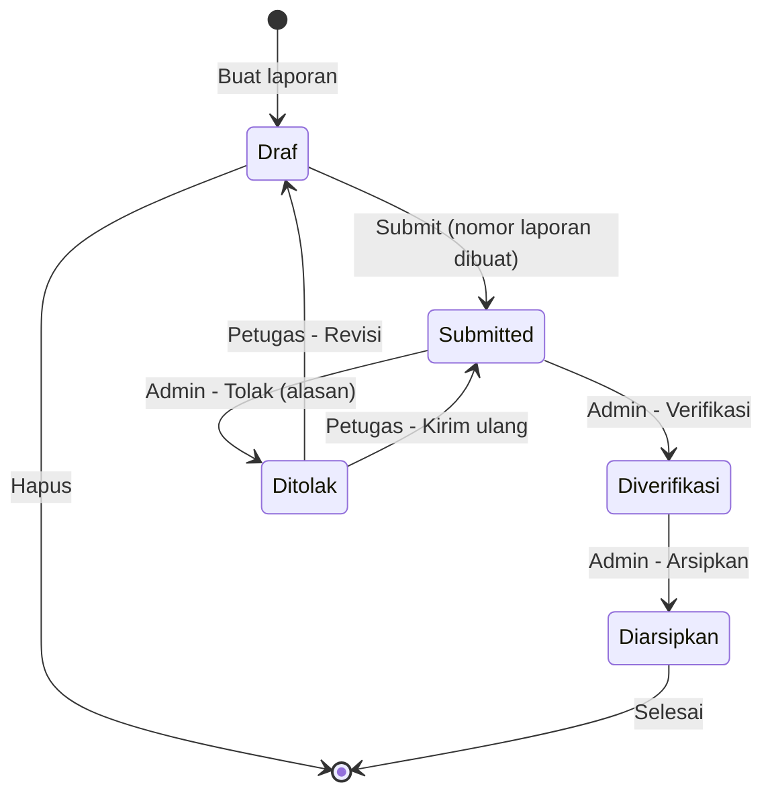
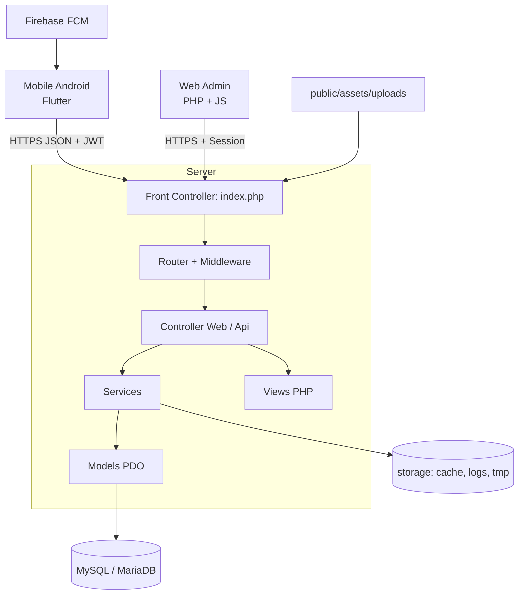
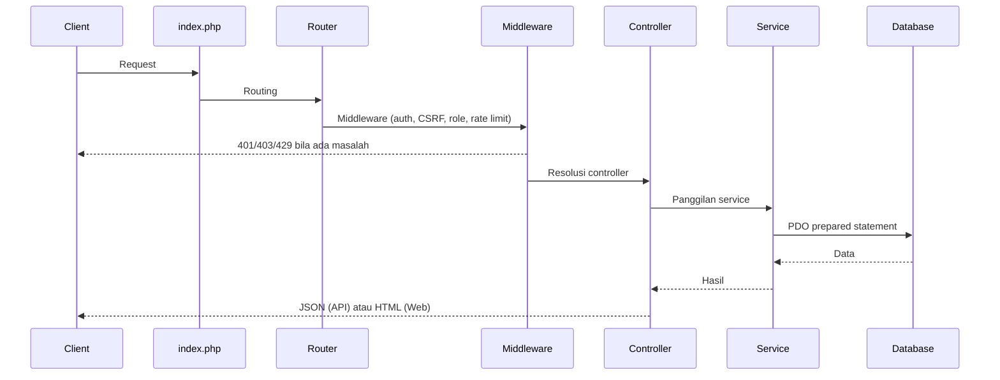
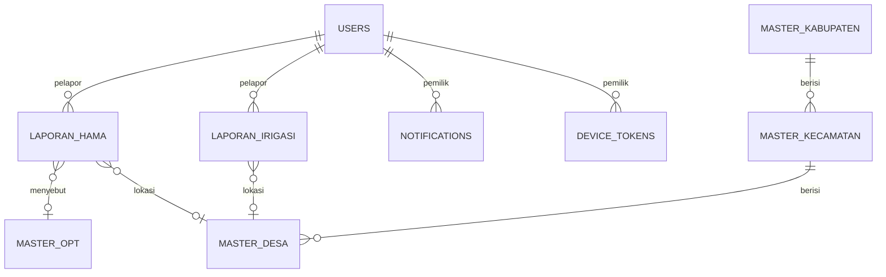
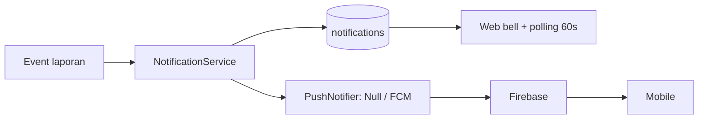

# Dokumentasi Proyek JAGAPADI — Dokumen Induk

> **J**ember **A**grikultur **G**apai **P**restasi **D**igital
> Sistem Pelaporan Pertanian (Hama/OPT & Kondisi Irigasi) untuk Kabupaten Jember

> **Versi**: v1.0.0 Production Ready — diperbarui: **Agustus 2026**
> **Audience**: manajemen, pengembang, DevOps, QA, dan pengguna akhir

---

## Daftar Isi

- [1. Pendahuluan](#1-pendahuluan)
- [2. Persyaratan Sistem](#2-persyaratan-sistem)
- [3. Panduan Instalasi & Konfigurasi](#3-panduan-instalasi--konfigurasi)
- [4. Panduan Penggunaan Fitur Utama](#4-panduan-penggunaan-fitur-utama)
- [5. Arsitektur Teknis](#5-arsitektur-teknis)
- [6. Struktur Direktori Proyek](#6-struktur-direktori-proyek)
- [7. Spesifikasi API](#7-spesifikasi-api)
- [8. Panduan Pengembangan & Kontribusi](#8-panduan-pengembangan--kontribusi)
- [9. Penanganan Masalah Umum](#9-penanganan-masalah-umum)
- [10. Pemeliharaan & Rilis](#10-pemeliharaan--rilis)
- [11. Pengujian Dokumentasi](#11-pengujian-dokumentasi)
- [12. Glosarium & Referensi](#12-glosarium--referensi)

---

## 1. Pendahuluan

### 1.1 Tentang JAGAPADI

JAGAPADI (Jember Agrikultur Gapai Prestasi Digital) adalah sistem pelaporan pertanian untuk Kabupaten Jember. Sistem ini memungkinkan pelaporan dua jenis kondisi lapangan secara digital:

| Jenis Laporan | Contoh Isi |
|---|---|
| **Hama/OPT** (Organisme Pengganggu Tanaman) | Wereng, tikus, ulat, penyakit tanaman, dan lain-lain |
| **Irigasi** | Saluran rusak, debit air berkurang, banjir, dan lain-lain |

Sistem menjalankan alur kerja **Draf → Submit → Verifikasi** sehingga kualitas data laporan dapat dipertanggungjawabkan sebelum digunakan untuk analisis dan pengambilan keputusan.

### 1.2 Tujuan & Manfaat

- Mempercepat dan mempermudah pelaporan kondisi pertanian secara digital (web + Android).
- Menyediakan data terverifikasi untuk dashboard, peta sebaran, analisis, dan ekspor.
- Mendukung mode offline-first di lapangan (draf disimpan di perangkat, disinkronkan saat online).
- Memastikan transparansi proses verifikasi oleh admin/verifikator.

### 1.3 Nilai Bisnis (untuk Manajemen)

1. Data berkualitas — laporan hanya masuk statistik bila berstatus `Submitted` atau `Diverifikasi`.
2. Auditable — setiap perubahan tercatat di `activity_log`, `audit_log_wilayah`, serta notifikasi.
3. Terukur — dashboard KPI, grafik bulanan, peta sebaran, dan ekspor CSV/XLSX.
4. Mudah dikembangkan — arsitektur modular memudahkan penambahan fitur.

### 1.4 Status Proyek

- **v1.0.0 Production Ready** — seluruh modul MVP telah diimplementasikan (lihat `CHANGELOG.md`).
- Tahapan pembangunan 0–14 dijalankan bertahap; rincian ada di `docs/TUTORIAL_BUILD.md`.

### 1.5 Aktor dan Peran

| Peran | Tugas | Platform |
|---|---|---|
| **Petugas Lapangan** | Membuat dan mengirim laporan dari lapangan | Aplikasi Android + Web |
| **Admin / Verifikator** | Memeriksa, memverifikasi/menolak/mengarsipkan laporan, mengelola master data | Web |

### 1.6 Modul MVP

| Modul | Deskripsi |
|---|---|
| Auth Web | Login admin/petugas, session, CSRF, role `admin` dan `petugas` |
| Auth Mobile | Login petugas, JWT access token + endpoint refresh |
| Laporan Hama/OPT | CRUD, draf, submit, validasi field minimum analisis |
| Laporan Irigasi | CRUD, draf, submit, validasi field minimum analisis |
| Verifikasi Admin | Review `Submitted` → `Diverifikasi` / `Ditolak` / `Diarsipkan` |
| Dashboard & Statistik | Filter `include_draft=true\|false` (default `false`) |
| Peta | Titik laporan dengan filter status (Leaflet) |
| Ekspor | CSV/XLSX, menghormati `include_draft` |
| Notifikasi | In-app + push (FCM) untuk event submit/verifikasi/dan lain-lain |

### 1.7 Kebijakan Draf (aturan penting)

| Aturan | Detil |
|---|---|
| Draf disimpan di server | Saat online, draf wajib tersimpan di database server |
| Draf bisa dianalisis | Hanya bila field minimum analisis terisi |
| Statistik default tanpa Draf | `include_draft=false` default |
| Semua endpoint agregat wajib mendukung `include_draft` | `?include_draft=true\|false` |
| Nomor laporan | Hanya dibuat saat Submit, bukan saat Draf |
| Pemilikan laporan | Petugas hanya mengelola laporannya sendiri |
| Verifikasi | Hanya admin yang memverifikasi laporan `Submitted` |

---

## 2. Persyaratan Sistem

### 2.1 Lingkungan Pengembangan (lokal)

| Komponen | Versi | Catatan |
|---|---|---|
| PHP | >= 8.2 | `php -v` |
| Composer | >= 2.x | `composer --version` |
| Database | MySQL 8.0+ atau MariaDB 10.6+ | charset `utf8mb4` |
| Ekstensi PHP | `pdo_mysql`, `mbstring`, `openssl`, `gd`, `fileinfo`, `json`, `curl`, `zip`, `xml` | untuk upload, ekspor, FCM |
| Node.js + npm | >= 18 | build asset Vite (opsional) |
| Git | >= 2.x | |

Windows: disarankan Laragon (Apache/Nginx + MySQL). Linux/macOS: Apache/Nginx + PHP 8.2-FPM + MySQL.

### 2.2 Mobile (Flutter)

| Komponen | Versi |
|---|---|
| Flutter SDK | 3.x (Dart ^3.0.0) |
| Android SDK | API level >= 24 |
| Alat | `flutter`, `dart`, Android Studio (opsional) |

Rincian: `mobile/pubspec.yaml`, `mobile/README.md`.

### 2.3 Server Produksi

| Kategori | Spesifikasi |
|---|---|
| OS | Ubuntu 22.04 / 24.04 LTS |
| Web server | Nginx + PHP-FPM 8.2 |
| Database | MySQL 8.0 / MariaDB 10.6+ |
| SSL/TLS | Let's Encrypt (certbot) |
| Cron | backup DB harian, backup upload mingguan, prune notifikasi |
| Document root | `backend/public` |

---

## 3. Panduan Instalasi & Konfigurasi

### 3.1 Instalasi Lokal (ringkas)

1. Clone repository:
   ```bash
   git clone <repository-url> jagapadi
   cd jagapadi
   ```
2. Pasang ketergantungan backend:
   ```bash
   cd backend
   composer install
   cp .env.example .env
   ```
3. Sesuaikan `.env` (lihat tabel 3.3).
4. Buat database, migrate, seed:
   ```bash
   mysql -u root -p -e "CREATE DATABASE IF NOT EXISTS jagapadi_local CHARACTER SET utf8mb4 COLLATE utf8mb4_unicode_ci;"
   php scripts/migrate.php
   php scripts/seed.php
   ```
5. Jalankan server pengembangan:
   ```bash
   php -S localhost:8080 -t public
   ```
6. Verifikasi kesehatan:
   ```bash
   curl -i http://localhost:8080/api/v1/health
   ```

> Panduan lokal lebih rinci (Laragon, virtual host, akses LAN): `docs/AKSES_WEB_BACKEND.md`.

#### Akun seed lokal

| Akun | Password awal | Catatan |
|---|---|---|
| `admin` | `ChangeMeAdmin!123` | wajib diganti setelah login pertama |
| `petugas01` | `ChangeMePetugas!123` | wajib diganti setelah login pertama |

> Seed hanya untuk lingkungan lokal. Jangan jalankan `php scripts/seed.php` di production.

### 3.2 Instalasi Mobile

```bash
cd mobile
flutter pub get
flutter run
flutter run --dart-define=API_BASE_URL=https://domain.tld/api/v1
```

- Build APK debug: `flutter build apk --debug`
- Build APK production: `flutter build apk --release --dart-define=API_BASE_URL=https://jagapadi.example.go.id/api/v1`
- Rincian: `docs/BUILD_APK.md`

FCM aktif bila `FCM_ENABLED=true` dan `google-services.json` ada di `android/app/`.

### 3.3 Variabel Environment (`.env`)

Salin `backend/.env.example` menjadi `backend/.env` dan sesuaikan.

| Variable | Lokal | Production | Catatan |
|---|---|---|---|
| `APP_ENV` | `local` | `production` | Kontrol tampilan error |
| `APP_DEBUG` | `true` | `false` | Jangan biarkan `true` di production |
| `APP_BASE_URL` | `http://localhost:8080` | `https://domain.tld` | |
| `APP_TIMEZONE` | `Asia/Jakarta` | `Asia/Jakarta` | |
| `DB_DRIVER` | `mysql` | `mysql` | |
| `DB_HOST` | `127.0.0.1` | host database | |
| `DB_PORT` | `3306` | `3306` | |
| `DB_NAME` | `jagapadi_local` | `jagapadi_prod` | |
| `DB_USER` | `root` | user database | |
| `DB_PASS` | kosong | password kuat | |
| `DB_CHARSET` | `utf8mb4` | `utf8mb4` | |
| `JWT_SECRET` | acak >= 64 karakter | acak >= 64 karakter | generator: `php -r "echo bin2hex(random_bytes(32));"` |
| `JWT_EXPIRY` | `3600` | `3600` | detik |
| `SESSION_NAME` | `jagapadi_session` | sama | |
| `LOGIN_MAX_ATTEMPTS` | `5` | `5` | proteksi brute force |
| `LOGIN_DECAY_SECONDS` | `900` | `900` | |
| `TRUSTED_PROXIES` | `127.0.0.1,::1` | IP proxy | |
| `APP_LOG_LEVEL` | `debug` | `warning` | |
| `CORS_ALLOWED_ORIGINS` | kosong (localhost) | daftar origin HTTPS | jangan `*` di production |
| `FCM_ENABLED` | `false` | `true` (jika siap) | |
| `FCM_SERVER_KEY` | kosong | server key FCM | |
| `FCM_PROJECT_ID` | kosong | project ID FCM | |

> File `.env` tidak boleh di-commit. Gunakan password manager dan `chmod 640`.

### 3.4 Migrasi dan Seed

```bash
cd backend
php scripts/migrate.php   # menjalankan seluruh file database/migrations/
php scripts/seed.php      # hanya untuk lokal
```

- Migration runner mencatat batch di tabel `schema_migrations`.
- Referensi skema: `backend/database/schema.sql`.
- Detail database: `docs/DATABASE.md`.

### 3.5 Instalasi Production (ringkas)

1. `composer install --no-dev --optimize-autoloader`.
2. Konfigurasi `.env` production.
3. Migrate; buat akun admin secara manual (jangan memakai password seed).
4. Atur permission `storage/` dan `public/assets/uploads/`; lindungi `.env`.
5. Konfigurasi Nginx: document root `backend/public`, blokir eksekusi PHP di folder upload.
6. TLS via certbot; pasang cron untuk backup, prune, dan log rotation.
7. Jalankan perintah smoke test.

**Rincian selengkapnya**: `docs/DEPLOY.md` (Ubuntu + Nginx + PHP-FPM + MySQL + TLS + backup + rollback).

---

## 4. Panduan Penggunaan Fitur Utama

> Panduan pengguna langkah-demi-langkah: `docs/PANDUAN_PENGGUNA.md`.

### 4.1 Workflow Status Laporan



### 4.2 Petugas — Laporan Hama/OPT dan Irigasi

| Langkah | Tindakan |
|---|---|
| 1 | Login (Web `/login` atau aplikasi Android) |
| 2 | Menu **Laporan Hama** atau **Laporan Irigasi** > tombol **Buat** |
| 3 | Isi form (lihat panduan pengguna untuk rincian field) |
| 4 | Simpan **Draf** kalau belum lengkap (belum ada nomor laporan) |
| 5 | **Kirim** untuk masuk antrian hasil nomor laporan `LH-YYYYMMDD-NNNN` / `LI-YYYYMMDD-NNNN` |
| 6 | Pantau status dan riwayat verifikasi di halaman detail |
| 7 | Jika ditolak, perbaiki dan **kirim ulang** |

### 4.3 Admin — Verifikasi

1. Buka antrian status `Submitted`.
2. Periksa data dan foto.
3. **Verifikasi** jika data benar (status `Diverifikasi`).
4. **Tolak** dengan menulis alasan minimal 10 karakter (petugas mendapat notifikasi).
5. **Arsipkan** laporan yang sudah diverifikasi.

### 4.4 Dashboard dan Peta

- KPI cards: total aktif = `Submitted + Diverifikasi`.
- Grafik bulanan (Chart.js) untuk hama dan iritasi.
- Peta sebaran (Leaflet), toggle layer hama/irigasi.
- Top OPT.
- Statistik default tidak termasuk Draf.

### 4.5 Ekspor

1. Menu **Ekspor**.
2. Pilih jenis laporan, format (`csv` / `xlsx`), status, wilayah, rentang tanggal.
3. Download. Batas 10.000 baris dan rentang tanggal 366 hari.

### 4.6 Notifikasi

- Web: ikon lonceng di kanan atas; polling tiap 60 detik; halaman penuh di `/notifications`.
- Android: badge lonceng; push FCM bila diaktifkan.
- Petugas submit/kiim → admin dinotifikasi; admin verifikasi/tolak/arsip → pemilik dinotifikasi.

### 4.7 Master Data (admin)

- **Wilayah**: kabupaten > kecamatan > desa (berjenjang).
- **OPT**: daftar hama/penyakit/gulma dengan foto referensi.

---

## 5. Arsitektur Teknis

### 5.1 Gambaran Arsitektur



### 5.2 Alur Permintaan (Request)



### 5.3 Lapisan Backend (MVC ringan)

| Lapisan | Peran | Contoh |
|---|---|---|
| Core | Framework tambahan | `Env`, `Database`, `Router`, `Request`, `Security`, `Jwt`, `CacheManager`, `Logger` |
| Middleware | Proteksi | `Csrf`, `WebAuth`, `Admin`, `ApiAuth`, `RateLimit` |
| Controller | Orkestrasi | `Api/*Controller`, `Web/*Controller` |
| Service | Logika bisnis | `LaporanHamaService`, `DashboardService`, `ExportService`, `NotificationService` |
| Model | Akses data | `User`, `LaporanHama`, `MasterOpt`, `Notification`, `DeviceToken` |
| Helper | Utilitas | `LaporanStatus`, `NomorLaporanGenerator`, `SecureImageUploader`, `CsvWriter`, `XlsxWriter` |
| View | Template | `app/Views/**` |

### 5.4 Autentikasi

| Platform | Alur |
|---|---|
| Web | Session PHP dengan cookie aman (`secure`, `httponly`, `SameSite`), CSRF regenerasi 1 jam, proteksi `WebAuth` + `Admin`, rate limit 5 percobaan gagal / 15 menit. |
| Mobile | `POST /auth/login` → JWT HS256 (exp 3600 detik), header `Authorization: Bearer`, diverifikasi oleh `ApiAuthMiddleware`; `POST /auth/refresh` untuk memperpanjang. |

### 5.5 Model Data (ringkasan)



Dokumentasi tabel lengkap (13 tabel) di `docs/DATABASE.md`.

### 5.6 Upload Foto

1. `POST /laporan-hama/{id}/foto` (multipart, owner/admin, status Draf atau Ditolak).
2. Validasi berlapis: magic bytes, MIME (finfo), ekstensi, ukuran <= 10 MB.
3. Nama acak, subdirektori `YYYYMM`, auto-kompresi > 2 MB.

### 5.7 Notifikasi



### 5.8 Cache dan Kinerja

| Aspek | Desain |
|---|---|
| Driver | File-based `storage/cache/` |
| TTL | 300 detik |
| Key | `dashboard:{type}:{role}:{userId}:{tahun}` |
| Invalidasi | Otomatis pada create/submit/verify/reject/archive/resubmit |
| Fallback | Tanpa cache jika direktori tidak dapat ditulis |

### 5.9 Keamanan

- Tidak ada rahasia yang di-commit (`.env`, `.pem`, `.key`, `google-services.json`).
- Semua query memakai PDO prepared statement.
- Semua output HTML di-escape (`htmlspecialchars`).
- Semua mutasi web wajib CSRF.
- Otorisasi role dan ownership di level query.
- Upload divalidasi berlapis (magic bytes + MIME + ekstensi + ukuran + nama acak).
- Security headers (CSP, X-Frame-Options, dan lain-lain) di `public/index.php`.

---

## 6. Struktur Direktori Proyek

```
jagapadi/
|-- backend/            # PHP backend (document root: backend/public)
|   |-- app/
|   |   |-- Core/       # framework inti
|   |   |-- Controllers/# Api dan Web
|   |   |-- Helpers/    # validasi, upload, generator nomor
|   |   |-- Middleware/ # proteksi jalur
|   |   |-- Models/     # akses data
|   |   |-- Services/   # logika bisnis (termasuk Push/)
|   |   `-- Views/      # template
|   |-- config/         # routes
|   |-- database/       # migrations (001-019), seeds, schema.sql
|   |-- public/          # index.php, assets, uploads
|   |-- scripts/         # migrate.php, seed.php, utilitas
|   |-- storage/         # cache, logs, tmp
|   |-- tests/           # phpunit
|   |-- .env.example
|   |-- composer.json, phpunit.xml
|-- mobile/              # Flutter (Android)
|   |-- android/, lib/, test/, pubspec.yaml
|-- docs/                # dokumentasi (indeks: docs/README.md)
|-- scripts/             # ops (backup, prune, health-check)
|-- .github/             # CI/CD, template, CODEOWNERS
|-- tests/, e2e/         # PHP + Playwright E2E
|-- data/, reports/, storage/
|-- README.md, CHANGELOG.md, AGENTS.md, CONTRIBUTING.md, TECH_STACK.md
|-- composer.json, package.json, phpunit.xml, vite.config.js
```

> `web-app/`, `nextjs-app/`, dan `node_modules/` adalah eksperimen, bukan jalur utama.

Struktur lengkap terdaftar di `docs/README.md` serta `backend/README.md`.

---

## 7. Spesifikasi API

### 7.1 Ketentuan Umum

| Parameter | Nilai |
|---|---|
| Base URL | `https://domain.tld/api/v1` |
| Format | JSON |
| Envelope sukses | `{ "success": true, "data": ..., "meta": ... }` |
| Envelope gagal | `{ "success": false, "error": "...", "message": "..." }` |
| Auth mobile | `Authorization: Bearer <JWT>` |
| Auth web | Session cookie + CSRF |
| Pagination | `?page=1&per_page=15` (maks 100) |
| Sorting | `?sort=kolom:desc` |
| Draft filter | `?include_draft=true\|false` (default `false`) |
| Kode error | `ValidationError`, `Unauthorized`, `Forbidden`, `NotFound`, `Conflict`, `ServerError`, `TooManyRequests`, `TokenInvalid` |
| Rate limit | 60/menit authed, 20/menit guest, 5 percobaan login / 15 menit |

### 7.2 Kelompok Endpoint

| Grup | Endpoint inti |
|---|---|
| Health | `GET /health` (publik) |
| Auth | `login`, `refresh`, `logout`, `change-password` |
| Profil | `GET /me` |
| Wilayah | `kabupaten`, `kecamatan`, `desa` (list, detail, CRUD admin) |
| OPT | `GET /opt/...` (read), CRUD admin |
| Laporan Hama | CRUD + `submit` + direktif status |
| Laporan Irigasi | CRUD + `submit` + status |
| Verifikasi | `verifikasi`, `tolak`, `arsip`, `resubmit` |
| Foto | `/{id}/foto` dan `/{id}/foto/delete` |
| Dashboard | `stats`, `charts/{hama,irigasi}`, `map/{hama,irigasi}` |
| Ekspor | `GET /export/{hama,irigasi}` (csv/xlsx) |
| Notifikasi | list, `unread-count`, `read`, `read-all`, delete |
| Perangkat | `device-tokens` (registrasi FCM) |

### 7.3 Aturan Penting

- Nomor laporan `LH-YYYYMMDD-NNNN` / `LI-YYYYMMDD-NNNN` dibuat saat submit.
- Hanya pemilik yang dapat mengubah laporan `Draf` / `Ditolak`.
- Alasan penolakan minimal 10 karakter.
- Upload foto hanya untuk status `Draf` / `Ditolak`.
- Ekspor dibatasi 10.000 baris dan rentang tanggal 366 hari.

**Dokumentasi lengkap beserta contoh request/response**: `docs/API.md`.

---

## 8. Panduan Pengembangan & Kontribusi

### 8.1 Standar Kode

| Area | Aturan |
|---|---|
| PHP | PSR-12, `declare(strict_types=1)`, indent 4 spasi |
| YAML/JSON/MD | 2 spasi |
| Penamaan | `snake_case`, PK `id BIGINT UNSIGNED` |
| Git | Conventional Commits; branch per tugas |

### 8.2 Alur Kerja Git

1. Branch dari `main`: `feat/...`, `fix/...`, `docs/...`, `refactor/...`, `test/...`, `ci/...`.
2. Satu branch untuk satu tugas; satu eksekutor utama.
3. Commit jelas, contoh: `docs: tambah bagian arsitektur`.
4. PR memicu CI; jangan langsung merge tanpa review.
5. Jangan commit secret, artefak runtime, atau backup SQL.

### 8.3 Menjalankan Pengujian

```bash
cd backend
vendor/bin/phpunit

# Cek sintaks (mirror CI)
php -l file.php

# Mobile
cd mobile && flutter test

# E2E (Playwright)
npm run test:e2e
```

### 8.4 Perubahan Database

- Gunakan migration baru (`database/migrations/NNN_...sql`). Tidak pernah mengubah skema tanpa migrasi.
- Jelaskan di PR: nama migration, dampak data, dan cara rollback.
- Seed hanya untuk lokal.

Detail lengkap: `CONTRIBUTING.md`, `AGENTS.md`, `docs/AI_WORKFLOW.md`.

---

## 9. Penanganan Masalah Umum

### 9.1 Web

| Tanda | Solusi |
|---|---|
| 404 semua rute | document root salah atau rewrite tidak aktif |
| Koneksi DB gagal | periksa `.env` (host, port, user, pass) dan MySQL |
| Error 500 blank | aktifkan debug / baca `storage/logs/app.log` |
| Loop login / CSRF 403 | periksa `APP_BASE_URL` dan cookie session |
| Aset hilang | cek base URL/path; jalankan `npm run build` |
| Upload gagal | periksa permission `public/assets/uploads` |

### 9.2 API dan Mobile

| Tanda | Solusi |
|---|---|
| 401 TokenInvalid | token kedaluwarsa, panggil `/auth/refresh` |
| 429 Too Many Requests | tunggu 15 menit |
| 409 Conflict | transisi status tidak legal pada state machine |
| 403 Forbidden | hak akses tidak sesuai |
| Mobile koneksi gagal | periksa `API_BASE_URL`, CORS, HTTPS |
| Push tidak masuk | `FCM_ENABLED`, `google-services.json`, token terdaftar |

### 9.3 Fitur dan Kinerja

| Tanda | Solusi |
|---|---|
| Cache usang | hapus `storage/cache/*` atau tunggu invalidasi |
| Data statistik tidak muncul | biasakan filter status dan `include_draft` |
| Export terlalu besar | perketat filter; maksimal 10.000 baris |

---

## 10. Pemeliharaan & Rilis

### 10.1 Operasi Rutin

| Jenis | Jadwal | Tindakan |
|---|---|---|
| Backup DB | harian | `mysqldump` + kompresi, retensi 30 hari |
| Backup upload | mingguan | rsync/tar, retensi 90 hari |
| Prune notifikasi | harian | hapus > 90 hari |
| Rotasi log | harian | logrotate |

Contoh cron:

```
0 2 * * *  /var/www/jagapadi/scripts/backup-db.sh >> .../backup.log
0 3 * * 0  /var/www/jagapadi/scripts/backup-uploads.sh
0 3 * * * cd /var/www/jagapadi/backend && php scripts/prune-notifications.php
```

### 10.2 Proses Rilis

1. Fitur selesai di branch + PR merged.
2. CI hijau dan review oke.
3. Tag rilis `vX.Y.Z`.
4. Deploy ke staging; smoke test.
5. Deploy production (`composer install --no-dev`, migrasi, smoke).
6. Catat di `CHANGELOG.md`.

### 10.3 Rollback

1. Restore database dari backup.
2. Kembali ke tag rilis sebelumnya di git.
3. Restore uploads.
4. Restore configuration (`.env`).
5. Restart php-fpm dan smoke test.

Rincian lebih lanjut ada di `docs/DEPLOY.md`.

---

## 11. Pengujian Dokumentasi

Tujuan: memastikan setiap panduan mudah diikuti tanpa hambatan oleh pembaca yang sesuai.

| Level | Pelaksana | Cakupan | Kapan |
|---|---|---|---|
| L1 | Developer/QA | Instalasi total dari awal hingga running di env bersih | bagian 3 & 7 |
| L2 | Pengguna | Ikuti `4` di web dan Android untuk peran masing-masing | sebelum rilis |
| L3 | Editor dokumen | Tautan valid, istilah konsisten, versi terbaru | setiap rilis |

Checklist:

- [ ] Ikuti bagian 3 (instalasi) pada mesin bersih sampai health endpoint memberi `200`.
- [ ] Login, buat draft, kirim, verifikasi, export CSV/XLSX.
- [ ] Semua tautan markdown menuju file yang benar (`Test-Path`).
- [ ] Istilah seperti `Draf`, `Submit`, `Diverifikasi`, `include_draft` dipakai konsisten (lihat Glosarium).
- [ ] Diagram Mermaid dapat di-render di GitHub/VS Code.
- [ ] Tidak ada secret/password asli yang bocor ke dokumen (hanya placeholder).
- [ ] Jika ada kendala → catat issue bertanda `doc:` dan perbaiki.

---

## 12. Glosarium & Referensi

### Glosarium

| Istilah | Arti |
|---|---|
| Draf | Laporan tersimpan sementara, belum dikirim |
| Submitted | Laporan dikirim dan menunggu verifikasi |
| Diverifikasi | Laporan disetujui admin |
| Ditolak | Laporan ditolak admin, dapat diperbaiki |
| Diarsipkan | Laporan selesai/read-only |
| OPT | Organisme Pengganggu Tanaman |
| FCM | Firebase Cloud Messaging |
| JWT | JSON Web Token |
| ETL | Economic Threshold Level |

### Referensi

- `docs/BLUEPRINT.md` — arsitektur v1
- `docs/API.md` — API contract
- `docs/DATABASE.md` — skema
- `docs/PANDUAN_PENGGUNA.md` — panduan pengguna
- `docs/DEPLOY.md` — produksi
- `docs/SMOKE_TEST.md` — smoke test
- `docs/GO_LIVE_CHECKLIST.md` — go-live
- `CONTRIBUTING.md` — kontribusi

---

> Dokumentasi ini disusun agar mudah diakses seluruh tim. Pembaruan dokumentasi mengikuti prosedur di bagian 11.