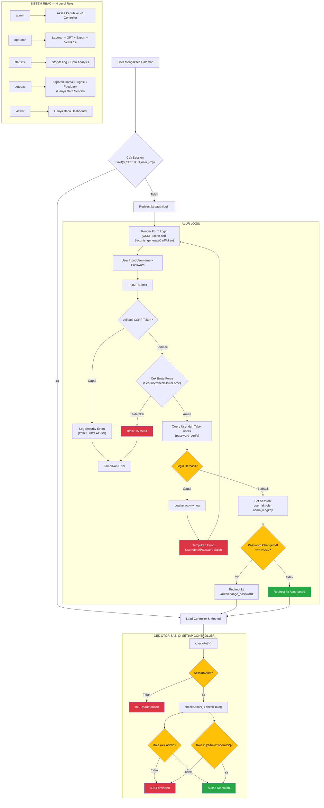
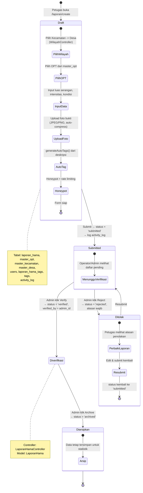
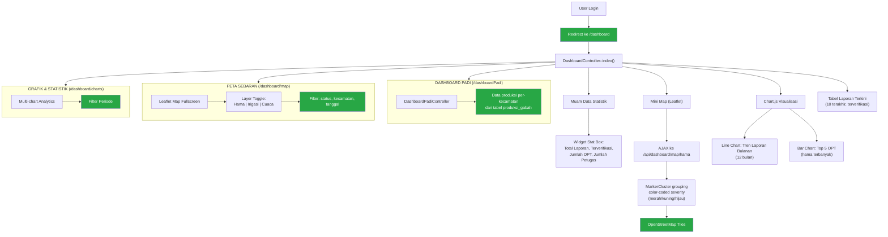
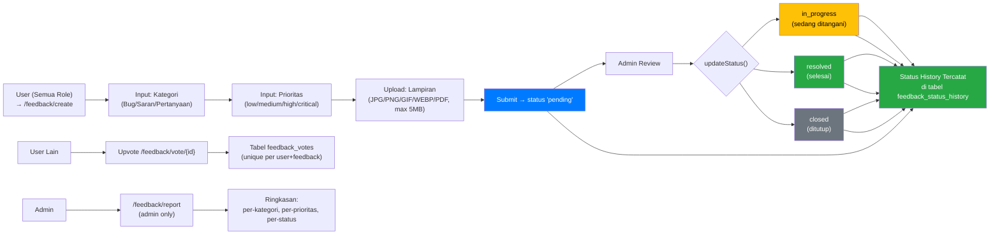
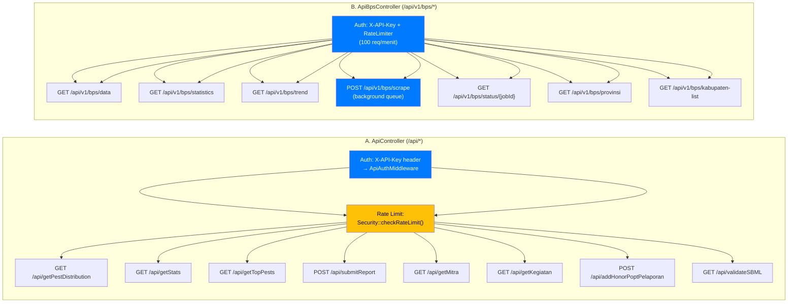
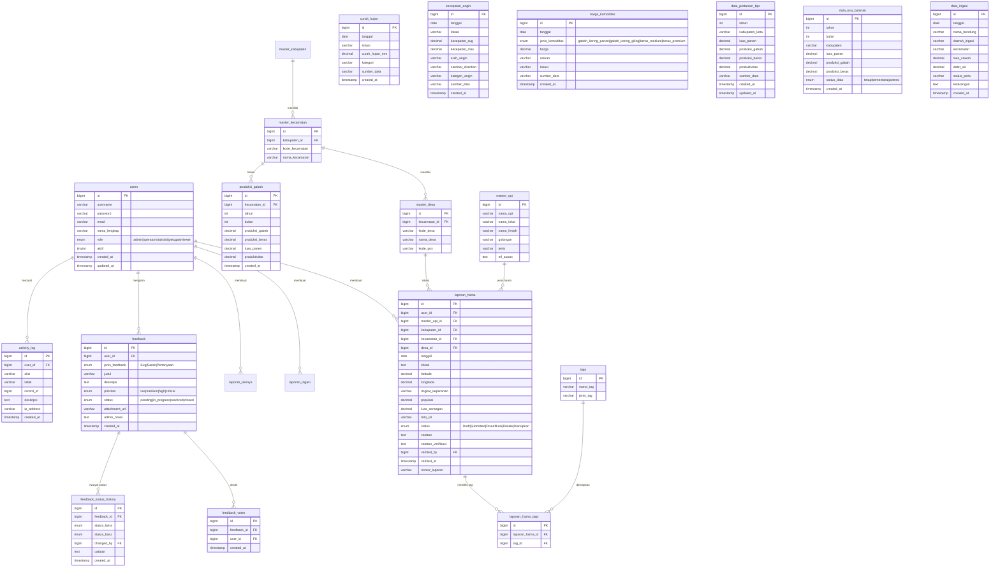

# Flowchart Komprehensif Aplikasi JAGAPADI

> Dokumen ini berisi 10 flowchart komprehensif untuk aplikasi JAGAPADI (Jember Agrikultur Gapai Prestasi Digital) menggunakan sintaks Mermaid.
> Semua label menggunakan bahasa Indonesia dengan decision node, aktor/role, serta referensi controller/service/tabel.

---

## FLOWCHART 1: ARSITEKTUR SISTEM KESELURUHAN

```mermaid
graph TD
    subgraph Layer1_EntryPoint ["LAYER 1 — Entry Point"]
        A1["HTTP Request"] --> A2["index.php<br/>(Front Controller)"]
        A2 --> A3["Load .env + .env.local"]
        A3 --> A4["Session Config<br/>(httponly, samesite, secure)"]
        A4 --> A5["Autoloader<br/>(spl_autoload_register)"]
        A5 --> A6["CORS Headers"]
    end

    subgraph Layer2_Routing ["LAYER 2 — Routing"]
        B1{"API Request?<br/>(/api/*)"} -->|Ya| B2["Router.php<br/>(Middleware Chain)"]
        B1 -->|Tidak| B3["index.php<br/>(Convention-based Mapping)"]
        B2 --> B4["Middleware:<br/>auth, admin, operator, statistisi, rate_limit<br/>external_auth, mobile_auth, scraper_auth"]
        B3 --> B5["Explicit Routes<br/>(config/web_routes.php)"]
        B5 --> B6["Controller@Method"]
        B4 --> B7["Controller@Method"]
    end

    subgraph Layer3_Controller ["LAYER 3 — Controller (23 Total)"]
        C1["Auth: AuthController"]
        C2["Dashboard: DashboardController, DashboardPadiController"]
        C3["Laporan: LaporanController, LaporanHamaController, LaporanLainnyaController"]
        C4["Cuaca: CurahHujanController, KecepatanAnginController"]
        C5["Pertanian: BpsScraperController, GabahBerasController, EvaluasiController"]
        C6["Harga: HargaKomoditasController"]
        C7["Irigasi: IrigasiController, IrigasiScraperController"]
        C8["Admin: UserController, AdminWilayahController, OptController"]
        C9["Lainnya: FeedbackController, StorytellingController, ExportController"]
        C10["API: ApiController, ApiBpsController, WilayahController"]
    end

    subgraph Layer4_Service ["LAYER 4 — Service (25 Total)"]
        D1["Scraper: BpsScraper, CurahHujanScraper, KecepatanAnginScraper<br/>HargaKomoditasScraper, IrigasiScraper"]
        D2["API Client: BpsApiClient, BMKGApiClient, BMKGService, OpenMeteoService"]
        D3["Analytics: WindAnalyticsService, WindIntegrationService, GabahBerasAnalytics<br/>DashboardDataAggregator, DataStoryService"]
        D4["Import: ExcelImportService, KsaImportService, UserImportService"]
        D5["Engine: IrrigationRuleEngine, WeatherService, WeatherConditionMapper"]
        D6["Lainnya: BpsSimulationService, BpsDataService, CurahHujanMonitor<br/>CurahHujanHealthCheck, QwenEditorTokenManager"]
    end

    subgraph Layer5_ModelDB ["LAYER 5 — Model & Database"]
        E1["26 Model Classes<br/>(Active Record / QueryBuilder)"]
        E2["52 Tabel MySQL<br/>(InnoDB, utf8mb4)"]
        E3["Core ORM: Model.php + QueryBuilder.php"]
        E4["Cache: CacheManager.php<br/>(file/redis/memcached, fail-open)"]
    end

    subgraph Layer6_External ["LAYER 6 — Sumber Data Eksternal"]
        F1["NASA POWER API<br/>(curah hujan + kecepatan angin)"]
        F2["Open-Meteo API<br/>(prakiraan cuaca)"]
        F3["BMKG API<br/>(prakiraan cuaca Indonesia)"]
        F4["SISKAPERBAPO Jatim<br/>(harga komoditas)"]
        F5["BPS WebAPI<br/>(data pertanian resmi)"]
        F6["Qwen AI<br/>(editor token)"]
        F7["Simitra<br/>(integrasi mitra)"]
    end

    B7 --> C1 & C2 & C3 & C4 & C5 & C6 & C7 & C8 & C9 & C10
    C1 & C2 & C3 & C4 & C5 & C6 & C7 & C8 & C9 & C10 --> D1 & D2 & D3 & D4 & D5 & D6
    D1 & D2 & D3 & D4 & D5 & D6 --> E1
    E1 --> E2
    E1 --> E3
    E1 --> E4
    D1 & D2 --> F1 & F2 & F3 & F4 & F5 & F6 & F7

    style A2 fill:#007bff,color:#fff
    style B2 fill:#007bff,color:#fff
    style B3 fill:#007bff,color:#fff
    style E1 fill:#28a745,color:#fff
    style E2 fill:#28a745,color:#fff
```



---

## FLOWCHART 2: ALUR AUTENTIKASI & OTORISASI



---

## FLOWCHART 3: SIKLUS HIDUP LAPORAN HAMA (OPT)



---

## FLOWCHART 4: PIPELINE DATA SCRAPING (CUACA & PERTANIAN)

```mermaid
graph TD
    subgraph A_CurahHujan ["A. PIPELINE CURAH HUJAN<br/>(CurahHujanScraper → CurahHujanController)"]
        A1["Admin Klik<br/>'Jalankan Scraper'"] --> A2{"Pilih Sumber:<br/>NASA | Open-Meteo | BMKG | Simulasi"}
        A2 --> A3["Fallback Chain Dimulai"]
        A3 --> A4{"NASA POWER API<br/>(Prioritas 1)<br/>cURL Multi, 45s timeout"}
        A4 -->|Berhasil| A5["Parse Data<br/>(31 kecamatan × 30 hari)"]
        A4 -->|Gagal| A6{"Open-Meteo API<br/>(Prioritas 2)<br/>200ms delay, 30s timeout"}
        A6 -->|Berhasil| A5
        A6 -->|Gagal| A7{"BMKG API<br/>(Prioritas 3)<br/>3x retry + exponential backoff"}
        A7 -->|Berhasil| A5
        A7 -->|Gagal| A8["Simulasi<br/>(Prioritas 99)"]
        A8 --> A5
        A5 --> A9["Validasi: range 0-500mm<br/>Deteksi duplikat (tanggal + lokasi)"]
        A9 --> A10["Simpan ke tabel:<br/>curah_hujan + curah_hujan_logs"]
    end

    subgraph B_KecepatanAngin ["B. PIPELINE KECEPATAN ANGIN<br/>(KecepatanAnginScraper → KecepatanAnginController)"]
        B1["Admin Klik<br/>'Jalankan Scraper'"] --> B2["Fallback Chain"]
        B2 --> B3{"NASA POWER API<br/>(WS10M, WS2M)"}
        B3 -->|Berhasil| B4["Transformasi:<br/>m/s × 3.6 = km/h<br/>degrees → cardinal direction"]
        B3 -->|Gagal| B5{"Open-Meteo API"}
        B5 -->|Berhasil| B4
        B5 -->|Gagal| B6["Simulasi"]
        B6 --> B4
        B4 --> B7["Analitik:<br/>Beaufort scale, spray recommendation<br/>pest risk scoring"]
        B7 --> B8["Simpan ke tabel:<br/>kecepatan_angin + kecepatan_angin_logs"]
    end

    subgraph C_HargaKomoditas ["C. PIPELINE HARGA KOMODITAS<br/>(HargaKomoditasScraper → HargaKomoditasController)"]
        C1["Admin Klik<br/>'Jalankan Scraper'"] --> C2{"SISKAPERBAPO Jatim API"}
        C2 -->|Berhasil| C3["Filter: Region Jember<br/>Validasi harga Rp5.000-30.000"]
        C2 -->|Gagal| C4["Simulasi"]
        C4 --> C3
        C3 --> C5["Estimasi:<br/>GKP = 52% × Medium<br/>GKG = 60% × Medium"]
        C5 --> C6["Simpan ke tabel:<br/>harga_komoditas + harga_komoditas_logs + harga_alerts"]
    end

    subgraph D_BPS ["D. PIPELINE DATA BPS<br/>(BpsScraper → BpsScraperController)"]
        D1["Admin Klik<br/>'Jalankan Scraper'"] --> D2["Orchestrator: BpsScraper.php"]
        D2 --> D3{"BpsApiClient<br/>(WebAPI Resmi)"}
        D3 -->|Berhasil| D4["BpsDataService.processRecords()"]
        D3 -->|Gagal| D5["BpsSimulationService<br/>(Fallback)"]
        D5 --> D4
        D4 --> D6["applyConversions:<br/>GKG×0.577=Beras<br/>produktivitas=(gabah/luas)×10"]
        D6 --> D7["validateRecord:<br/>range check produktivitas 30-80 ku/ha"]
        D7 --> D8{"Valid?"}
        D8 -->|Tidak| D9["logAnomaly<br/>(selisih > 5 ku/ha)"]
        D9 --> D10["Upsert ke data_pertanian_bps<br/>(UNIQUE KEY tahun+kabupaten)"]
        D8 -->|Ya| D10
        D10 --> D11["updateYearlySummary"]
        D11 --> D12["Simpan log:<br/>bps_scraping_logs + bps_data_anomalies"]
    end

    style A4 fill:#ffc107,color:#000
    style A6 fill:#ffc107,color:#000
    style A7 fill:#ffc107,color:#000
    style B3 fill:#ffc107,color:#000
    style B5 fill:#ffc107,color:#000
    style C2 fill:#ffc107,color:#000
    style D3 fill:#ffc107,color:#000
    style D8 fill:#ffc107,color:#000
    style A10 fill:#28a745,color:#fff
    style B8 fill:#28a745,color:#fff
    style C6 fill:#28a745,color:#fff
    style D12 fill:#28a745,color:#fff
```



---

## FLOWCHART 5: ALUR IMPORT DATA (EXCEL & KSA)

```mermaid
graph TD
    subgraph A_ImportExcel ["A. IMPORT EXCEL UMUM<br/>(ExcelImportService.php)"]
        A1["Admin Upload File<br/>(.xlsx/.xls/.csv, max 5MB)"] --> A2["Validasi MIME via finfo<br/>+ extension whitelist"]
        A2 --> A3{"File Valid?"}
        A3 -->|Tidak| A4["Tampilkan Error"]
        A3 -->|Ya| A5["Preview: Parse 10 baris pertama"]
        A5 --> A6["Tampilkan di Modal<br/>(column mapping preview)"]
        A6 --> A7{"Admin Konfirmasi?"}
        A7 -->|Tidak| A8["Batal Import"]
        A7 -->|Ya| A9["Column Mapping Otomatis<br/>(header Indonesia/Inggris → DB column)"]
        A9 --> A10["Per-baris: validasi tipe data + range<br/>+ normalizeNumber()"]
        A10 --> A11{"Semua Baris Valid?"}
        A11 -->|Tidak| A12["Catat errors[] + warnings[]"]
        A12 --> A13["Upsert ke tabel target:<br/>data_pertanian_bps / harga_komoditas<br/>kecepatan_angin / evaluasi_akurasi"]
        A11 -->|Ya| A13
        A13 --> A14["Hasil: {successCount, failedCount,<br/>errors[], warnings[]}"]
    end

    subgraph B_ImportKSA ["B. IMPORT KSA<br/>(KsaImportService.php)"]
        B1["Admin Upload File KSA BPS<br/>(.xlsx)"] --> B2{"Format File?"}
        B2 -->|Fixed Annual<br/>(2018-2025)| B3["3 Sheet: luas panen,<br/>prod gabah, prod beras"]
        B2 -->|Monthly 2026| B4["Sheet 'Level KABKOT'<br/>dengan blok per-variabel"]
        B3 --> B5["Parser: ZipArchive +<br/>SimpleXMLElement"]
        B4 --> B5
        B5 --> B6["Header Parser:<br/>teks tanggal ('Jan 18', 'Feb-26*')<br/>atau serial Excel"]
        B6 --> B7["Mapping nama kabupaten:<br/>'[3501] PACITAN' → 'Pacitan'"]
        B7 --> B8["Status data:<br/>tetap / sementara / potensi<br/>(dari tanda *)"]
        B8 --> B9["Simpan ke tabel:<br/>data_ksa_bulanan"]
        B9 --> B10{"Sync to Annual?"}
        B10 -->|Ya| B11["Agregasi data 'tetap'<br/>→ upsert ke data_pertanian_bps"]
        B10 -->|Tidak| B12["Selesai"]
        B11 --> B13{"Perlindungan:<br/>TIDAK timpa data manual<br/>yang bukan dari KSA?"}
        B13 -->|Ya| B12
        B13 -->|Tidak| B14["Skip overwrite<br/>log warning"]
        B14 --> B12
    end

    A1 --> A2
    B1 --> B2

    style A3 fill:#ffc107,color:#000
    style A7 fill:#ffc107,color:#000
    style A11 fill:#ffc107,color:#000
    style B2 fill:#ffc107,color:#000
    style B10 fill:#ffc107,color:#000
    style B13 fill:#ffc107,color:#000
    style A4 fill:#dc3545,color:#fff
    style A8 fill:#dc3545,color:#fff
    style A14 fill:#28a745,color:#fff
    style B12 fill:#28a745,color:#fff
```

---

## FLOWCHART 6: DASHBOARD & VISUALISASI DATA



---

## FLOWCHART 7: SISTEM IRIGASI & RULE ENGINE

```mermaid
graph TD
    subgraph A_LaporanIrigasi ["A. LAPORAN IRIGASI<br/>(IrigasiController)"]
        A1["Petugas → /irigasi/create"] --> A2["Pilih: kecamatan, desa,<br/>nama saluran/bendung"]
        A2 --> A3["Input: debit air (L/det),<br/>tinggi muka air, kondisi pintu air"]
        A3 --> A4["Upload Foto"]
        A4 --> A5["Submit → status 'submitted'"]
        A5 --> A6["Operator/Admin Verify<br/>→ status 'verified'"]
    end

    subgraph B_MonitoringIrigasi ["B. MONITORING IRIGASI<br/>(IrigasiScraperController)"]
        B1["Admin → /irigasiScraper/runScraper"] --> B2["IrigasiScraper.php:<br/>simulasi 20 bendung Jember"]
        B2 --> B3["Per-bendung:<br/>debit = norm_debit × seasonal_coeff × fluctuation"]
        B3 --> B4["Kategorisasi:"]
        B4 --> B5["Aman (≥60%)"]
        B4 --> B6["Waspada (30-60%)"]
        B4 --> B7["Kritis (<30%)"]
        B5 & B6 & B7 --> B8["Simpan ke tabel:<br/>data_irigasi"]
    end

    subgraph C_RuleEngine ["C. RULE ENGINE<br/>(IrrigationRuleEngine.php)"]
        C1["Admin → /irigasi/rules"] --> C2["Buat Rule JSON"]
        C2 --> C3["Kondisi:<br/>sensor (soil_moisture, water_ph,<br/>water_flow, temperature, humidity,<br/>water_level) + cuaca (rain, temp)<br/>+ waktu (jam, hari)"]
        C3 --> C4["Operator logika:<br/>AND, OR, perbandingan<br/>(=, !=, <, >, BETWEEN, IN)"]
        C4 --> C5["Aksi:<br/>irrigation_start, irrigation_stop,<br/>alert, log, notification"]
        C5 --> C6["Cooldown Check<br/>(mencegah re-trigger)"]
        C6 --> C7["Eksekusi Rule"]
        C7 --> C8["Log ke:<br/>irrigation_logs + irrigation_rule_logs"]
    end

    A1 --> A2
    B1 --> B2
    C1 --> C2

    style B5 fill:#28a745,color:#fff
    style B6 fill:#ffc107,color:#000
    style B7 fill:#dc3545,color:#fff
    style C7 fill:#007bff,color:#fff
    style C8 fill:#007bff,color:#fff
```



---

## FLOWCHART 8: FEEDBACK & MASUKAN PENGGUNA



---

## FLOWCHART 9: INTEGRASI API EKSTERNAL



---

## FLOWCHART 10: ERD (ENTITY RELATIONSHIP DIAGRAM)



---

## Catatan Implementasi

1. **Sintaks Mermaid**: Semua diagram menggunakan sintaks Mermaid yang valid untuk rendering di GitHub, GitLab, dan Markdown viewers yang mendukung Mermaid.
2. **Warna Konsisten**:
   - Hijau (`#28a745`): Status sukses/completed
   - Merah (`#dc3545`): Error/gagal
   - Kuning (`#ffc107`): Warning/pending/percabangan
   - Biru (`#007bff`): Proses/action
3. **Referensi Kode**: Semua controller, service, model, dan tabel telah diverifikasi against codebase aktual di `C:\laragon\www\jagapadi-3509`.
4. **Bahasa Indonesia**: Semua label node menggunakan bahasa Indonesia sesuai spesifikasi.
