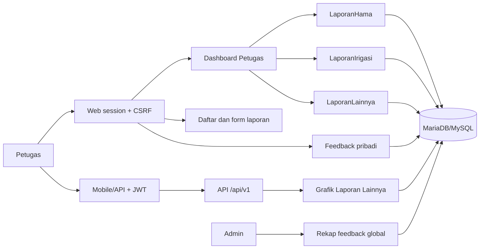
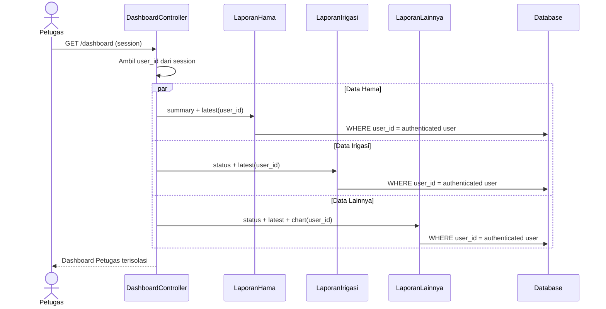

# Implementasi Penyempurnaan Fitur Petugas

> Versi: 1.0.0
>
> Tanggal verifikasi: 20 Agustus 2026
>
> Cakupan: halaman laporan, feedback, dashboard, laporan terbaru, dan grafik
> Laporan Lainnya untuk role `petugas`

## 1. Tujuan

Perubahan ini menyederhanakan pengalaman Petugas agar berfokus pada tiga
kegiatan utama:

1. Membuat dan mengelola fenomena Hama, Irigasi, dan Lainnya.
2. Memantau laporan milik sendiri beserta status prosesnya.
3. Mengirim saran/aduan dan memantau riwayat pribadi.

Rekap global, daftar feedback seluruh pengguna, dan pengelolaan status feedback
tetap menjadi kewenangan Admin. Penyederhanaan tampilan tidak menghapus
pembatasan ownership pada controller, model, maupun endpoint API.

## 2. Arsitektur Perubahan



## 3. Perubahan Halaman Laporan

### 3.1 Pola daftar Petugas

Laporan Hama dan Irigasi menggunakan partial bersama:

`app/views/reports/petugas_list.php`

Pola interaksi yang disediakan:

- filter status;
- rentang tanggal;
- pencarian teks;
- pilihan jumlah data per halaman;
- tabel responsif;
- pagination;
- tombol detail dan edit berdasarkan status;
- tombol tambah fenomena sesuai jenis laporan.

Label aksi utama:

| Modul | Label |
|---|---|
| Hama | `Tambah Fenomena Hama` |
| Irigasi | `Tambah Fenomena Irigasi` |
| Lainnya | `Tambah Fenomena Lainnya` |

Pesan dan badge `Mode Petugas: Anda hanya dapat melihat laporan yang Anda buat
sendiri` telah dihapus dari tampilan. Pembatasan tersebut tetap aktif di query.

### 3.2 Aturan ownership

```text
IF authenticated_user.role == "petugas"
THEN every report list/detail/mutation query MUST include
     report.user_id == authenticated_user.id
AND request.user_id MUST NOT determine authorization.
```

Petugas hanya dapat mengubah laporan miliknya yang masih berstatus `Draf` atau
`Ditolak`. Verifikasi tetap hanya dapat dilakukan Admin terhadap laporan
`Submitted`.

## 4. Feedback Petugas

### 4.1 Tampilan Petugas

Halaman `/feedback` merender
`app/views/feedback/petugas_history.php` bagi role Petugas. Isinya hanya:

- tombol `Kirim Saran`;
- daftar saran/aduan milik Petugas yang sedang login;
- jenis, status, prioritas, waktu, dan deskripsi ringkas;
- pagination dan tautan detail milik sendiri.

Elemen berikut tidak ditampilkan kepada Petugas:

- statistik atau rekap global;
- saran populer;
- daftar feedback pengguna lain;
- voting;
- filter dan analitik global.

### 4.2 Form dan status

Form `/feedback/create` menerima:

| Field | Aturan |
|---|---|
| `jenis_feedback` | `bug`, `fitur_baru`, atau `peningkatan` |
| `judul` | Wajib; panjang minimum mengikuti controller |
| `deskripsi` | Wajib; panjang minimum mengikuti controller |
| `prioritas` | `rendah`, `medium`, atau `tinggi` |
| `attachment` | Opsional; divalidasi berdasarkan ukuran, MIME, dan ekstensi |

Status awal feedback baru adalah `diterima`. Controller mengisi `user_id` dari
session, bukan dari payload.

### 4.3 Batas Admin

Admin tetap memiliki akses eksklusif terhadap:

- `/feedback/admin-summary`;
- `/feedback/report`;
- daftar seluruh feedback;
- filter lintas Petugas;
- perubahan status dan catatan Admin;
- riwayat perubahan status.

## 5. Dashboard Petugas

Dashboard khusus Petugas berada di:

`app/views/dashboard/petugas.php`

`app/views/dashboard/index.php` memilih tampilan tersebut melalui variabel
`isPetugasDashboard`. Dashboard role lain tetap menggunakan tampilan lama.

### 5.1 Kartu fenomena

Dashboard menampilkan tiga kartu:

| Kartu | Ringkasan | Aksi |
|---|---|---|
| Fenomena Hama | Draf, Dikirim, Diverifikasi, Ditolak | Tambah Fenomena Hama |
| Fenomena Irigasi | Draf, Dikirim, Diverifikasi, Ditolak | Tambah Fenomena Irigasi |
| Fenomena Lainnya | Draf, Dikirim, Diverifikasi, Ditolak | Tambah Fenomena Lainnya |

Draf ditampilkan sebagai indikator pekerjaan operasional. Statistik grafik
default tetap mengecualikan Draf.

### 5.2 Elemen yang dihapus dari dashboard Petugas

- peta sebaran Hama;
- peta Irigasi;
- kartu/badge Ringkasan Kinerja;
- rekap global;
- tabel laporan lintas Petugas.

Endpoint peta lama tidak dihapus agar mobile atau integrasi lama tetap
kompatibel. Endpoint tersebut tidak lagi dipanggil oleh UI dashboard Petugas.

## 6. Laporan Terbaru

Dashboard menampilkan tiga panel terpisah:

1. Laporan Hama Terbaru.
2. Laporan Irigasi Terbaru.
3. Laporan Lainnya Terbaru.

Setiap panel:

- dibatasi maksimal tiga record;
- hanya mengambil record milik Petugas yang login;
- memprioritaskan `updated_at DESC` untuk Irigasi dan Lainnya;
- menampilkan kecamatan, desa, lokasi, keterangan, dan tanggal;
- menyediakan tombol `Lihat Semua` menuju daftar modul terkait.

Method model terkait:

| Model | Method |
|---|---|
| `LaporanHama` | `getRecentForDashboard($userId, 3)` |
| `LaporanIrigasi` | `getRecentForDashboard($userId, 3)` |
| `LaporanLainnya` | `getRecentForDashboard($userId, 3)` |

## 7. Grafik Laporan Lainnya

### 7.1 Endpoint API canonical

```http
GET /api/v1/dashboard/charts/lainnya?tahun=2026&include_draft=false
Authorization: Bearer <jwt>
Accept: application/json
```

Endpoint terdaftar pada `backend/config/routes.php` dan ditangani oleh
`App\Controllers\Api\DashboardController::chartsLainnya()`.

Aturan akses:

- JWT valid wajib tersedia;
- hanya role `petugas` yang diterima;
- role lain menerima `403`;
- `user_id` selalu berasal dari `$GLOBALS['auth_user']`;
- kedua query agregat menyertakan `ll.user_id = :user_id`;
- Draf dikecualikan secara default.

Parameter:

| Parameter | Tipe | Default | Keterangan |
|---|---|---|---|
| `tahun` | integer | Tahun berjalan | Divvalidasi oleh `DashboardService::validateTahun()` |
| `include_draft` | boolean | `false` | Sertakan Draf milik Petugas bila `true` |

Contoh respons sukses:

```json
{
  "success": true,
  "message": "Chart laporan lainnya",
  "data": {
    "trend": [
      {"bulan": 8, "total": 4}
    ],
    "by_type": [
      {"label": "Pupuk", "total": 2},
      {"label": "Panen", "total": 2}
    ],
    "tahun": 2026,
    "include_draft": false
  }
}
```

Kode status:

| Status | Kondisi |
|---|---|
| `200` | Data grafik berhasil diambil |
| `401` | JWT tidak tersedia, kedaluwarsa, atau direvoke |
| `403` | Role bukan Petugas atau akses akun dibatasi |
| `422` | Parameter tahun tidak valid |
| `500` | Kegagalan server/database yang tidak tertangani |

Kontrak machine-readable tersedia di `docs/openapi-petugas.yaml`.

### 7.2 Endpoint web session

```http
GET /dashboard/charts-lainnya?tahun=2026&include_draft=false
Cookie: PHPSESSID=<session>
```

Endpoint ini digunakan untuk kebutuhan web dan juga dibatasi oleh
`checkRole(['petugas'])`.

## 8. Alur Data Dashboard



## 9. Keamanan

Checklist wajib ketika mengubah fitur ini:

- jangan menerima ownership dari `user_id` request;
- gunakan prepared statement;
- pertahankan filter ownership pada list, detail, statistik, dan mutasi;
- escape seluruh output HTML dengan `htmlspecialchars()`;
- gunakan CSRF untuk mutasi web;
- gunakan JWT dan pemeriksaan role untuk API;
- jangan menampilkan feedback Petugas lain;
- jangan memasukkan Draf ke statistik resmi secara default;
- invalidasi cache dashboard setelah laporan dibuat atau status berubah;
- pertahankan validasi status workflow di server.

## 10. Pengujian

Test regresi utama:

`tests/Integration/PetugasDashboardSimplificationTest.php`

Cakupannya:

- tiga kartu fenomena tersedia;
- grafik Laporan Lainnya tersedia;
- tiga panel laporan terbaru tersedia;
- batas maksimal tiga data diterapkan;
- peta dan Ringkasan Kinerja tidak ada pada view Petugas;
- endpoint grafik memeriksa role Petugas;
- seluruh query grafik di-scope ke authenticated user;
- tampilan feedback Petugas tidak memiliki rekap global atau voting.

Test pendukung:

- `tests/Integration/PetugasReportUiConsistencyTest.php`;
- `tests/Integration/FeedbackAuthorizationTest.php`.

Perintah pengujian Windows/Laragon:

```powershell
$php = 'C:\laragon\bin\php\php-8.2.32-nts-Win32-vs16-x64\php.exe'
& $php vendor/bin/phpunit `
  tests/Integration/PetugasDashboardSimplificationTest.php `
  tests/Integration/PetugasReportUiConsistencyTest.php `
  tests/Integration/FeedbackAuthorizationTest.php
```

Hasil verifikasi implementasi: `13 tests`, `184 assertions`, seluruhnya lulus.

## 11. Panduan Pemeliharaan

Saat menambah jenis Laporan Lainnya:

1. Pastikan `master_jenis_laporan` memiliki jenis aktif.
2. Jangan mengubah kontrak ownership.
3. Pastikan jenis baru muncul otomatis pada agregasi `by_type`.
4. Tambahkan warna grafik bila jumlah jenis melampaui palet yang tersedia.
5. Perbarui OpenAPI dan test kontrak.

Saat mengubah field laporan terbaru:

1. Periksa kesetaraan field Hama, Irigasi, dan Lainnya.
2. Gunakan fallback aman bila nilai NULL.
3. Escape nilai sebelum dirender.
4. Hindari query per-record; gunakan JOIN/eager loading.
5. Pastikan limit tetap bounded.

## 12. Daftar File Implementasi

| File | Fungsi |
|---|---|
| `app/controllers/DashboardController.php` | Orkestrasi dashboard dan endpoint grafik web |
| `app/models/LaporanIrigasi.php` | Status dan tiga laporan Irigasi terbaru |
| `app/models/LaporanLainnya.php` | Status, terbaru, tren, dan komposisi jenis |
| `app/views/dashboard/index.php` | Pemilih dashboard berdasarkan role |
| `app/views/dashboard/petugas.php` | Dashboard khusus Petugas |
| `app/views/reports/petugas_list.php` | Pola daftar bersama Hama/Irigasi |
| `app/views/laporan-lainnya/index.php` | Daftar dan tombol Fenomena Lainnya |
| `app/views/feedback/index.php` | Pemilih tampilan feedback Petugas |
| `app/views/feedback/petugas_history.php` | Riwayat feedback pribadi |
| `backend/app/Controllers/Api/DashboardController.php` | API grafik Laporan Lainnya |
| `backend/config/routes.php` | Registrasi endpoint JWT |
| `config/web_routes.php` | Registrasi endpoint web session |
| `docs/openapi-petugas.yaml` | Kontrak API machine-readable |
| `tests/Integration/PetugasDashboardSimplificationTest.php` | Test regresi perubahan |

## 13. Batasan dan Pekerjaan Lanjutan

- Endpoint peta lama masih tersedia untuk backward compatibility.
- Pengujian browser end-to-end dengan database berisi dua akun Petugas berbeda
  tetap disarankan sebelum rilis produksi.
- Cache dashboard perlu diaudit pada seluruh jalur create/update/submit/resubmit
  agar perubahan terlihat tanpa menunggu TTL.
- Kontrak respons aktual perlu dimasukkan ke contract-test OpenAPI pada CI.
- Palet grafik perlu dibuat dinamis bila jenis laporan bertambah signifikan.

## 14. Definition of Done

Perubahan dianggap siap rilis apabila:

- lint PHP lulus;
- unit/integration test lulus;
- Petugas A tidak dapat melihat data Petugas B;
- Admin tetap dapat membuka rekap feedback global;
- dashboard Petugas tidak memanggil endpoint peta;
- setiap panel terbaru maksimal berisi tiga record milik sendiri;
- grafik default tidak memasukkan Draf;
- OpenAPI dan dokumentasi tetap sinkron dengan route;
- tidak ada secret atau kredensial yang masuk repository.
