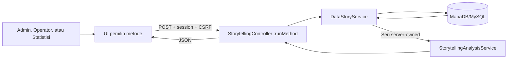

# Implementasi Analitik Storytelling JAGAPADI

**Status:** Aktif  
**Versi:** Analitik `1.0.0`, storytelling utama `2.0.0`  
**Diperbarui:** 20 Agustus 2026  
**Runtime:** Root/integrated (`index.php`)  
**Halaman:** `/storytelling`

Dokumen ini menjelaskan implementasi metode analisis pilihan pengguna,
kontrak endpoint, validasi, keamanan, batas interpretasi, pengujian, serta
tahapan lanjutan menuju arsitektur realtime.

## 1. Ruang Lingkup

Implementasi menyediakan lima metode:

1. tren temporal;
2. korelasi Pearson;
3. prediksi baseline;
4. segmentasi data;
5. deteksi outlier.

Tahap ini masih sinkron pada request pengguna. Redis Streams, transactional
outbox, worker asinkron, SSE, dan high availability belum diimplementasikan.

## 2. Komponen

| Komponen | Lokasi | Tanggung jawab |
|---|---|---|
| Halaman | `app/views/storytelling/index.php` | Pemilih metode, parameter, hasil |
| JavaScript | `public/js/storytelling-dashboard.js` | Request dan render respons |
| Controller | `app/controllers/StorytellingController.php` | Auth, CSRF, validasi, orkestrasi |
| Service sumber | `app/services/DataStoryService.php` | Seri produksi, hujan, dan OPT |
| Service analitik | `app/services/StorytellingAnalysisService.php` | Perhitungan statistik deterministik |
| Route | `config/web_routes.php` | Route `/storytelling/runMethod` |
| Test | `tests/Unit/StorytellingAnalysisServiceTest.php` | Verifikasi algoritme |



Seri data tidak diterima dari browser. Controller mengambil ulang data dari
database agar pengguna tidak dapat memanipulasi input produksi, hujan, atau
OPT sebelum perhitungan.

## 3. Hak Akses dan Keamanan

| Kontrol | Implementasi |
|---|---|
| Autentikasi | Session web wajib aktif |
| Role | `admin`, `operator`, atau `statistisi` |
| HTTP | Hanya `POST` |
| CSRF | Token wajib diverifikasi server |
| Wilayah | ID kecamatan harus ada di master |
| Periode | Bulan 1–12; tahun 2000 sampai tahun berjalan + 1 |
| Data mentah | Selalu dibaca ulang oleh server |
| SQL | Prepared statements pada service sumber |
| Output UI | Menggunakan `textContent`, bukan HTML mentah |

Role `petugas` tidak mempunyai akses ke storytelling berdasarkan policy
runtime root saat ini.

## 4. Kontrak Endpoint

### `POST /storytelling/runMethod`

**Content-Type:** `application/json`  
**Autentikasi:** session web  
**Header:** `X-CSRF-Token: <token-session>`

Contoh request:

```json
{
  "bulan": 8,
  "tahun": 2026,
  "wilayah_id": 12,
  "method": "correlation",
  "months": 12,
  "parameters": {
    "variable": "rain"
  }
}
```

| Field | Tipe | Wajib | Aturan |
|---|---|---:|---|
| `bulan` | integer | Ya | 1–12 |
| `tahun` | integer | Ya | 2000–tahun sekarang + 1 |
| `wilayah_id` | integer | Ya | Kecamatan harus ditemukan |
| `method` | string | Ya | Whitelist lima metode |
| `months` | integer | Tidak | Dinormalisasi 6–24; default 12 |
| `parameters` | object | Tidak | Bergantung metode |

Contoh respons berhasil:

```json
{
  "success": true,
  "data": {
    "parameters": {"variable": "rain", "coefficient": "pearson"},
    "summary": "Korelasi Pearson rain terhadap produksi adalah 0.812; hasil tidak membuktikan kausalitas.",
    "metrics": {"pearson_r": 0.812, "strength": "sangat_kuat"},
    "visualization": {
      "labels": ["Sep 2025", "Okt 2025"],
      "series": {"x": [120.5, 151.2], "production": [410, 455]}
    },
    "sample_size": 12,
    "method": "correlation",
    "algorithm_version": "1.0.0",
    "generated_at": "2026-08-20T10:00:00+00:00"
  },
  "data_window_months": 12
}
```

Contoh respons gagal:

```json
{
  "success": false,
  "error": "Korelasi membutuhkan minimal 3 pasangan data lengkap."
}
```

| HTTP | Arti |
|---:|---|
| 200 | Analisis berhasil |
| 400 | Request, metode, parameter, atau wilayah tidak valid |
| 401 | Session tidak tersedia |
| 403 | Role atau CSRF tidak valid |
| 422 | Observasi tidak mencukupi |

## 5. Spesifikasi Metode

### 5.1 Tren temporal — `trend`

```json
{"parameters":{"window":3}}
```

- `window`: integer 2–12.
- Menghitung moving average produksi.
- Menghitung persentase perubahan observasi awal ke akhir.
- Moving average `null` sampai observasi memenuhi window.

### 5.2 Korelasi Pearson — `correlation`

```json
{"parameters":{"variable":"rain"}}
```

- `variable`: `rain` atau `pest`.
- Minimum tiga pasangan observasi lengkap.
- Koefisien berada pada -1 sampai 1.
- Kekuatan: `sangat_kuat` ≥0,8; `kuat` ≥0,6; `sedang` ≥0,4;
  `lemah` ≥0,2; selainnya `sangat_lemah`.

Korelasi tidak membuktikan hubungan sebab-akibat. Versi ini belum menghitung
p-value atau confidence interval.

### 5.3 Prediksi baseline — `predictive`

```json
{"parameters":{"horizon":3}}
```

- `horizon`: integer 1–12 bulan.
- Minimum tiga observasi produksi.
- Model regresi linear terhadap urutan waktu.
- Prediksi negatif dinormalisasi menjadi nol.

Model ini merupakan baseline. Hasil tidak boleh menjadi dasar keputusan
operasional sebelum backtesting dan review ahli domain.

### 5.4 Segmentasi data — `clustering`

```json
{"parameters":{"clusters":3}}
```

- `clusters`: integer 2–5.
- Membutuhkan pasangan produksi dan hujan lengkap.
- Variabel dinormalisasi min-max.
- Skor gabungan dibagi menggunakan segmentasi quantile.

Nama UI menggunakan “Segmentasi data” karena versi pertama belum merupakan
K-Means atau DBSCAN penuh. Indeks cluster dimulai dari `0`.

### 5.5 Deteksi outlier — `outlier`

```json
{"parameters":{"threshold":3.5}}
```

- `threshold`: angka 2–10; default 3,5.
- Minimum lima observasi produksi.
- Menggunakan modified z-score berbasis median dan MAD.
- Outlier ditandai ketika nilai absolut skor melewati threshold.

## 6. Kontrak Respons Umum

| Field | Deskripsi |
|---|---|
| `method` | Metode yang dijalankan |
| `parameters` | Parameter efektif |
| `summary` | Penjelasan singkat untuk UI |
| `metrics` | Metrik khusus metode |
| `visualization` | Seri siap divisualisasikan |
| `sample_size` | Observasi lengkap yang dipakai |
| `algorithm_version` | Versi algoritme |
| `generated_at` | Timestamp UTC ISO-8601 |

Kontrak ini memungkinkan pemindahan proses ke worker asinkron tanpa mengubah
format hasil frontend.

## 7. Penggunaan UI

1. Masuk menggunakan akun yang berhak dan buka `/storytelling`.
2. Pilih bulan, tahun, dan kecamatan.
3. Pilih metode pada **Metode Analisis Lanjutan**.
4. Pilih jendela data 6, 12, 18, atau 24 bulan.
5. Isi parameter yang ditampilkan.
6. Tekan **Jalankan**.
7. Tinjau ringkasan, jumlah observasi, versi algoritme, dan metrik.

Hasil lanjutan belum otomatis disimpan. Tombol **Simpan Analisis** tetap
menyimpan hasil storytelling utama versi `2.0.0`.

Jika tidak ada baris `produksi_gabah` berstatus `verified` dengan `bulan` yang
terisi, halaman menampilkan diagnosis jumlah data tahunan/bulanan dan
menonaktifkan tombol analisis. Sistem sengaja tidak membentuk estimasi bulanan
dari data tahunan karena hasilnya berisiko menyesatkan.

## 8. Pengujian

Unit test:

```powershell
& 'C:\laragon\bin\php\php-8.2.32-nts-Win32-vs16-x64\php.exe' `
  vendor/bin/phpunit tests/Unit/StorytellingAnalysisServiceTest.php
```

Regresi storytelling:

```powershell
& 'C:\laragon\bin\php\php-8.2.32-nts-Win32-vs16-x64\php.exe' `
  vendor/bin/phpunit `
  tests/Unit/DataStoryServiceTest.php `
  tests/Unit/StorytellingAnalysisServiceTest.php `
  tests/Integration/DataStoryServiceDatabaseTest.php
```

Hasil saat implementasi:

- storytelling: **15 tests, 46 assertions**, lulus;
- seluruh unit suite: **61 tests, 176 assertions**, lulus;
- PHP lint dan sintaks JavaScript: lulus.

QA visual belum dilakukan karena browser lokal tidak tersedia pada sesi
implementasi.

## 9. Checklist QA Manual

- [ ] Admin, Operator, dan Statistisi dapat menjalankan metode.
- [ ] Petugas ditolak.
- [ ] Request tanpa CSRF ditolak.
- [ ] Kecamatan kosong/tidak dikenal ditolak.
- [ ] Parameter di luar batas ditolak.
- [ ] Dataset tanpa produksi bulanan menampilkan peringatan dan menonaktifkan analisis.
- [ ] Korelasi kurang dari tiga pasangan menghasilkan HTTP 422.
- [ ] Outlier kurang dari lima observasi menghasilkan HTTP 422.
- [ ] Pergantian metode memperbarui label dan batas parameter.
- [ ] Output server tidak dirender sebagai HTML mentah.
- [ ] Analisa, Simpan, Preview, dan riwayat lama tetap berfungsi.

## 10. Batasan

1. Request masih sinkron dan belum memiliki analytical job queue.
2. Perubahan database belum didorong otomatis ke browser.
3. Belum ada cache hasil berdasarkan parameter dan versi data.
4. Prediksi belum memiliki model musiman, confidence interval, atau backtest.
5. Korelasi belum memiliki Spearman, p-value, atau kontrol confounder.
6. Segmentasi belum memiliki K-Means/DBSCAN dan silhouette score.
7. Hasil lanjutan belum dipersistenkan atau diekspor.
8. Target dua detik, 1.000 pengguna, dan availability 99,9% belum dapat
   diklaim tanpa infrastruktur dan load test.

## 11. Roadmap Realtime

### Fase 2 — Proyeksi dan cache

- migration tabel agregat bulanan dan hasil analisis;
- cache key berdasarkan metode, parameter, wilayah, periode, dan versi data;
- cache-aside dan stale-while-revalidate;
- metrik query p50/p95/p99.

### Fase 3 — Event pipeline

- transactional outbox;
- Redis Streams dengan idempotent consumer;
- worker proyeksi analitik;
- event version dan processing watermark;
- reconciliation job.

### Fase 4 — Pembaruan browser

- SSE untuk progress dan data-update event;
- status `fresh`, `processing`, dan `stale`;
- reconnect dengan `Last-Event-ID`;
- fallback polling.

### Fase 5 — Model lanjutan

- seasonal naïve sebagai baseline evaluasi;
- ETS/ARIMA setelah validasi dataset;
- walk-forward backtesting;
- model registry dan deteksi drift.

### Fase 6 — Skala dan availability

- load test 1.000 pengguna;
- Redis high availability dan read replica;
- beberapa worker consumer;
- monitoring consumer lag dan commit-to-UI latency;
- runbook recovery dan error budget 99,9%.

## 12. Aturan Pengembangan

1. Baca `AGENTS.md`, `docs/BLUEPRINT.md`, `docs/API.md`, dan
   `docs/DATABASE.md` sebelum perubahan.
2. Jangan menerima seri client sebagai sumber perhitungan resmi.
3. Metode baru wajib mempertahankan kontrak respons umum.
4. Setiap algoritme wajib memiliki versi, data minimum, validasi, unit test,
   dan batas interpretasi.
5. Perubahan skema hanya melalui migration baru.
6. Jangan menyebut korelasi sebagai kausalitas.
7. Jangan mengklaim target akurasi/performa tanpa benchmark terdokumentasi.

## 13. Kriteria Selesai Realtime

- commit-to-UI p95 tidak lebih dari dua detik;
- error rate di bawah 1% pada 1.000 pengguna bersamaan;
- event duplikat/out-of-order tidak mengubah hasil;
- agregasi deterministik cocok 100% dengan golden dataset;
- model prediktif memenuhi metrik backtesting yang disepakati;
- availability minimal 99,9%;
- observabilitas dan runbook tersedia;
- pengguna dapat memilih metode tanpa bantuan.
