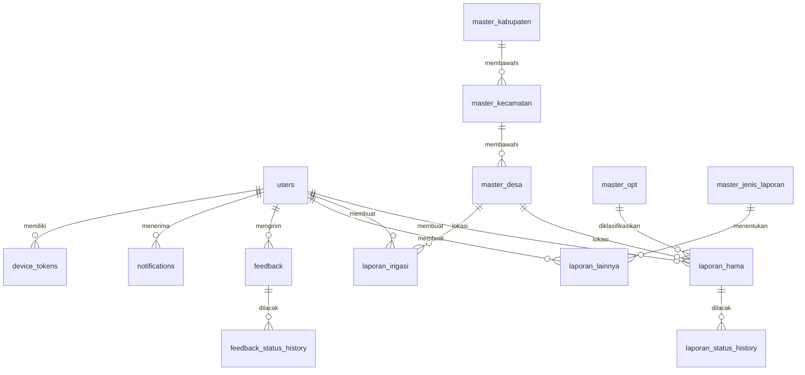
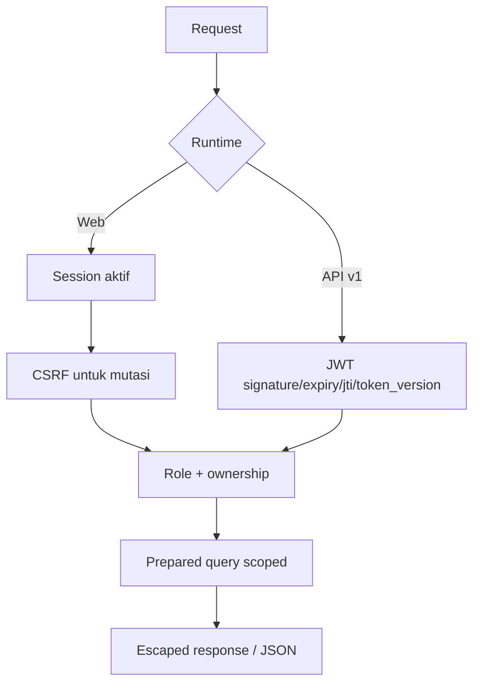

# Buku Metadata Aplikasi JAGAPADI

> ID katalog: `jagapadi-metadata`
>
> Versi buku: 1.0.0
>
> Terakhir diverifikasi: 20 Agustus 2026
>
> Pemilik: Tim Pengembang JAGAPADI
>
> Katalog machine-readable: [`metadata/catalog.yaml`](metadata/catalog.yaml)

## 1. Tujuan dan Ruang Lingkup

Buku ini mendeskripsikan metadata fungsional dan non-fungsional JAGAPADI:
database, model, API, UI, konfigurasi, autentikasi, keamanan, workflow, operasi,
dependensi, ownership, dan pemeliharaan. Metadata dibandingkan dengan database
runtime yang terhubung, migration, route, middleware, controller/model, test,
API, OpenAPI, dan dokumentasi pada 20 Agustus 2026.

Buku tidak menyimpan secret, nilai token, password, atau data pribadi pengguna.
Contoh data bersifat ilustratif.

## 2. Cara Membaca dan Mencari

Setiap elemen mempunyai metadata minimum:

| Field | Makna |
|---|---|
| ID | Identifier stabil untuk referensi manusia/mesin |
| Nama resmi | Nama bisnis atau teknis yang disepakati |
| Modul | Klasifikasi fungsional |
| Deskripsi | Fungsi elemen |
| Pemilik | Tim/role yang bertanggung jawab |
| Versi | Versi kontrak, migration, atau kondisi repository |
| Diperbarui | Tanggal verifikasi terakhir |
| Dependensi | Elemen upstream/downstream |
| Sumber | Lokasi implementasi atau schema |

Pencarian cepat dapat dilakukan dengan ID pada tabel indeks atau key yang sama
dalam `docs/metadata/catalog.yaml`.

## 3. Indeks Metadata

| ID | Modul | Nama resmi | Jenis | Pemilik |
|---|---|---|---|---|
| `runtime.root` | Platform | Runtime Root/Integrated | Runtime | Tim Backend Web |
| `runtime.v1` | Platform | Backend v1 | Runtime | Tim Backend API |
| `iam.users` | Identity & Access | Pengguna | Entitas | Admin Sistem |
| `master.wilayah` | Master Data | Hierarki Wilayah | Entitas | Admin Wilayah |
| `master.opt` | Master Data | Master OPT | Entitas | Admin Pertanian |
| `report.hama` | Pelaporan | Laporan Hama | Entitas | Petugas/Admin |
| `report.irigasi` | Pelaporan | Laporan Irigasi | Entitas | Petugas/Admin |
| `report.lainnya` | Pelaporan | Laporan Lainnya | Entitas | Petugas/Admin |
| `report.v1-extra` | Pelaporan | Pupuk/Panen/Cuaca/Alat | Entitas | Petugas/Admin |
| `feedback.main` | Feedback | Saran dan Aduan | Entitas | Petugas/Admin |
| `notification.main` | Notifikasi | Notifikasi Pengguna | Entitas | Sistem/Pengguna |
| `notification.device` | Notifikasi | Token Perangkat | Entitas | Pengguna |
| `iam.jwt-blacklist` | Identity & Access | Revokasi JWT | Entitas | Sistem Auth |
| `ops.idempotency` | Operasi | Kunci Idempotensi | Entitas | Sistem API |
| `audit.main` | Audit | Log dan Riwayat Status | Entitas | Sistem Operasi |
| `analytics.environment` | Data/Analitik | Lingkungan dan Produksi | Kelompok entitas | Tim Data |
| `api.auth` | API | API Autentikasi | Endpoint group | Tim Backend API |
| `api.reports` | API | API Pelaporan | Endpoint group | Tim Pelaporan |
| `api.dashboard` | API | API Dashboard | Endpoint group | Tim Analitik |
| `ui.petugas-dashboard` | UI | Dashboard Petugas | Komponen | Tim Web |
| `ui.petugas-feedback` | UI | Feedback Petugas | Komponen | Tim Web |
| `config.environment` | Konfigurasi | Environment | Konfigurasi | DevOps |

## 4. Sumber Kebenaran dan Status Verifikasi

Urutan sumber kebenaran:

1. database runtime target;
2. route, middleware, controller/service/model;
3. migration dan `schema_migrations`;
4. test otomatis;
5. API/OpenAPI;
6. dokumentasi arsitektur.

Database yang diaudit memiliki 64 base table dan 20 migration tercatat.
Migration `019`, `021`, dan `022` tersedia di filesystem tetapi belum tercatat
pada database tersebut. Karena deployment dapat berbeda, selalu audit target
sebelum menggunakan label “aktif”.

## 5. Metadata Runtime

### 5.1 `runtime.root`

| Properti | Nilai |
|---|---|
| Nama resmi | Runtime Root/Integrated |
| Deskripsi | Web terintegrasi, server-rendered UI, API internal dan integrasi kompatibilitas |
| Pemilik | Tim Backend Web |
| Versi | `repository-current` |
| Diperbarui | 2026-08-20 |
| Entry point | `index.php` |
| Route | `config/web_routes.php`, `app/core/Router.php` |
| Auth | Session + CSRF; middleware khusus untuk API eksternal |
| Dependensi | Root database, PHP views, cache, integrasi eksternal |

### 5.2 `runtime.v1`

| Properti | Nilai |
|---|---|
| Nama resmi | Backend v1 |
| Deskripsi | Backend canonical untuk web v1 dan REST API mobile |
| Pemilik | Tim Backend API |
| Versi | `v1` |
| Diperbarui | 2026-08-20 |
| Entry point | `backend/public/index.php` |
| Route | `backend/config/routes.php` |
| API base | `/api/v1` |
| Auth | Session/CSRF untuk web; JWT Bearer untuk API |
| Dependensi | Backend database, Flutter, storage, cache/log |

## 6. Kamus Entitas Inti

Notasi: `PK` primary key, `FK` foreign key, `UQ` unique, `NN` not null.
Kolom audit `created_at`/`updated_at` dimiliki sistem kecuali disebut lain.

### 6.1 `iam.users` — `users`

Deskripsi: identitas dan otorisasi pengguna. Pemilik: Admin Sistem. Versi:
migration 003/012/022-compatible. Dependensi: seluruh resource ber-ownership.

| Kolom | Tipe | Batasan dan fungsi |
|---|---|---|
| `id` | INT UNSIGNED | PK, auto increment |
| `username` | VARCHAR(50) | NN, UQ, kredensial login |
| `password` | VARCHAR(255) | NN, hash; sensitif; tidak pernah dikirim balik |
| `email` | VARCHAR(150) | NN, UQ, data pribadi |
| `nama_lengkap` | VARCHAR(150) | NN, nama tampilan |
| `role` | ENUM | `admin`, `petugas`, `operator`, `statistisi`, `viewer` |
| `aktif` | TINYINT(1) | Default 1; gerbang login |
| `must_change_password` | TINYINT(1) | Memaksa pergantian password |
| `token_version` | INT UNSIGNED | Revokasi seluruh JWT pengguna |
| `last_password_change_at` | TIMESTAMP NULL | Audit password |
| `created_at`, `updated_at` | TIMESTAMP | Audit sistem |

### 6.2 `master.wilayah`

Pemilik: Admin Wilayah. Versi: migrations 002/013. Dependensi: laporan, peta,
dashboard, ekspor, integrasi data.

| Tabel | Kolom utama | Relasi/validasi |
|---|---|---|
| `master_kabupaten` | `id INT`, `kode VARCHAR(10) UQ`, `nama_kabupaten VARCHAR(100)` | Induk wilayah |
| `master_kecamatan` | `id INT`, `kabupaten_id INT`, kode/nama, latitude/longitude | FK ke kabupaten; koordinat `-90..90`, `-180..180` |
| `master_desa` | `id INT`, `kecamatan_id INT`, kode/nama | FK ke kecamatan |

Hierarki wajib konsisten: desa harus menjadi anak kecamatan dan kecamatan harus
menjadi anak kabupaten yang dikirim pada laporan.

### 6.3 `master.opt` — `master_opt`

Pemilik: Admin Pertanian. Versi: migrations 004/016. Dependensi:
`laporan_hama`, dashboard, analitik.

| Kelompok atribut | Kolom |
|---|---|
| Identitas | `id INT PK`, `kode_opt`, `nama_opt UQ`, `nama_ilmiah`, `nama_lokal` |
| Klasifikasi | `jenis ENUM(hama,penyakit,gulma)`, `kategori`, `status_karantina`, `tingkat_bahaya` |
| Taksonomi | `kingdom`, `filum`, `kelas`, `ordo`, `famili`, `genus` |
| Kendali | `etl_acuan DECIMAL(10,2)`, `satuan_etl`, `rekomendasi` |
| Konten | `foto_url`, `deskripsi`, `referensi`, `aktif` |

### 6.4 `report.hama` — `laporan_hama`

Pemilik data: Petugas pembuat. Pemilik workflow: Admin. Versi: Backend v1
current. Dependensi: users, OPT, wilayah, foto, status history, notifikasi,
dashboard, peta, ekspor.

| Kolom | Tipe | Batasan/fungsi |
|---|---|---|
| `id` | BIGINT UNSIGNED | PK |
| `nomor_laporan` | VARCHAR(20) NULL | UQ; dibuat atomik saat Submitted pertama |
| `user_id` | INT UNSIGNED | NN, FK; dari auth context |
| `master_opt_id` | INT UNSIGNED NULL | FK; wajib sesuai validator submit |
| `tanggal` | DATE NULL | Tanggal observasi |
| `kabupaten_id`, `kecamatan_id`, `desa_id` | INT UNSIGNED NULL | FK dan hierarki wilayah |
| `lokasi`, `alamat_lengkap` | VARCHAR | Lokasi tekstual |
| `latitude`, `longitude` | DECIMAL(10,7) | Rentang koordinat bumi |
| `tingkat_keparahan` | ENUM | `Ringan`, `Sedang`, `Berat` |
| `luas_serangan` | DECIMAL(8,2) | Nilai non-negatif |
| `populasi` | DECIMAL(10,2) | Nilai non-negatif |
| `foto_url` | VARCHAR(300) NULL | Path hasil upload tervalidasi |
| `catatan` | TEXT NULL | Teks; escape saat output |
| `status` | ENUM | Lima status resmi; default `Draf` |
| `verified_by`, `verified_at`, `catatan_verifikasi` | FK/timestamp/text | Admin/server-only |
| `ip_pengirim` | VARCHAR(45) NULL | Metadata audit request |
| `created_at`, `updated_at` | TIMESTAMP | Audit sistem |

### 6.5 `report.irigasi` — `laporan_irigasi`

Ownership dan workflow sama dengan Hama. Dependensi: users, wilayah, foto,
status history, notifikasi, dashboard, peta, ekspor.

| Kolom | Tipe | Batasan/fungsi |
|---|---|---|
| `id`, `nomor_laporan`, `user_id` | BIGINT/STRING/INT | Identitas, nomor atomik, ownership |
| `tanggal`, wilayah | DATE/FK | Observasi dan hierarki lokasi |
| `nama_saluran`, `daerah_irigasi` | VARCHAR(200) | Identitas saluran/area |
| `luas_layanan` | DECIMAL(12,2) | Non-negatif |
| `jenis_saluran` | ENUM | `Primer`, `Sekunder`, `Tersier` |
| `latitude`, `longitude` | DECIMAL(10,7) | Koordinat valid |
| `kondisi_fisik` | ENUM | `Bagus`, `Sedang`, `Tidak Bagus`, `Rusak` |
| `debit_air` | ENUM | `Cukup`, `Kurang`, `Kering` |
| `status_perbaikan` | ENUM | Normal/selesai/dalam perbaikan/belum ditangani |
| `aksi_dilakukan`, `catatan` | TEXT | Catatan operasional |
| `foto_url` | VARCHAR(300) | Upload tervalidasi |
| `status` | ENUM | Lima status resmi; default `Draf` |
| Field verifikasi/audit | mixed | Admin/server-only |

### 6.6 `report.lainnya`

Tabel: `laporan_lainnya`, `master_jenis_laporan`. Pemilik: Petugas/Admin.
Versi: root-integrated current. Dependensi: users, wilayah, jenis dinamis.

`laporan_lainnya` memiliki `id`, `user_id`, `jenis_id`, wilayah,
`kode_laporan`, `alamat_lengkap`, `foto_url`, `tanggal_kejadian`, `data_json`,
`deskripsi`, koordinat, status, field verifikasi, dan timestamp.
`master_jenis_laporan.fields_json` mendefinisikan field dinamis.

Catatan kompatibilitas: schema runtime root masih memakai status lowercase
`draft`, `submitted`, `verified`, `rejected`, `archived`. Jangan mencampurnya
dengan vocabulary resmi Backend v1 tanpa adapter/migration eksplisit.

### 6.7 `report.v1-extra`

Tabel source: `laporan_pupuk`, `laporan_panen`, `laporan_cuaca`, dan
`laporan_alat_sarana`. Pemilik: Petugas/Admin. Versi: migration 021.
Status deployment wajib diperiksa lewat `schema_migrations`; pada database audit,
migration 021 belum tercatat walaupun tabel ditemukan.

### 6.8 `feedback.main`

Tabel utama `feedback`; pendukung `feedback_status_history`, `feedback_votes`.
Pemilik record: Petugas pembuat. Pemilik workflow: Admin.

| Kolom | Tipe | Batasan/fungsi |
|---|---|---|
| `id` | INT UNSIGNED | PK |
| `user_id` | INT UNSIGNED | NN, ownership dari session |
| `jenis_feedback` | VARCHAR(50) | `bug`, `fitur_baru`, `peningkatan` |
| `judul` | VARCHAR(255) | Wajib dan tervalidasi panjang |
| `deskripsi` | TEXT NULL | Isi feedback |
| `prioritas` | VARCHAR(20) | `rendah`, `medium`, `tinggi` |
| `status` | VARCHAR(20) | `diterima`, `dalam_proses`, `selesai`, `ditolak` |
| `attachment_url` | VARCHAR(500) | Upload opsional tervalidasi |
| `admin_notes`, `processed_by`, `processed_at` | mixed | Admin-only |
| `vote_count` | INT | Counter kompatibilitas; UI Petugas tidak menampilkan voting global |
| timestamps | TIMESTAMP | Audit sistem |

### 6.9 `notification.main` dan `notification.device`

`notifications`: ID BIGINT, `user_id`, type, title, body, `data_json`, `read_at`,
`created_at`. Semua operasi wajib scoped ke penerima.

`device_tokens`: ID BIGINT, `user_id`, token UQ hingga 512 karakter, platform
Android/iOS/web, user agent, last seen dan timestamp. Token adalah data sensitif
dan hanya boleh dikelola pemilik.

### 6.10 `iam.jwt-blacklist` dan `ops.idempotency`

`jwt_blacklist` menyimpan `jti`, user opsional, expiry, dan waktu pembuatan untuk
revokasi JWT. `idempotency_keys` menyimpan fingerprint request dan respons agar
retry mutasi tidak menggandakan data. Migration 022 harus diverifikasi pada
target sebelum fitur idempotensi/token version dianggap aktif penuh.

### 6.11 `audit.main`

| Tabel | Fungsi |
|---|---|
| `activity_log` | Actor, action, tabel/record, deskripsi, IP, user-agent, waktu |
| `laporan_status_history` | Status lama/baru, actor, komentar, waktu |
| `audit_log_wilayah` | Audit perubahan master wilayah bila tersedia |
| `schema_migrations` | Registry migration, batch, dan waktu eksekusi |

### 6.12 `analytics.environment`

Kelompok ini mencakup data curah hujan, angin, harga komoditas, BPS/KSA,
produksi gabah, evaluasi akurasi, analisis produksi, scraper queue/log, IoT
pengairan, rule/alert, dan tabel ringkasan. Pemilik: Tim Data/Statistik. Setiap
dataset wajib mencatat sumber, periode, wilayah, timestamp ingest, serta status
simulasi/aktual bila kolomnya tersedia.

Tabel dengan suffix/prefix `backup_`, `*_backup_*`, dan tabel anomali merupakan
operational/legacy evidence, bukan sumber domain utama tanpa keputusan data
owner.

## 7. Relasi Entitas



## 8. Metadata API

Kontrak rinci berada di [`API.md`](API.md), [`openapi.yaml`](openapi.yaml), dan
[`openapi-petugas.yaml`](openapi-petugas.yaml). Route aktual tetap sumber utama.

| ID | Path/pola | Metode | Auth/otorisasi | Dependensi |
|---|---|---|---|---|
| `api.auth.login` | `/api/v1/auth/login` | POST | Publik + rate limit | users, JWT |
| `api.auth.refresh` | `/api/v1/auth/refresh` | POST | JWT aktif | blacklist, token version |
| `api.auth.logout` | `/api/v1/auth/logout` | POST | JWT | blacklist |
| `api.auth.me` | `/api/v1/me` | GET | JWT | users |
| `api.master.wilayah` | `/api/v1/wilayah/**` | GET; mutasi Admin | JWT/RBAC | master wilayah |
| `api.master.opt` | `/api/v1/opt/**` | GET; mutasi Admin | JWT/RBAC | master_opt |
| `api.report.*` | `/api/v1/laporan-{jenis}/**` | CRUD/workflow/foto | JWT + ownership/Admin | laporan, storage |
| `api.dashboard.*` | `/api/v1/dashboard/**` | GET | JWT + user scope | laporan, cache |
| `api.export.*` | `/api/v1/export/{hama,irigasi}` | GET | JWT + scope | laporan |
| `api.notification.*` | `/api/v1/notifications/**` | GET/POST/DELETE | JWT + ownership | notifications |
| `api.device.*` | `/api/v1/device-tokens/**` | POST/DELETE | JWT + ownership | device_tokens |
| `api.feedback.root` | `/api/feedback/**` | GET | Session + Admin | feedback |

Respons API v1 berbentuk JSON envelope. Status minimum: `200/201`, `400`, `401`,
`403`, `404`, `409`, `422`, dan `429` sesuai operasi. Mutasi yang eligible dapat
menggunakan `Idempotency-Key`; key sama dengan payload berbeda menghasilkan
konflik.

## 9. Metadata Model dan Service

| Modul | Root/integrated | Backend v1 | Tanggung jawab |
|---|---|---|---|
| User | `app/models/User.php` | `backend/app/Models/User.php` | Akun dan role |
| Hama | `app/models/LaporanHama.php` | Model + `LaporanHamaService` | Query, ownership, workflow |
| Irigasi | `app/models/LaporanIrigasi.php` | Model + `LaporanIrigasiService` | Query, ownership, workflow |
| Lainnya | `app/models/LaporanLainnya.php` | Model/service jenis tambahan | Field dinamis/tambahan |
| Feedback | `app/models/Feedback.php` | Runtime root dominan | Feedback dan rekap |
| Notifikasi | Model/service terkait | `Notification`, service | Inbox dan event |
| Dashboard | Aggregator/model | `DashboardService` | Agregat, map, cache |

Model tidak boleh mengambil ownership dari payload. Service workflow menangani
transaction, nomor laporan, transisi status, history, notifikasi, dan cache.

## 10. Metadata UI

| ID | Komponen | File | Pemilik | Dependensi |
|---|---|---|---|---|
| `ui.layout.root` | Layout web root | `app/views/layouts/` | Tim Web | session, navigation |
| `ui.report.list` | Daftar Petugas Hama/Irigasi | `app/views/reports/petugas_list.php` | Tim Web | report controller |
| `ui.report.lainnya` | Laporan Lainnya | `app/views/laporan-lainnya/` | Tim Web | jenis dinamis |
| `ui.petugas-dashboard` | Dashboard Petugas | `app/views/dashboard/petugas.php` | Tim Web | tiga report model, Chart.js |
| `ui.petugas-feedback` | Riwayat feedback | `app/views/feedback/petugas_history.php` | Tim Web | feedback ownership |
| `ui.admin-feedback` | Rekap Admin | `app/views/feedback/admin_summary.php` | Tim Web | Admin policy |
| `ui.v1.layout` | Layout Backend v1 | `backend/app/Views/layouts/` | Tim Web v1 | session/CSRF |
| `ui.mobile` | Flutter screens/widgets | `mobile/lib/` | Tim Mobile | API v1, secure storage |

Semua output dinamis wajib di-escape. Mutasi web menggunakan CSRF. Komponen
tidak boleh menjadi satu-satunya lapisan otorisasi.

## 11. Metadata Konfigurasi

| ID | Elemen | Lokasi | Pemilik | Klasifikasi |
|---|---|---|---|---|
| `config.environment` | Template environment | `.env.example`, `backend/.env.example` jika tersedia | DevOps | Publik tanpa nilai rahasia |
| `config.root-api` | API internal/eksternal root | `config/api_config.php` | Backend/Security | Internal |
| `config.routes.root` | Route web root | `config/web_routes.php`, `app/core/Router.php` | Backend Web | Internal |
| `config.routes.v1` | Route Backend v1 | `backend/config/routes.php` | Backend API | Internal |
| `config.deployment` | Web server/deploy | `.htaccess`, `backend/public/index.php`, `docs/DEPLOY.md` | DevOps | Internal |
| `config.tests` | PHPUnit/E2E | `phpunit.xml`, `e2e/*.config.*` | QA | Internal |

Nilai environment aktual bersifat rahasia dan tidak didokumentasikan di buku.
Perubahan konfigurasi keamanan harus melalui review dan smoke test.

## 12. Autentikasi, Otorisasi, dan Keamanan Data



Klasifikasi data:

| Kelas | Contoh | Kontrol minimum |
|---|---|---|
| Publik/referensi | Nama wilayah, master OPT aktif | Integrity, cache validation |
| Internal | Laporan/agregat/audit | Auth, role, ownership, logging |
| Data pribadi | Nama, email, lokasi, IP, user-agent | Least privilege, minimisasi, retention |
| Rahasia | Password hash, JWT/JTI, device token, secret env | Tidak dilog/ditampilkan; encrypted transport/storage policy |

Kontrol wajib: prepared statement, output escaping, CSRF, JWT validation,
ownership query, RBAC, rate limit, upload validation, random filename,
non-executable upload storage, audit log, dan no-secret commit.

## 13. Workflow Bisnis Utama

### 13.1 Laporan

```text
Draf → Submitted → Diverifikasi → Diarsipkan
              └→ Ditolak → Draf
                         └→ Submitted
```

Nomor dibuat atomik saat Submitted pertama. Resubmit mempertahankan nomor.
Admin hanya memverifikasi/menolak Submitted dan mengarsipkan Diverifikasi pada
workflow resmi Backend v1. Agregat resmi default mengecualikan Draf.

### 13.2 Feedback

Petugas membuat feedback → status `diterima` → Admin memproses atau menolak →
history dan notifikasi diperbarui. Petugas hanya melihat miliknya; Admin melihat
rekap global.

### 13.3 Notifikasi

Event submit/resubmit/verifikasi/penolakan/arsip/feedback menghasilkan record
notifikasi. Push melalui device token bersifat delivery channel; database inbox
tetap menjadi sumber status baca.

## 14. Metadata Non-Fungsional

| Aspek | Standar/implementasi | Bukti utama |
|---|---|---|
| Keamanan | RBAC, ownership, CSRF, JWT, blacklist, escaping, upload validation | Middleware/controller/helper/test |
| Reliability | Transaction, lock nomor, idempotensi, cache invalidation | Service/migration/helper |
| Performa | Pagination, bounded limit, indeks, cache, eager loading/JOIN | Model/service/migration |
| Observability | Request ID, structured log, activity/status history, health | Front controller/log/model |
| Portabilitas | PHP 8.2, MariaDB/MySQL, utf8mb4, cPanel | Composer/config/deploy docs |
| Maintainability | PSR-12, strict types, migration append-only, contract docs | AGENTS.md/test/docs |
| Availability | Health/smoke test, backup/restore, graceful error | Routes/ops docs |
| Privasi | Minimisasi PII, no-secret logs, scoped access | Security policy/code review |

## 15. Matriks Validasi Metadata

| Area | Dibandingkan dengan | Status 2026-08-20 |
|---|---|---|
| Runtime | Dua front controller dan router | Terverifikasi |
| Schema inti | `information_schema` database terhubung | Terverifikasi, 64 tabel |
| Migration | Filesystem vs `schema_migrations` | Terverifikasi; terdapat gap deployment |
| API | Route Backend v1, API.md, OpenAPI Petugas | Terverifikasi secara struktural |
| Ownership | Middleware/controller/model/service dan test | Terverifikasi pada modul inti |
| Workflow | Helper status dan service | Terverifikasi Backend v1 |
| UI | View root dan Backend v1 | Terinventarisasi; visual QA tidak dilakukan |
| Konfigurasi | File config/template, tanpa membaca nilai secret ke output | Terinventarisasi |
| Test | PHPUnit dan E2E inventory | Terinventarisasi; tidak seluruh suite dijalankan untuk buku ini |

## 16. Panduan Pemeliharaan

Metadata wajib diperbarui bila terjadi perubahan schema/migration, route/API,
role/ownership, workflow, model, UI, konfigurasi, dependency, atau kontrol
non-fungsional.

Prosedur:

1. Jalankan `git status` dan tentukan runtime target.
2. Bandingkan migration filesystem dengan `schema_migrations` target.
3. Audit schema melalui `information_schema`; jangan menyalin secret/data row.
4. Audit route, middleware, controller/service/model, UI, dan test.
5. Perbarui buku ini dan `metadata/catalog.yaml` dalam perubahan yang sama.
6. Naikkan `schema_version` katalog untuk perubahan struktur; naikkan versi
   elemen untuk perubahan kontrak.
7. Validasi link Markdown, YAML, duplicate ID, enum, tanggal, dan dependensi.
8. Jalankan lint/test/contract test relevan.
9. Reviewer data owner dan security menyetujui perubahan sensitif.

Definition of Done metadata:

- setiap elemen baru memiliki ID, nama, deskripsi, owner, versi, tanggal,
  klasifikasi, sumber, dan dependensi;
- kolom/endpoint tidak diklaim aktif tanpa bukti runtime;
- tidak ada secret atau contoh data pribadi;
- buku manusia dan katalog mesin sinkron;
- link valid dan hasil verifikasi dicatat.

## 17. Referensi

- [`BLUEPRINT.md`](BLUEPRINT.md)
- [`REFERENSI_TEKNIS_BACKEND_AI.md`](REFERENSI_TEKNIS_BACKEND_AI.md)
- [`API.md`](API.md)
- [`DATABASE.md`](DATABASE.md)
- [`openapi.yaml`](openapi.yaml)
- [`openapi-petugas.yaml`](openapi-petugas.yaml)
- [`PETUGAS_BACKEND_AI_GUIDE.md`](PETUGAS_BACKEND_AI_GUIDE.md)
- [`IMPLEMENTASI_PETUGAS_LAPORAN_FEEDBACK_DASHBOARD.md`](IMPLEMENTASI_PETUGAS_LAPORAN_FEEDBACK_DASHBOARD.md)
- [`DEPLOY.md`](DEPLOY.md)
- [`QA_CHECKLIST.md`](QA_CHECKLIST.md)
