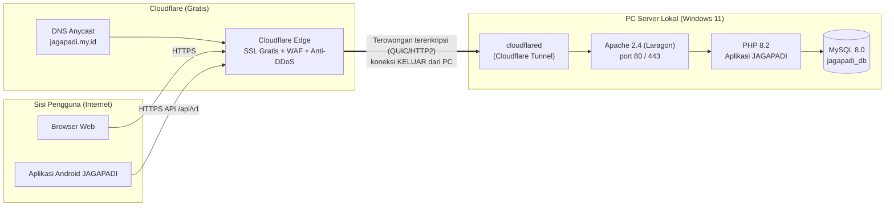
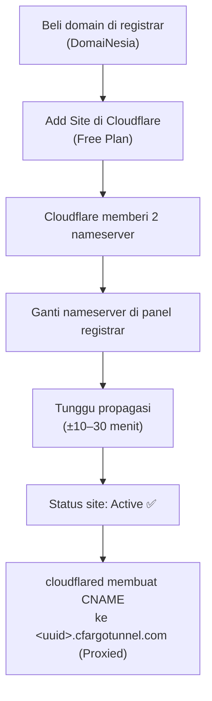
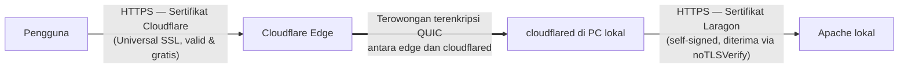
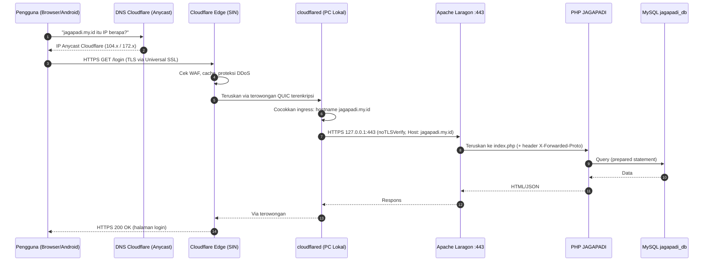

# Dokumentasi Teknis: Localhost – Laragon – Cloudflare (JAGAPADI)

> **Untuk siapa:** pengguna dengan pengetahuan teknis menengah (bisa pakai Windows, terminal dasar, dan panel web).
> **Apa yang akan Anda pelajari:** memasang Laragon sebagai server lokal, mengekspos aplikasi ke internet melalui Cloudflare Tunnel, mengatur DNS dan SSL di panel Cloudflare, memahami alur request dari pengguna internet sampai ke aplikasi, serta cara memverifikasi dan mengatasi masalah umum.
> **Kasus nyata:** aplikasi JAGAPADI di `C:\laragon\www\jagapadi-3509`, online di `https://jagapadi.my.id`.
> **Referensi operasional lanjutan:** [PANDUAN_HOSTING_SERVER_LOKAL_CLOUDFLARE.md](PANDUAN_HOSTING_SERVER_LOKAL_CLOUDFLARE.md) dan [PANDUAN_DOMAIN_CLOUDFLARE_JAGAPADI_MY_ID.md](PANDUAN_DOMAIN_CLOUDFLARE_JAGAPADI_MY_ID.md).

---

## Daftar Isi

1. [Gambaran Besar](#1-gambaran-besar)
2. [Istilah Penting](#2-istilah-penting)
3. [Prasyarat](#3-prasyarat)
4. [Tahap 1 — Instalasi dan Konfigurasi Laragon](#4-tahap-1--instalasi-dan-konfigurasi-laragon)
5. [Tahap 2 — Menjalankan Aplikasi di Localhost](#5-tahap-2--menjalankan-aplikasi-di-localhost)
6. [Tahap 3 — Menyiapkan Domain di Cloudflare (DNS)](#6-tahap-3--menyiapkan-domain-di-cloudflare-dns)
7. [Tahap 4 — Memasang cloudflared dan Membuat Tunnel](#7-tahap-4--memasang-cloudflared-dan-membuat-tunnel)
8. [Tahap 5 — Konfigurasi SSL/TLS di Panel Cloudflare](#8-tahap-5--konfigurasi-ssltls-di-panel-cloudflare)
9. [Tahap 6 — Penyesuaian di Sisi Aplikasi (Apache, .htaccess, .env)](#9-tahap-6--penyesuaian-di-sisi-aplikasi-apache-htaccess-env)
10. [Cara Kerja Alur Request: Pengguna Internet → Aplikasi Lokal](#10-cara-kerja-alur-request-pengguna-internet--aplikasi-lokal)
11. [Membuat Tunnel dan Laragon Auto-Start](#11-membuat-tunnel-dan-laragon-auto-start)
12. [Verifikasi End-to-End](#12-verifikasi-end-to-end)
13. [Troubleshooting Masalah Umum](#13-troubleshooting-masalah-umum)
14. [Checklist Akhir](#14-checklist-akhir)
15. [Referensi](#15-referensi)

---

## 1. Gambaran Besar

Aplikasi JAGAPADI berjalan di **PC lokal** (bukan di hosting/VPS), tetapi tetap bisa diakses publik melalui domain `https://jagapadi.my.id`. Rahasianya adalah **Cloudflare Tunnel**: sebuah program kecil bernama `cloudflared` yang dipasang di PC lokal dan membuat koneksi keluar (outbound) yang terenkripsi ke jaringan Cloudflare. Karena koneksinya keluar — bukan masuk — Anda **tidak perlu**:

- IP publik statis,
- membuka port (port forwarding) di modem/router,
- cemas soal CGNAT dari ISP,
- sertifikat SSL berbayar (Cloudflare menyediakan SSL gratis di sisi pengguna).



**Gambar 1 — Arsitektur umum Localhost → Laragon → Cloudflare.**

Tiga lapis yang harus dikonfigurasi:

| Lapisan | Peran | Tempat konfigurasi |
|---|---|---|
| **Laragon** | Menjalankan Apache + PHP + MySQL (server aplikasi lokal) | `C:\laragon` |
| **cloudflared** | Jembatan aman PC lokal ↔ Cloudflare | `C:\Users\<user>\.cloudflared\config.yml` |
| **Panel Cloudflare** | DNS domain + SSL gratis + proteksi | https://dash.cloudflare.com |

---

## 2. Istilah Penting

| Istilah | Arti sederhana |
|---|---|
| **Localhost / 127.0.0.1** | Alamat "komputer ini sendiri". Hanya bisa diakses dari PC yang sama. |
| **Origin server** | Server asli tempat aplikasi berjalan (di sini: Apache Laragon di PC lokal). |
| **Cloudflare Edge** | Server Cloudflare terdekat dengan pengguna (mis. Singapura/SIN) yang menerima request duluan. |
| **Tunnel (Argo Tunnel)** | Terowongan terenkripsi dari PC lokal ke Cloudflare, dibuat oleh program `cloudflared`. |
| **Nameserver** | Server yang menjawab "domain ini IP-nya berapa". Domain diarahkan ke nameserver Cloudflare. |
| **DNS Record** | Entri di panel DNS, mis. `CNAME jagapadi.my.id → <uuid>.cfargotunnel.com`. |
| **Proxied (awan oranye)** | Trafik dilewatkan lewat Cloudflare (SSL, cache, proteksi aktif). |
| **SSL Mode Full** | Koneksi Cloudflare → origin juga memakai HTTPS (boleh sertifikat self-signed). |
| **`noTLSVerify`** | Perintah ke cloudflared: "terima sertifikat self-signed Laragon tanpa protes". |
| **CGNAT** | Teknik ISP yang membuat IP Anda tidak bisa dijangkau dari luar. Tunnel mengatasi ini. |

---

## 3. Prasyarat

Pastikan hal-hal berikut tersedia sebelum mulai:

1. **PC Windows** yang akan menjadi server (kasus JAGAPADI: Windows 11 Pro, RAM 32 GB — PC biasa pun cukup).
2. **Koneksi internet stabil** (fiber direkomendasikan; kecepatan upload menentukan respons server).
3. **Domain aktif** (kasus JAGAPADI: `jagapadi.my.id` dari registrar DomaiNesia). Bisa registrar mana pun.
4. **Akun Cloudflare** — daftar gratis di https://dash.cloudflare.com (Free Plan sudah cukup).
5. **Kode aplikasi** JAGAPADI sudah ada (atau akan diletakkan) di `C:\laragon\www\jagapadi-3509`.
6. Hak akses untuk **menjalankan terminal** (PowerShell/CMD); beberapa langkah butuh *Run as Administrator*.

---

## 4. Tahap 1 — Instalasi dan Konfigurasi Laragon

### 4.1 Unduh dan pasang Laragon

1. Unduh **Laragon Full** (64-bit) dari https://laragon.org/download/.
2. Jalankan installer, pasang ke lokasi default: **`C:\laragon`**.
   > Hindari path ber-spasi seperti `Program Files` agar tidak merepotkan konfigurasi Apache.
3. Selesai instalasi, buka aplikasi Laragon.

### 4.2 Start service dan kenali komponennya

Klik **Start All**. Laragon menjalankan:

- **Apache 2.4** — web server (port 80 dan 443).
- **PHP 8.2** — bahasa aplikasi JAGAPADI.
- **MySQL 8.0** — database (port 3306).
- **HeidiSQL** — alat kelola database ber-GUI.

### 4.3 Letakkan aplikasi di folder `www`

1. Salin/clone kode JAGAPADI ke **`C:\laragon\www\jagapadi-3509`**.
2. Buka browser → `http://localhost/jagapadi-3509` atau `http://jagapadi-3509.test` (Laragon otomatis membuat virtual host `.test`).
3. Laragon membuat file vhost otomatis di:
   `C:\laragon\etc\apache2\sites-enabled\auto.jagapadi-3509.test.conf`
   (file inilah yang nanti kita ubah di [Tahap 6](#9-tahap-6--penyesuaian-di-sisi-aplikasi-apache-htaccess-env)).

### 4.4 Siapkan database

1. Buka Laragon → **Database** (membuka HeidiSQL).
2. Buat database baru: `jagapadi_db`, charset `utf8mb4`.
3. Import file SQL yang disertakan proyek, atau jalankan migration sesuai panduan proyek (`docs/DATABASE.md`).
4. Catat kredensial: user default Laragon adalah `root` dengan password kosong — **ubah untuk pemakaian produksi**.

### 4.5 Aktifkan SSL lokal (penting untuk skema Tunnel HTTPS)

1. Di Laragon: klik kanan tray icon → **Apache → SSL → Add laragon.crt to Trust Store**.
2. Aktifkan **Settings → Apache SSL port 443** (Laragon membuat sertifikat self-signed `laragon.crt`/`laragon.key` di `C:\laragon\etc\ssl\`).
3. Restart Apache. Uji: `https://localhost` harus terbuka (browser akan memperingatkan sertifikat self-signed — itu normal untuk lokal).

> Kenapa perlu SSL lokal? Konfigurasi JAGAPADI saat ini mengarahkan Tunnel ke `https://127.0.0.1:443` (bukan HTTP port 80). Detailnya di [Tahap 4](#7-tahap-4--memasang-cloudflared-dan-membuat-tunnel).

---

## 5. Tahap 2 — Menjalankan Aplikasi di Localhost

Sebelum menyentuh Cloudflare, pastikan aplikasi **benar-benar jalan di lokal** dulu. Prinsip: *perbaiki lokal dulu, baru ekspos ke internet.*

1. Buka `http://localhost/jagapadi-3509` → halaman login JAGAPADI tampil.
2. Login dengan akun admin → dashboard tampil.
3. Uji API lokal (PowerShell):
   ```powershell
   curl.exe -k -s https://127.0.0.1/api/v1/health
   ```
   Diharapkan: `{"success":true,"database":"connected"}` (atau respons serupa).
4. Jika ada error di tahap ini (halaman kosong, 500, database gagal), selesaikan dulu — lihat `docs/QA_CHECKLIST.md` dan log Apache di `C:\laragon\www\jagapadi-3509\logs`.

---

## 6. Tahap 3 — Menyiapkan Domain di Cloudflare (DNS)

Tahap ini dilakukan seluruhnya di browser, di dua tempat: **panel registrar** (DomaiNesia) dan **dashboard Cloudflare**.

### 6.1 Tambahkan site ke Cloudflare

1. Login https://dash.cloudflare.com → **Add a Site** → ketik `jagapadi.my.id` → **Add site**.
2. Pilih paket **Free** → **Continue**.
3. Cloudflare memindai DNS lama — lanjutkan saja.

### 6.2 Ganti nameserver di registrar

Cloudflare menampilkan **2 nameserver khusus** untuk domain Anda. Kasus JAGAPADI:

```
abby.ns.cloudflare.com
camilo.ns.cloudflare.com
```

Di panel DomaiNesia (atau registrar Anda):

1. Client Area → My Domains → `jagapadi.my.id` → **Nameservers**.
2. Pilih **Use Custom Nameservers**, tempel kedua nameserver Cloudflare → Save.
3. Tunggu propagasi **5 menit sampai 24 jam** (umumnya 10–30 menit).

### 6.3 Verifikasi nameserver

```powershell
nslookup -type=NS jagapadi.my.id
```

Harus menjawab `abby.ns.cloudflare.com` dan `camilo.ns.cloudflare.com`. Di Cloudflare, status site menjadi **Active** (hijau).

### 6.4 DNS record untuk Tunnel

**Anda tidak perlu membuat A record ke IP apa pun.** Record dibuat otomatis oleh perintah `cloudflared tunnel route dns` pada [Tahap 4](#7-tahap-4--memasang-cloudflared-dan-membuat-tunnel), dan hasilnya terlihat seperti ini di **DNS → Records**:

| Type | Name | Target | Proxy | Arti |
|---|---|---|---|---|
| CNAME | `jagapadi.my.id` | `168ca50f-....cfargotunnel.com` | Proxied (oranye) | Domain utama → Tunnel |
| CNAME | `www` | `168ca50f-....cfargotunnel.com` | Proxied (oranye) | Subdomain www → Tunnel |

> Pastikan ikon awan **oranye (Proxied)**. Jika abu-abu (DNS only), trafik tidak lewat Cloudflare dan Tunnel tidak akan menerima request.



**Gambar 2 — Alur menautkan domain ke Cloudflare.**

---

## 7. Tahap 4 — Memasang cloudflared dan Membuat Tunnel

### 7.1 Unduh cloudflared

1. Unduh `cloudflared-windows-amd64.msi` (64-bit) dari https://github.com/cloudflare/cloudflared/releases.
2. Jalankan installer. Program terpasang di `C:\Program Files (x86)\cloudflared\cloudflared.exe`.
3. Verifikasi (PowerShell):
   ```powershell
   & "C:\Program Files (x86)\cloudflared\cloudflared.exe" --version
   ```

### 7.2 Login ke akun Cloudflare

```powershell
& "C:\Program Files (x86)\cloudflared\cloudflared.exe" tunnel login
```

Browser terbuka → pilih site `jagapadi.my.id` → **Authorize**. File `cert.pem` tersimpan di `C:\Users\IPDS\.cloudflared\cert.pem`.

### 7.3 Buat tunnel bernama

```powershell
& "C:\Program Files (x86)\cloudflared\cloudflared.exe" tunnel create jagapadi-server
```

Perintah ini menghasilkan **Tunnel UUID** (contoh JAGAPADI: `168ca50f-e89f-4c18-8d70-c5427121dbe6`) dan file kredensial `C:\Users\IPDS\.cloudflared\<uuid>.json`.

### 7.4 Daftarkan DNS (membuat CNAME otomatis)

```powershell
& "C:\Program Files (x86)\cloudflared\cloudflared.exe" tunnel route dns jagapadi-server jagapadi.my.id
& "C:\Program Files (x86)\cloudflared\cloudflared.exe" tunnel route dns jagapadi-server www.jagapadi.my.id
```

Sekarang cek **DNS → Records** di Cloudflare — dua CNAME ke `<uuid>.cfargotunnel.com` sudah ada (Proxied).

### 7.5 Tulis file konfigurasi `config.yml`

Buat file **`C:\Users\IPDS\.cloudflared\config.yml`** (konfigurasi aktual JAGAPADI, terverifikasi 2026-09-11):

```yaml
tunnel: 168ca50f-e89f-4c18-8d70-c5427121dbe6
credentials-file: C:\Users\IPDS\.cloudflared\168ca50f-e89f-4c18-8d70-c5427121dbe6.json

ingress:
  - hostname: jagapadi.my.id
    service: https://127.0.0.1:443
    originRequest:
      noTLSVerify: true
      httpHostHeader: jagapadi.my.id
  - hostname: www.jagapadi.my.id
    service: https://127.0.0.1:443
    originRequest:
      noTLSVerify: true
      httpHostHeader: www.jagapadi.my.id
  - service: http_status:404
```

Penjelasan baris penting:

| Baris | Arti |
|---|---|
| `tunnel: <uuid>` | Identitas tunnel yang dijalankan. |
| `credentials-file` | Kunci rahasia tunnel (jangan pernah dibagikan/di-commit). |
| `ingress` | Daftar aturan: hostname X diteruskan ke service Y. |
| `service: https://127.0.0.1:443` | Teruskan ke Apache Laragon lokal via HTTPS. |
| `noTLSVerify: true` | Terima sertifikat self-signed Laragon tanpa validasi. **Wajib** jika origin pakai `laragon.crt`. |
| `httpHostHeader` | Header `Host` yang dikirim ke Apache (agar vhost dengan `ServerAlias` mengenali domain). |
| `service: http_status:404` | Aturan terakhir: hostname lain → 404. **Selalu ada di baris paling bawah.** |

> ⚠️ Jangan menempel isi file `*.json` kredensial atau `cert.pem` ke dokumen/chat mana pun — cukup sebutkan path-nya.

### 7.6 Jalankan tunnel

```powershell
& "C:\Program Files (x86)\cloudflared\cloudflared.exe" tunnel --config "C:\Users\IPDS\.cloudflared\config.yml" run jagapadi-server
```

Tanda sukses: log menampilkan **4 koneksi** ke edge Cloudflare (kasus JAGAPADI: `SIN` = Singapura) dan status `Connected`. Buka `https://jagapadi.my.id` di browser — situs tampil dengan gembok SSL.

> Untuk menjalankan di latar belakang tanpa jendela terminal, proyek ini menyediakan `start-tunnel.bat` dan `run-tunnel-silent.vbs`, plus mekanisme auto-start di [bagian 11](#11-membuat-tunnel-dan-laragon-auto-start).

---

## 8. Tahap 5 — Konfigurasi SSL/TLS di Panel Cloudflare

Buka **SSL/TLS** di dashboard Cloudflare untuk site `jagapadi.my.id`.

### 8.1 Mode enkripsi: pilih **Full**

| Mode | Koneksi pengguna → Cloudflare | Koneksi Cloudflare → origin | Verdict |
|---|---|---|---|
| Off | HTTP | HTTP | ❌ Jangan |
| Flexible | HTTPS | HTTP | ❌ Data ke origin polos |
| **Full** | HTTPS | HTTPS (self-signed OK) | ✅ **Dipakai JAGAPADI** (cocok dengan `noTLSVerify: true`) |
| Full (Strict) | HTTPS | HTTPS (sertifikat valid CA) | Hanya jika origin punya sertifikat terpercaya |

### 8.2 Edge Certificates (tab SSL/TLS → Edge Certificates)

- **Always Use HTTPS** = ON — semua HTTP otomatis dialihkan ke HTTPS.
- **Automatic HTTPS Rewrites** = ON — memperbaiki konten campuran (mixed content).
- **Minimum TLS Version** = 1.2.
- **TLS 1.3** = ON.
- **Universal SSL** = aktif otomatis — sertifikat gratis untuk `jagapadi.my.id` dan `*.jagapadi.my.id` di sisi pengguna. Inilah yang membuat browser menampilkan gembok aman meskipun origin lokal hanya punya sertifikat self-signed.

### 8.3 Mengapa "dua lapis SSL" itu aman



**Gambar 3 — Tiga segmen koneksi, semuanya terenkripsi.** Self-signed di segmen terakhir aman karena hanya terjadi di dalam PC sendiri (127.0.0.1) dan tidak melewati jaringan publik.

---

## 9. Tahap 6 — Penyesuaian di Sisi Aplikasi (Apache, .htaccess, .env)

### 9.1 VirtualHost Apache mengenali domain publik

File: `C:\laragon\etc\apache2\sites-enabled\auto.jagapadi-3509.test.conf` (versi ringkas aktual):

```apache
<VirtualHost *:80>
    DocumentRoot "C:/laragon/www/jagapadi-3509"
    ServerName jagapadi-3509.test
    ServerAlias *.jagapadi-3509.test jagapadi.my.id *.jagapadi.my.id

    # Backend v1: /api/v1 diarahkan ke backend/public (API JWT mobile)
    Alias /api/v1 "C:/laragon/www/jagapadi-3509/backend/public"
    <Directory "C:/laragon/www/jagapadi-3509/backend/public">
        AllowOverride All
        Require all granted
    </Directory>
    <Directory "C:/laragon/www/jagapadi-3509">
        AllowOverride All
        Require all granted
    </Directory>
</VirtualHost>

<VirtualHost *:443>
    DocumentRoot "C:/laragon/www/jagapadi-3509"
    ServerName jagapadi-3509.test
    ServerAlias *.jagapadi-3509.test jagapadi.my.id *.jagapadi.my.id
    SSLEngine on
    SSLCertificateFile "C:/laragon/etc/ssl/laragon.crt"
    SSLCertificateKeyFile "C:/laragon/etc/ssl/laragon.key"

    Alias /api/v1 "C:/laragon/www/jagapadi-3509/backend/public"
    <Directory "C:/laragon/www/jagapadi-3509/backend/public">
        AllowOverride All
        Require all granted
    </Directory>
</VirtualHost>
```

Dua hal krusial:

1. **`ServerAlias jagapadi.my.id *.jagapadi.my.id`** — tanpa ini Apache menolak request yang datang lewat domain publik.
2. **`Alias /api/v1` di kedua blok** (`:80` dan `:443`) — tanpa ini web hidup tetapi API mobile 404.

Setelah mengedit, **restart Apache** dari Laragon.

### 9.2 `.htaccess` yang sadar-Cloudflare (anti redirect loop)

File: `C:\laragon\www\jagapadi-3509\.htaccess`:

```apache
RewriteCond %{HTTPS} off
RewriteCond %{HTTP:X-Forwarded-Proto} !https [NC]
RewriteCond %{HTTP_HOST} !^localhost$ [NC]
RewriteCond %{HTTP_HOST} !^127\.0\.0\.1$ [NC]
RewriteCond %{HTTP_HOST} !^10\. [NC]
RewriteCond %{HTTP_HOST} !^192\.168\. [NC]
RewriteCond %{HTTP_HOST} !^172\.(1[6-9]|2[0-9]|3[0-1])\. [NC]
RewriteRule ^(.*)$ https://%{HTTP_HOST}%{REQUEST_URI} [L,R=301]
```

**Kenapa baris `X-Forwarded-Proto` penting:** dari sudut pandang Apache, request dari cloudflared bisa terlihat sebagai HTTP, padahal pengguna sudah HTTPS. Tanpa pengecualian header ini, Apache terus mengarahkan ulang ke HTTPS → **loop redirect tanpa akhir** (`ERR_TOO_MANY_REDIRECTS`). Header `X-Forwarded-Proto: https` memberitahu bahwa pengguna aslinya sudah HTTPS, jadi tidak perlu redirect lagi.

### 9.3 Konfigurasi aplikasi `.env`

```ini
APP_URL=https://jagapadi.my.id
CORS_ALLOWED_ORIGINS=https://jagapadi.my.id,https://www.jagapadi.my.id
```

`APP_URL` memakai domain publik (bukan localhost) agar URL yang dihasilkan aplikasi (link email, redirect, asset) benar. Jangan pernah commit `.env`.

---

## 10. Cara Kerja Alur Request: Pengguna Internet → Aplikasi Lokal

Ini penjelasan langkah demi langkah apa yang terjadi ketika seorang petugas membuka `https://jagapadi.my.id/login`:



**Gambar 4 — Perjalanan satu request dari pengguna sampai database dan kembali.**

Poin-poin kunci untuk dipahami:

1. **Pengguna tidak pernah berkomunikasi langsung dengan PC Anda.** IP asli server tidak pernah terekspos; yang terlihat publik hanyalah IP Cloudflare.
2. **Koneksi Tunnel dibuat dari dalam ke luar (outbound).** Itulah mengapa firewall router, CGNAT, dan tidak adanya IP publik statis tidak jadi masalah — sama seperti PC Anda bisa membuka website tanpa perlu port forwarding.
3. **cloudflared menjaga 4 koneksi** ke edge Cloudflare demi redundansi. Jika satu putus, yang lain mengambil alih.
4. **Satu aturan ingress per hostname.** Request ke `www.jagapadi.my.id` dan `jagapadi.my.id` sama-sama diteruskan ke Apache lokal; vhost Apache-lah yang memutuskan aplikasi mana yang menjawab (lewat `ServerAlias`).
5. **API Android** (`/api/v1/...`) menempuh jalur yang sama persis — bedanya Apache mengarahkannya ke `backend/public` lewat `Alias`, lalu autentikasi memakai JWT Bearer, bukan session.

---

## 11. Membuat Tunnel dan Laragon Auto-Start

Tujuan: PC mati-listrik/restart → semua hidup lagi tanpa campur tangan.

### 11.1 Laragon auto-start

Di Laragon: klik kanan tray → **Preferences** → centang **Run Laragon when Windows starts** dan **Auto start Apache & MySQL**.

### 11.2 Tunnel auto-start (berlapis, sesuai setup aktual)

**Lapisan 1 — VBS Startup (tanpa jendela terminal):**
File di `C:\Users\IPDS\AppData\Roaming\Microsoft\Windows\Start Menu\Programs\Startup\start_cloudflare_tunnel.vbs`:

```vbs
Set WshShell = CreateObject("WScript.Shell")
WshShell.Run """C:\Program Files (x86)\cloudflared\cloudflared.exe"" tunnel --config ""C:\Users\IPDS\.cloudflared\config.yml"" run jagapadi-server", 0, False
```

**Lapisan 2 — Scheduled Task `Cloudflared-Jagapadi`:** trigger `AtLogOn`, retry 3× tiap 1 menit, `StartWhenAvailable`. Cek dengan:

```powershell
Get-ScheduledTask -TaskName "Cloudflared-Jagapadi"
```

**Lapisan 3 (opsional, butuh Admin) — Windows Service**, untuk skenario PC berjalan tanpa ada user login (headless):

```powershell
# PowerShell Run as Administrator
& "C:\Program Files (x86)\cloudflared\cloudflared.exe" service install
sc.exe config Cloudflared start= auto
sc.exe start Cloudflared
```

### 11.3 Ketahanan listrik (sangat disarankan)

- **UPS** untuk PC server.
- BIOS → Power Management → **AC Back / Restore on AC Power Loss = Power On** (PC otomatis hidup setelah listrik menyala).
- Windows → Settings → Power & battery → **Sleep: Never**.

---

## 12. Verifikasi End-to-End

Jalankan berurutan di PowerShell. Semua harus lolos sebelum dinyatakan "integrasi stabil".

```powershell
# 1. Nameserver sudah Cloudflare?
nslookup -type=NS jagapadi.my.id
# ✅ abby.ns.cloudflare.com, camilo.ns.cloudflare.com

# 2. Domain resolve ke IP Cloudflare (tanda Proxied aktif)?
nslookup jagapadi.my.id
# ✅ 104.x.x.x / 172.x.x.x — BUKAN IP PC/router Anda

# 3. Situs publik hidup dengan SSL Cloudflare?
curl.exe -I https://jagapadi.my.id
# ✅ HTTP/2 200, header: server: cloudflare, cf-ray: ...-SIN

# 4. API backend sehat?
curl.exe -s https://jagapadi.my.id/api/v1/health
# ✅ {"success":true,"database":"connected",...}

# 5. Tunnel berjalan dan sehat (4 koneksi)?
Get-Process cloudflared -ErrorAction SilentlyContinue
& "C:\Program Files (x86)\cloudflared\cloudflared.exe" tunnel info jagapadi-server

# 6. Origin lokal merespons HTTPS?
curl.exe -k -sI https://127.0.0.1/
# ✅ 200/301/302 — bukan connection refused

# 7. Auto-start terpasang?
Get-ScheduledTask -TaskName "Cloudflared-Jagapadi"

# 8. File sensitif TIDAK bocor?
curl.exe -I https://jagapadi.my.id/.env
# ✅ 403 atau 404 — jangan pernah 200
```

Verifikasi manual di browser:

- Buka `https://jagapadi.my.id` → gembok SSL tampil, login admin berhasil, dashboard memuat data.
- Uji aplikasi Android yang di-build dengan `API_BASE_URL=https://jagapadi.my.id/api/v1` → login petugas dan kirim laporan.
- (Opsional) Skor SSL di https://www.ssllabs.com/ssltest/ → target A/A+.

**Uji stabilitas:** jalankan server minimal 24 jam, pantau bahwa `curl.exe -I https://jagapadi.my.id` konsisten `200` dan `cloudflared` tetap 4 koneksi. Simulasikan restart PC → semua layanan naik sendiri (bagian 11).

---

## 13. Troubleshooting Masalah Umum

### 13.1 Koneksi gagal

| Gejala | Penyebab umum | Solusi |
|---|---|---|
| Error **1033** (Cloudflare) | Hostname di `config.yml` tidak cocok dengan DNS record | Samakan persis `hostname:` di `config.yml` dengan CNAME di DNS (`jagapadi.my.id`, `www.jagapadi.my.id`) |
| Error **404** dari tunnel | Request jatuh ke aturan `http_status:404` | Hostname belum didaftarkan di ingress; tambahkan bloknya sebelum baris 404 |
| **Timeout / ERR_CONNECTION_TIMED_OUT** | `cloudflared` tidak berjalan atau PC mati | `Get-Process cloudflared`; jalankan ulang tunnel; cek koneksi internet PC |
| Tunnel `0 connections` | Proses jalan tapi gagal konek edge | Cek firewall/antivirus memblokir outbound 7844; jalankan manual dan baca log errornya |
| `tunnel list` kosong / error `cert.pem` | Login Cloudflare kedaluwarsa | Ulangi `cloudflared.exe tunnel login` lalu `tunnel list` |
| Situs lokal hidup, publik mati | Tunnel mati tapi Laragon hidup | Pisahkan masalah: uji `curl -k -sI https://127.0.0.1/` (lokal) vs `curl -I https://jagapadi.my.id` (publik) |

### 13.2 Error SSL

| Gejala | Penyebab umum | Solusi |
|---|---|---|
| Error **526** (Invalid SSL Certificate) | Apache port 443 mati, atau sertifikat Laragon berubah/hilang | `curl.exe -k -sI https://127.0.0.1/` harus merespons; restart Apache; regenerasi `laragon.crt` lewat Laragon; pastikan `noTLSVerify: true` |
| Error **525** (SSL Handshake Failed) | Mode SSL Cloudflare Full/Strict tapi origin tidak HTTPS | Aktifkan SSL di Laragon (port 443) **atau** ubah `service:` ke `http://127.0.0.1:80` + verifikasi ulang |
| **ERR_TOO_MANY_REDIRECTS** (loop HTTPS) | `.htaccess` tidak membaca `X-Forwarded-Proto` | Pakai blok `.htaccess` di bagian 9.2 yang mengecualikan header Cloudflare |
| **Mixed content** (asset HTTP di halaman HTTPS) | Aplikasi menghasilkan URL `http://` | Set `APP_URL=https://jagapadi.my.id`; aktifkan Automatic HTTPS Rewrites di Cloudflare |
| Peringatan sertifikat di browser saat akses lokal | Sertifikat Laragon self-signed | Normal untuk `localhost`/IP lokal; akses publik via domain memakai Universal SSL Cloudflare yang valid |

### 13.3 Masalah aplikasi di balik Tunnel

| Gejala | Penyebab umum | Solusi |
|---|---|---|
| Web hidup tapi `/api/v1/*` 404 | `Alias /api/v1` hanya ada di vhost `:80` | Tambahkan `Alias` di blok `:443` juga, restart Apache |
| CORS error di browser/Android | Origin tidak di-allowlist | Set `CORS_ALLOWED_ORIGINS=https://jagapadi.my.id,https://www.jagapadi.my.id` di `.env` |
| IP pengguna tercatat 127.0.0.1 | Aplikasi membaca IP koneksi lokal, bukan header | Baca header `CF-Connecting-IP` / `X-Forwarded-For` untuk IP asli pengguna |
| Session login sering terlempar | Cache Cloudflare menyimpan halaman dinamis | Buat Cache Rule: bypass untuk `/api/*`, `/login`, `/dashboard` |
| `service install` → **Access denied** | PowerShell bukan Administrator | Jalankan ulang sebagai Administrator, atau gunakan VBS/Scheduled Task (bagian 11) |

### 13.4 Prosedur diagnosis standar (lakukan berurutan)

```powershell
# Langkah 1 — lokal dulu
curl.exe -k -sI https://127.0.0.1/                    # Apache hidup?
# Langkah 2 — tunnel
Get-Process cloudflared                               # cloudflared jalan?
& "C:\Program Files (x86)\cloudflared\cloudflared.exe" tunnel info jagapadi-server
# Langkah 3 — DNS
nslookup jagapadi.my.id                               # resolve ke IP Cloudflare?
# Langkah 4 — publik
curl.exe -I https://jagapadi.my.id                    # 200 + server: cloudflare?
```

Prinsip: **temukan segmen pertama yang gagal** (lokal → tunnel → DNS → publik), lalu fokus perbaikan di situ. Jangan mengubah konfigurasi di segmen yang masih sehat.

---

## 14. Checklist Akhir

```
[ ] Laragon terpasang di C:\laragon; Apache + MySQL auto-start
[ ] Aplikasi jalan di https://localhost / http://jagapadi-3509.test SEBELUM diekspos
[ ] SSL lokal Laragon aktif (port 443, laragon.crt)
[ ] Nameserver domain = 2 nameserver Cloudflare; status site Active
[ ] cloudflared terpasang; tunnel login OK (cert.pem ada)
[ ] Tunnel jagapadi-server dibuat; route dns untuk apex + www
[ ] config.yml: ingress benar, noTLSVerify: true, aturan 404 di akhir
[ ] DNS: CNAME → <uuid>.cfargotunnel.com, awan ORANYE (Proxied)
[ ] Cloudflare SSL/TLS: mode Full; Always Use HTTPS ON; Min TLS 1.2
[ ] VirtualHost: ServerAlias jagapadi.my.id di blok :80 dan :443; Alias /api/v1 di keduanya
[ ] .htaccess: blok force-HTTPS mengecualikan X-Forwarded-Proto
[ ] .env: APP_URL=https://jagapadi.my.id; CORS_ALLOWED_ORIGINS benar; file TIDAK di-commit
[ ] Auto-start: VBS Startup + Scheduled Task aktif; UPS + BIOS AC Back disarankan
[ ] Verifikasi: nslookup, curl -I 200 (server: cloudflare), /api/v1/health connected,
    /.env 403/404, tunnel info 4 koneksi
[ ] Uji restart PC → semua layanan naik sendiri
[ ] Uji 24 jam → respons konsisten 200 OK
```

---

## 15. Referensi

- Dokumen operasional aktual proyek ini: [PANDUAN_HOSTING_SERVER_LOKAL_CLOUDFLARE.md](PANDUAN_HOSTING_SERVER_LOKAL_CLOUDFLARE.md) — status live, UUID tunnel, SOP harian.
- Panduan domain & Cloudflare lengkap (termasuk skenario VPS/cPanel): [PANDUAN_DOMAIN_CLOUDFLARE_JAGAPADI_MY_ID.md](PANDUAN_DOMAIN_CLOUDFLARE_JAGAPADI_MY_ID.md).
- Dokumentasi resmi Cloudflare Tunnel: https://developers.cloudflare.com/cloudflare-one/connections/connect-networks/
- Dokumentasi Laragon: https://laragon.org/docs/
- Arsitektur aplikasi: [BLUEPRINT.md](BLUEPRINT.md) · [DATABASE.md](DATABASE.md) · [API.md](API.md)

> **Keamanan:** jangan pernah menempel isi file kredensial tunnel (`*.json`), `cert.pem`, `.env`, atau password database ke dokumen ini, chat, atau repository. Cukup tulis lokasi path-nya.
