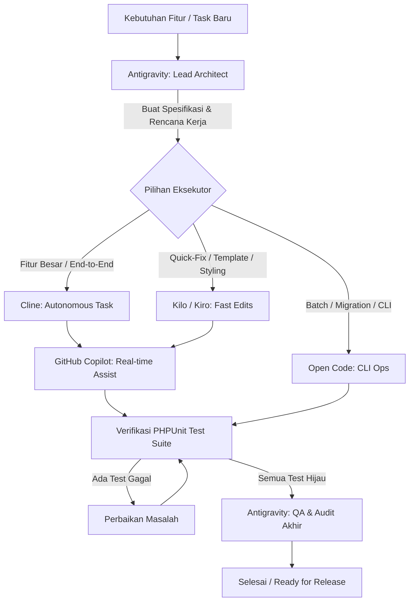

# Panduan Orkestrasi Multi-Agent JAGAPADI (3509)

> Dokumen panduan dan SOP orkestrasi kolaborasi multi-agent AI: **Antigravity**, **Cline**, **Kilo**, **Kiro**, **Open Code**, dan **GitHub Copilot** dalam pengembangan sistem JAGAPADI.

---

## 1. Pendahuluan & Filosofi Orkestrasi

Pengembangan sistem JAGAPADI memanfaatkan ekosistem multi-agent cerdas dengan spesialisasi tugas masing-masing. Agar tidak terjadi konflik logika, pelanggaran arsitektur, atau benturan modifikasi kode, seluruh agent dipandu oleh satu sumber kebenaran (`AGENTS.md`) dan mematuhi batas-batas peran yang didefinisikan dalam dokumen ini.

---

## 2. Matriks Peran & Tanggung Jawab Agent

| Agent | Peran Utama | Ranah Tanggung Jawab | File Konfigurasi |
| :--- | :--- | :--- | :--- |
| **Antigravity** | **Lead Architect & Orchestrator** | Perencanaan arsitektur (*implementation plan*), audit kepatuhan `AGENTS.md`, orkestrasi antar-agent, verifikasi *regression test*, pembuatan dokumentasi master. | `AGENTS.md`, `.gemini/config` |
| **Cline** | **Autonomous Feature Builder** | Pengerjaan fitur baru end-to-end, refactoring modul, implementasi view/controller/service, pembuatan unit test baru. | `.clinerules` |
| **Kilo / Kiro** | **Rapid Code Editor & Assistant** | Perbaikan bug cepat (*quick-fix*), penyesuaian styling template, penulisan script utilitas, penambahan validasi input. | `kilo.json`, `kilo-rules.md`, `.kiro/rules.md` |
| **Open Code** | **Batch CLI & Environment Runner** | Eksekusi perintah command-line kompleks, migration database, seeding, setup dependensi composer/npm. | `opencode.json`, `.opencoderules` |
| **GitHub Copilot** | **Inline Autocomplete & Contextual Chat** | Saran penulisan kode real-time (*inline auto-completion*), docstrings, type hinting, boilerplates method. | `.github/copilot-instructions.md` |

---

## 3. Aturan Emas Arsitektur (Golden Guardrails)

Seluruh agent wajib mematuhi 5 aturan mutlak berikut:

### 1. Kesadaran Dua Runtime (Dual-Runtime Awareness)
- **Root Runtime (`/index.php`)**:
  - Aplikasi web server-rendered dan dashboard analitik.
  - Routing diatur di `config/web_routes.php`.
  - **DILARANG MENGUBAH JUMLAH RUTE**: File `config/web_routes.php` dibekukan pada **136 rute** sesuai ADR-011 dan dijaga oleh `tests/Compatibility/RootCompatibilityTest.php`.
  - Method controller baru di-dispatch secara otomatis oleh fallback convention `index.php` (format URL: `/controllerName/actionName`).
- **Backend v1 Runtime (`backend/public/index.php`)**:
  - Canonical REST API v1 (`/api/v1`) untuk aplikasi mobile Flutter.
  - Menggunakan router terpisah di `backend/config/routes.php` dan autentikasi JWT Bearer.

### 2. Siklus Status Laporan (Report Workflow)
```
Draf → Submitted → Diverifikasi
              └→ Ditolak → Draf
                         └→ Submitted (resubmit pemilik)
```
- Status resmi database: `'Draf'`, `'Submitted'`, `'Diverifikasi'`, `'Ditolak'` (status `'Diarsipkan'` telah dihapus).
- Tampilan UI boleh menampilkan label `'Dikirim'` untuk `'Submitted'`, tetapi nilai query database dan API wajib tetap `'Submitted'`.
- Seluruh query agregasi statistik, grafik tren, peta sebaran GIS, dan ekspor data publik **wajib mengecualikan data berstatus `'Draf'`** secara default. Laporan berstatus `'Diverifikasi'` merupakan status akhir (final approved).

### 3. Keamanan Data & Otorisasi
- **No Raw SQL**: Seluruh interaksi database wajib menggunakan prepared statement PDO dengan parameter binding.
- **XSS Escaping**: Semua cetakan data pada file view/HTML wajib dibungkus `htmlspecialchars()` atau helper `e()`.
- **CSRF Token**: Semua endpoint mutasi state (POST, PUT, DELETE) pada web wajib memvalidasi CSRF token (`$this->validateCsrfToken()`).
- **Ownership Enforcement**: Petugas hanya berhak mengelola datanya sendiri. ID pengguna wajib diambil dari sesi server (`$_SESSION['user_id']`) atau token JWT, bukan dari payload input form client.

### 4. Standar Kode PHP 8.2
- Baris pertama wajib `declare(strict_types=1);`.
- Standar PSR-12, indentasi 4 spasi, LF line ending, UTF-8.
- Type hint eksplisit pada parameter dan return type seluruh fungsi/method.

### 5. Verifikasi Otomatis (Green Test Obligation)
Sebelum menyelesaikan tugas atau membuat commit, setiap agent atau orkestrator wajib memvalidasi bahwa seluruh test suite lulus 100%:
```powershell
php vendor/bin/phpunit
```
*Current benchmark: 354 tests, 3,111+ assertions passing.*

---

## 4. Alur Kerja Orkestrasi (SOP Pengembangan)



1. **Inisiasi & Analisis (Antigravity)**:
   - Memeriksa dampak terhadap `config/web_routes.php` dan dua runtime.
   - Merumuskan arsitektur layanan, model, atau controller.
2. **Implementasi (Cline / Kilo / Open Code)**:
   - Agent bekerja pada berkas masing-masing dengan pedoman guardrail aktif.
   - GitHub Copilot membantu inline completion secara konsisten mengikuti standar PSR-12 dan prepared statements.
3. **Pemberian Test Unit / Kontrak**:
   - Setiap endpoint atau service baru wajib disertai unit test di folder `tests/Unit/`.
4. **Verifikasi Terpusat**:
   - Menjalankan `php vendor/bin/phpunit`.
   - Mengonfirmasi tidak ada regresi pada kompatibilitas root runtime maupun canonical backend.

---

## 5. Ringkasan File Konfigurasi Multi-Agent

Berikut berkas konfigurasi yang telah terpasang dan aktif di repositori:

1. **`AGENTS.md`**: Master instruksi repository untuk seluruh AI coding agent.
2. **`.clinerules`**: Aturan ketat untuk Cline (mencegah edit route beku, mengunci workflow status).
3. **`kilo.json` & `kilo-rules.md`**: Izin full-tool auto-approve dan aturan arsitektur untuk Kilo.
4. **`.kiro/rules.md`**: Instruksi arsitektur untuk Kiro.
5. **`opencode.json` & `.opencoderules`**: Izin eksekusi dan guardrail untuk Open Code.
6. **`.github/copilot-instructions.md`**: Standar coding dan konteks arsitektur untuk GitHub Copilot.
