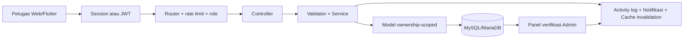
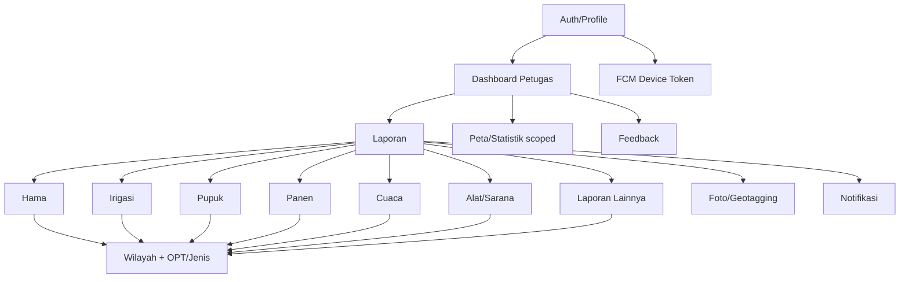
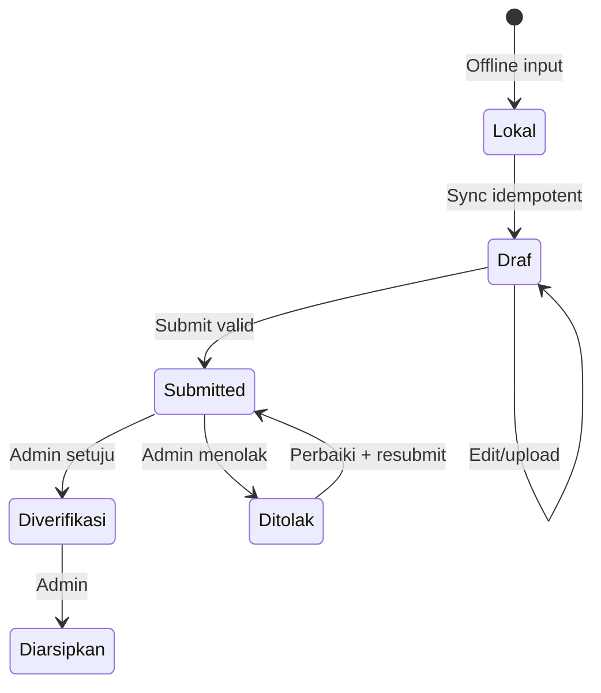

# Panduan Teknis dan Fungsional Backend JAGAPADI — Role Petugas

> Versi dokumen: 1.0.0
>
> Terakhir diverifikasi: 20 Agustus 2026
>
> Target pembaca: developer, QA, DevOps, product owner, dan AI coding agent
> Kontrak OpenAPI Petugas: [`openapi-petugas.yaml`](openapi-petugas.yaml)

## 0. Kontrak Pembacaan untuk AI Agent

Dokumen ini menjadi konteks awal semua pekerjaan yang menyentuh Petugas. Baca
juga [`../AGENTS.md`](../AGENTS.md), [`REFERENSI_TEKNIS_BACKEND_AI.md`](REFERENSI_TEKNIS_BACKEND_AI.md),
[`BLUEPRINT.md`](BLUEPRINT.md), [`API.md`](API.md), dan [`DATABASE.md`](DATABASE.md).

Urutan resolusi konflik: `AGENTS.md` → route/middleware/controller/service/model
aktual → migration aktual → OpenAPI → dokumen naratif. Jika ditemukan perbedaan,
jangan menebak; buktikan dengan test dan perbaiki kontrak dalam perubahan sama.

### 0.1 Fakta kritis

- URL `http://localhost/jagapadi-3509/*` dilayani runtime root (`index.php`,
  `app/`), sedangkan API v1 canonical dilayani `backend/public/index.php`.
- `PetugasAdminMiddleware` mengizinkan `petugas`, `operator`, dan `admin`; nama
  middleware **bukan berarti eksklusif Petugas**. Endpoint eksklusif harus memakai
  policy/role guard yang benar.
- Petugas selalu scoped ke `user_id` dari session/JWT, tidak dari request.
- Mobile/offline retry memakai `Idempotency-Key`; jangan menghilangkannya.
- Draf tidak memiliki nomor laporan dan tidak boleh diverifikasi.

### 0.2 Checklist kerja agent

```text
[ ] Tentukan runtime dan route target.
[ ] Periksa worktree dan pertahankan perubahan pengguna.
[ ] Buat matriks Petugas pemilik vs Petugas bukan pemilik.
[ ] Audit status, CSRF/JWT, ownership query, idempotency, upload, cache.
[ ] Tambahkan unit + integration + negative IDOR + E2E.
[ ] Sinkronkan openapi-petugas.yaml, API.md, DATABASE.md, dan panduan ini.
```

## 1. Pengantar Umum

JAGAPADI mendigitalisasi observasi pertanian Kabupaten Jember. Petugas adalah
aktor lapangan: mengautentikasi perangkat, mengambil master data, menyimpan draf,
melengkapi lokasi/foto, mengirim laporan, menerima hasil verifikasi, memperbaiki
laporan ditolak, melihat data miliknya, mengekspor ringkasan, dan mengirim saran.

Stack: PHP native MVC 8.2+, PDO MySQL/MariaDB, session+CSRF untuk web, JWT HS256
untuk API v1, Flutter Android untuk mobile, PHPUnit 11, Playwright, Chart.js dan
Leaflet. Detail dua runtime ada pada referensi teknis lintas-runtime.



## 2. Identitas, Hak Akses, dan Batasan

### 2.1 Sumber identitas

| Kanal | Identitas authoritative |
|---|---|
| Web root/v1 | `$_SESSION['user_id']`, role dan status akun server-side |
| API v1 | JWT `sub`, lalu user dimuat ulang dari DB oleh `ApiAuthMiddleware` |
| Offline sync | JWT aktif + `Idempotency-Key`; payload tidak boleh menentukan pemilik |

JWT ditolak jika hilang, invalid/expired, masuk blacklist, akun nonaktif, versi
token tidak cocok setelah perubahan password, atau password sementara belum
diganti. Saat `must_change_password=true`, hanya change-password dan logout boleh.

### 2.2 Matriks izin

| Operasi | Petugas | Batasan |
|---|---:|---|
| Login/logout/ganti password | Ya | Akun aktif; rate limit; token version |
| Baca master wilayah/OPT aktif | Ya | Read-only |
| Buat laporan | Ya | `user_id` server; validasi; idempotency API |
| Daftar/detail laporan | Ya | Hanya milik sendiri |
| Edit | Ya | Hanya milik sendiri; Draf/Ditolak |
| Submit | Ya | Draf milik sendiri; validasi lengkap |
| Resubmit | Ya | Ditolak milik sendiri; data diperbaiki |
| Hapus | Terbatas | Draf milik sendiri; policy jenis laporan dapat lebih ketat |
| Foto upload/delete | Terbatas | Milik sendiri; Draf/Ditolak; MIME/size valid |
| Verifikasi/tolak/arsip | Tidak | Admin-only |
| Dashboard/peta/ekspor | Ya | Data scoped; Draf sesuai `include_draft` |
| Notifikasi/device token | Ya | Hanya milik sendiri |
| Feedback | Ya | Kirim dan lihat milik sendiri; rekap global Admin-only |
| Master/user management | Tidak | Admin-only |
| Storytelling global | Tidak | Admin/statistisi |

### 2.3 Logika policy yang dapat diparse

```text
IF actor.role == petugas THEN query.user_id MUST_EQUAL actor.id
IF resource.user_id != actor.id THEN DENY 403 OR HIDE AS 404
IF action IN [edit, update] THEN status MUST_IN [Draf, Ditolak]
IF action == delete THEN status MUST_EQUAL Draf unless documented stricter
IF action == submit THEN status MUST_EQUAL Draf AND submit_validation == valid
IF action == resubmit THEN status MUST_EQUAL Ditolak AND submit_validation == valid
IF action IN [verify, reject, archive] THEN DENY
IF status == Draf THEN nomor_laporan MUST_BE NULL
IF status CHANGES_TO Submitted THEN nomor_laporan MUST_BE generated_server_side
NEVER trust request.user_id, request.role, request.verified_by, request.nomor_laporan
```

## 3. Modul yang Digunakan Petugas



| Modul | Backend v1 | Runtime root |
|---|---|---|
| Auth | `backend/app/Controllers/Api/AuthController.php` | `app/controllers/AuthController.php` |
| Laporan inti | `backend/app/Services/Laporan*Service.php` | Controller/model laporan root |
| Ownership | `findAccessibleById`, list user-scoped | Filter `user_id` controller+model |
| Master | API Wilayah/OPT read | API/root model wilayah/OPT |
| Dashboard | `DashboardService(role,userId)` | Dashboard controller/aggregator scoped |
| Feedback | — | Feedback controller/model/view |
| Mobile sync | Idempotency middleware/table | API root compatibility tidak selalu JWT |

## 4. Alur Operasional Petugas

### 4.1 Login pertama

1. Petugas mengirim username/password melalui HTTPS.
2. Server menerapkan brute-force limit dan `password_verify`.
3. Akun harus aktif.
4. API menghasilkan JWT; web meregenerasi session.
5. Jika password sementara, Petugas wajib mengganti password sebelum fitur lain.
6. Mobile mendaftarkan FCM token setelah login berhasil.

Kasus gagal: kredensial salah (`401`), limit (`429`), user nonaktif (`401`),
password wajib diganti (`403 PasswordChangeRequired`). Jangan membedakan pesan
“username tidak ada” dan “password salah” pada UI publik.

### 4.2 Membuat draf

1. Ambil wilayah dan OPT/jenis laporan.
2. Bentuk UUID operasi dan kirim sebagai `Idempotency-Key`.
3. Kirim field parsial dengan status Draf/default.
4. Server mengabaikan `user_id`, nomor, verifier dan status terlarang dari client.
5. Validator draf menerima field kosong, tetapi field yang ada harus valid.
6. DB menyimpan Draf dengan `nomor_laporan=NULL`.
7. Client menyimpan mapping local operation → server ID.

### 4.3 Melengkapi dan mengirim

1. Edit hanya resource milik sendiri berstatus Draf/Ditolak.
2. Upload foto setelah entity server tersedia.
3. Jalankan submit; server memvalidasi field lengkap dan hierarki wilayah.
4. Dalam transaksi/lock, server menghasilkan nomor laporan.
5. Status menjadi Submitted, history/activity dicatat, cache diinvalidasi, Admin
   menerima notifikasi.
6. Client menjadikan laporan read-only sampai hasil verifikasi.



### 4.4 Penolakan dan eskalasi

- Petugas menerima notifikasi dengan alasan penolakan.
- Petugas membuka laporan miliknya, memperbaiki field/foto, lalu resubmit.
- Petugas tidak boleh menghapus alasan, memalsukan verifier, atau langsung
  mengubah status.
- Bug aplikasi/data: gunakan `/feedback` dengan jenis bug dan lampiran aman.
- Masalah akun: hubungi Admin; jangan berbagi password/token.
- Data salah setelah Diverifikasi: eskalasi ke Admin karena resource read-only.

### 4.5 Skenario nyata

**Serangan wereng:** Petugas memilih OPT, tanggal, desa, tingkat keparahan, luas,
populasi, koordinat dan foto; simpan Draf ketika sinyal lemah; sync; submit. Jika
foto tidak jelas dan Admin menolak, Petugas mengganti foto lalu resubmit.

**Saluran rusak:** Petugas mengisi nama/daerah irigasi, kondisi, debit, lokasi dan
foto. Dashboard Petugas hanya menampilkan laporannya; Admin melihat global.

**Retry offline:** request create timeout setelah server menyimpan. Client harus
mengulang dengan key idempotensi sama sehingga tidak tercipta duplikat.

## 5. Validasi Data

### 5.1 Field bersama tabel laporan

| Kolom | Tipe | Aturan Petugas |
|---|---|---|
| `id` | BIGINT UNSIGNED | Server-generated; path parameter positif |
| `nomor_laporan` | VARCHAR(20) NULL UNIQUE | NULL Draf; server-generated saat submit |
| `user_id` | INT UNSIGNED FK | Dari auth context |
| `tanggal` | DATE NULL | `YYYY-MM-DD`; wajib submit |
| `kabupaten_id` | INT UNSIGNED FK | Wajib submit; hierarki valid |
| `kecamatan_id` | INT UNSIGNED FK | Anak kabupaten |
| `desa_id` | INT UNSIGNED FK | Anak kecamatan |
| `latitude` | DECIMAL(10,7) | `-90..90` |
| `longitude` | DECIMAL(10,7) | `-180..180` |
| `foto_url` | VARCHAR(300) NULL | Ditentukan upload server |
| `catatan` | TEXT NULL | Plain text; escape saat output |
| `ip_pengirim` | VARCHAR/VARBINARY NULL | Metadata audit dari request; bukan input tepercaya client |
| `status` | ENUM | Workflow server-side |
| `verified_by/at` | FK/timestamp NULL | Admin/server-only |
| `catatan_verifikasi` | TEXT NULL | Admin-only |
| `created_at/updated_at` | timestamp | Server-only |

### 5.2 Field domain

| Jenis | Field utama submit |
|---|---|
| Hama | `master_opt_id`, `tingkat_keparahan`, `luas_serangan`, `populasi`, lokasi/wilayah, tanggal |
| Irigasi | `nama_saluran`, `daerah_irigasi`, `kondisi_fisik`, `debit_air`, wilayah, tanggal |
| Pupuk | `jenis_pupuk`, `dosis`, `satuan_dosis`, `metode_aplikasi`, wilayah, tanggal |
| Panen | `komoditas`, `luas_panen`, `volume_panen`, `satuan`, opsional harga, wilayah, tanggal |
| Cuaca | `kondisi_cuaca`, `suhu`, `kelembaban`, `curah_hujan`, angin, wilayah, tanggal |
| Alat/sarana | `jenis_sarana`, `nama_alat`, `jumlah`, `kondisi`, wilayah, tanggal |
| Lainnya | `jenis_id`, kejadian/deskripsi, wilayah, tanggal; definisi dinamis jenis |

Nilai persis required/range/enum harus mengikuti validator jenis pada
`backend/app/Helpers/Laporan*Validator.php`; OpenAPI memberi kontrak transport,
bukan menggantikan validasi server.

### 5.3 Kamus tabel pendukung Petugas

Tabel laporan memakai seluruh kolom bersama pada 5.1 ditambah field domain pada
5.2. Kamus berikut melengkapi tabel yang dibaca/ditulis dalam alur Petugas.

| Tabel | Kolom dan makna operasional |
|---|---|
| `users` | `id` identitas; `username` login; `password` hash; `email` kontak; `nama_lengkap` label; `role` otoritas; `aktif` boleh login; `must_change_password` gerbang keamanan; `token_version` revokasi JWT; timestamp audit |
| `kabupaten`, `kecamatan`, `desa` | `id` PK; foreign key induk pada kecamatan/desa; kode/nama identitas wilayah; `aktif` visibilitas pilihan; timestamp audit |
| `master_opt` | `id`; kode/nama OPT; kategori/deskripsi/foto; `aktif`; timestamp audit; Petugas hanya membaca |
| `laporan_status_history` | `id`; jenis dan ID laporan; status lama/baru; actor/user; catatan; waktu perubahan; append-only audit workflow |
| `notifications` | `id`; `user_id` pemilik; tipe/judul/pesan; referensi laporan; `read_at`; timestamp; query wajib scoped ke user |
| `device_tokens` | `id`; `user_id`; token FCM; platform; aktif/last-used/timestamp; token hanya boleh dikelola pemilik |
| `idempotency_keys` | user, key, method, path, request hash, status proses, response status/body, expiry/timestamp; mencegah duplikasi retry |
| `feedback`/aduan runtime root | identitas pengirim, kategori, subjek/pesan, lampiran, status dan timestamp; Petugas membuat, Admin merekap sesuai policy runtime root |

Nama dan tipe fisik definitif tetap berasal dari migration berurutan di
`backend/database/migrations/`; jangan membuat kolom berdasarkan dokumentasi
ini tanpa migration baru.

### 5.4 Upload

Maksimum umum 10 MB sebelum kompresi; format JPEG/PNG/WebP untuk foto. Server
memeriksa upload error, ukuran, `finfo` magic bytes, MIME whitelist, ekstensi dari
MIME, nama random, path traversal, dan melarang eksekusi PHP pada folder upload.

## 6. API Petugas

Kontrak machine-readable lengkap: [`openapi-petugas.yaml`](openapi-petugas.yaml).
Kontrak umum dan contoh tambahan: [`API.md`](API.md).

### 6.1 Kelompok endpoint

| Fungsi | Endpoint utama |
|---|---|
| Auth | `POST /auth/login`, `/auth/refresh`, `/auth/logout`, `/auth/change-password`; `GET /me` |
| Master | `GET /wilayah/*`, `GET /opt` |
| Hama/Irigasi | CRUD, `submit`, `resubmit`, foto upload/delete |
| Pupuk/Panen/Cuaca/Alat | CRUD, `submit`, `resubmit`, foto upload/delete |
| Dashboard | stats, charts Hama/Irigasi/Lainnya, map; server scope ke user |
| Notifikasi | list, unread count, read/read-all |
| Device | register/delete token |
| Ekspor | hama/irigasi sesuai scope |

Base server OpenAPI adalah `/api/v1`. Endpoint root `/api/v1/laporan-lainnya`
yang memakai session adalah compatibility runtime dan tidak boleh diasumsikan
sebagai JWT API canonical tanpa pemeriksaan router.

### 6.2 Header mutasi

```http
Authorization: Bearer <jwt>
Content-Type: application/json
Idempotency-Key: <uuid-v4-operasi>
```

Header `Idempotency-Key` opsional menurut middleware saat ini, tetapi wajib
digunakan oleh client mobile untuk create/update/submit/upload yang mungkin
diulang setelah timeout. Key sama dengan payload berbeda menghasilkan `409`.

Response list harus dipagination. Error minimum: `401` unauthenticated/token,
`403` forbidden/password-change/ownership, `404` not found, `409` conflict
status/idempotency, `422` validation, `429` rate limit.

## 7. Performa dan Reliability Petugas

### 7.1 Target operasional yang direkomendasikan

| Operasi | Target p95 | Catatan |
|---|---:|---|
| Login/master/list | < 500 ms server-side | Di luar latency seluler |
| Detail/save draft | < 750 ms | Tidak termasuk upload |
| Submit | < 1 s | Termasuk lock nomor, tanpa push blocking |
| Upload | Bergantung ukuran | Kompres di client/server; progress UI |
| Dashboard scoped | < 1 s cold, < 300 ms cached | Invalidasi setelah mutasi |

Ini target engineering, bukan SLA kontraktual. Ukur di staging/production.

### 7.2 Query dan indeks

Daftar Petugas harus memakai `WHERE user_id=?`, status/tanggal, pagination, dan
indeks yang mendukung pola tersebut. Kandidat `(user_id,status,tanggal)` harus
dibuktikan dengan `EXPLAIN`; jangan menambah indeks duplikat. Hindari N+1 wilayah,
OPT, dan user dengan JOIN terukur.

### 7.3 Offline/idempotency

- Satu operasi logis memakai satu key; retry memakai key sama dan body sama.
- Key sama dengan body berbeda harus conflict, bukan overwrite.
- Sync queue exponential backoff dan berhenti pada validation/authorization.
- `401` mencoba refresh sekali; `403/422` butuh tindakan pengguna; `5xx/timeout`
  boleh retry; jangan retry tanpa batas.

## 8. Troubleshooting Petugas

| Gejala | Diagnosis | Penyelesaian |
|---|---|---|
| Login loop | must-change, session/JWT expired | Ganti password/login ulang; cek clock/token version |
| Daftar kosong | scope benar tetapi filter aktif/sync belum selesai | Reset filter, cek user ID auth dan server record |
| Muncul data orang lain | IDOR kritis | Hentikan rilis, audit query ownership dan cache key |
| Draf ganda | retry tanpa idempotency | Perbaiki key/replay; deduplikasi melalui prosedur aman |
| Submit 422 | field minimum/hierarki invalid | Tampilkan `errors` per field; jangan ubah status |
| Submit 409 | status berubah/key mismatch | Fetch detail terbaru dan rekonsiliasi |
| Foto gagal | size/MIME/permission/network | Kompres, cek magic bytes, PHP limit dan upload dir |
| Rekap stale | cache invalidation gagal | Invalidate key user/type setelah mutasi |
| Notifikasi tidak masuk | FCM best-effort | Poll notifikasi DB; refresh token perangkat |
| GPS tidak akurat | permission/sinyal | Minta high accuracy, tampilkan akurasi, izinkan konfirmasi |

Diagnosis standar: catat operation ID, waktu, endpoint, HTTP status, error code,
user ID server (tanpa token), koneksi, dan status lokal/server. Jangan meminta
Petugas mengirim password atau bearer token.

## 9. Keamanan dan Pengujian Wajib

Matriks negatif minimum untuk setiap resource:

| Actor | Own Draf | Other Draf | Own Submitted | Other Submitted |
|---|---:|---:|---:|---:|
| Petugas GET | 200 | 403/404 | 200 | 403/404 |
| Petugas PUT | 200 | 403/404 | 409/422 | 403/404 |
| Petugas DELETE | 200 | 403/404 | 409/422 | 403/404 |
| Petugas verify/reject/archive | 403 | 403 | 403 | 403 |

Test wajib sebelum rilis:

- PHPUnit validator/status/idempotency/nomor;
- integration DB ownership, transaksi, pagination, aggregate scope;
- IDOR dengan dua akun Petugas;
- CSRF web, JWT revoked/expired/must-change, rate limit;
- upload MIME spoofing/path traversal/oversize;
- Playwright/Flutter login → draft → edit → upload → submit → reject → resubmit;
- offline retry dan duplicate prevention;
- dashboard/map/export tidak bocor lintas user;
- smoke test Admin tetap dapat memverifikasi.

## 10. Panduan Pengembangan Lanjutan

Urutan implementasi: tentukan runtime → policy matrix → migration append-only →
validator/model prepared query → service transaction → controller/middleware →
view/API → tests → docs. PHP mengikuti PSR-12, strict types pada file baru,
escaping di output, dan Conventional Commits. Jangan refactor di luar scope.

Definition of Done Petugas:

```text
ownership_in_query = true
ownership_negative_test = passed
client_user_id_ignored = true
status_transition_server_side = true
idempotency_test = passed
csrf_or_jwt_test = passed
lint_and_relevant_tests = passed
openapi_and_docs_updated = true
admin_regression = passed
```

## 11. Transfer Proyek dan Roadmap

### 11.1 Kondisi saat ini

- Hama dan Irigasi memiliki CRUD/workflow, ownership, upload, dashboard, dan
  tampilan daftar Petugas yang diselaraskan.
- Laporan pupuk/panen/cuaca/alat-sarana tersedia di backend v1 API.
- Laporan Lainnya dan feedback aktif pada runtime root.
- Idempotency dan token version tersedia melalui migration 022.
- Mobile memiliki auth, laporan, notifikasi, offline/sync building blocks.
- Dua runtime dan migration tersebar masih menjadi risiko utama.

### 11.2 Roadmap prioritas

1. ADR runtime canonical dan konsolidasi route bertahap.
2. Samakan policy/status/error envelope semua jenis laporan.
3. Contract-test `openapi-petugas.yaml` terhadap router/controller.
4. Lengkapi IDOR matrix seluruh laporan tambahan dan attachment.
5. Observability: correlation/operation ID, structured log, sync metrics.
6. Queue idempotent untuk notifikasi/scraper panjang.
7. Performance baseline serta indeks berbasis `EXPLAIN`.
8. Activity history Petugas jika kebutuhan bisnis disetujui.

### 11.3 Titik integrasi

- Flutter `ApiClient`, secure storage, local DB, sync service, operation ID.
- JWT blacklist/token version dan must-change-password.
- Notification DB + optional FCM.
- Dashboard cache key harus memuat role/user ID.
- Wilayah/OPT adalah dependency form; perubahan schema merusak client.
- Nomor laporan memakai prefix/counter/lock dan harus atomik.

### 11.4 Paket handoff agent

Agent penerus harus melaporkan: runtime/branch/worktree, objektif, file berubah,
migration, contract delta, test yang dijalankan, data fixture/cleanup, risiko,
dan langkah berikutnya. Jangan menyatakan selesai hanya berdasarkan UI.

## 12. Kontribusi Dokumentasi

Setiap perubahan Petugas wajib memperbarui bagian terkait dan OpenAPI. Gunakan
terminologi status resmi, tandai perbedaan runtime, sertakan contoh tanpa secret,
dan jangan mendokumentasikan rencana sebagai fitur aktif. Verifikasi link,
OpenAPI parse, Mermaid, JSON example, route coverage, dan secret scan.

Kriteria onboarding kurang dari dua jam:

1. Agent dapat menjelaskan dua runtime dan memilih target benar.
2. Agent dapat menggambar workflow Petugas dan policy ownership.
3. Agent dapat menemukan route/service/model/test satu fitur.
4. Agent dapat menjalankan lint/test dan membaca error contract.
5. Agent dapat merancang perubahan tanpa mempercayai input ownership/status.
