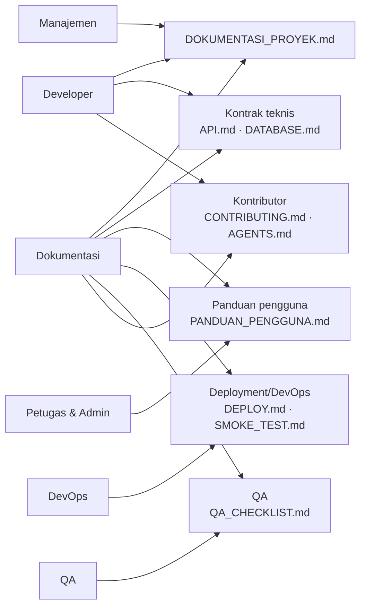

# Dokumentasi JAGAPADI — Pusat Katalog

> **J**ember **A**grikultur **G**apai **P**restasi **D**igital
> Pusat akses seluruh dokumentasi proyek. Gunakan dokumen ini untuk menemukan panduan yang tepat sesuai peran Anda.

**Versi proyek**: v1.0.0 Production Ready — diperbarui: Agustus 2026

---

## Mulai dari Sini

> **Katalog metadata aplikasi:** gunakan
> [`METADATA_BOOK.md`](METADATA_BOOK.md) untuk referensi manusia dan
> [`metadata/catalog.yaml`](metadata/catalog.yaml) untuk AI agent/tooling.
>
> **Kamus konsep & definisi variabel (petugas):** [`Kondef jagapadi.md`](Kondef%20jagapadi.md)
> — lintang/bujur, populasi/intensitas, status laporan, OPT, irigasi, KSA/BPS, dan variabel dashboard.

> **Khusus pengembangan role Petugas:** baca
> [`PETUGAS_BACKEND_AI_GUIDE.md`](PETUGAS_BACKEND_AI_GUIDE.md) dan kontrak
> [`openapi-petugas.yaml`](openapi-petugas.yaml) sebelum mengubah autentikasi,
> ownership, laporan, sinkronisasi mobile, dashboard scoped, atau notifikasi.
> Dokumentasi implementasi penyederhanaan UI
> dan grafik tersedia di
> [`IMPLEMENTASI_PETUGAS_LAPORAN_FEEDBACK_DASHBOARD.md`](IMPLEMENTASI_PETUGAS_LAPORAN_FEEDBACK_DASHBOARD.md).

> **AI agent dan developer backend lintas-runtime:** mulai dari
> [`REFERENSI_TEKNIS_BACKEND_AI.md`](REFERENSI_TEKNIS_BACKEND_AI.md). Dokumen
> tersebut menjelaskan perbedaan runtime root dan `backend/public`, peta kode,
> arsitektur, API, aturan bisnis, testing, deployment, dan troubleshooting.

| Peran Anda | Mulai dari |
|------------|------------|
| **Semua pemangku kepentingan** | [`DOKUMENTASI_PROYEK.md`](DOKUMENTASI_PROYEK.md) — dokumen induk lengkap (pendahuluan, arsitektur, instalasi, API, kontribusi, dll) |
| **Pengguna akhir (Petugas & Admin) non-teknis** | [`PANDUAN_PENGGUNA.md`](PANDUAN_PENGGUNA.md) — cara menggunakan web & aplikasi Android. Kamus konsep: [`Kondef jagapadi.md`](Kondef%20jagapadi.md) |
| **Pengembang Backend** | [`DOKUMENTASI_PROYEK.md`](DOKUMENTASI_PROYEK.md) · [`API.md`](API.md) · [`DATABASE.md`](DATABASE.md) · backend/README.md |
| **Pengembang Mobile (Flutter)** | mobile/README.md · [`BUILD_APK.md`](BUILD_APK.md) · [`API.md`](API.md) |
| **Tim DevOps / Production** | [`DEPLOY.md`](DEPLOY.md) · [`GO_LIVE_CHECKLIST.md`](GO_LIVE_CHECKLIST.md) · [`SMOKE_TEST.md`](SMOKE_TEST.md) |
| **QA / Penguji** | [`QA_CHECKLIST.md`](QA_CHECKLIST.md) · [`SMOKE_TEST.md`](SMOKE_TEST.md) · [`TESTING_GUIDE.md`](../TESTING_GUIDE.md) |
| **Tim Manajemen** | [`DOKUMENTASI_PROYEK.md`](DOKUMENTASI_PROYEK.md) · [`PROJECT_SUMMARY.md`](../PROJECT_SUMMARY.md) |

---

## Peta Dokumen

### 1. Dokumen Induk

| Dokumen | Deskripsi |
|---|---|
| **`DOKUMENTASI_PROYEK.md`** | **Dokumen utama & lengkap** — mencakup pendahuluan, persyaratan sistem, instalasi/konfigurasi, panduan fitur, arsitektur + diagram, struktur direktori, spesifikasi API, kontribusi, troubleshooting, pemeliharaan & rilis, serta langkah pengujian dokumentasi. |
| `BLUEPRINT.md` | Ringkasan arsitektur v1, modul, status laporan, kebijakan Draf. |
| `Kondef jagapadi.md` | Konsep dan definisi setiap variabel sistem, bahasa petugas lapangan. |
| `PROJECT_SUMMARY.md` (root) | Gambaran singkat aplikasi untuk manajemen. |
| `TECH_STACK.md` (root) | Rincian stack teknologi. |

### 2. Panduan Instalasi & Deployment

| Dokumen | Deskripsi |
|---|---|
| `AKSES_WEB_BACKEND.md` | Panduan praktis akses web lokal (Laragon) & production. |
| DEPLOY.md | Deployment production lengkap: Ubuntu + Nginx + PHP-FPM + MySQL + TLS + cron + backup + rollback. |
|`BUILD_APK.md` | Cara build APK debug/release Flutter. |
| `DATA_SEEDING.md` | Panduan seeding data. |
| `DATA_DICTIONARY.md`, `DATABASE_SCHEMA.md` (root) | Kamus data & ringkasan skema. |

### 3. Kontrak Teknis

| Dokumen | Deskripsi |
|---|---|
| `API.md` | Kontrak API lengkap (`/api/v1`, JSON, JWT, `include_draft`, semua endpoint). |
| `IMPLEMENTASI_STORYTELLING_ANALYTICS.md` | Lima metode analisis storytelling, endpoint, keamanan, pengujian, batasan, dan roadmap realtime. |
| `DATABASE.md` | Skema database, tabel, relasi, migrasi, seed. |
| `TUTORIAL_BUILD.md` | Tahapan pembangunan 0–14 & checklist tahap. |

### 4. Pengujian & Quality

| Dokumen | Deskripsi |
|---|---|
| `SMOKE_TEST.md` | Prosedur smoke test post-deploy (curl + browser + mobile). |
| `QA_CHECKLIST.md` | Checklist regresi manual. |
| `GO_LIVE_CHECKLIST.md` | Checklist go-live & sign-off. |
| `TESTING_GUIDE.md` (root) | Panduan testing keseluruhan. |
| `TESTING_REPORT_*.md` (root) | Laporan hasil pengujian. |

### 5. Pengembangan & Standar

| Dokumen | Deskripsi |
|---|---|
| `CONTRIBUTING.md` (root) | Cara berkontribusi, branch, commit, PR. |
| `AGENTS.md` (root) | Aturan wajib AI agent sebelum coding. |
| `AI_WORKFLOW.md` | Alur kerja kolaborasi AI agent. |
| `PR_BODY_SECURITY_HARDENING.md` | Checklist keamanan di PR. |
| `.github/PULL_REQUEST_TEMPLATE.md` | Template PR. |

### 6. Audit, Risiko & Laporan

| Dokumen | Deskripsi |
|---|---|
| `CODEX_TECHNICAL_AUDIT_*.md` dkk | Laporan audit teknis & keamanan. |
| `fitur-laporan-hama.md` | Detail fitur laporan hama. |

---

## Peta Peran → Dokumentasi



---

## Format Dokumentasi

- Semua dokumen **Markdown** (`.md`) — dapat dibaca di GitHub, VS Code, GitLab, dan editor mana pun.
- Diagram menggunakan **Mermaid** (fence \```mermaid) dan **ASCII** agar tetap terbaca tanpa renderer.
- Bahasa: **Bahasa Indonesia** (dokumen teknis & pengguna), sesuai audiens internal Pemkab Jember.
- Nama berkas memakai `UPPER_SNAKE` untuk dokumen induk dan konsisten dengan konvensi yang ada.

---

## Memperbarui Dokumentasi

Lihat bagian [Pengujian Dokumentasi](DOKUMENTASI_PROYEK.md#11-pengujian-dokumentasi) untuk prosedur pengecekan dan pembaruan dokumentasi saat fitur berubah.

---

## Keamanan Dokumentasi

- **Jangan pernah** menulis password/secret asli, token, `.env`, `.pem`, `.key`, atau `google-services.json` ke dokumen.
- Contoh `.env`/password di dokumen hanya **placeholder**.
