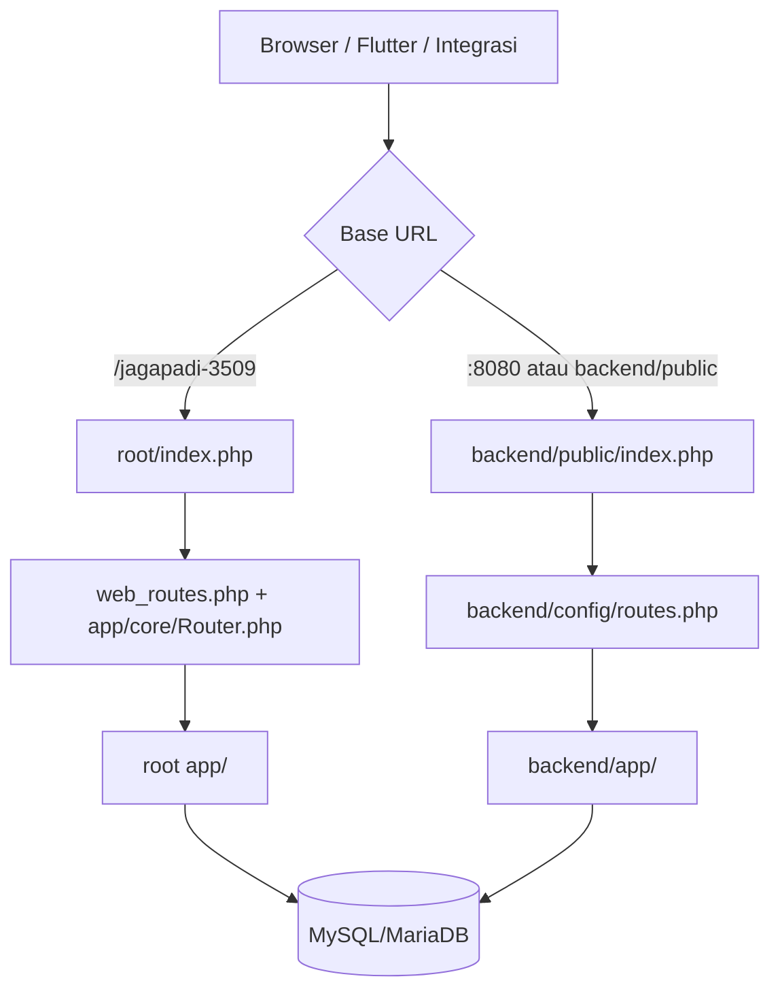
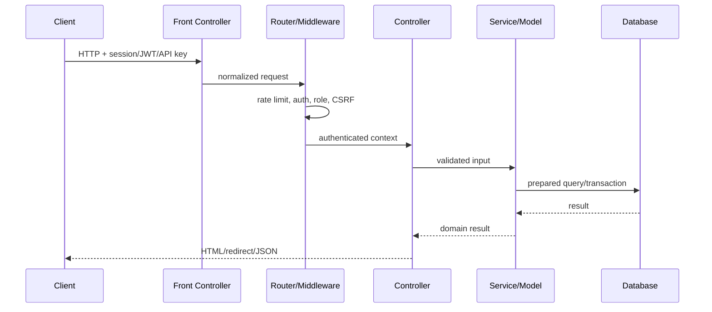
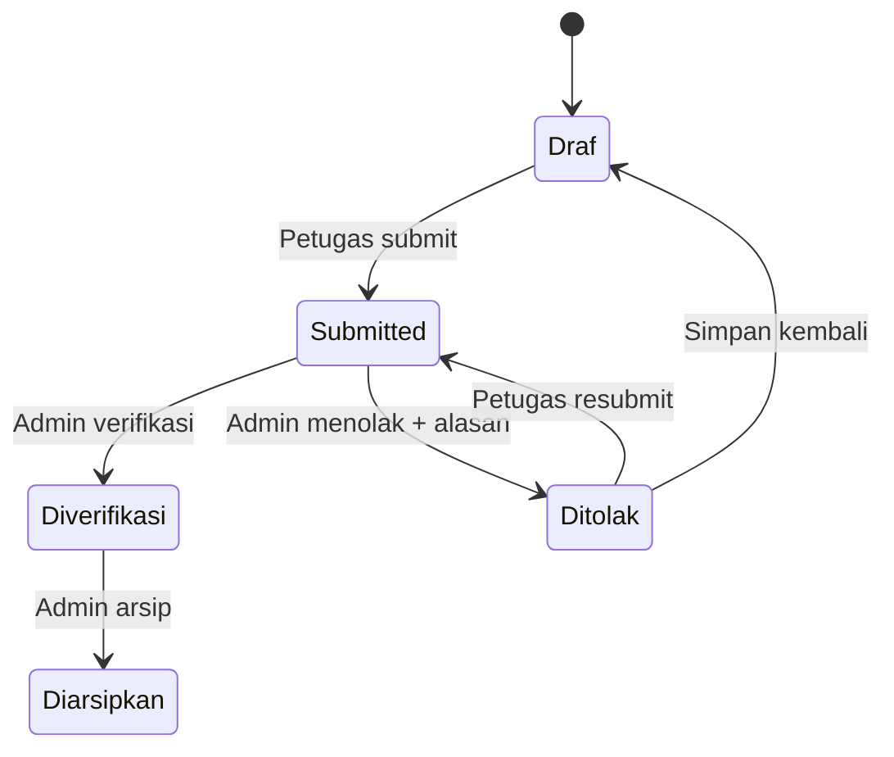
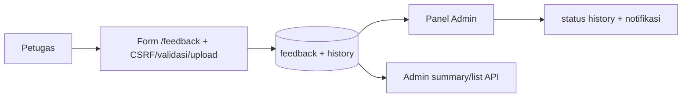
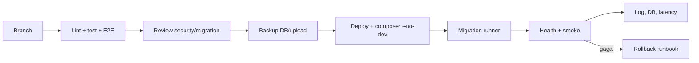

# Referensi Teknis Backend JAGAPADI untuk Developer dan AI Agent

> Terakhir diverifikasi: 20 Agustus 2026  
> Audiens: developer, QA, DevOps, security reviewer, dan AI coding agent

## 0. Cara Menggunakan Referensi Ini

Dokumen ini adalah pintu masuk lintas-runtime. Sumber otoritatif rinci:

| Informasi | Sumber |
|---|---|
| Instruksi agent | [`../AGENTS.md`](../AGENTS.md) |
| Aturan bisnis | [`BLUEPRINT.md`](BLUEPRINT.md) |
| Endpoint dan payload | [`API.md`](API.md) |
| OpenAPI machine-readable | [`openapi.yaml`](openapi.yaml) |
| Skema database | [`DATABASE.md`](DATABASE.md) dan migration aktual |
| Deployment/operasi | [`DEPLOY.md`](DEPLOY.md), [`SMOKE_TEST.md`](SMOKE_TEST.md), [`QA_CHECKLIST.md`](QA_CHECKLIST.md) |

Aturan resolusi konflik:

1. `AGENTS.md` selalu berlaku.
2. Route dan migration yang dijalankan lebih kuat daripada narasi lama.
3. Jika OpenAPI, API.md, dan controller berbeda, verifikasi kode lalu perbarui
   seluruh kontrak dalam perubahan yang sama.
4. Jangan menyimpulkan runtime dari nama kelas; tentukan URL/front controller.
5. Jangan memasukkan secret, token, cookie, password, `.env`, private key, atau
   data pribadi ke source, test, prompt, log, dan dokumentasi.

Checklist awal agent:

```text
[ ] Baca AGENTS.md dan dokumen wajib.
[ ] Periksa git status; pertahankan perubahan pengguna.
[ ] Tentukan runtime target dari base URL.
[ ] Petakan route -> middleware -> controller -> service/model -> view -> DB.
[ ] Audit role, ownership, CSRF/JWT, status, query, dan upload.
[ ] Implementasikan perubahan kecil, lalu lint dan test.
[ ] Sinkronkan API/database/docs jika kontrak berubah.
```

## 1. Pengantar Proyek

JAGAPADI (**Jember Agrikultur Gapai Prestasi Digital**) mendigitalisasi pelaporan
kondisi pertanian Kabupaten Jember. Petugas mengirim observasi lapangan; Admin
memverifikasi; data valid digunakan oleh dashboard, peta, analisis, notifikasi,
dan ekspor.

Tujuan utamanya:

- menyimpan draf di server dan mendukung perbaikan/resubmit;
- menjamin ownership, nomor laporan, status, dan audit trail;
- memisahkan akses Petugas, Admin, Operator, Statistisi, dan Viewer;
- menyediakan web server-rendered dan API untuk Flutter/integrasi;
- mengubah data lapangan menjadi statistik yang dapat dipertanggungjawabkan.

### 1.1 Lingkup fungsional

| Domain | Kemampuan |
|---|---|
| Auth/RBAC | Session web, CSRF, JWT/API key, ganti password, brute-force protection |
| Laporan | Hama, irigasi, lainnya, pupuk, panen, cuaca, alat-sarana |
| Workflow | Draf, submit, verifikasi/tolak, resubmit, arsip, history |
| Master | Kabupaten, kecamatan, desa, OPT, jenis laporan |
| Analitik | Dashboard, grafik, peta, produksi padi, storytelling, evaluasi |
| Eksternal | BPS, hujan, angin, harga komoditas, scraper irigasi |
| Operasi | Notifikasi, FCM/device token, ekspor, health check |
| Feedback | Input Petugas; rekap dan daftar global khusus Admin |

### 1.2 Stack terverifikasi

| Lapisan | Teknologi/versi |
|---|---|
| Backend | PHP native MVC `>=8.2`; lokal terverifikasi 8.2.32; bukan Laravel |
| Database | MySQL 8.0+ / MariaDB 10.6+, InnoDB, `utf8mb4_unicode_ci` |
| DB access | PDO MySQL, prepared statement |
| PHP packages | Composer 2.x, PclZip `^2.8`, PHPUnit `^11` |
| Web | PHP templates, Bootstrap/AdminLTE, jQuery, Chart.js, Leaflet, DataTables |
| Mobile | Flutter Android, JWT, offline storage, FCM opsional |
| JS/test | Vite `^5.4`, Playwright `^1.61.1`, TypeScript `^7.0.2`, Chart.js `^4.4` |
| Server | Laragon Apache lokal; Nginx/Apache cPanel + PHP-FPM production |

Node/npm tidak tersedia pada PATH saat audit; gunakan Node LTS yang kompatibel
dengan lockfile untuk E2E.

### 1.3 Persyaratan non-fungsional

- Keamanan: HttpOnly/SameSite session, CSRF, JWT, RBAC, ownership, escaping,
  upload magic-byte validation.
- Integritas: transaksi, FK/CHECK/unique, status history, nomor atomik.
- Performa: pagination maksimal 100, indeks filter, cache terinvalidasi.
- Observabilitas: activity log, application log, health dan job/scraper status.
- Maintainability: PSR-12, strict types untuk file baru, migration append-only,
  test dan dokumentasi pada setiap perubahan kontrak.

## 2. Dua Runtime Backend Aktif

| Runtime | URL umum | Front controller | Kode/router | Auth utama |
|---|---|---|---|---|
| Root/integrated | `http://localhost/jagapadi-3509/*` | `index.php` | `app/`, `config/web_routes.php`, `app/core/Router.php` | Session+CSRF; internal API session; external/mobile API key/token |
| Backend v1 | `http://localhost:8080/*` atau docroot `backend/public` | `backend/public/index.php` | `backend/app/`, `backend/config/routes.php` | Session+CSRF web; JWT `/api/v1` |



Konsekuensi penting:

- `/feedback`, `/laporan`, `/irigasi`, scraper, storytelling root berada di
  `app/`, bukan otomatis di `backend/app/`.
- API mobile canonical `/api/v1` terutama berada di `backend/`.
- Nama kelas yang sama dapat memiliki implementasi berbeda.
- Migration tersebar; jangan menjalankan SQL/PHP migration acak. Periksa runner
  dan `schema_migrations` runtime target.
- Konsolidasi ke satu runtime direkomendasikan melalui ADR dan compatibility
  test, bukan big-bang rewrite.

## 3. Struktur Proyek

```text
jagapadi-3509/
├── AGENTS.md                    # Aturan wajib agent
├── index.php                    # Front controller root
├── app/
│   ├── controllers/Api/         # Controller web/internal API root
│   ├── models/                  # Query/model root
│   ├── services/                # Agregasi, scraper, storytelling
│   ├── middleware/              # Auth API key/token root
│   ├── helpers/, traits/        # Security, validator, audit
│   ├── core/                    # Router, Controller, Database, Model
│   └── views/                   # Template PHP root
├── config/web_routes.php        # Route web eksplisit root
├── public/                      # Aset dan upload root
├── database/migrations/         # Migration lanjutan root
├── migrations/                  # Migration historis; audit sebelum pakai
├── tests/                       # PHPUnit root
├── e2e/                         # Playwright web/mobile/security
├── scripts/                     # Worker, scraper, maintenance, backup example
├── backend/
│   ├── public/index.php         # Front controller backend v1
│   ├── app/{Controllers,Core,Helpers,Middleware,Models,Services,Views}/
│   ├── config/routes.php
│   ├── database/{migrations,seeds,schema.sql}/
│   ├── scripts/{migrate,seed,lint}.php
│   ├── tests/
│   └── composer.json
├── mobile/                      # Flutter Android
└── docs/                        # Kontrak dan runbook
```

### 3.1 Peta lokasi perubahan

| Kebutuhan | Lokasi pertama |
|---|---|
| Route web root | `config/web_routes.php`, fallback di `index.php` |
| Internal/external API root | `app/core/Router.php` |
| API v1 | `backend/config/routes.php` |
| Hama root | `LaporanController`, `LaporanHama`, `views/laporan/` |
| Irigasi root | `IrigasiController`, `LaporanIrigasi`, `views/irigasi/` |
| Laporan lainnya | `LaporanLainnyaController/Model/View`, `JenisLaporan` |
| Feedback | `FeedbackController`, `Feedback`, `views/feedback/` |
| Dashboard | controller dashboard, aggregator/service/model, JS dashboard |
| Storytelling | controller/model dan `DataStoryService` |
| Scraper | controller, `app/services/*Scraper.php`, `scripts/*worker.php` |
| Auth v1 | backend Auth controllers, middleware, `Core/Jwt.php`, `User` |
| Skema | migration terbaru; jangan hanya melihat `schema.sql` |

## 4. Setup Lingkungan Pengembangan

### 4.1 Prasyarat

PHP 8.2 dengan `pdo_mysql`, `mbstring`, `fileinfo`, `json`, `curl`, `gd`,
`zip`, `openssl`; MySQL 8/MariaDB 10.6; Composer 2; Node LTS/npm; Laragon
atau Nginx/Apache.

### 4.2 Runtime root (Laragon)

```powershell
cd C:\laragon\www\jagapadi-3509
Copy-Item .env.example .env.local
# Isi nilai lokal; jangan commit .env/.env.local.
npm ci
# buka http://localhost/jagapadi-3509/
```

Root memuat `.env`, lalu `.env.local` sebagai override. Konfigurasi penting:
DB, APP_ENV, base URL, session, CORS, API key/hash, SMTP, dan integrasi eksternal.

### 4.3 Backend v1

```powershell
cd C:\laragon\www\jagapadi-3509\backend
composer install
Copy-Item .env.example .env
php scripts/migrate.php
php scripts/seed.php   # hanya local/development
php -S localhost:8080 -t public
```

Production tidak boleh memakai seed default. `JWT_SECRET` harus acak dan berada
di environment/secret manager.

### 4.4 Database dan quality gate

```sql
CREATE DATABASE jagapadi_local CHARACTER SET utf8mb4 COLLATE utf8mb4_unicode_ci;
```

```powershell
# backend v1
cd backend
composer test
composer lint

# root tests
cd ..
php backend/vendor/phpunit/phpunit/phpunit --configuration phpunit.xml

# E2E
npx playwright test --config=e2e/playwright.config.js
```

Migration aman: backup, periksa `schema_migrations`, jalankan runner yang tepat,
verifikasi DDL/indeks, integration test, lalu smoke test.

### 4.5 Troubleshooting setup

| Gejala | Penyebab | Solusi |
|---|---|---|
| `php` tidak dikenal | PHP belum di PATH | Gunakan PHP Laragon; jangan hard-code path ke source |
| Semua route 404 | rewrite/docroot salah | Root: folder repo; v1: `backend/public` |
| Controller salah | Runtime target keliru | Cocokkan base URL dengan tabel runtime |
| DB gagal | env/service/port salah | Cek MySQL, env override, PDO |
| 403 mutasi | CSRF hilang/expired | Kirim field/header CSRF dan method benar |
| 401 API v1 | JWT hilang/expired | Login ulang, cek Bearer/blacklist |
| Migration duplikat | Runner berbeda dijalankan | Audit `schema_migrations`; jangan edit migration lama |
| Upload gagal | extension/size/permission/MIME | Cek `fileinfo`, PHP ini, directory writable |
| E2E gagal start | Node/browser belum ada | `npm ci`, `npx playwright install` |

## 5. Arsitektur dan Alur Data



### 5.1 ERD ringkas

```mermaid
erDiagram
    users ||--o{ laporan_hama : membuat
    users ||--o{ laporan_irigasi : membuat
    users ||--o{ laporan_lainnya : membuat
    users ||--o{ feedback : mengirim
    users ||--o{ notifications : menerima
    users ||--o{ device_tokens : memiliki
    users ||--o{ activity_log : melakukan
    master_kabupaten ||--o{ master_kecamatan : memiliki
    master_kecamatan ||--o{ master_desa : memiliki
    master_opt ||--o{ laporan_hama : klasifikasi
    master_desa ||--o{ laporan_hama : lokasi
    master_desa ||--o{ laporan_irigasi : lokasi
    jenis_laporan ||--o{ laporan_lainnya : tipe
    laporan_hama ||--o{ laporan_status_history : riwayat
    feedback ||--o{ feedback_status_history : riwayat
    feedback ||--o{ feedback_votes : vote
```



### 5.2 Workflow laporan



### 5.3 Workflow feedback



## 6. Dokumentasi API

### 6.1 Konvensi

| Item | Kontrak |
|---|---|
| API v1 | `/api/v1`, JSON, JWT Bearer |
| Internal API root | `/api/*`, session; mutasi session memakai CSRF |
| External API | API key/Bearer sesuai middleware route |
| Pagination | `page`, `per_page`/`limit`, maksimum umum 100 |
| Agregat | `include_draft=false` default kecuali terdokumentasi lain |
| Tanggal | `YYYY-MM-DD` / ISO-8601 |
| Upload | `multipart/form-data` |

Kode status: `200`, `201`, `204`, `400`, `401`, `403`, `404`, `409`, `422`,
`429`, `500`. Error otorisasi tidak boleh dikembalikan sebagai 200.

```http
Authorization: Bearer <access-token>
Content-Type: application/json
```

Web/internal mutation:

```http
Cookie: <session-cookie>
X-CSRF-TOKEN: <csrf-token>
```

### 6.2 Inventaris endpoint lengkap

Parameter, response, status, contoh, dan autentikasi setiap endpoint berada di
[`API.md`](API.md) dan [`openapi.yaml`](openapi.yaml). Kebenaran registrasi route
berada di `backend/config/routes.php`, `app/core/Router.php`, dan
`config/web_routes.php`.

| Kelompok | Prefix | Auth/role | Operasi |
|---|---|---|---|
| Health | `/api/v1/health`, `/admin/health` | public/admin | Health app/DB |
| Auth | `/api/v1/auth/*`, `/login`, `/logout` | public lalu JWT/session | Login, refresh, logout, password |
| Hama | `/api/v1/laporan-hama`, `/api/laporan-hama`, `/laporan` | auth+ownership | CRUD, submit, verify, archive |
| Irigasi | `/api/v1/laporan-irigasi`, `/api/irigasi`, `/irigasi` | auth+ownership | CRUD, monitoring, rules |
| Lainnya | `/api/v1/laporan-lainnya`, `/laporan-lainnya` | auth+ownership/admin | CRUD, submit, verify/reject/archive/export |
| Wilayah | `/api/v1/wilayah`, `/api/wilayah` | read terbatas; write admin | hierarchy/search/stats |
| OPT | `/api/v1/opt`, `/api/opt` | read auth; write admin | CRUD/search/status/foto |
| Dashboard | `/api/v1/dashboard`, `/api/dashboard` | auth, role-scoped | KPI/chart/map/alert/activity |
| Export | `/api/v1/export`, `/export/*` | auth, role-scoped | CSV/XLSX/PDF |
| Notifikasi | `/api/v1/notifications` | JWT ownership | list/unread/read |
| Device | `/api/v1/device-tokens` | JWT ownership | register/delete FCM token |
| Feedback | `/api/feedback`, `/api/feedback/summary` | session Admin | global list/summary |
| Storytelling | `/api/storytelling/*` | Admin/statistisi | generate/save/publish/chart/stats |
| Scraper/data | route root terkait scraper | role/API key | BPS/cuaca/angin/harga/queue |
| External | `/api/external/*` | API key/Bearer+limit | report/mitra/honor/validation |

Contoh login:

```http
POST /api/v1/auth/login
Content-Type: application/json

{"username":"petugas01","password":"<password>"}
```

```json
{
  "data": {
    "access_token": "<jwt>",
    "token_type": "Bearer",
    "expires_in": 3600,
    "user": {"id": 2, "username": "petugas01", "role": "petugas"}
  }
}
```

Contoh error:

```json
{"error":{"code":"Forbidden","message":"Akses ditolak."}}
```

### 6.3 Rate limit

Kontrak global: 60 request/menit authenticated, 20 request/menit guest, dan
brute-force login 5 kegagalan per IP/15 menit. Endpoint root dapat memiliki
limiter khusus/key operasi. Verifikasi middleware rate limit, konfigurasi env,
`Security::checkBruteForce`, header `X-RateLimit-*`, dan response 429. Setiap
endpoint baru wajib mendokumentasikan limit efektif di API.md dan OpenAPI.

## 7. Model Bisnis dan Aturan Logika

### 7.1 Role

| Role | Hak inti |
|---|---|
| Admin | Data global, master, verifikasi/tolak/arsip, rekap, user management |
| Petugas | Membuat/mengelola laporan sendiri; tidak melihat data orang lain |
| Operator | Operasional terbatas; tidak otomatis setara Admin |
| Statistisi | Dashboard/statistik/storytelling/ekspor sesuai policy |
| Viewer | Read-only pada route yang diberi izin |

Ownership harus diterapkan di query dan dicek ulang pada controller/policy.
`user_id` dari request tidak pernah menjadi sumber ownership.

### 7.2 Aturan laporan

1. Draf disimpan di server saat online.
2. Draf dianalisis hanya jika field minimum tersedia.
3. Statistik default mengecualikan Draf.
4. Agregat relevan mendukung `include_draft`.
5. Nomor dibuat hanya ketika Submitted.
6. Draf tidak dapat diverifikasi.
7. Hanya Admin memverifikasi Submitted.
8. Petugas hanya mengubah/menghapus miliknya sesuai status.
9. Penolakan memiliki alasan; Petugas memperbaiki/resubmit.
10. Status tidak boleh dinaikkan dari nilai mentah client.

Validasi server authoritative. ID wilayah harus konsisten; koordinat latitude
`-90..90`, longitude `-180..180`; enum/status/filter memakai whitelist. Upload
memvalidasi error, ukuran, magic bytes, MIME, ekstensi dari MIME, nama random,
dan directory aman. Escape HTML dilakukan saat render, bukan saat penyimpanan.

“Real-time” berarti terlihat pada request/poll berikutnya. Jika cache digunakan,
semua mutasi wajib menginvalidasi key terkait. FCM best-effort; notifikasi DB
adalah sumber kebenaran. Analisis/storytelling bukan bukti kausalitas.

## 8. Panduan Pengembangan Fitur

Urutan yang diwajibkan:

1. Tetapkan runtime dan kontrak route.
2. Definisikan aturan bisnis serta matriks role/ownership.
3. Buat migration append-only bila skema berubah.
4. Implementasikan model prepared statement.
5. Implementasikan service/transaksi/validator.
6. Implementasikan controller tipis dan middleware.
7. Buat view/API response dengan escaping.
8. Tambahkan unit, integration, negative-security, E2E.
9. Lint, test, smoke test.
10. Perbarui OpenAPI/API/database/QA/changelog.

Konvensi:

- PHP PSR-12, 4 spasi, strict types dan type hint pada file baru.
- JSON/YAML/Markdown 2 spasi, UTF-8, LF.
- DB `snake_case`, PK `id`, transaksi untuk mutasi majemuk.
- HTML memakai `htmlspecialchars(..., ENT_QUOTES, 'UTF-8')`.
- Conventional Commits dan branch `feat/`, `fix/`, `chore/`.
- Tidak ada refactor luar scope atau secret commit.

Migration:

- jangan edit migration yang sudah dijalankan;
- sertakan FK, indeks, charset, backfill dan rollback plan;
- uji `EXPLAIN` untuk daftar/agregat besar;
- update DATABASE.md/schema setelah migration final.

Testing:

| Jenis | Target |
|---|---|
| Unit | Validator, status/filter normalization, helper nomor, payload mapping |
| Integration DB | Query, ownership, transaksi, FK, agregat, pagination |
| Security negatif | IDOR, role bypass, CSRF, SQLi, XSS, upload spoofing |
| E2E | Login, create/edit/submit/verify, filter, mobile, regression |
| Smoke | Health, login, halaman dan endpoint kritis setelah deploy |

Test DB memakai transaction rollback atau fixture ber-marker dengan cleanup
tervalidasi. Definition of Done: scope/role benar, lint/test lulus, migration dan
docs sinkron, ownership/CSRF/JWT diuji negatif, query diperiksa, risiko dicatat.

## 9. Deployment, Backup, dan Monitoring



Gunakan `DEPLOY.md`. Document root v1 adalah `backend/public`. Jangan mengekspos
`.env`, `app`, `database`, `storage`, log, atau script maintenance.

| Data | Frekuensi minimum | Retensi | Verifikasi |
|---|---|---|---|
| Database | Harian | 30 hari | Restore test berkala |
| Upload | Mingguan/inkremental | 90 hari | Checksum/sample restore |
| Secret/env | Saat berubah | Policy organisasi | Secret manager, bukan Git |
| Audit log | Policy instansi | Compliance | Pastikan tanpa secret |

Pantau health/DB, HTTP 5xx/4xx/429, latency p95/p99, slow query/deadlock,
connection count, PHP-FPM/OPcache/memory, disk log/cache/tmp/upload/backup,
scraper last-success/backlog, FCM failure, login failure, CSRF violation, dan
anomali authorization.

## 10. Pemeliharaan dan Troubleshooting

Runbook insiden:

1. Catat runtime, URL, waktu, role, dan correlation/request ID.
2. Reproduksi read-only; jangan langsung mengubah data.
3. Periksa log app/web/PHP dan health DB.
4. Bandingkan route, middleware, controller, query, migration aktif.
5. Isolasi kode/env/DB/cache/permission/layanan eksternal.
6. Terapkan fix terkecil, regresi test, deploy, monitor.
7. Dokumentasikan root cause dan pencegahan.

| Masalah | Penyebab | Solusi |
|---|---|---|
| Data lintas Petugas | Ownership tidak di query | Scope auth user + IDOR test |
| Rekap stale | Cache tidak invalid | Invalidate semua mutasi |
| Nomor duplikat | Tanpa lock/transaksi | Counter/DB lock + unique constraint |
| Draf di statistik | Filter status salah | Exclude default + test include_draft |
| 403 form | CSRF/session expired | Refresh form/token; jangan matikan CSRF |
| 500 sesudah migration | Schema/runtime salah | Cek runtime, migration table, kolom |
| Mojibake | Encoding salah | UTF-8/header charset; hindari bulk rewrite |
| Scraper nol | Source/network/parser berubah | Pertahankan last-good dan tandai stale |
| PHP dapat dieksekusi di upload | Web hardening salah | Blok PHP + magic bytes validation |
| E2E flaky | Shared state/wait buruk | Fixture terisolasi dan locator semantik |

## 11. Risiko Teknis dan Roadmap

| Risiko | Dampak | Rekomendasi |
|---|---|---|
| Dua runtime | Duplikasi dan contract drift | ADR, route inventory, migrasi kompatibel bertahap |
| Migration tiga lokasi | Schema drift | Runner tunggal dan baseline terverifikasi |
| API docs tertinggal | Client/agent salah | OpenAPI validation + contract test CI |
| Role tidak seragam | Bypass/403 salah | Policy matrix terpusat + negative tests |
| Integrasi sinkron | Request lambat/gagal | Queue retry/idempotency |
| Cache file lokal | Multi-instance stale | Shared cache atau invalidation disiplin |

Prioritas: ADR konsolidasi runtime; inventaris route/OpenAPI otomatis; baseline
DB; authorization policy terpusat; structured logging/correlation ID; queue
idempotent untuk pekerjaan eksternal.

## 12. Verifikasi Dokumentasi

| Pemeriksaan | Metode |
|---|---|
| Link/path ada | Markdown link checker/path audit |
| Route sinkron | Bandingkan OpenAPI/API.md dengan kedua router |
| Schema sinkron | DATABASE.md vs migration dan DB integration test |
| Mermaid valid | Render GitHub/VS Code |
| Tanpa secret | Secret scanner dan review |
| JSON valid | Parse fenced JSON di CI |
| Perintah valid | Jalankan pada environment bersih/staging |
| Role benar | Integration + Playwright negative-security |

Dokumentasi dianggap memadai ketika agent baru dapat menentukan runtime URL,
lokasi kode, policy akses, workflow status, kebutuhan migration/test, dan proses
rilis/rollback tanpa penjelasan tambahan.
