# DOKUMENTASI LENGKAP ENTITY RELATIONSHIP DIAGRAM (ERD)
## SISTEM INFORMASI PERTANIAN KABUPATEN JEMBER — JAGAPADI
**Versi Dokumen:** 3.0.0 | **Tanggal Rilis:** September 2026 | **Target Database:** MariaDB 10.6+ / MySQL 8.0+ (InnoDB, UTF-8 mb4)

---

## DAFTAR ISI
1. [Ringkasan Eksekutif & Arsitektur Database](#1-ringkasan-eksekutif--arsitektur-database)
2. [Identifikasi Entitas Berdasarkan 8 Domain Utama](#2-identifikasi-entitas-berdasarkan-8-domain-utama)
3. [Kamus Data Lengkap & Spesifikasi Atribut Entitas](#3-kamus-data-lengkap--spesifikasi-atribut-entitas)
   - [3.1 Klaster Pengguna, Keamanan & Audit (Users & Security)](#31-klaster-pengguna-keamanan--audit)
   - [3.2 Klaster Wilayah & Lahan Pertanian (Spatial & Land)](#32-klaster-wilayah--lahan-pertanian)
   - [3.3 Klaster Tanaman, Hama & OPT (Crops & Pest Management)](#33-klaster-tanaman-hama--opt)
   - [3.4 Klaster Panen & Produksi Pertanian (Harvest & Production)](#34-klaster-panen--produksi-pertanian)
   - [3.5 Klaster Keuangan & Pasar Komoditas (Agricultural Economics)](#35-klaster-keuangan--pasar-komoditas)
   - [3.6 Klaster Inventaris, Alsintan & IoT Irigasi (Farm Assets & IoT)](#36-klaster-inventaris-alsintan--iot-irigasi)
   - [3.7 Klaster Notifikasi & Komunikasi (Notifications & Feedback)](#37-klaster-notifikasi--komunikasi)
   - [3.8 Klaster Pelaporan Lapangan Terpadu (Field Reporting)](#38-klaster-pelaporan-lapangan-terpadu)
4. [Matriks Hubungan & Kardinalitas Antar-Entitas](#4-matriks-hubungan--kardinalitas-antar-entitas)
5. [Diagram ERD Standar (Notasi Mermaid)](#5-diagram-erd-standar-notasi-mermaid)
6. [Aturan Integritas Data & Logika Bisnis](#6-aturan-integritas-data--logika-bisnis)
   - [6.1 Siklus Hidup & Status Laporan (Report Lifecycle)](#61-siklus-hidup--status-laporan)
   - [6.2 Penomoran Laporan Atomik](#62-penomoran-laporan-atomik)
   - [6.3 Keamanan Akses & Kepemilikan (Ownership & RBAC)](#63-keamanan-akses--kepemilikan)
   - [6.4 Pola Penghapusan Data (Soft Delete & Recycle Bin)](#64-pola-penghapusan-data)
7. [Catatan Pemeliharaan & Pengembangan Masa Depan](#7-catatan-pemeliharaan--pengembangan-masa-depan)

---

## 1. Ringkasan Eksekutif & Arsitektur Database

**JAGAPADI** (*Jember Agrikultur Gapai Prestasi Digital*) adalah platform sistem informasi geospasial dan monitoring pelaporan pertanian terpadu Kabupaten Jember yang melayani Badan Pusat Statistik (BPS), Dinas Pertanian, penyuluh lapangan, petugas pengamat hama, dan pemangku kepentingan daerah.

Arsitektur basis data JAGAPADI dirancang menggunakan prinsip relational database modern berbasis **MySQL 8.0+ / MariaDB 10.6+** dengan karakteristik teknis:
- **Engine:** `InnoDB` untuk seluruh tabel guna menjamin kepatuhan *ACID (Atomicity, Consistency, Isolation, Durability)*, transaksi atomik, dan integritas referensial foreign key.
- **Karakter Set & Kolasi:** `utf8mb4` dengan collation `utf8mb4_unicode_ci` untuk mendukung penyimpanan teks internasional, karakter multibyte, simbol emoji, dan integritas data teks tanpa data corruption.
- **Normalisasi:** Memenuhi kriteria **3NF (Third Normal Form)** hingga **BCNF (Boyce-Codd Normal Form)** untuk meminimalkan anomali redundansi, dengan denormalisasi terkendali (*controlled caching / aggregate columns*) untuk optimasi performa analitik dashboard (misal: `feedback.vote_count`, snapshot evaluasi).
- **Skalabilitas Spasial & Temporal:** Indeks spasial `(latitude, longitude)`, composite index pada rentang waktu `(tanggal, status)`, serta pembagian tabel audit/log tersendiri untuk mencegah degradasi performa pada tabel transaksional inti.

---

## 2. Identifikasi Entitas Berdasarkan 8 Domain Utama

Sesuai dengan kebutuhan bisnis dan fungsionalitas sistem informasi JAGAPADI, terdapat **38 entitas database** yang terbagi dalam **8 domain utama**:

```
┌─────────────────────────────────────────────────────────────────────────────────────────────┐
│                                   SISTEM BASIS DATA JAGAPADI                                │
├──────────────────────────────┬──────────────────────────────┬───────────────────────────────┤
│ 1. PENGGUNA & KEAMANAN       │ 2. LAHAN & WILAYAH           │ 3. TANAMAN & OPT              │
│  - users                     │  - master_kabupaten          │  - master_opt                 │
│  - device_tokens             │  - master_kecamatan          │  - usulan_opt                 │
│  - jwt_blacklist             │  - master_desa               │  - usulan_opt_photos          │
│  - idempotency_keys          │  - audit_log_wilayah         │  - usulan_opt_status_history  │
│  - activity_log              │                              │  - tags                       │
│                              │                              │  - laporan_hama_tags          │
├──────────────────────────────┼──────────────────────────────┼───────────────────────────────┤
│ 4. PANEN & PRODUKSI          │ 5. KEUANGAN & PASAR          │ 6. INVENTARIS, ALSINTAN & IOT │
│  - laporan_panen             │  - harga_komoditas           │  - laporan_alat_sarana        │
│  - produksi_gabah            │  - harga_alerts              │  - laporan_pupuk              │
│  - data_pertanian_bps        │  - harga_komoditas_logs      │  - sensor_pengairan           │
│  - data_ksa_bulanan          │  - harga_beras_siskaperbapo  │  - pembacaan_sensor           │
│  - evaluasi_akurasi_panen    │  - gabah_beras_logs          │  - irrigation_rules           │
│  - evaluasi_akurasi_logs     │                              │  - irrigation_rule_logs       │
│  - analisis_produksi_bulanan │                              │  - pengairan_otomatis         │
│                              │                              │  - data_irigasi               │
├──────────────────────────────┼──────────────────────────────┴───────────────────────────────┤
│ 7. NOTIFIKASI & KOMUNIKASI   │ 8. PELAPORAN LAPANGAN TERPADU                                │
│  - notifications             │  - laporan_hama                                              │
│  - feedback                  │  - laporan_irigasi                                           │
│  - feedback_votes            │  - laporan_cuaca & curah_hujan & cuaca_angin_jember          │
│  - feedback_status_history   │  - laporan_lainnya & master_jenis_laporan                    │
│                              │  - laporan_status_history & nomor_laporan_counter            │
└──────────────────────────────┴──────────────────────────────────────────────────────────────┘
```

---

## 3. Kamus Data Lengkap & Spesifikasi Atribut Entitas

### 3.1 Klaster Pengguna, Keamanan & Audit

#### 1. `users`
Entitas inti pengidentifikasi aktor sistem (Admin, Petugas Lapangan, Operator, Statistisi, Viewer).
- `id`: `INT UNSIGNED`, **Primary Key**, Auto Increment.
- `username`: `VARCHAR(50)`, **UNIQUE**, NOT NULL. Nama pengguna unik untuk login.
- `password`: `VARCHAR(255)`, NOT NULL. Hash kata sandi menggunakan Bcrypt (cost 12).
- `email`: `VARCHAR(150)`, **UNIQUE**, NOT NULL. Alamat surat elektronik terverifikasi.
- `nama_lengkap`: `VARCHAR(150)`, NOT NULL. Nama asli pemegang akun.
- `role`: `ENUM('admin','petugas','operator','statistisi','viewer')`, NOT NULL, DEFAULT `'petugas'`. Hak akses peran (RBAC).
- `aktif`: `TINYINT(1)`, NOT NULL, DEFAULT `1`. Status akun (`1` = aktif, `0` = dinonaktifkan).
- `must_change_password`: `TINYINT(1)`, NOT NULL, DEFAULT `0`. Flag kewajiban memperbarui password saat login perdana.
- `last_password_change_at`: `TIMESTAMP`, NULL. Waktu terakhir kali password diganti.
- `token_version`: `INT UNSIGNED`, NOT NULL, DEFAULT `1`. Versi token untuk *mass invalidation* JWT saat logout semua sesi.
- `ksa`: `VARCHAR(20)`, NULL. Kode Kerangka Sampel Area BPS terkait petugas.
- `created_at`: `TIMESTAMP`, NOT NULL, DEFAULT CURRENT_TIMESTAMP.
- `updated_at`: `TIMESTAMP`, NOT NULL, DEFAULT CURRENT_TIMESTAMP ON UPDATE CURRENT_TIMESTAMP.
- *Indexes:* `uk_username` (UNIQUE), `uk_email` (UNIQUE), `idx_role`, `idx_aktif`.

#### 2. `device_tokens`
Menyimpan token Firebase Cloud Messaging (FCM) untuk push notification perangkat mobile Android/iOS.
- `id`: `BIGINT UNSIGNED`, **Primary Key**, Auto Increment.
- `user_id`: `INT UNSIGNED`, **Foreign Key** → `users(id)` ON DELETE CASCADE.
- `token`: `VARCHAR(512)`, **UNIQUE**, NOT NULL. Token registrasi FCM.
- `platform`: `ENUM('android','ios','web')`, NOT NULL, DEFAULT `'android'`.
- `user_agent`: `VARCHAR(500)`, NULL. Spesifikasi browser/aplikasi perangkat.
- `last_seen_at`: `TIMESTAMP`, NULL. Terakhir kali token aktif merespons.
- `created_at`: `TIMESTAMP`, DEFAULT CURRENT_TIMESTAMP.
- `updated_at`: `TIMESTAMP`, DEFAULT CURRENT_TIMESTAMP ON UPDATE CURRENT_TIMESTAMP.
- *Indexes:* `uq_device_token` (UNIQUE), `idx_device_tokens_user` (`user_id`).

#### 3. `jwt_blacklist`
Daftar token JWT yang telah dibatalkan (*revoked/logged out*) sebelum masa kadaluwarsanya berakhir.
- `id`: `BIGINT UNSIGNED`, **Primary Key**, Auto Increment.
- `token_hash`: `CHAR(64)`, **UNIQUE**, NOT NULL. Hash SHA-256 dari token JWT.
- `user_id`: `INT UNSIGNED`, **Foreign Key** → `users(id)` ON DELETE CASCADE.
- `expires_at`: `TIMESTAMP`, NOT NULL. Batas kadaluwarsa token asli untuk pembersihan berkala (*garbage collection*).
- `created_at`: `TIMESTAMP`, DEFAULT CURRENT_TIMESTAMP.
- *Indexes:* `uk_jwt_token_hash` (UNIQUE), `idx_jwt_expires` (`expires_at`).

#### 4. `idempotency_keys`
Mencegah mutasi data ganda (*duplicate submission*) akibat koneksi jaringan yang tidak stabil di lapangan.
- `key`: `VARCHAR(64)`, **Primary Key**. String acak UUIDv4 yang dikirimkan header HTTP `Idempotency-Key`.
- `user_id`: `INT UNSIGNED`, **Foreign Key** → `users(id)` ON DELETE CASCADE.
- `route`: `VARCHAR(255)`, NOT NULL. Target endpoint API.
- `request_hash`: `CHAR(64)`, NOT NULL. Hash parameter/body request.
- `response_code`: `INT`, NOT NULL. Status HTTP yang dikembalikan sebelumnya.
- `response_body`: `LONGTEXT`, NOT NULL. Salinan respon JSON yang telah diproses.
- `expires_at`: `TIMESTAMP`, NOT NULL. Waktu kedaluwarsa kunci idempotensi (default 24 jam).
- `created_at`: `TIMESTAMP`, DEFAULT CURRENT_TIMESTAMP.

#### 5. `activity_log`
Catatan audit trail seluruh aktivitas penting aplikasi (*system-wide auditable actions*).
- `id`: `BIGINT UNSIGNED`, **Primary Key**, Auto Increment.
- `user_id`: `INT UNSIGNED`, **Foreign Key** → `users(id)` ON DELETE SET NULL.
- `action`: `VARCHAR(100)`, NOT NULL. Kode tindakan (misal: `create_report`, `verify_hama`, `login`).
- `table_name`: `VARCHAR(50)`, NULL. Entitas tabel yang terdampak.
- `record_id`: `BIGINT UNSIGNED`, NULL. ID baris yang terdampak.
- `description`: `TEXT`, NULL. Narasi detail aktivitas.
- `ip_address`: `VARCHAR(45)`, NULL. Alamat IP v4/v6 klien.
- `user_agent`: `VARCHAR(500)`, NULL. User Agent klien perambah.
- `created_at`: `TIMESTAMP`, DEFAULT CURRENT_TIMESTAMP.
- *Indexes:* `idx_user`, `idx_action`, `idx_created`.

---

### 3.2 Klaster Wilayah & Lahan Pertanian

#### 6. `master_kabupaten`
Master data wilayah administratif tingkat II (Kabupaten Jember dan pembanding sekitarnya).
- `id`: `INT UNSIGNED`, **Primary Key**, Auto Increment.
- `kode`: `VARCHAR(10)`, **UNIQUE**, NOT NULL. Kode referensi wilayah standar BPS (contoh: `'3509'`).
- `nama_kabupaten`: `VARCHAR(100)`, NOT NULL. Nama resmi kabupaten.
- `created_at`: `TIMESTAMP`, DEFAULT CURRENT_TIMESTAMP.
- `updated_at`: `TIMESTAMP`, DEFAULT CURRENT_TIMESTAMP ON UPDATE CURRENT_TIMESTAMP.
- *Indexes:* `uk_kode` (UNIQUE), `idx_nama` (`nama_kabupaten`).

#### 7. `master_kecamatan`
Master data kecamatan di wilayah Kabupaten Jember (31 kecamatan).
- `id`: `INT UNSIGNED`, **Primary Key**, Auto Increment.
- `kabupaten_id`: `INT UNSIGNED`, **Foreign Key** → `master_kabupaten(id)` ON UPDATE CASCADE ON DELETE RESTRICT.
- `kode`: `VARCHAR(10)`, **UNIQUE**, NOT NULL. Kode kecamatan resmi BPS (contoh: `'3509010'`).
- `nama_kecamatan`: `VARCHAR(100)`, NOT NULL.
- `latitude`: `DECIMAL(10,7)`, NULL. Titik koordinat pusat kecamatan.
- `longitude`: `DECIMAL(10,7)`, NULL. Titik bujur pusat kecamatan.
- `created_at`: `TIMESTAMP`, DEFAULT CURRENT_TIMESTAMP.
- `updated_at`: `TIMESTAMP`, DEFAULT CURRENT_TIMESTAMP ON UPDATE CURRENT_TIMESTAMP.
- *Indexes:* `uk_kode` (UNIQUE), `idx_kabupaten` (`kabupaten_id`), `idx_nama` (`nama_kecamatan`).

#### 8. `master_desa`
Master data desa/kelurahan di wilayah Kabupaten Jember (248 desa/kelurahan).
- `id`: `INT UNSIGNED`, **Primary Key**, Auto Increment.
- `kecamatan_id`: `INT UNSIGNED`, **Foreign Key** → `master_kecamatan(id)` ON UPDATE CASCADE ON DELETE RESTRICT.
- `kode`: `VARCHAR(10)`, **UNIQUE**, NOT NULL. Kode desa/kelurahan BPS (contoh: `'3509010001'`).
- `nama_desa`: `VARCHAR(100)`, NOT NULL.
- `created_at`: `TIMESTAMP`, DEFAULT CURRENT_TIMESTAMP.
- `updated_at`: `TIMESTAMP`, DEFAULT CURRENT_TIMESTAMP ON UPDATE CURRENT_TIMESTAMP.
- *Indexes:* `uk_kode` (UNIQUE), `idx_kecamatan` (`kecamatan_id`), `idx_nama` (`nama_desa`).

#### 9. `audit_log_wilayah`
Audit trail mutasi master data wilayah yang dilakukan oleh Admin.
- `id`: `BIGINT UNSIGNED`, **Primary Key**, Auto Increment.
- `admin_id`: `INT UNSIGNED`, **Foreign Key** → `users(id)` ON UPDATE CASCADE ON DELETE RESTRICT.
- `tabel`: `VARCHAR(50)`, NOT NULL (`master_kabupaten`, `master_kecamatan`, `master_desa`).
- `record_id`: `INT UNSIGNED`, NOT NULL.
- `aksi`: `ENUM('INSERT','UPDATE','DELETE')`, NOT NULL.
- `data_lama`: `JSON`, NULL. Snapshot nilai sebelum diubah.
- `data_baru`: `JSON`, NULL. Snapshot nilai setelah diubah.
- `created_at`: `TIMESTAMP`, DEFAULT CURRENT_TIMESTAMP.
- *Indexes:* `idx_admin`, `idx_tabel_record` (`tabel`, `record_id`), `idx_created`.

---

### 3.3 Klaster Tanaman, Hama & OPT

#### 10. `master_opt`
Daftar baku Organisme Pengganggu Tanaman (OPT) komoditas padi dan palawija.
- `id`: `INT UNSIGNED`, **Primary Key**, Auto Increment.
- `kode_opt`: `VARCHAR(20)`, **UNIQUE**, NULL. Kode klasifikasi OPT.
- `nama_opt`: `VARCHAR(150)`, **UNIQUE**, NOT NULL. Nama taksonomi / nama ilmiah / umum OPT.
- `jenis`: `ENUM('hama','penyakit','gulma')`, NOT NULL.
- `etl_acuan`: `DECIMAL(10,2)`, NULL. Ambang Batas Ekonomi (*Economic Threshold Level*).
- `satuan_etl`: `VARCHAR(30)`, NULL. Satuan pengukuran ETL (contoh: `'ekor/rumpun'`, `'persen'`).
- `foto_url`: `VARCHAR(300)`, NULL. Foto morfologi referensi resmi.
- `deskripsi`: `TEXT`, NULL. Karakteristik, siklus hidup, dan gejala serangan.
- `aktif`: `TINYINT(1)`, NOT NULL, DEFAULT `1`.
- `created_at`: `TIMESTAMP`, DEFAULT CURRENT_TIMESTAMP.
- `updated_at`: `TIMESTAMP`, DEFAULT CURRENT_TIMESTAMP ON UPDATE CURRENT_TIMESTAMP.
- *Indexes:* `uk_nama_opt` (UNIQUE), `idx_jenis`, `idx_aktif`, `ft_nama` (FULLTEXT).

#### 11. `usulan_opt`
Pengajuan identifikasi jenis OPT baru atau varian baru yang ditemukan oleh petugas di lapangan (*crowdsourcing review*).
- `id`: `BIGINT UNSIGNED`, **Primary Key**, Auto Increment.
- `user_id`: `INT UNSIGNED`, **Foreign Key** → `users(id)` ON UPDATE CASCADE ON DELETE RESTRICT. Petugas pengusul.
- `master_opt_id`: `INT UNSIGNED`, **Foreign Key** → `master_opt(id)` ON UPDATE CASCADE ON DELETE SET NULL. Link hasil merge ke master aktif.
- `nama_opt`: `VARCHAR(150)`, NOT NULL. Nama sementara OPT.
- `jenis`: `ENUM('hama','penyakit','gulma')`, NOT NULL.
- `deskripsi`: `TEXT`, NOT NULL.
- `tanggal_ditemukan`: `DATE`, NULL.
- `kabupaten_id`: `INT UNSIGNED`, **Foreign Key** → `master_kabupaten(id)` ON UPDATE CASCADE ON DELETE SET NULL.
- `kecamatan_id`: `INT UNSIGNED`, **Foreign Key** → `master_kecamatan(id)` ON UPDATE CASCADE ON DELETE SET NULL.
- `desa_id`: `INT UNSIGNED`, **Foreign Key** → `master_desa(id)` ON UPDATE CASCADE ON DELETE SET NULL.
- `alamat_lokasi`: `VARCHAR(300)`, NULL.
- `latitude`: `DECIMAL(10,7)`, NULL. CHECK(`latitude` BETWEEN -90 AND 90).
- `longitude`: `DECIMAL(10,7)`, NULL. CHECK(`longitude` BETWEEN -180 AND 180).
- `bagian_terserang`: `VARCHAR(100)`, NULL (misal: Batang, Bulir, Daun, Akar).
- `pola_gejala`: `TEXT`, NULL.
- `estimasi_terdampak`: `DECIMAL(10,2)`, NULL. CHECK(`estimasi_terdampak` >= 0).
- `satuan_terdampak`: `VARCHAR(30)`, NULL (ha, rumpun).
- `tingkat_keyakinan`: `ENUM('Rendah','Sedang','Tinggi')`, NULL.
- `sumber_identifikasi`: `VARCHAR(150)`, NULL.
- `status`: `ENUM('Draf','Menunggu Review','Perlu Perbaikan','Disetujui','Digabungkan','Ditolak Permanen')`, NOT NULL, DEFAULT `'Draf'`.
- `reviewed_by`: `INT UNSIGNED`, **Foreign Key** → `users(id)` ON UPDATE CASCADE ON DELETE SET NULL.
- `reviewed_at`: `TIMESTAMP`, NULL.
- `catatan_review`: `TEXT`, NULL.
- `submitted_at`: `TIMESTAMP`, NULL.
- `deleted_at`: `DATETIME`, NULL. Soft delete timestamp.
- `deleted_by`: `INT UNSIGNED`, **Foreign Key** → `users(id)` ON UPDATE CASCADE ON DELETE SET NULL.
- `created_at`: `TIMESTAMP`, DEFAULT CURRENT_TIMESTAMP.
- `updated_at`: `TIMESTAMP`, DEFAULT CURRENT_TIMESTAMP ON UPDATE CURRENT_TIMESTAMP.
- *Indexes:* `idx_uopt_user_status`, `idx_uopt_status_created`, `idx_uopt_nama_opt`.

#### 12. `usulan_opt_photos`
Dokumentasi foto spesimen pendukung identifikasi usulan OPT.
- `id`: `BIGINT UNSIGNED`, **Primary Key**, Auto Increment.
- `usulan_opt_id`: `BIGINT UNSIGNED`, **Foreign Key** → `usulan_opt(id)` ON DELETE CASCADE.
- `file_path`: `VARCHAR(300)`, NOT NULL.
- `file_name`: `VARCHAR(255)`, NOT NULL.
- `mime_type`: `VARCHAR(50)`, NOT NULL.
- `file_size`: `INT UNSIGNED`, NOT NULL.
- `checksum`: `CHAR(64)`, NOT NULL. Hash SHA-256 untuk mendeteksi berkas duplikat.
- `caption`: `VARCHAR(255)`, NULL.
- `created_by`: `INT UNSIGNED`, **Foreign Key** → `users(id)` ON DELETE SET NULL.
- `created_at`: `TIMESTAMP`, DEFAULT CURRENT_TIMESTAMP.
- *Indexes:* `idx_uopt_photos_parent` (`usulan_opt_id`, `created_at`), `idx_checksum` (`checksum`).

#### 13. `usulan_opt_status_history`
Audit trail riwayat peralihan status usulan OPT dari penyerahan hingga persetujuan/penolakan.
- `id`: `BIGINT UNSIGNED`, **Primary Key**, Auto Increment.
- `usulan_opt_id`: `BIGINT UNSIGNED`, **Foreign Key** → `usulan_opt(id)` ON DELETE CASCADE.
- `from_status`: `VARCHAR(30)`, NULL.
- `to_status`: `VARCHAR(30)`, NOT NULL.
- `changed_by`: `INT UNSIGNED`, **Foreign Key** → `users(id)` ON DELETE SET NULL.
- `catatan`: `TEXT`, NULL.
- `created_at`: `TIMESTAMP`, DEFAULT CURRENT_TIMESTAMP.
- *Indexes:* `idx_uopt_hist_opt` (`usulan_opt_id`, `created_at`), `idx_uopt_hist_user` (`changed_by`, `created_at`).

#### 14. `tags` & 15. `laporan_hama_tags`
Sistem taksonomi bebas untuk kategorisasi laporan hama lintas tema (*many-to-many*).
- `tags`:
  - `id`: `INT UNSIGNED`, **Primary Key**, Auto Increment.
  - `nama_tag`: `VARCHAR(100)`, **UNIQUE**, NOT NULL.
  - `deskripsi`: `TEXT`, NULL.
  - `warna`: `VARCHAR(10)`, NOT NULL, DEFAULT `'#007bff'`.
  - `usage_count`: `INT`, NOT NULL, DEFAULT `0`.
- `laporan_hama_tags` (Tabel Pivot):
  - `laporan_hama_id`: `BIGINT UNSIGNED`, **Composite PK & FK** → `laporan_hama(id)` ON DELETE CASCADE.
  - `tag_id`: `INT UNSIGNED`, **Composite PK & FK** → `tags(id)` ON DELETE CASCADE.
  - `created_at`: `TIMESTAMP`, DEFAULT CURRENT_TIMESTAMP.

---

### 3.4 Klaster Panen & Produksi Pertanian

#### 16. `laporan_panen`
Laporan hasil panen lapangan riil oleh petugas pertanian kecamatan/desa.
- `id`: `BIGINT UNSIGNED`, **Primary Key**, Auto Increment.
- `nomor_laporan`: `VARCHAR(20)`, **UNIQUE**, NULL. Kode unik laporan (format `LP{YYYYMMDD}-{XXXX}`).
- `user_id`: `INT UNSIGNED`, **Foreign Key** → `users(id)` ON UPDATE CASCADE ON DELETE RESTRICT.
- `master_opt_id`: `INT UNSIGNED`, **Foreign Key** → `master_opt(id)` ON UPDATE CASCADE ON DELETE RESTRICT. Riwayat OPT dominan yang mempengaruhi pertanaman.
- `tanggal`: `DATE`, NULL. Tanggal pelaksanaan panen.
- `kabupaten_id`: `INT UNSIGNED`, **Foreign Key** → `master_kabupaten(id)` ON UPDATE CASCADE ON DELETE RESTRICT.
- `kecamatan_id`: `INT UNSIGNED`, **Foreign Key** → `master_kecamatan(id)` ON UPDATE CASCADE ON DELETE RESTRICT.
- `desa_id`: `INT UNSIGNED`, **Foreign Key** → `master_desa(id)` ON UPDATE CASCADE ON DELETE RESTRICT.
- `lokasi`: `VARCHAR(255)`, NULL. Nama blok persawahan / hamparan.
- `alamat_lengkap`: `VARCHAR(300)`, NULL.
- `latitude`: `DECIMAL(10,7)`, NULL. CHECK(`latitude` BETWEEN -90 AND 90).
- `longitude`: `DECIMAL(10,7)`, NULL. CHECK(`longitude` BETWEEN -180 AND 180).
- `komoditas`: `VARCHAR(100)`, NOT NULL, DEFAULT `'Padi Sawah'`.
- `varietas`: `VARCHAR(100)`, NULL (misal: Ciherang, Inpari 32, Mekongga).
- `musim_tanam`: `ENUM('MT1','MT2','MT3')`, NULL.
- `luas_panen`: `DECIMAL(10,2)`, NULL. Luas ubinan/panen dalam hektar (ha). CHECK(`luas_panen` >= 0).
- `hasil_panen`: `DECIMAL(10,2)`, NULL. Total hasil riil panen dalam kuintal atau ton.
- `volume_panen`: `DECIMAL(10,2)`, NULL. Volume panen.
- `satuan`: `VARCHAR(50)`, NULL, DEFAULT `'Ton'`.
- `produktivitas`: `DECIMAL(10,2)`, NULL. Produktivitas rata-rata (kuintal/ha).
- `harga_per_unit`: `DECIMAL(15,2)`, NULL. Harga jual panen di tingkat petani (Rp/kg atau Rp/kuintal).
- `foto_url`: `VARCHAR(300)`, NULL. Bukti foto ubinan atau panen bersama petani.
- `catatan`: `TEXT`, NULL.
- `status`: `ENUM('Draf','Submitted','Diverifikasi','Ditolak','Diarsipkan')`, NOT NULL, DEFAULT `'Draf'`.
- `verified_by`: `INT UNSIGNED`, **Foreign Key** → `users(id)` ON UPDATE CASCADE ON DELETE SET NULL.
- `verified_at`: `TIMESTAMP`, NULL.
- `catatan_verifikasi`: `TEXT`, NULL.
- `ip_pengirim`: `VARCHAR(45)`, NULL.
- `deleted_at`: `DATETIME`, NULL.
- `deleted_by`: `INT UNSIGNED`, **Foreign Key** → `users(id)` ON UPDATE CASCADE ON DELETE SET NULL.
- `created_at`: `TIMESTAMP`, DEFAULT CURRENT_TIMESTAMP.
- `updated_at`: `TIMESTAMP`, DEFAULT CURRENT_TIMESTAMP ON UPDATE CURRENT_TIMESTAMP.
- *Indexes:* `uk_lpan_nomor_laporan` (UNIQUE), `idx_lpan_user`, `idx_lpan_status`, `idx_lpan_tanggal`, `idx_lpan_kecamatan`.

#### 17. `produksi_gabah`
Agregasi estimasi dan rekapitulasi produksi gabah tingkat kecamatan per tahun anggaran.
- `id`: `INT UNSIGNED`, **Primary Key**, Auto Increment.
- `kecamatan_id`: `INT UNSIGNED`, **Foreign Key** → `master_kecamatan(id)` ON DELETE CASCADE.
- `tahun`: `INT`, NOT NULL.
- `luas_panen`: `DECIMAL(15,2)`, NOT NULL, DEFAULT `0`. Total luas panen dalam hektar.
- `produksi_total`: `DECIMAL(15,2)`, NOT NULL, DEFAULT `0`. Total produksi gabah dalam ton.
- `status`: `VARCHAR(20)`, NOT NULL, DEFAULT `'pending'` (`'draft'`,`'pending'`,`'verified'`,`'rejected'`).
- `created_at`: `TIMESTAMP`, DEFAULT CURRENT_TIMESTAMP.
- `updated_at`: `TIMESTAMP`, DEFAULT CURRENT_TIMESTAMP ON UPDATE CURRENT_TIMESTAMP.
- *Indexes:* `idx_produksi_kecamatan`, `idx_produksi_tahun`, `idx_produksi_status`.

#### 18. `data_pertanian_bps`
Data rilis agregat tahunan resmi dari BPS Jawa Timur / BPS Kabupaten Jember untuk perbandingan makro.
- `id`: `INT UNSIGNED`, **Primary Key**, Auto Increment.
- `tahun`: `INT`, NOT NULL.
- `kode_provinsi`: `VARCHAR(10)`, NOT NULL, DEFAULT `'35'`.
- `kabupaten_kota`: `VARCHAR(100)`, NOT NULL.
- `kode_wilayah`: `VARCHAR(20)`, NULL.
- `luas_panen`: `DECIMAL(15,2)`, DEFAULT `0`. (hektar).
- `produksi_gabah`: `DECIMAL(15,2)`, DEFAULT `0`. (ton).
- `produksi_beras`: `DECIMAL(15,2)`, DEFAULT `0`. (ton).
- `produktivitas`: `DECIMAL(10,2)`, DEFAULT `0`. (kuintal/ha).
- `sumber_data`: `VARCHAR(100)`, NULL.
- `sumber_data_type`: `ENUM('ksa','resmi_webapi','manual','simulasi')`, DEFAULT `'simulasi'`.
- `tipe_skenario`: `ENUM('baseline','optimis','pesimis')`, DEFAULT `'baseline'`.
- `is_validated`: `TINYINT(1)`, DEFAULT `0`.
- `validation_notes`: `TEXT`, NULL.
- `created_at`: `TIMESTAMP`, DEFAULT CURRENT_TIMESTAMP.
- `updated_at`: `TIMESTAMP`, DEFAULT CURRENT_TIMESTAMP ON UPDATE CURRENT_TIMESTAMP.
- *Indexes:* `idx_bps_tahun`, `idx_bps_kabupaten`, `uk_bps_source_scenario` (UNIQUE composite).

#### 19. `data_ksa_bulanan`
Data granular bulanan hasil Kerangka Sampel Area (KSA) berbasis citra satelit dan observasi lapangan BPS.
- `id`: `BIGINT UNSIGNED`, **Primary Key**, Auto Increment.
- `tahun`: `SMALLINT UNSIGNED`, NOT NULL.
- `bulan`: `TINYINT UNSIGNED`, NOT NULL (1-12).
- `kabupaten_kota`: `VARCHAR(100)`, NOT NULL.
- `kode_wilayah`: `VARCHAR(10)`, NOT NULL (contoh: `'3509'`).
- `luas_panen`: `DECIMAL(15,4)`, NULL. (hektar).
- `produksi_gabah`: `DECIMAL(15,4)`, NULL. (ton).
- `produksi_beras`: `DECIMAL(15,4)`, NULL. (ton).
- `produktivitas`: `DECIMAL(10,4)`, NULL. (kuintal/ha).
- `status_data`: `ENUM('tetap','sementara','potensi')`, NOT NULL, DEFAULT `'tetap'`.
- `sumber_file`: `VARCHAR(255)`, NULL. Nama file impor Excel BPS.
- `sumber_sheet`: `VARCHAR(100)`, NULL.
- `created_at`: `TIMESTAMP`, DEFAULT CURRENT_TIMESTAMP.
- `updated_at`: `TIMESTAMP`, DEFAULT CURRENT_TIMESTAMP ON UPDATE CURRENT_TIMESTAMP.
- *Indexes:* `idx_ksa_tahun_bulan` (`tahun`, `bulan`), `idx_ksa_wilayah` (`kode_wilayah`).

#### 20. `evaluasi_akurasi_panen` & 21. `evaluasi_akurasi_logs`
Komparasi statistik dan akurasi antara data estimasi internal JAGAPADI (snapshot KSA) terhadap rilis resmi BPS.
- `evaluasi_akurasi_panen`:
  - `id`: `INT`, **Primary Key**, Auto Increment.
  - `periode_bulan`: `INT(2)`, NOT NULL (1-12).
  - `periode_tahun`: `YEAR`, NOT NULL.
  - `wilayah_id`: `INT`, NOT NULL. Kode wilayah resmi BPS (misal 3509).
  - `nama_wilayah`: `VARCHAR(100)`, NOT NULL.
  - `luas_estimasi_daerah`: `DECIMAL(10,2)`, NOT NULL. Nilai estimasi Jagapadi/KSA.
  - `luas_rilis_bps`: `DECIMAL(10,2)`, NULL. Nilai rilis resmi statistik BPS.
  - `deviasi_absolut`: `DECIMAL(10,2)`, NULL. Selisih absolut (|estimasi - rilis|).
  - `persentase_bias`: `DECIMAL(5,2)`, NULL. Persentase bias akurasi estimasi.
  - `status_akurasi`: `ENUM('Sangat Akurat','Perlu Perhatian','Bias Tinggi')`, NULL.
  - `catatan_analisis`: `TEXT`, NULL.
  - `snapshot_locked`: `TINYINT(1)`, DEFAULT `0`. Menandakan snapshot terkunci permanen.
  - `snapshot_date`: `DATE`, NULL.
  - `created_by`: `INT`, NULL. **Foreign Key** → `users(id)`.
  - `updated_by`: `INT`, NULL. **Foreign Key** → `users(id)`.
  - `created_at` & `updated_at`: `TIMESTAMP`.
  - *Indexes:* `uk_eval_periode_wilayah` (`periode_bulan`, `periode_tahun`, `wilayah_id`), `idx_eval_tahun`, `idx_eval_status`.
- `evaluasi_akurasi_logs`: Log tindakan modul evaluasi (`id`, `action`, `status`, `message`, `details`, `user_id`, `created_at`).

#### 22. `analisis_produksi_bulanan`
Hasil komputasi agregasi bulanan otomatis yang memadukan data KSA, laporan hama, curah hujan, dan narasi AI otomatis.
- `id`: `INT UNSIGNED`, **Primary Key**, Auto Increment.
- `periode_bulan`: `TINYINT UNSIGNED`, NOT NULL.
- `periode_tahun`: `SMALLINT UNSIGNED`, NOT NULL.
- `luas_panen_bersih`: `DECIMAL(15,2)`, NOT NULL.
- `estimasi_produksi`: `DECIMAL(15,2)`, NOT NULL.
- `skor_risiko_hama`: `DECIMAL(5,2)`, NOT NULL. Skor terhitung dari intensitas laporan hama.
- `narasi_otomatis`: `TEXT`, NOT NULL. Teks narasi analisis situasi pertanian bulanan yang digenerate AI.
- `metadata`: `JSON`, NULL.
- `created_at`: `TIMESTAMP`, DEFAULT CURRENT_TIMESTAMP.

---

### 3.5 Klaster Keuangan & Pasar Komoditas

#### 23. `harga_komoditas`
Pencatatan tren harian harga komoditas gabah dan beras di Kabupaten Jember pada berbagai tingkat rantai pasok.
- `id`: `INT`, **Primary Key**, Auto Increment.
- `tanggal`: `DATE`, NOT NULL.
- `jenis_komoditas`: `ENUM('gabah_kering_panen','gabah_kering_giling','beras_medium','beras_premium')`, NOT NULL.
- `harga`: `DECIMAL(12,2)`, NOT NULL. Harga dalam mata uang Rupiah.
- `satuan`: `VARCHAR(20)`, NOT NULL, DEFAULT `'Rp/kg'`.
- `lokasi`: `VARCHAR(100)`, NOT NULL, DEFAULT `'Jember'`. Pasar atau sentra perdagangan.
- `kode_wilayah`: `VARCHAR(20)`, NULL.
- `sumber_data`: `VARCHAR(100)`, NOT NULL, DEFAULT `'Manual'`.
- `metode_data`: `ENUM('aktual','estimasi','simulasi','manual')`, NOT NULL, DEFAULT `'manual'`.
- `keterangan`: `TEXT`, NULL.
- `created_at`: `TIMESTAMP`, DEFAULT CURRENT_TIMESTAMP.
- `updated_at`: `TIMESTAMP`, DEFAULT CURRENT_TIMESTAMP ON UPDATE CURRENT_TIMESTAMP.
- *Indexes:* `uk_harga_observation` (UNIQUE: `tanggal`, `jenis_komoditas`, `lokasi`, `sumber_data`), `idx_harga_filter`, `idx_harga_method`, `idx_lokasi`.

#### 24. `harga_alerts`
Peringatan anomali fluktuasi harga komoditas gabah dan beras (lonjakan atau penurunan tajam melebihi threshold).
- `id`: `INT`, **Primary Key**, Auto Increment.
- `jenis_komoditas`: `VARCHAR(50)`, NOT NULL.
- `tipe_alert`: `ENUM('naik','turun','fluktuasi')`, NOT NULL.
- `persentase`: `DECIMAL(5,2)`, NOT NULL. Deviasi persentase kenaikan/penurunan harga.
- `harga_sebelum`: `DECIMAL(12,2)`, NOT NULL.
- `harga_sesudah`: `DECIMAL(12,2)`, NOT NULL.
- `tanggal`: `DATE`, NOT NULL.
- `is_read`: `BOOLEAN`, DEFAULT FALSE.
- `created_at`: `TIMESTAMP`, DEFAULT CURRENT_TIMESTAMP.
- *Indexes:* `uk_harga_alert_daily` (UNIQUE: `jenis_komoditas`, `tanggal`).

#### 25. `harga_komoditas_logs` & 26. `gabah_beras_logs`
Catatan pembaruan, scraping, atau impor data keuangan dan pasar komoditas.
- `harga_komoditas_logs`: `id`, `action`, `status`, `message`, `details` (JSON), `created_at`.
- `gabah_beras_logs`: `id`, `action`, `status`, `message`, `details` (JSON), `user_id` (FK → `users`), `ip_address`, `created_at`.

---

### 3.6 Klaster Inventaris, Alsintan & IoT Irigasi

#### 27. `laporan_alat_sarana` (Inventaris Alsintan)
Inventarisasi sarana prasarana pertanian dan Alat Mesin Pertanian (Alsintan) kelompok tani di wilayah Jember.
- `id`: `BIGINT UNSIGNED`, **Primary Key**, Auto Increment.
- `nomor_laporan`: `VARCHAR(20)`, **UNIQUE**, NULL.
- `user_id`: `INT UNSIGNED`, **Foreign Key** → `users(id)` ON UPDATE CASCADE ON DELETE RESTRICT.
- `tanggal`: `DATE`, NULL. Tanggal pendataan.
- `kabupaten_id`: `INT UNSIGNED`, **Foreign Key** → `master_kabupaten(id)` ON UPDATE CASCADE ON DELETE RESTRICT.
- `kecamatan_id`: `INT UNSIGNED`, **Foreign Key** → `master_kecamatan(id)` ON UPDATE CASCADE ON DELETE RESTRICT.
- `desa_id`: `INT UNSIGNED`, **Foreign Key** → `master_desa(id)` ON UPDATE CASCADE ON DELETE RESTRICT.
- `lokasi`: `VARCHAR(255)`, NULL. Nama gapoktan / gudang penyimpanan.
- `alamat_lengkap`: `VARCHAR(300)`, NULL.
- `latitude`: `DECIMAL(10,7)`, NULL. CHECK(`latitude` BETWEEN -90 AND 90).
- `longitude`: `DECIMAL(10,7)`, NULL. CHECK(`longitude` BETWEEN -180 AND 180).
- `nama_alat`: `VARCHAR(200)`, NOT NULL. Merk / tipe alat (misal: Kubota L4018, Yanmar YH850).
- `jenis_sarana`: `ENUM('Traktor','Pompa Air','Gudang','Jalan Usaha Tani','Lainnya')`, NOT NULL.
- `kondisi`: `ENUM('Baik','Rusak Ringan','Rusak Berat','Tidak Layak')`, NOT NULL.
- `kapasitas`: `VARCHAR(100)`, NULL (misal: '8.5 HP', '50 Ton').
- `jumlah`: `INT UNSIGNED`, NULL, DEFAULT `1`. Unit yang tersedia.
- `tahun_pengadaan`: `YEAR`, NULL. Tahun pemberian bantuan atau pembelian.
- `foto_url`: `VARCHAR(300)`, NULL.
- `catatan`: `TEXT`, NULL.
- `status`: `ENUM('Draf','Submitted','Diverifikasi','Ditolak','Diarsipkan')`, NOT NULL, DEFAULT `'Draf'`.
- `verified_by`: `INT UNSIGNED`, **Foreign Key** → `users(id)` ON UPDATE CASCADE ON DELETE SET NULL.
- `verified_at`: `TIMESTAMP`, NULL.
- `catatan_verifikasi`: `TEXT`, NULL.
- `ip_pengirim`: `VARCHAR(45)`, NULL.
- `deleted_at`: `DATETIME`, NULL.
- `deleted_by`: `INT UNSIGNED`, **Foreign Key** → `users(id)` ON UPDATE CASCADE ON DELETE SET NULL.
- `created_at`: `TIMESTAMP`, DEFAULT CURRENT_TIMESTAMP.
- `updated_at`: `TIMESTAMP`, DEFAULT CURRENT_TIMESTAMP ON UPDATE CURRENT_TIMESTAMP.
- *Indexes:* `uk_las_nomor_laporan` (UNIQUE), `idx_las_user`, `idx_las_status`, `idx_las_tanggal`, `idx_las_kecamatan`.

#### 28. `laporan_pupuk` (Inventaris & Pemupukan)
Pencatatan inventarisasi distribusi serta aplikasi pupuk kimia dan organik pada hamparan sawah.
- `id`: `BIGINT UNSIGNED`, **Primary Key**, Auto Increment.
- `nomor_laporan`: `VARCHAR(20)`, **UNIQUE**, NULL.
- `user_id`: `INT UNSIGNED`, **Foreign Key** → `users(id)` ON UPDATE CASCADE ON DELETE RESTRICT.
- `master_opt_id`: `INT UNSIGNED`, **Foreign Key** → `master_opt(id)` ON UPDATE CASCADE ON DELETE RESTRICT.
- `tanggal`: `DATE`, NULL.
- `kabupaten_id`: `INT UNSIGNED`, **Foreign Key** → `master_kabupaten(id)` ON UPDATE CASCADE ON DELETE RESTRICT.
- `kecamatan_id`: `INT UNSIGNED`, **Foreign Key** → `master_kecamatan(id)` ON UPDATE CASCADE ON DELETE RESTRICT.
- `desa_id`: `INT UNSIGNED`, **Foreign Key** → `master_desa(id)` ON UPDATE CASCADE ON DELETE RESTRICT.
- `lokasi`: `VARCHAR(255)`, NULL.
- `alamat_lengkap`: `VARCHAR(300)`, NULL.
- `latitude`: `DECIMAL(10,7)`, NULL. CHECK(`latitude` BETWEEN -90 AND 90).
- `longitude`: `DECIMAL(10,7)`, NULL. CHECK(`longitude` BETWEEN -180 AND 180).
- `jenis_pupuk`: `ENUM('Urea','NPK','Organik','Kompos','Lainnya')`, NOT NULL.
- `dosis`: `DECIMAL(10,2)`, NULL. Jumlah dosis pupuk yang diaplikasikan.
- `satuan_dosis`: `VARCHAR(50)`, NULL, DEFAULT `'kg/ha'`.
- `luas_pemupukan`: `DECIMAL(8,2)`, NULL. Luas area aplikasi (ha).
- `metode_aplikasi`: `ENUM('Tabur','Kocor','Semprot','Injeksi')`, NULL.
- `foto_url`: `VARCHAR(300)`, NULL.
- `catatan`: `TEXT`, NULL.
- `status`: `ENUM('Draf','Submitted','Diverifikasi','Ditolak','Diarsipkan')`, NOT NULL, DEFAULT `'Draf'`.
- `verified_by`: `INT UNSIGNED`, **Foreign Key** → `users(id)` ON UPDATE CASCADE ON DELETE SET NULL.
- `verified_at`: `TIMESTAMP`, NULL.
- `catatan_verifikasi`: `TEXT`, NULL.
- `ip_pengirim`: `VARCHAR(45)`, NULL.
- `deleted_at`: `DATETIME`, NULL.
- `deleted_by`: `INT UNSIGNED`, **Foreign Key** → `users(id)` ON UPDATE CASCADE ON DELETE SET NULL.
- `created_at`: `TIMESTAMP`, DEFAULT CURRENT_TIMESTAMP.
- `updated_at`: `TIMESTAMP`, DEFAULT CURRENT_TIMESTAMP ON UPDATE CURRENT_TIMESTAMP.
- *Indexes:* `uk_lp_nomor_laporan` (UNIQUE), `idx_lp_user`, `idx_lp_status`, `idx_lp_tanggal`, `idx_lp_kecamatan`.

#### 29. `sensor_pengairan` & 30. `pembacaan_sensor` (Perangkat IoT)
Master sensor ketinggian air, debit air, dan kelembaban tanah persawahan beserta data telemetrinya.
- `sensor_pengairan`:
  - `id`: `INT UNSIGNED`, **Primary Key**, Auto Increment.
  - `kode_sensor`: `VARCHAR(100)`, **UNIQUE**, NULL. Serial number / MAC address perangkat.
  - `nama`: `VARCHAR(255)`, NOT NULL. Lokasi titik pasang sensor.
  - `tipe_sensor`: `VARCHAR(100)`, NULL (misal: *Ultrasonic Water Level*, *Soil Moisture*).
  - `nilai_min`: `DECIMAL(10,2)`, NULL.
  - `nilai_max`: `DECIMAL(10,2)`, NULL.
  - `status`: `VARCHAR(50)`, NOT NULL, DEFAULT `'Aktif'`.
  - `last_reading_at`: `DATETIME`, NULL. Waktu transmisi terakhir.
  - `created_at` & `updated_at`: `TIMESTAMP`.
- `pembacaan_sensor`:
  - `id`: `INT UNSIGNED`, **Primary Key**, Auto Increment.
  - `sensor_id`: `INT UNSIGNED`, **Foreign Key** → `sensor_pengairan(id)` ON DELETE CASCADE.
  - `nilai`: `DECIMAL(10,2)`, NULL. Nilai hasil ukur sensor.
  - `status_pembacaan`: `VARCHAR(50)`, NULL (misal: `'normal'`, `'warning'`, `'critical'`).
  - `waktu_baca`: `DATETIME`, NULL.
  - `created_at`: `TIMESTAMP`, DEFAULT CURRENT_TIMESTAMP.
  - *Indexes:* `idx_ps_sensor_id`, `idx_ps_waktu`.

#### 31. `irrigation_rules` & 32. `irrigation_rule_logs` (Otomasi Irigasi Pintar)
Rule engine otomasi buka/tutup pintu air persawahan berbasis data sensor telemetri dan cuaca.
- `irrigation_rules`:
  - `id`: `INT UNSIGNED`, **Primary Key**, Auto Increment.
  - `irigasi_id`: `INT UNSIGNED`, NOT NULL. Referensi saluran irigasi.
  - `rule_name`: `VARCHAR(255)`, NOT NULL.
  - `description`: `TEXT`, NULL.
  - `conditions`: `JSON`, NOT NULL. Kondisi logika trigger (contoh: water_level < 15cm AND rain = 0).
  - `actions`: `JSON`, NOT NULL. Tindakan yang dijalankan (contoh: buka pintu saluran 45%).
  - `priority`: `INT`, NOT NULL, DEFAULT `10`.
  - `is_active`: `TINYINT(1)`, NOT NULL, DEFAULT `1`.
  - `cooldown_minutes`: `INT`, NOT NULL, DEFAULT `60`.
  - `execution_count`: `INT`, NOT NULL, DEFAULT `0`.
  - `last_executed_at`: `DATETIME`, NULL.
  - `created_by`: `INT UNSIGNED`, NULL. **Foreign Key** → `users(id)`.
  - `created_at` & `updated_at`: `TIMESTAMP`.
- `irrigation_rule_logs`: Catatan riwayat eksekusi otomasi (`id`, `rule_id` (FK), `irigasi_id`, `conditions_snapshot`, `actions_executed`, `execution_status`, `triggered_at`).

---

### 3.7 Klaster Notifikasi & Komunikasi

#### 33. `notifications`
Notifikasi in-app untuk pengguna (konfirmasi penyerahan, verifikasi, atau penolakan laporan).
- `id`: `BIGINT UNSIGNED`, **Primary Key**, Auto Increment.
- `user_id`: `INT UNSIGNED`, **Foreign Key** → `users(id)` ON DELETE CASCADE.
- `type`: `VARCHAR(50)`, NOT NULL (misal: `laporan_submitted`, `laporan_verified`, `laporan_rejected`).
- `title`: `VARCHAR(200)`, NOT NULL. Judul pemberitahuan.
- `body`: `VARCHAR(500)`, NOT NULL. Isi pesan pemberitahuan.
- `data_json`: `TEXT`, NULL. Payload JSON pendukung (target entitas, id laporan, rute web/API).
- `read_at`: `TIMESTAMP`, NULL. Waktu notifikasi dibaca (NULL = belum dibaca).
- `created_at`: `TIMESTAMP`, DEFAULT CURRENT_TIMESTAMP.
- *Indexes:* `idx_user_created` (`user_id`, `created_at`), `idx_user_unread` (`user_id`, `read_at`), `idx_type`.

#### 34. `feedback`, 35. `feedback_votes`, 36. `feedback_status_history`
Kanal masukan, pelaporan kendala teknis (bug), dan usulan peningkatan sistem dari petugas lapangan kepada admin.
- `feedback`:
  - `id`: `BIGINT UNSIGNED`, **Primary Key**, Auto Increment.
  - `user_id`: `INT UNSIGNED`, **Foreign Key** → `users(id)` ON DELETE CASCADE. Pembuat masukan.
  - `jenis_feedback`: `VARCHAR(50)`, NOT NULL (`bug`, `fitur_baru`, `peningkatan`).
  - `judul`: `VARCHAR(255)`, NOT NULL.
  - `deskripsi`: `TEXT`, NOT NULL.
  - `prioritas`: `VARCHAR(20)`, NOT NULL, DEFAULT `'medium'` (`rendah`, `medium`, `tinggi`).
  - `status`: `VARCHAR(20)`, NOT NULL, DEFAULT `'diterima'` (`diterima`, `dalam_proses`, `selesai`, `ditolak`).
  - `attachment_url`: `VARCHAR(500)`, NULL.
  - `admin_notes`: `TEXT`, NULL.
  - `processed_by`: `INT UNSIGNED`, **Foreign Key** → `users(id)` ON DELETE SET NULL.
  - `processed_at`: `DATETIME`, NULL.
  - `vote_count`: `INT`, NOT NULL, DEFAULT `0`. Agregat vote sinkron dari tabel votes.
  - `created_at` & `updated_at`: `TIMESTAMP`.
- `feedback_votes`:
  - `id`: `INT UNSIGNED`, **Primary Key**, Auto Increment.
  - `feedback_id`: `BIGINT UNSIGNED`, **Foreign Key** → `feedback(id)` ON DELETE CASCADE.
  - `user_id`: `INT UNSIGNED`, **Foreign Key** → `users(id)` ON DELETE CASCADE.
  - `created_at`: `TIMESTAMP`, DEFAULT CURRENT_TIMESTAMP.
  - *Constraint:* `uk_feedback_user` (UNIQUE: `feedback_id`, `user_id`).
- `feedback_status_history`: Audit trail pergeseran status tiket aduan (`id`, `feedback_id`, `old_status`, `new_status`, `changed_by` (FK), `notes`, `created_at`).

---

### 3.8 Klaster Pelaporan Lapangan Terpadu

#### 37. `laporan_hama`
Entitas transaksi utama pelaporan observasi serangan hama, penyakit, dan OPT tanaman padi di lapangan.
- `id`: `BIGINT UNSIGNED`, **Primary Key**, Auto Increment.
- `nomor_laporan`: `VARCHAR(20)`, **UNIQUE**, NULL. Diisi atomik saat status berubah menjadi `'Submitted'`. Format `LH{YYYYMMDD}-{XXXX}`.
- `user_id`: `INT UNSIGNED`, **Foreign Key** → `users(id)` ON UPDATE CASCADE ON DELETE RESTRICT.
- `master_opt_id`: `INT UNSIGNED`, **Foreign Key** → `master_opt(id)` ON UPDATE CASCADE ON DELETE RESTRICT.
- `tanggal`: `DATE`, NULL. Tanggal observasi lapangan.
- `kabupaten_id`: `INT UNSIGNED`, **Foreign Key** → `master_kabupaten(id)` ON UPDATE CASCADE ON DELETE RESTRICT.
- `kecamatan_id`: `INT UNSIGNED`, **Foreign Key** → `master_kecamatan(id)` ON UPDATE CASCADE ON DELETE RESTRICT.
- `desa_id`: `INT UNSIGNED`, **Foreign Key** → `master_desa(id)` ON UPDATE CASCADE ON DELETE RESTRICT.
- `lokasi`: `VARCHAR(255)`, NULL. Nama blok persawahan / petak lahan.
- `alamat_lengkap`: `VARCHAR(300)`, NULL.
- `latitude`: `DECIMAL(10,7)`, NULL. CHECK(`latitude` BETWEEN -90 AND 90).
- `longitude`: `DECIMAL(10,7)`, NULL. CHECK(`longitude` BETWEEN -180 AND 180).
- `tingkat_keparahan`: `ENUM('Ringan','Sedang','Berat')`, NULL.
- `luas_serangan`: `DECIMAL(8,2)`, NULL. Luas lahan terserang dalam hektar. CHECK(0 <= `luas_serangan` <= 9999.99).
- `populasi`: `DECIMAL(10,2)`, NULL. Kerapatan populasi hama per rumpun atau per m².
- `metode_pengukuran`: `ENUM('absolut','persentase')`, NULL.
- `persentase_serangan`: `DECIMAL(5,2)`, NULL. CHECK(0 <= `persentase_serangan` <= 100).
- `luas_areal_diamati`: `DECIMAL(8,2)`, NULL.
- `luas_serangan_estimasi`: `DECIMAL(8,2)`, NULL.
- `foto_url`: `VARCHAR(300)`, NULL.
- `video_url`: `VARCHAR(300)`, NULL.
- `catatan`: `TEXT`, NULL.
- `status`: `ENUM('Draf','Submitted','Diverifikasi','Ditolak','Diarsipkan')`, NOT NULL, DEFAULT `'Draf'`.
- `verified_by`: `INT UNSIGNED`, **Foreign Key** → `users(id)` ON UPDATE CASCADE ON DELETE SET NULL.
- `verified_at`: `TIMESTAMP`, NULL.
- `catatan_verifikasi`: `TEXT`, NULL.
- `ip_pengirim`: `VARCHAR(45)`, NULL.
- `deleted_at`: `DATETIME`, NULL.
- `deleted_by`: `INT UNSIGNED`, **Foreign Key** → `users(id)` ON UPDATE CASCADE ON DELETE SET NULL.
- `created_at`: `TIMESTAMP`, DEFAULT CURRENT_TIMESTAMP.
- `updated_at`: `TIMESTAMP`, DEFAULT CURRENT_TIMESTAMP ON UPDATE CURRENT_TIMESTAMP.
- *Indexes:* `uk_nomor_laporan` (UNIQUE), `idx_user`, `idx_opt`, `idx_status`, `idx_tanggal`, `idx_kecamatan`, `idx_tingkat`, `idx_status_tanggal`.

#### 38. `laporan_irigasi`
Laporan kondisi fisik jaringan irigasi tersier/sekunder dan kecukupan debit air sawah.
- `id`: `BIGINT UNSIGNED`, **Primary Key**, Auto Increment.
- `nomor_laporan`: `VARCHAR(20)`, **UNIQUE**, NULL. Format `LI{YYYYMMDD}-{XXXX}`.
- `user_id`: `INT UNSIGNED`, **Foreign Key** → `users(id)` ON UPDATE CASCADE ON DELETE RESTRICT.
- `tanggal`: `DATE`, NULL.
- `kabupaten_id`: `INT UNSIGNED`, **Foreign Key** → `master_kabupaten(id)` ON UPDATE CASCADE ON DELETE RESTRICT.
- `kecamatan_id`: `INT UNSIGNED`, **Foreign Key** → `master_kecamatan(id)` ON UPDATE CASCADE ON DELETE RESTRICT.
- `desa_id`: `INT UNSIGNED`, **Foreign Key** → `master_desa(id)` ON UPDATE CASCADE ON DELETE RESTRICT.
- `nama_saluran`: `VARCHAR(200)`, NULL.
- `daerah_irigasi`: `VARCHAR(200)`, NULL (misal: DI Bedadung, DI Sampean Baru).
- `latitude`: `DECIMAL(10,7)`, NULL. CHECK(`latitude` BETWEEN -90 AND 90).
- `longitude`: `DECIMAL(10,7)`, NULL. CHECK(`longitude` BETWEEN -180 AND 180).
- `kondisi_fisik`: `ENUM('Bagus','Sedang','Tidak Bagus','Rusak')`, NULL.
- `debit_air`: `ENUM('Cukup','Kurang','Kering')`, NULL.
- `foto_url`: `VARCHAR(300)`, NULL.
- `catatan`: `TEXT`, NULL.
- `status`: `ENUM('Draf','Submitted','Diverifikasi','Ditolak','Diarsipkan')`, NOT NULL, DEFAULT `'Draf'`.
- `verified_by`: `INT UNSIGNED`, **Foreign Key** → `users(id)` ON UPDATE CASCADE ON DELETE SET NULL.
- `verified_at`: `TIMESTAMP`, NULL.
- `catatan_verifikasi`: `TEXT`, NULL.
- `ip_pengirim`: `VARCHAR(45)`, NULL.
- `deleted_at`: `DATETIME`, NULL.
- `deleted_by`: `INT UNSIGNED`, **Foreign Key** → `users(id)` ON UPDATE CASCADE ON DELETE SET NULL.
- `created_at` & `updated_at`: `TIMESTAMP`.

#### 39. `laporan_cuaca`, `curah_hujan`, & `cuaca_angin_jember`
Kondisi agrometeorologi harian per kecamatan dari laporan observasi lapangan dan integrasi API satelit NASA POWER / BMKG.
- `laporan_cuaca`: Laporan cuaca harian lapangan (`id`, `nomor_laporan`, `user_id`, `tanggal`, `kabupaten_id`, `kecamatan_id`, `desa_id`, `suhu_min`, `suhu_max`, `curah_hujan`, `kelembaban`, `kecepatan_angin`, `kondisi_cuaca`, `status`, `verified_by`).
- `curah_hujan`: Data curah hujan per stasiun/kecamatan (`id`, `tanggal`, `lokasi`, `kecamatan_id`, `curah_hujan`, `satuan`, `sumber_data`).
- `cuaca_angin_jember`: Kecepatan dan arah hembusan angin harian (`id`, `tanggal`, `kecepatan_angin`, `arah_angin`).

#### 40. `laporan_lainnya` & `master_jenis_laporan`
Pelaporan kejadian pertanian fleksibel non-standar (bencana banjir, kekeringan, bantuan bibit, kerusakan cuaca) dengan arsitektur form dinamis (*EAV via JSON Schema*).
- `master_jenis_laporan`:
  - `id`: `BIGINT UNSIGNED`, **Primary Key**, Auto Increment.
  - `kode`: `VARCHAR(50)`, **UNIQUE**, NOT NULL (`gangguan_sosial`, `faktor_abiotik`, `bencana_cuaca`, `gangguan_fisiologis`).
  - `nama_jenis`: `VARCHAR(100)`, NOT NULL.
  - `deskripsi`: `TEXT`, NULL.
  - `fields_json`: `JSON`, NOT NULL. Definisi form input kustom (nama kolom, label tampilan, tipe data, validasi).
  - `aktif`: `TINYINT(1)`, DEFAULT `1`.
- `laporan_lainnya`:
  - `id`: `BIGINT UNSIGNED`, **Primary Key**, Auto Increment.
  - `kode_laporan`: `VARCHAR(20)`, NULL.
  - `nomor_laporan`: `VARCHAR(20)`, **UNIQUE**, NULL.
  - `jenis_id`: `BIGINT UNSIGNED`, **Foreign Key** → `master_jenis_laporan(id)` ON DELETE RESTRICT.
  - `user_id`: `INT UNSIGNED`, **Foreign Key** → `users(id)` ON UPDATE CASCADE ON DELETE RESTRICT.
  - `kabupaten_id`, `kecamatan_id`, `desa_id`: `INT UNSIGNED`, **Foreign Key** ke master wilayah.
  - `judul`: `VARCHAR(200)`, NOT NULL.
  - `deskripsi`: `TEXT`, NULL.
  - `data_json`: `JSON`, NOT NULL. Data dinamis pasangan key-value sesuai skema `fields_json`.
  - `foto_url`: `VARCHAR(300)`, NULL.
  - `status`: `ENUM('Draf','Submitted','Diverifikasi','Ditolak','Diarsipkan')`, NOT NULL, DEFAULT `'Draf'`.
  - `verified_by`: `INT UNSIGNED`, **Foreign Key** → `users(id)` ON UPDATE CASCADE ON DELETE SET NULL.
  - `deleted_at`: `DATETIME`, NULL.
  - `deleted_by`: `INT UNSIGNED`, **Foreign Key** → `users(id)`.

#### 41. `laporan_status_history` & `nomor_laporan_counter`
- `laporan_status_history`: Audit trail transisi status laporan hama/irigasi/lainnya (`id`, `laporan_id` (FK), `old_status`, `new_status`, `changed_by` (FK), `komentar`, `created_at`).
- `nomor_laporan_counter`: Pembangkit nomor laporan atomik harian (`prefix` [LH, LI, LP, dll], `tanggal`, `counter`). Composite Primary Key: `(prefix, tanggal)`.

---

## 4. Matriks Hubungan & Kardinalitas Antar-Entitas

Tabel matriks berikut merinci relasi antar-entitas, jenis kardinalitas, kolom Foreign Key pengait, serta aksi integritas referensial (`ON DELETE` / `ON UPDATE`):

| Entitas Asal (Parent) | Entitas Tujuan (Child) | Kardinalitas | Kolom Foreign Key | Aksi Referensial | Keterangan Bisnis |
|:---|:---|:---:|:---|:---|:---|
| `users` | `laporan_hama` | **1 : N** | `laporan_hama.user_id` | RESTRICT / CASCADE | Petugas membuat banyak laporan hama |
| `users` | `laporan_panen` | **1 : N** | `laporan_panen.user_id` | RESTRICT / CASCADE | Petugas melaporkan banyak panen |
| `users` | `laporan_irigasi` | **1 : N** | `laporan_irigasi.user_id` | RESTRICT / CASCADE | Petugas membuat laporan irigasi |
| `users` | `laporan_pupuk` | **1 : N** | `laporan_pupuk.user_id` | RESTRICT / CASCADE | Petugas mencatat pemupukan |
| `users` | `laporan_alat_sarana` | **1 : N** | `laporan_alat_sarana.user_id` | RESTRICT / CASCADE | Petugas mendata alsintan |
| `users` | `laporan_cuaca` | **1 : N** | `laporan_cuaca.user_id` | RESTRICT / CASCADE | Petugas melaporkan kondisi cuaca |
| `users` | `laporan_lainnya` | **1 : N** | `laporan_lainnya.user_id` | RESTRICT / CASCADE | Petugas membuat laporan dinamis |
| `users` | `usulan_opt` | **1 : N** | `usulan_opt.user_id` | RESTRICT / CASCADE | Petugas mengusulkan identifikasi OPT |
| `users` | `feedback` | **1 : N** | `feedback.user_id` | CASCADE / CASCADE | Petugas mengirimkan saran/tiket aduan |
| `users` | `feedback_votes` | **1 : N** | `feedback_votes.user_id` | CASCADE / CASCADE | Pengguna memberikan dukungan tiket |
| `users` | `notifications` | **1 : N** | `notifications.user_id` | CASCADE / CASCADE | Pengguna menerima notifikasi personal |
| `users` | `device_tokens` | **1 : N** | `device_tokens.user_id` | CASCADE / CASCADE | Pengguna memiliki token FCM perangkat |
| `users` | `activity_log` | **1 : N** | `activity_log.user_id` | SET NULL / CASCADE | Audit log jejak aktivitas pengguna |
| `users` (Admin) | *Seluruh Laporan* | **1 : N** | `*.verified_by` | SET NULL / CASCADE | Admin memverifikasi laporan petugas |
| `master_kabupaten` | `master_kecamatan` | **1 : N** | `master_kecamatan.kabupaten_id`| RESTRICT / CASCADE | Hierarki wilayah: 1 Kab memiliki N Kec |
| `master_kecamatan` | `master_desa` | **1 : N** | `master_desa.kecamatan_id` | RESTRICT / CASCADE | Hierarki wilayah: 1 Kec memiliki N Desa |
| `master_desa` | *Seluruh Laporan* | **1 : N** | `*.desa_id` | RESTRICT / CASCADE | Lokasi administratif terkecil laporan |
| `master_kecamatan` | `produksi_gabah` | **1 : N** | `produksi_gabah.kecamatan_id` | CASCADE / CASCADE | Estimasi produksi gabah per kecamatan |
| `master_opt` | `laporan_hama` | **1 : N** | `laporan_hama.master_opt_id` | RESTRICT / CASCADE | Klasifikasi taksonomi OPT laporan |
| `master_opt` | `laporan_panen` | **1 : N** | `laporan_panen.master_opt_id` | RESTRICT / CASCADE | Riwayat hama dominan saat panen |
| `master_opt` | `usulan_opt` | **1 : N** | `usulan_opt.master_opt_id` | SET NULL / CASCADE | Usulan disetujui dimerge ke master |
| `usulan_opt` | `usulan_opt_photos` | **1 : N** | `usulan_opt_photos.usulan_opt_id`| CASCADE / CASCADE | Foto-foto bukti spesimen OPT |
| `usulan_opt` | `usulan_opt_status_history`| **1 : N** | `*.usulan_opt_id` | CASCADE / CASCADE | Riwayat proses review usulan |
| `laporan_hama` | `tags` | **M : N** | via `laporan_hama_tags` | CASCADE / CASCADE | Relasi banyak-ke-banyak laporan dan tag |
| `master_jenis_laporan`| `laporan_lainnya` | **1 : N** | `laporan_lainnya.jenis_id` | RESTRICT / CASCADE | Skema template form laporan dinamis |
| `feedback` | `feedback_votes` | **1 : N** | `feedback_votes.feedback_id` | CASCADE / CASCADE | Dukungan voting pada masukan (1 vote/user)|
| `feedback` | `feedback_status_history`| **1 : N** | `*.feedback_id` | CASCADE / CASCADE | Riwayat proses penyelesaian masukan |
| `sensor_pengairan` | `pembacaan_sensor`| **1 : N** | `pembacaan_sensor.sensor_id` | CASCADE / CASCADE | Telemetri pembacaan sensor IoT |
| `irrigation_rules` | `irrigation_rule_logs`| **1 : N** | `irrigation_rule_logs.rule_id`| RESTRICT / CASCADE | Riwayat eksekusi otomasi irigasi |
| `laporan_hama` | `laporan_status_history`| **1 : N** | `*.laporan_id` | CASCADE / CASCADE | Audit log status laporan hama |

---

## 5. Diagram ERD Standar (Notasi Mermaid)

Berikut adalah representasi diagram ERD relasional lengkap yang dapat dirender oleh Markdown viewer modern:

```mermaid
erDiagram
    %% Klaster 1: Pengguna & Keamanan
    USERS ||--o{ DEVICE_TOKENS : has
    USERS ||--o{ NOTIFICATIONS : receives
    USERS ||--o{ ACTIVITY_LOG : triggers
    USERS ||--o{ IDEMPOTENCY_KEYS : requests
    USERS ||--o{ FEEDBACK : writes
    USERS ||--o{ FEEDBACK_VOTES : votes
    USERS ||--o{ USULAN_OPT : proposes

    %% Klaster 2: Lahan & Wilayah
    MASTER_KABUPATEN ||--|{ MASTER_KECAMATAN : divides
    MASTER_KECAMATAN ||--|{ MASTER_DESA : divides
    MASTER_KECAMATAN ||--o{ PRODUKSI_GABAH : records
    MASTER_KECAMATAN ||--o{ CURAH_HUJAN : measures

    %% Klaster 3: Tanaman, Hama & OPT
    MASTER_OPT ||--o{ LAPORAN_HAMA : classifies
    MASTER_OPT ||--o{ LAPORAN_PANEN : impacts
    MASTER_OPT ||--o{ LAPORAN_PUPUK : associates
    MASTER_OPT ||--o{ USULAN_OPT : merged_into
    USULAN_OPT ||--|{ USULAN_OPT_PHOTOS : attaches
    USULAN_OPT ||--|{ USULAN_OPT_STATUS_HISTORY : logs
    LAPORAN_HAMA ||--o{ LAPORAN_HAMA_TAGS : labeled_by
    TAGS ||--o{ LAPORAN_HAMA_TAGS : categorizes

    %% Klaster 4: Pelaporan Lapangan dari Pengguna & Wilayah
    USERS ||--o{ LAPORAN_HAMA : submits
    MASTER_DESA ||--o{ LAPORAN_HAMA : locates
    LAPORAN_HAMA ||--o{ LAPORAN_STATUS_HISTORY : tracks

    USERS ||--o{ LAPORAN_PANEN : submits
    MASTER_DESA ||--o{ LAPORAN_PANEN : locates

    USERS ||--o{ LAPORAN_IRIGASI : submits
    MASTER_DESA ||--o{ LAPORAN_IRIGASI : locates

    USERS ||--o{ LAPORAN_PUPUK : submits
    MASTER_DESA ||--o{ LAPORAN_PUPUK : locates

    USERS ||--o{ LAPORAN_ALAT_SARANA : submits
    MASTER_DESA ||--o{ LAPORAN_ALAT_SARANA : locates

    USERS ||--o{ LAPORAN_CUACA : submits
    MASTER_DESA ||--o{ LAPORAN_CUACA : locates

    USERS ||--o{ LAPORAN_LAINNYA : submits
    MASTER_DESA ||--o{ LAPORAN_LAINNYA : locates
    MASTER_JENIS_LAPORAN ||--o{ LAPORAN_LAINNYA : structures

    %% Klaster 5: IoT & Irigasi
    SENSOR_PENGAIRAN ||--|{ PEMBACAAN_SENSOR : streams
    IRRIGATION_RULES ||--o{ IRRIGATION_RULE_LOGS : generates

    %% Klaster 6: Komunikasi & Masukan
    FEEDBACK ||--o{ FEEDBACK_VOTES : gains
    FEEDBACK ||--|{ FEEDBACK_STATUS_HISTORY : chronicles

    USERS {
        int_unsigned id PK
        varchar_50 username UK
        varchar_150 email UK
        varchar_255 password
        varchar_150 nama_lengkap
        enum role
        tinyint aktif
        int token_version
    }

    MASTER_KABUPATEN {
        int_unsigned id PK
        varchar_10 kode UK
        varchar_100 nama_kabupaten
    }

    MASTER_KECAMATAN {
        int_unsigned id PK
        int_unsigned kabupaten_id FK
        varchar_10 kode UK
        varchar_100 nama_kecamatan
        decimal latitude
        decimal longitude
    }

    MASTER_DESA {
        int_unsigned id PK
        int_unsigned kecamatan_id FK
        varchar_10 kode UK
        varchar_100 nama_desa
    }

    MASTER_OPT {
        int_unsigned id PK
        varchar_20 kode_opt UK
        varchar_150 nama_opt UK
        enum jenis
        decimal etl_acuan
        varchar_30 satuan_etl
    }

    LAPORAN_HAMA {
        bigint_unsigned id PK
        varchar_20 nomor_laporan UK
        int_unsigned user_id FK
        int_unsigned master_opt_id FK
        int_unsigned desa_id FK
        date tanggal
        enum tingkat_keparahan
        decimal luas_serangan
        decimal populasi
        enum status
        int_unsigned verified_by FK
        datetime deleted_at
    }

    LAPORAN_PANEN {
        bigint_unsigned id PK
        varchar_20 nomor_laporan UK
        int_unsigned user_id FK
        int_unsigned desa_id FK
        varchar_100 komoditas
        varchar_100 varietas
        decimal luas_panen
        decimal hasil_panen
        decimal produktivitas
        decimal harga_per_unit
        enum status
        int_unsigned verified_by FK
    }

    LAPORAN_IRIGASI {
        bigint_unsigned id PK
        varchar_20 nomor_laporan UK
        int_unsigned user_id FK
        int_unsigned desa_id FK
        varchar_200 nama_saluran
        enum kondisi_fisik
        enum debit_air
        enum status
        int_unsigned verified_by FK
    }

    LAPORAN_ALAT_SARANA {
        bigint_unsigned id PK
        varchar_20 nomor_laporan UK
        int_unsigned user_id FK
        int_unsigned desa_id FK
        varchar_200 nama_alat
        enum jenis_sarana
        enum kondisi
        int_unsigned jumlah
        year tahun_pengadaan
        enum status
    }

    LAPORAN_PUPUK {
        bigint_unsigned id PK
        varchar_20 nomor_laporan UK
        int_unsigned user_id FK
        int_unsigned desa_id FK
        enum jenis_pupuk
        decimal dosis
        decimal luas_pemupukan
        enum metode_aplikasi
        enum status
    }

    LAPORAN_CUACA {
        bigint_unsigned id PK
        varchar_20 nomor_laporan UK
        int_unsigned user_id FK
        int_unsigned desa_id FK
        decimal suhu_min
        decimal suhu_max
        decimal curah_hujan
        varchar_100 kondisi_cuaca
        enum status
    }

    LAPORAN_LAINNYA {
        bigint_unsigned id PK
        varchar_20 nomor_laporan UK
        bigint_unsigned jenis_id FK
        int_unsigned user_id FK
        varchar_200 judul
        json data_json
        enum status
    }

    HARGA_KOMODITAS {
        int id PK
        date tanggal
        enum jenis_komoditas
        decimal harga
        varchar_20 satuan
        varchar_100 lokasi
        enum metode_data
    }

    DATA_KSA_BULANAN {
        bigint_unsigned id PK
        smallint_unsigned tahun
        tinyint_unsigned bulan
        varchar_100 kabupaten_kota
        decimal luas_panen
        decimal produksi_gabah
        enum status_data
    }

    EVALUASI_AKURASI_PANEN {
        int id PK
        int periode_bulan
        year periode_tahun
        decimal luas_estimasi_daerah
        decimal luas_rilis_bps
        decimal persentase_bias
        enum status_akurasi
    }

    SENSOR_PENGAIRAN {
        int_unsigned id PK
        varchar_100 kode_sensor UK
        varchar_255 nama
        varchar_100 tipe_sensor
        varchar_50 status
    }

    PEMBACAAN_SENSOR {
        int_unsigned id PK
        int_unsigned sensor_id FK
        decimal nilai
        varchar_50 status_pembacaan
        datetime waktu_baca
    }

    NOTIFICATIONS {
        bigint_unsigned id PK
        int_unsigned user_id FK
        varchar_50 type
        varchar_200 title
        varchar_500 body
        timestamp read_at
    }

    FEEDBACK {
        bigint_unsigned id PK
        int_unsigned user_id FK
        varchar_50 jenis_feedback
        varchar_255 judul
        text deskripsi
        varchar_20 status
        int vote_count
    }
```



---

## 6. Aturan Integritas Data & Logika Bisnis

### 6.1 Siklus Hidup & Status Laporan
Seluruh modul pelaporan lapangan (`laporan_hama`, `laporan_irigasi`, `laporan_panen`, `laporan_pupuk`, `laporan_alat_sarana`, `laporan_cuaca`, `laporan_lainnya`) tunduk pada diagram transisi status resmi berikut:

```
               ┌──────────────────────┐
               │         Draf         │  (Tersimpan lokal/server, nomor_laporan = NULL)
               └──────────┬───────────┘
                          │ (Kirim laporan)
                          ▼
               ┌──────────────────────┐
          ┌───►│      Submitted       │  (Nomor laporan di-generate atomik)
          │    └──────────┬───────────┘
          │               │
(Revisi & │       ┌───────┴───────┐
resubmit) │       ▼               ▼
          │ ┌───────────┐   ┌───────────┐
          └─┤  Ditolak  │   │Diverifikasi│ (Divalidasi oleh Admin)
            └───────────┘   └─────┬─────┘
                                  │
                                  ▼
                            ┌───────────┐
                            │Diarsipkan │ (Read-only, arsip historis)
                            └───────────┘
```

1. **Status Draf:**
   - Kolom `nomor_laporan` bernilai **`NULL`**.
   - Belum dihitung ke dalam analitik statistik resmi dashboard atau peta sebaran default (`WHERE status != 'Draf'`).
   - Laporan berstatus Draf **TIDAK DAPAT** diverifikasi oleh Admin.
2. **Status Submitted:**
   - Kolom `nomor_laporan` di-generate secara atomik melalui transaksi database (`nomor_laporan_counter`).
   - Menjadi *queue* antrean verifikasi Admin.
3. **Status Diverifikasi:**
   - Hanya dapat dilakukan oleh pengguna dengan role `admin`.
   - Mengisi kolom `verified_by = session_user_id` dan `verified_at = CURRENT_TIMESTAMP`.
4. **Status Ditolak:**
   - Wajib menyertakan alasan penolakan pada `catatan_verifikasi`.
   - Petugas pemilik laporan dapat merevisi dan mengirim ulang (*resubmit*) kembali ke status `Submitted` dengan tetap mempertahankan `nomor_laporan` yang sama tanpa membuat nomor baru.
5. **Status Diarsipkan:**
   - Transisi terminal dari `Diverifikasi` → `Diarsipkan` hanya oleh Admin. Record bersifat *immutable* / read-only.

### 6.2 Penomoran Laporan Atomik
Penomoran laporan menggunakan kombinasi:
- **Prefix modul:**
  - `LH` : Laporan Hama / OPT
  - `LI` : Laporan Irigasi
  - `LP` : Laporan Panen
  - `LK` : Laporan Pupuk
  - `LA` : Laporan Alsintan
  - `LC` : Laporan Cuaca
  - `LL` : Laporan Lainnya
- **Tanggal Transaksi:** Format `YYYYMMDD`.
- **Counter Urutan:** Angka urut 4 digit harian (`0001` - `9999`).
- **Contoh:** `LH20260915-0042` (Laporan Hama ke-42 pada tanggal 15 September 2026).
- **Integritas:** Perolehan nomor counter wajib dilakukan di dalam transaksi database menggunakan tabel `nomor_laporan_counter` dengan klausa `FOR UPDATE` untuk mengeliminasi risiko *race condition* pada pengiriman bersamaan.

### 6.3 Keamanan Akses & Kepemilikan (Ownership & RBAC)
- **Petugas Lapangan:**
  - Hanya memiliki hak akses baca (*SELECT*) dan manipulasi (*INSERT/UPDATE*) pada data yang dimilikinya (`WHERE user_id = :auth_user_id`).
  - Tidak diperbolehkan memanipulasi parameter `user_id` dari sisi klien (IDOR protection).
- **Admin:**
  - Memiliki akses manajemen penuh (*global view*), otorisasi verifikasi, penolakan, pengarsipan, serta pengelolaan master data dan audit log.
- **Statistisi & Viewer:**
  - Memiliki akses *read-only* pada data yang telah diverifikasi dan modul agregat statistik / analitik BPS.

### 6.4 Pola Penghapusan Data (Soft Delete & Recycle Bin)
- Tabel-tabel transaksi inti pelaporan lapangan tidak menggunakan penghapusan fisik (*hard delete* `DELETE FROM ...`).
- Menerapkan *Soft Delete* melalui kolom `deleted_at DATETIME NULL` dan `deleted_by INT UNSIGNED NULL`.
- Record yang dihapus dipindahkan ke menu *Recycle Bin* dan dapat dipulihkan (*restore*) hanya oleh role Admin.
- Seluruh kueri operasional standar wajib menyertakan filter `WHERE deleted_at IS NULL`.

---

## 7. Catatan Pemeliharaan & Pengembangan Masa Depan

Bagi pengembang (*backend engineers*), *database administrators* (DBA), dan agen AI yang bertugas memelihara serta mengembangkan skema database JAGAPADI di masa mendatang, wajib memperhatikan pedoman berikut:

### 7.1 Aturan Migrasi Append-Only
- **Dilarang keras mengubah file migration yang sudah pernah dieksekusi** dan tercatat pada tabel `schema_migrations`.
- Setiap penambahan tabel, kolom, indeks, atau pengubahan tipe data **wajib menggunakan file migration baru yang bersifat append-only** dengan penamaan berurutan (contoh: `025_add_new_feature.sql` atau `YYYY_MM_DD_deskripsi.php`).
- Selalu sediakan skrip *rollback* yang aman dan teruji pada setiap penambahan skema baru.

### 7.2 Strategi Indexing & Optimasi Query
- **Composite Index:** Buat composite index untuk kombinasi query penyaringan berkala, misalnya `INDEX idx_lap_status_tgl (status, tanggal)` dan `INDEX idx_lap_kec_status (kecamatan_id, status)`.
- **Fulltext Search:** Gunakan indeks FULLTEXT pada kolom pencarian nama latin/taksonomi OPT (`master_opt.nama_opt`) dan judul laporan (`laporan_lainnya.judul`).
- **Spatial Indexing:** Apabila dilakukan migrasi tipe kolom koordinat ke tipe spasial native MariaDB/MySQL (`POINT`), gunakan indeks spasial `SPATIAL INDEX (koordinat)` dengan kalkulasi `ST_Distance_Sphere` untuk pencarian radius wilayah terserang.

### 7.3 Partisi Tabel Data Time-Series (Sensors & Weather)
- Tabel telemetri IoT `pembacaan_sensor` dan data historis cuaca `curah_hujan` memiliki pertumbuhan baris yang sangat cepat (*high-velocity time-series data*).
- Pada volume > 10 juta baris, disarankan mengimplementasikan **Range Partitioning** berbasis tahun/bulan:
  ```sql
  PARTITION BY RANGE (YEAR(waktu_baca)) (
      PARTITION p2025 VALUES LESS THAN (2026),
      PARTITION p2026 VALUES LESS THAN (2027),
      PARTITION p_future VALUES LESS THAN MAXVALUE
  );
  ```
- Buat jadwal *cron maintenance* berkala untuk mengarsipkan atau merangkum data telemetri yang telah berusia lebih dari 2 tahun ke tabel agregat bulanan.

### 7.4 Ekstensibilitas Kolom Dinamis (JSON Schema Versioning)
- Modul `master_jenis_laporan` dan `laporan_lainnya` menggunakan pola *JSON Dynamic Fields*.
- Jika terdapat perubahan spesifikasi form di masa depan, tambahkan atribut `version` pada skema JSON di `fields_json` tanpa menghapus field lama guna menjamin *backward compatibility* terhadap laporan-laporan historis yang sudah tersimpan.

### 7.5 Pembersihan Token & Idempotensi Berkala
- Jalankan scheduled task (cron job) mingguan untuk menghapus data yang telah kadaluwarsa:
  ```sql
  DELETE FROM jwt_blacklist WHERE expires_at < NOW();
  DELETE FROM idempotency_keys WHERE expires_at < NOW();
  DELETE FROM device_tokens WHERE last_seen_at < DATE_SUB(NOW(), INTERVAL 90 DAY);
  ```

---

*Dokumen ini merupakan spesifikasi teknis resmi arsitektur basis data Sistem Informasi JAGAPADI Kabupaten Jember.*
