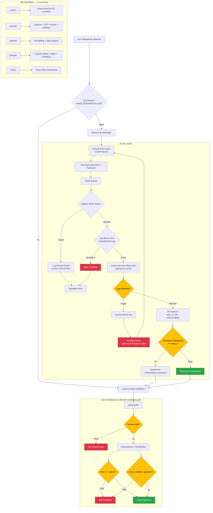
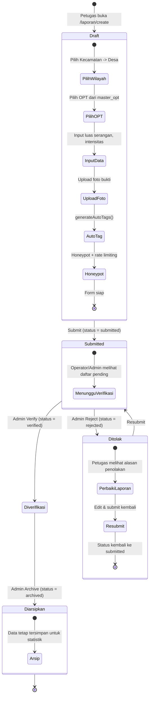
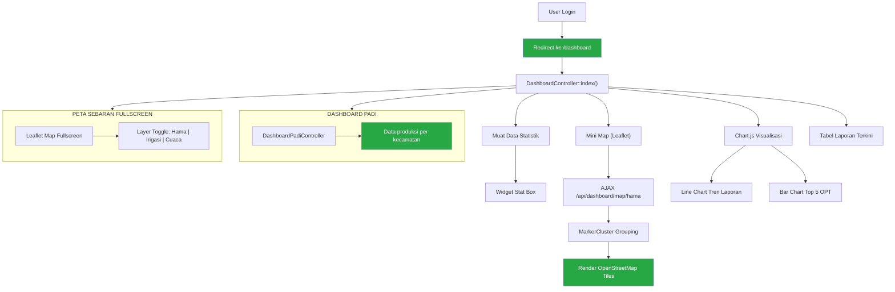
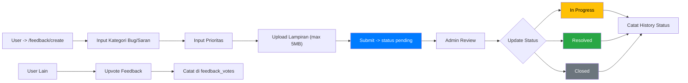
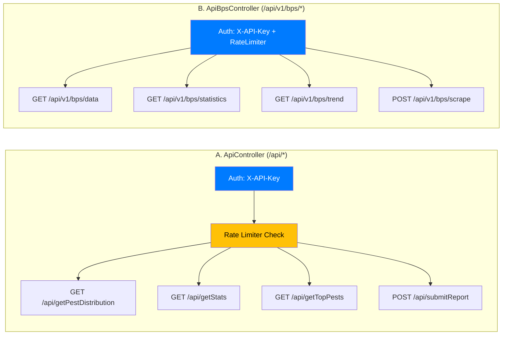
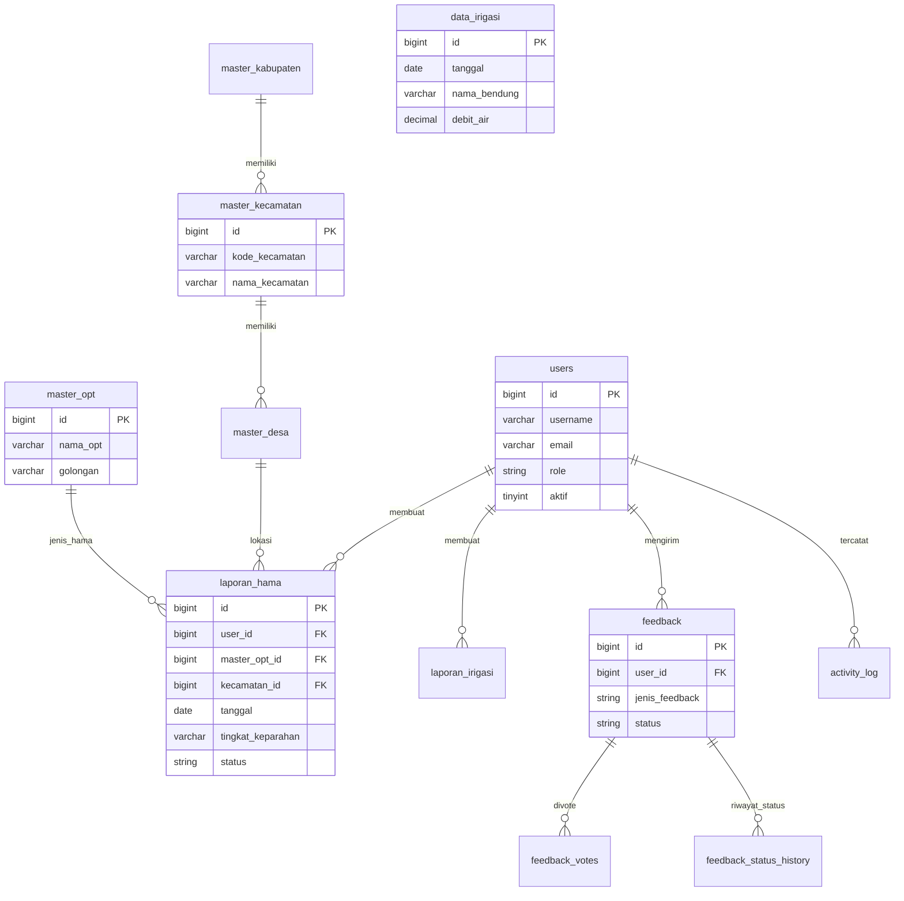

# Dokumentasi Flowchart & Arsitektur Sistem JAGAPADI v3.6
> **JAGAPADI** — *Jember Agrikultur Gapai Prestasi Digital*

Dokumen ini berisi dokumentasi resmi alur kerja, arsitektur sistem, pipeline data, dan struktur relasi basis data dari platform **JAGAPADI**. Seluruh flowchart dalam dokumen ini direpresentasikan dalam format **Mermaid.js** sehingga dapat dirender secara otomatis pada berbagai platform pembaca Markdown.

---

## 📋 Daftar Isi

1. [01. Arsitektur Sistem Keseluruhan](#01-arsitektur-sistem-keseluruhan)
2. [02. Alur Autentikasi & Otorisasi (RBAC)](#02-alur-autentikasi--otorisasi-rbac)
3. [03. Siklus Hidup Laporan Hama (OPT)](#03-siklus-hidup-laporan-hama-opt)
4. [04. Pipeline Data Scraping (Cuaca & Pertanian)](#04-pipeline-data-scraping-cuaca--pertanian)
5. [05. Alur Import Data (Excel & KSA BPS)](#05-alur-import-data-excel--ksa-bps)
6. [06. Dashboard & Visualisasi Data](#06-dashboard--visualisasi-data)
7. [07. Sistem Irigasi & Rule Engine](#07-sistem-irigasi--rule-engine)
8. [08. Feedback & Masukan Pengguna](#08-feedback--masukan-pengguna)
9. [09. Integrasi API Eksternal](#09-integrasi-api-eksternal)
10. [10. ERD (Entity Relationship Diagram) Database](#10-erd-entity-relationship-diagram-database)

---

## 01. Arsitektur Sistem Keseluruhan

Arsitektur aplikasi JAGAPADI dibangun dengan pola pemisahan 6 lapisan (*Layered Architecture*) untuk menjamin modularitas, keamanan, serta kemudahan pemeliharaan sistem.

```mermaid
graph TD
    subgraph Layer1_EntryPoint ["LAYER 1 — Entry Point"]
        A1["HTTP Request"] --> A2["index.php<br/>(Front Controller)"]
        A2 --> A3["Load .env + .env.local"]
        A3 --> A4["Session Config<br/>(httponly, samesite, secure)"]
        A4 --> A5["Autoloader<br/>(spl_autoload_register)"]
        A5 --> A6["CORS Headers"]
    end

    subgraph Layer2_Routing ["LAYER 2 — Routing"]
        B1{"API Request?<br/>(/api/*)"} -->|Ya| B2["Router.php<br/>(Middleware Chain)"]
        B1 -->|Tidak| B3["index.php<br/>(Convention-based Mapping)"]
        B2 --> B4["Middleware:<br/>auth, admin, operator, statistisi, rate_limit<br/>external_auth, mobile_auth, scraper_auth"]
        B3 --> B5["Explicit Routes<br/>(config/web_routes.php)"]
        B5 --> B6["Controller@Method"]
        B4 --> B7["Controller@Method"]
    end

    subgraph Layer3_Controller ["LAYER 3 — Controller (23 Total)"]
        C1["Auth: AuthController"]
        C2["Dashboard: DashboardController, DashboardPadiController"]
        C3["Laporan: LaporanController, LaporanHamaController, LaporanLainnyaController"]
        C4["Cuaca: CurahHujanController, KecepatanAnginController"]
        C5["Pertanian: BpsScraperController, GabahBerasController, EvaluasiController"]
        C6["Harga: HargaKomoditasController"]
        C7["Irigasi: IrigasiController, IrigasiScraperController"]
        C8["Admin: UserController, AdminWilayahController, OptController"]
        C9["Lainnya: FeedbackController, StorytellingController, ExportController"]
        C10["API: ApiController, ApiBpsController, WilayahController"]
    end

    subgraph Layer4_Service ["LAYER 4 — Service (25 Total)"]
        D1["Scraper: BpsScraper, CurahHujanScraper, KecepatanAnginScraper<br/>HargaKomoditasScraper, IrigasiScraper"]
        D2["API Client: BpsApiClient, BMKGApiClient, BMKGService, OpenMeteoService"]
        D3["Analytics: WindAnalyticsService, WindIntegrationService, GabahBerasAnalytics<br/>DashboardDataAggregator, DataStoryService"]
        D4["Import: ExcelImportService, KsaImportService, UserImportService"]
        D5["Engine: IrrigationRuleEngine, WeatherService, WeatherConditionMapper"]
        D6["Lainnya: BpsSimulationService, BpsDataService, CurahHujanMonitor<br/>CurahHujanHealthCheck, QwenEditorTokenManager"]
    end

    subgraph Layer5_ModelDB ["LAYER 5 — Model & Database"]
        E1["26 Model Classes<br/>(Active Record / QueryBuilder)"]
        E2["52 Tabel MySQL<br/>(InnoDB, utf8mb4)"]
        E3["Core ORM: Model.php + QueryBuilder.php"]
        E4["Cache: CacheManager.php<br/>(file/redis/memcached, fail-open)"]
    end

    subgraph Layer6_External ["LAYER 6 — Sumber Data Eksternal"]
        F1["NASA POWER API<br/>(curah hujan + kecepatan angin)"]
        F2["Open-Meteo API<br/>(prakiraan cuaca)"]
        F3["BMKG API<br/>(prakiraan cuaca Indonesia)"]
        F4["SISKAPERBAPO Jatim<br/>(harga komoditas)"]
        F5["BPS WebAPI<br/>(data pertanian resmi)"]
        F6["Qwen AI<br/>(editor token)"]
        F7["Simitra<br/>(integrasi mitra)"]
    end

    B7 --> C1
    B7 --> C2
    B7 --> C3
    B7 --> C4
    B7 --> C5
    B7 --> C6
    B7 --> C7
    B7 --> C8
    B7 --> C9
    B7 --> C10

    C1 --> D1
    C2 --> D2
    C3 --> D3
    C4 --> D4
    C5 --> D5
    C6 --> D6

    D1 --> E1
    D2 --> E1
    D3 --> E1
    D4 --> E1
    D5 --> E1
    D6 --> E1

    E1 --> E2
    E1 --> E3
    E1 --> E4

    D1 --> F1
    D1 --> F4
    D2 --> F2
    D2 --> F3
    D2 --> F5
    D6 --> F6
    D6 --> F7

    style A2 fill:#007bff,color:#fff
    style B2 fill:#007bff,color:#fff
    style B3 fill:#007bff,color:#fff
    style E1 fill:#28a745,color:#fff
    style E2 fill:#28a745,color:#fff
```

### Penjelasan Alur Arsitektur

1. **Layer 1 — Entry Point**: Setiap *HTTP Request* yang masuk ke server diarahkan ke `index.php` (Front Controller). Di tahap ini, aplikasi memuat konfigurasi lingkungan (`.env` & `.env.local`), menetapkan parameter keamanan sesi (`httponly`, `samesite`, `secure`), mengaktifkan autoloader kelas PHP, serta mengatur *CORS Headers*.
2. **Layer 2 — Routing & Middleware**: Memeriksa apakah permintaan bertipe API (`/api/*`) atau Web. Permintaan API diproses oleh `Router.php` dan melewati serangkaian *Middleware* keamanan (autentikasi, enkripsi token, pembatasan *rate limit*). Permintaan Web dipetakan melalui kustomisasi rute eksplisit pada `config/web_routes.php`.
3. **Layer 3 — Controller**: Terdiri dari **23 Controller** yang menangani logika pemrosesan logika bisnis sesuai domain aplikasi (Auth, Dashboard, Laporan, Cuaca, Pertanian, Irigasi, User Admin, API).
4. **Layer 4 — Service Layer**: Terdiri dari **25 Service** modular yang mengisolasi proses teknis kompleks seperti *web scraping*, *API Client*, agregasi data analitik, pengolahan berkas impor, serta *Irrigation Rule Engine*.
5. **Layer 5 — Model & Database**: Menggunakan **26 Kelas Model** yang berkomunikasi dengan **52 Tabel MySQL** via *Core ORM* (`Model.php` & `QueryBuilder.php`). Lapisan ini dilindungi oleh *CacheManager* berkonsep *fail-open* (mendukung driver File, Redis, dan Memcached).
6. **Layer 6 — Sumber Data Eksternal**: Berkomunikasi dengan *endpoint* pihak ketiga seperti NASA POWER API, Open-Meteo, BMKG, SISKAPERBAPO Jatim, WebAPI BPS, Qwen AI Engine, dan Simitra.

---

## 02. Alur Autentikasi & Otorisasi (RBAC)

Aplikasi JAGAPADI menerapkan kontrol akses berbasis peran (*Role-Based Access Control* / RBAC) dengan perlindungan berlapis terhadap peretasan dan serangan *brute force*.

### Penjelasan Tahapan Autentikasi & RBAC

1. **Pemeriksaan Sesi**: Pengguna yang mencoba membuka halaman internal akan diperiksa status sesinya (`$_SESSION['user_id']`). Jika belum ada sesi aktif, pengguna otomatis di-redirect ke `/auth/login`.
2. **Validasi Formulir Login**:
   - **CSRF Check**: Memastikan token CSRF yang dikirimkan cocok. Kegagalan validasi akan dicatat sebagai `CSRF_VIOLATION`.
   - **Brute Force Protection**: Memeriksa riwayat percobaan login gagal dari IP/Username tertentu. Jika melebihi batas batas ambang, akses diblokir sementara selama **15 menit**.
   - **Verifikasi Kredensial**: Menggunakan fungsi standar `password_verify()` terhadap tabel `users`.
3. **Penyusunan Sesi & Password Default**: Login berhasil menetapkan data variabel sesi. Jika `password_changed_at` masih bertipe `NULL`, pengguna diwajibkan mengganti kata sandi terlebih dahulu sebelum masuk ke Dashboard.
4. **Matriks Otorisasi Peran (RBAC)**:

| Level Role | Hak Akses Utama |
| :--- | :--- |
| `admin` | Akses penuh ke seluruh 23 Controller, manajemen pengguna, konfigurasi scraper, dan sistem. |
| `operator` | Verifikasi laporan, kelola data master OPT, ekspor laporan, dan analisis lapangan. |
| `statistisi` | Mengelola modul *Data Storytelling*, analitik spasial, dan agregasi statistik. |
| `petugas` | Penginputan laporan hama (OPT), laporan debit irigasi, dan pengiriman tiket masukan. |
| `viewer` | Hak akses baca (*Read-Only*) untuk melihat grafik visualisasi dan dashboard publik. |

---

## 03. Siklus Hidup Laporan Hama (OPT)

Setiap laporan Organisme Pengganggu Tumbuhan (OPT) memiliki *state machine* yang terstruktur guna menjamin akurasi data sebelum masuk ke agregasi statistik resmi.

### Penjelasan Status Laporan OPT

1. **Tahap Draft (Input Data)**:
   - Petugas memilih wilayah hirarkis (**Kecamatan $\rightarrow$ Desa**).
   - Memilih jenis hama dari tabel `master_opt`.
   - Mengisi parameter kuantitatif (luas lahan terserang dalam hektar, persentase intensitas kerusakan).
   - Mengunggah foto bukti fisik di lapangan.
   - Sistem secara otomatis menambahkan penanda metadata (`generateAutoTags()`) dan memeriksa bidang tersembunyi (*honeypot*) untuk menghentikan bot spam.
2. **Status Submitted**: Laporan yang dikirim berstatus `submitted` dan masuk ke dalam antrean *pending verification* milik Administrator/Operator Wilayah.
3. **Status Diverifikasi (`verified`)**: Laporan yang disetujui akan langsung dihitung dalam kalkulasi peta sebaran hama (*MarkerCluster*), statistik tren bulanan, dan agregasi data tingkat kabupaten.
4. **Status Ditolak (`rejected`)**: Apabila terdapat ketidaksesuaian data atau foto bukti yang tidak valid, laporan ditolak beserta alasan tertulis. Petugas lapangan dapat memperbaiki (*edit*) dan mengirim ulang (*resubmit*).
5. **Status Diarsipkan (`archived`)**: Data laporan lama dapat diarsipkan untuk keperluan rekapitulasi historis tahunan tanpa mengotori visualisasi peta aktif.

---

## 04. Pipeline Data Scraping (Cuaca & Pertanian)

Untuk menyajikan data cuaca dan ekonomi pertanian secara *real-time*, JAGAPADI menjalankan pipeline *scraping* otomatis yang dilengkapi dengan mekanisme *fallback chain* multi-tingkat.

```mermaid
graph TD
    subgraph A_CurahHujan ["A. PIPELINE CURAH HUJAN"]
        A1["Admin Klik Jalankan Scraper"] --> A2{"Pilih Sumber:<br/>NASA | Open-Meteo | BMKG | Simulasi"}
        A2 --> A3["Fallback Chain Dimulai"]
        A3 --> A4{"NASA POWER API<br/>(Prioritas 1)"}
        A4 -->|Berhasil| A5["Parse Data<br/>(31 kecamatan × 30 hari)"]
        A4 -->|Gagal| A6{"Open-Meteo API<br/>(Prioritas 2)"}
        A6 -->|Berhasil| A5
        A6 -->|Gagal| A7{"BMKG API<br/>(Prioritas 3)"}
        A7 -->|Berhasil| A5
        A7 -->|Gagal| A8["Simulasi"]
        A8 --> A5
        A5 --> A9["Validasi range 0-500mm"]
        A9 --> A10["Simpan ke tabel curah_hujan"]
    end

    subgraph B_KecepatanAngin ["B. PIPELINE KECEPATAN ANGIN"]
        B1["Admin Klik Jalankan Scraper"] --> B2["Fallback Chain"]
        B2 --> B3{"NASA POWER API"}
        B3 -->|Berhasil| B4["Transformasi: m/s -> km/h"]
        B3 -->|Gagal| B5{"Open-Meteo API"}
        B5 -->|Berhasil| B4
        B5 -->|Gagal| B6["Simulasi"]
        B6 --> B4
        B4 --> B7["Analitik Beaufort Scale"]
        B7 --> B8["Simpan ke kecepatan_angin"]
    end

    subgraph C_HargaKomoditas ["C. PIPELINE HARGA KOMODITAS"]
        C1["Admin Klik Jalankan Scraper"] --> C2{"SISKAPERBAPO Jatim API"}
        C2 -->|Berhasil| C3["Filter Region Jember"]
        C2 -->|Gagal| C4["Simulasi"]
        C4 --> C3
        C3 --> C5["Estimasi GKP/GKG"]
        C5 --> C6["Simpan ke harga_komoditas"]
    end

    style A4 fill:#ffc107,color:#000
    style A6 fill:#ffc107,color:#000
    style A7 fill:#ffc107,color:#000
    style B3 fill:#ffc107,color:#000
    style B5 fill:#ffc107,color:#000
    style C2 fill:#ffc107,color:#000
    style A10 fill:#28a745,color:#fff
    style B8 fill:#28a745,color:#fff
    style C6 fill:#28a745,color:#fff
```

### Rincian Pipeline Data Scraping

* **Pipeline A — Curah Hujan**:
  - Mengambil data untuk **31 kecamatan** di Kabupaten Jember selama 30 hari terakhir.
  - Urutan fallback otomatis: **NASA POWER API** (Prioritas 1) $\rightarrow$ **Open-Meteo API** (Prioritas 2) $\rightarrow$ **BMKG API** (Prioritas 3) $\rightarrow$ **Generator Data Simulasi** (Prioritas 4).
  - Melalui tahap validasi ambang batas presipitasi akurat ($0 - 500\text{ mm}$).
* **Pipeline B — Kecepatan Angin**:
  - Mengambil data vektor angin dari NASA POWER / Open-Meteo.
  - Melakukan konversi satuan otomatis dari meter per detik ($\text{m/s}$) ke kilometer per jam ($\text{km/h}$).
  - Melakukan klasifikasi dinamika cuaca menggunakan **Skala Beaufort** sebelum disimpan ke database.
* **Pipeline C — Harga Komoditas Pertanian**:
  - Terkoneksi dengan API resmi SISKAPERBAPO Jawa Timur.
  - Memfilter data pasar khusus wilayah Kabupaten Jember.
  - Menghitung perkiraan harga acuan Gabah Kering Panen (GKP) dan Gabah Kering Giling (GKG).

---

## 05. Alur Import Data (Excel & KSA BPS)

Modul pengimporan data bertugas menangani unggahan dokumen eksternal, baik dalam format spreadsheet umum maupun format khusus Kerangka Sampel Area (KSA) BPS.

```mermaid
graph TD
    subgraph A_ImportExcel ["A. IMPORT EXCEL UMUM"]
        A1["Admin Upload File .xlsx"] --> A2["Validasi MIME + Whitelist"]
        A2 --> A3{"File Valid?"}
        A3 -->|Tidak| A4["Tampilkan Error"]
        A3 -->|Ya| A5["Preview 10 baris pertama"]
        A5 --> A6["Tampilkan Column Mapping"]
        A6 --> A7{"Admin Konfirmasi?"}
        A7 -->|Tidak| A8["Batal Import"]
        A7 -->|Ya| A9["Column Mapping Otomatis"]
        A9 --> A10["Validasi Tipe Data & Range"]
        A10 --> A11{"Semua Baris Valid?"}
        A11 -->|Tidak| A12["Catat errors & warnings"]
        A12 --> A13["Upsert ke tabel target"]
        A11 -->|Ya| A13
        A13 --> A14["Tampilkan Ringkasan Hasil"]
    end

    subgraph B_ImportKSA ["B. IMPORT KSA BPS"]
        B1["Admin Upload File KSA"] --> B2{"Format File?"}
        B2 -->|Fixed Annual| B3["3 Sheet: Luas, Prod Gabah/Beras"]
        B2 -->|Monthly 2026| B4["Sheet Level KABKOT"]
        B3 --> B5["Parser XML/ZipArchive"]
        B4 --> B5
        B5 --> B6["Header & Date Parser"]
        B6 --> B7["Mapping Kode Kabupaten"]
        B7 --> B8["Status Data (Tetap/Sementara)"]
        B8 --> B9["Simpan ke data_ksa_bulanan"]
    end

    style A3 fill:#ffc107,color:#000
    style A7 fill:#ffc107,color:#000
    style A11 fill:#ffc107,color:#000
    style B2 fill:#ffc107,color:#000
    style A4 fill:#dc3545,color:#fff
    style A14 fill:#28a745,color:#fff
```

### Tahapan Validasi & Eksekusi Impor

1. **Pemeriksaan Tipe Berkas**: File yang diunggah divalidasi MIME type dan ketersediaan strukturnya (*whitelist* ekstensi `.xlsx` / `.xls`).
2. **Pratinjau & Pemetaan Kolom (*Column Mapping*)**:
   - Sistem menampilkan pratinjau 10 baris data pertama.
   - Admin menentukan atau mengonfirmasi kecocokan header kolom Excel dengan atribut tabel basis data.
3. **Pemeriksaan Integritas Baris Data**:
   - Memeriksa tipe data, kesesuaian range angka, dan kunci referensi asing (*Foreign Key*).
   - Baris bermasalah akan dicatat pada log peringatan (*warnings/errors log*) tanpa membatalkan baris lain yang valid (*partial batch upsert*).
4. **Parsing Data KSA BPS**:
   - Mendukung format **Fixed Annual** (3 sheet: Luas Panen, Production Gabah, Production Beras) dan **Monthly Format 2026** (Sheet Level Kab/Kota).
   - Ekstrak dilakukan menggunakan parser berbasis `ZipArchive`/`XML` langsung untuk efisiensi memori.
   - Data dipetakan berdasarkan Kode Wilayah BPS dan status data (**Data Tetap** vs **Data Sementara**).

---

## 06. Dashboard & Visualisasi Data

Halaman Utama Dashboard menyajikan indikator kinerja utama (*KPI*) sektor pertanian Jember secara visual dan responsif.

### Komponen Visualisasi Utama

* **Widget Ringkasan Statistik**: Menampilkan angka akumulasi total laporan bulan berjalan, total kecamatan terdampak, serta persentase verifikasi.
* **Peta Sebaran Interaktif (Leaflet.js)**:
  - Mengambil koordint lokasi via AJAX dari endpoint `/api/dashboard/map/hama`.
  - Mengelompokkan titik lokasi terdekat menggunakan algoritma **MarkerCluster** untuk menghindari pemandangan padat (*cluttering*).
  - Dilengkapi fitur *Layer Toggle* untuk berganti tampilan sebaran (Hama, Debit Irigasi, atau Stasiun Cuaca).
* **Grafik Analitis (Chart.js)**:
  - **Line Chart**: Menampilkan fluktuasi tren kemunculan kasus hama dari bulan ke bulan.
  - **Bar Chart**: Menampilkan 5 komoditas/jenis OPT yang paling mendominasi wilayah Jember.
* **Sub-Dashboard Produksi Padi**: Diampu oleh `DashboardPadiController` untuk memantau data ketersediaan beras, estimasi panen, dan neraca pangan daerah.

---

## 07. Sistem Irigasi & Rule Engine

Modul irigasi mengombinasikan pelaporan fisik infrastruktur air dengan pemantauan bendung otomatis serta pengambil keputusan otomatis (*Rule Engine*).

```mermaid
graph TD
    subgraph A_LaporanIrigasi ["A. LAPORAN IRIGASI"]
        A1["Petugas /irigasi/create"] --> A2["Pilih Kecamatan & Desa"]
        A2 --> A3["Input Debit Air & Tinggi Muka Air"]
        A3 --> A4["Upload Foto Proof"]
        A4 --> A5["Submit -> status submitted"]
        A5 --> A6["Admin Verify -> status verified"]
    end

    subgraph B_MonitoringIrigasi ["B. MONITORING BENDUNG"]
        B1["Admin /irigasiScraper/runScraper"] --> B2["Simulasi 20 Bendung Jember"]
        B2 --> B3["Perhitungan Fluktuasi Debit"]
        B3 --> B4{"Kategori Debit"}
        B4 -->|>=60%| B5["Aman"]
        B4 -->|30-60%| B6["Waspada"]
        B4 -->|<30%| B7["Kritis"]
        B5 & B6 & B7 --> B8["Simpan ke data_irigasi"]
    end

    subgraph C_RuleEngine ["C. RULE ENGINE"]
        C1["Buat Rule JSON"] --> C2["Kondisi Sensor & Cuaca"]
        C2 --> C3["Operator Logika AND/OR"]
        C3 --> C4["Aksi Otomatis"]
        C4 --> C5["Cooldown Check"]
        C5 --> C6["Eksekusi Rule & Logging"]
    end

    style B5 fill:#28a745,color:#fff
    style B6 fill:#ffc107,color:#000
    style B7 fill:#dc3545,color:#fff
    style C6 fill:#007bff,color:#fff
```

### Kategori Status Bendung & Pemrosesan Aturan Otomatis

* **Kategori Ketersediaan Air Bendung**:

$$\text{Persentase Debit} = \left( \frac{\text{Debit Air Aktual}}{\text{Kapasitas Maksimum Bendung}} \right) \times 100\%$$

| Kategori | Ambang Persentase Debit | Warna Indikator | Tindakan Rekomendasi |
| :--- | :---: | :---: | :--- |
| **Aman** | $\ge 60\%$ | Hijau | Pasokan air tercukupi untuk pembagian irigasi normal. |
| **Waspada** | $30\% - 59.9\%$ | Kuning | Pengaturan giliran aliran air antar-petak sawah. |
| **Kritis** | $< 30\%$ | Merah | Peringatan dini kekeringan & koordinasi pembagian air darurat. |

* **Irrigation Rule Engine**:
  - Pengguna Administrator dapat mengonfigurasi aturan berbasis JSON.
  - Mengevaluasi kombinasi variabel cuaca (misal: *Curah Hujan < 5mm* **AND** *Debit Bendung < 30%*).
  - Memiliki fitur **Cooldown Check** untuk mencegah pemicuan peringatan berulang (*alert fatigue*) dalam kurun waktu pendek.

---

## 08. Feedback & Masukan Pengguna

Modul feedback berfungsi sebagai sarana komunikasi dua arah antara pengguna lapangan (petugas/petani) dengan tim teknis platform JAGAPADI.

### Tahapan Pengelolaan Tiket Feedback

1. **Pembuatan Tiket**: Pengguna mengisi formulir kategori (Laporan Bug, Usulan Fitur, Pertanyaan Technical), menentukan skala prioritas, dan dapat melampirkan tangkapan layar (maksimal 5MB).
2. **Review Admin & Perubahan Status**:
   - `Pending`: Tiket baru diterima dan menunggu antrean evaluasi.
   - `In Progress`: Masukan sedang ditindaklanjuti oleh pengembang.
   - `Resolved`: Kendala telah terselesaikan.
   - `Closed`: Tiket ditutup.
3. **Pencatatan Histori & Upvoting**: Setiap perubahan status dicatat pada tabel `feedback_status_history`. Pengguna lain dapat memberikan *upvote* pada tiket ide/saran yang relevan untuk menaikkan prioritas penanganan.

---

## 09. Integrasi API Eksternal

JAGAPADI menyediakan antarmuka Application Programming Interface (API) berstandar RESTful untuk memfasilitasi pertukaran data secara aman dengan aplikasi luar maupun integrasi internal.

### Katalog Endpoint API

| Controller | HTTP Method | Endpoint | Fungsi Deskriptif | Enkripsi & Akses |
| :--- | :---: | :--- | :--- | :--- |
| `ApiController` | `GET` | `/api/getPestDistribution` | Mendapatkan GeoJSON sebaran koordinat hama. | Header `X-API-Key` + Rate Limit |
| `ApiController` | `GET` | `/api/getStats` | Ringkasan agregat angka statistik mingguan. | Header `X-API-Key` + Rate Limit |
| `ApiController` | `GET` | `/api/getTopPests` | Daftar 5 besar OPT paling dominan. | Header `X-API-Key` + Rate Limit |
| `ApiController` | `POST` | `/api/submitReport` | Mengirim laporan hama dari aplikasi mobile. | Header `X-API-Key` + Auth Bearer |
| `ApiBpsController`| `GET` | `/api/v1/bps/data` | Mengambil raw data hasil impor BPS KSA. | Header `X-API-Key` + Role Admin |
| `ApiBpsController`| `GET` | `/api/v1/bps/statistics` | Analisis tren produksi pangan regional. | Header `X-API-Key` + Role Admin |
| `ApiBpsController`| `POST` | `/api/v1/bps/scrape` | Memicu eksekusi scraper BPS background task. | Header `X-API-Key` + Role Admin |

---

## 10. ERD (Entity Relationship Diagram) Database

Diagram hubungan antar entitas (*Entity Relationship Diagram*) berikut menggambarkan struktur relasional antar-tabel utama di dalam basis data MySQL JAGAPADI.

### Ringkasan Entitas Utama Basis Data

1. **`users`**: Menyimpan data identitas akun pengguna, kredensial password terenkripsi, level role, dan status keaktifan akun.
2. **`laporan_hama`**: Tabel utama penyimpan transaksi laporan OPT yang terhubung dengan `users`, `master_opt`, dan `master_desa`.
3. **`master_kabupaten` / `master_kecamatan` / `master_desa`**: Tabel standar referensi wilayah administratif berhirarki di Kabupaten Jember.
4. **`master_opt`**: Katalog acuan Organisme Pengganggu Tumbuhan (jenis hama, penyakit, dan gulma).
5. **`feedback` / `feedback_votes` / `feedback_status_history`**: Rangkaian tabel pengelola tiket masukan pengguna beserta dukungan pencatatan jejak audit (*audit trail*).
6. **`data_irigasi`**: Menyimpan data histori pengukuran debit air dan status keandalan bendung irigasi.
7. **`activity_log`**: Catatan riwayat aktivitas pengguna untuk kebutuhan pengawasan log keamanan (*security logging*).

---
*Dokumen ini disusun dan disinkronkan secara otomatis berdasarkan basis kode JAGAPADI v3.6.*
