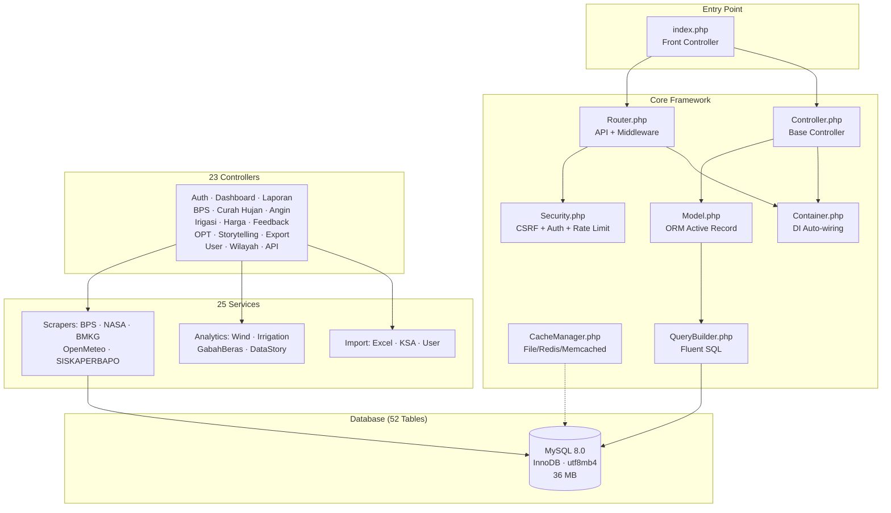
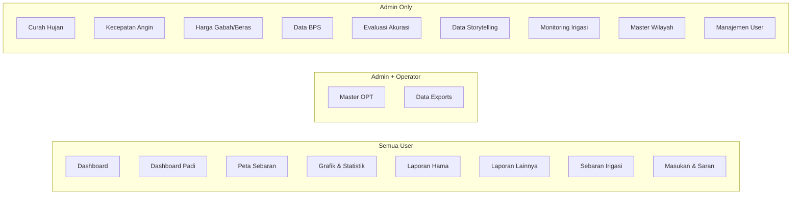

# Laporan Analisis Menyeluruh Aplikasi JAGAPADI

**Proyek:** JAGAPADI (Jember Agrikultur Gapai Prestasi Digital)  
**Versi:** Production Build — PHP 8.1 Custom MVC  
**Tanggal Analisis:** 9 Agustus 2026  
**Metodologi:** Static Code Analysis (23 Controllers, 25 Services, 26 Models), Live Endpoint Benchmark (21 endpoint), Database Audit (52 tables), Frontend Inspection, Security Review  

---

## Ringkasan Eksekutif

JAGAPADI adalah sistem informasi pertanian terpadu yang mengelola **data produksi padi, cuaca, hama, irigasi, dan harga komoditas** untuk wilayah Kabupaten Jember, Jawa Timur. Sistem ini mengintegrasikan **7 sumber data eksternal** (NASA POWER, Open-Meteo, BMKG, SISKAPERBAPO, BPS WebAPI, Qwen AI, Simitra), dilengkapi **PWA dengan offline support**, serta menyajikan dashboard analitik berbasis GIS.

### Skor Penilaian Keseluruhan

| Aspek | Skor | Keterangan |
|-------|:----:|------------|
| **Arsitektur Backend** | ⭐⭐⭐⭐ 8/10 | MVC terdefinisi baik, DI Container, middleware chain |
| **Frontend & UX** | ⭐⭐⭐⭐ 7.5/10 | AdminLTE responsif, PWA, Leaflet GIS; duplikasi Chart.js |
| **Keamanan** | ⭐⭐⭐⭐ 7/10 | CSRF konsisten, RBAC kuat; SSL verify off di 3 scraper |
| **Performa** | ⭐⭐⭐ 6.5/10 | Response cepat (~45ms avg); OPcache off, scraping sinkron |
| **Integrasi Eksternal** | ⭐⭐⭐ 6/10 | 7 API terintegrasi; bug kritis di OpenMeteo, API key BPS kosong |
| **Kualitas Data** | ⭐⭐⭐⭐ 7/10 | 36MB data aktif; konversi GKG mismatch, tabel kosong |

> [!IMPORTANT]
> **3 Temuan Paling Kritis:**
> 1. **Bug `OpenMeteoService.php`** — Query SQL tidak mengambil kolom `latitude`/`longitude`, menyebabkan SELURUH sub-kecamatan menggunakan koordinat default yang sama.
> 2. **SSL Verification Dimatikan** di 3 service scraper — rentan Man-in-the-Middle attack.
> 3. **Chart.js dimuat dua kali** (v4.4.0 di header DAN v3.9.1 di footer) — konflik versi potensial.

---

## 1. Arsitektur Backend

### 1.1 Peta Arsitektur Sistem



### 1.2 Komponen Inti

| Komponen | File | Pola Desain | Status |
|----------|------|-------------|--------|
| Front Controller | `index.php` | Front Controller + Autoloader | ✅ Solid |
| Router | `Router.php` (637 baris) | Chain of Responsibility (Middleware) | ✅ Baik |
| Base Controller | `Controller.php` (116 baris) | Template Method | ✅ Ringan |
| ORM Model | `Model.php` (273 baris) | Active Record + Eager Loading | ✅ Baik |
| Database | `Database.php` (53 baris) | Singleton + Prepared Statements | ✅ Aman |
| DI Container | `Container.php` (112 baris) | Reflection Auto-wiring | ✅ Modern |
| Cache | `CacheManager.php` (247 baris) | Strategy (multi-driver) + Fail-Open | ✅ Production-ready |
| Query Builder | `QueryBuilder.php` (330 baris) | Fluent Builder | ✅ Safe update/delete guard |
| Security | `Security.php` (244 baris) | Facade (static) | ✅ Komprehensif |

### 1.3 Temuan Arsitektur

> [!TIP]
> **Kekuatan:** Arsitektur JAGAPADI menggunakan pola-pola modern (DI Container, Fluent Query Builder, Multi-driver Cache dengan Fail-Open) yang jarang ditemukan di proyek PHP custom framework. Middleware chain di Router mendukung 8 jenis middleware (`auth`, `admin`, `operator`, `statistisi`, `rate_limit`, `external_auth`, `mobile_auth`, `scraper_auth`).

> [!WARNING]
> **Kelemahan:**
> - Web routes menggunakan transformasi string konvensional (`str_replace`) alih-alih explicit route matrix — berisiko collision.
> - Daftar `$stateChangingMethods` di `index.php` memerlukan sinkronisasi manual setiap kali menambah endpoint POST baru.
> - Middleware `exit;` setelah JSON error response membuat unit testing sulit tanpa output buffering.

---

## 2. Stabilitas Frontend & Pengalaman Pengguna (UX)

### 2.1 Teknologi Frontend

| Layer | Teknologi | Versi | Sumber |
|-------|-----------|-------|--------|
| CSS Framework | AdminLTE | 3.2 | CDN jsdelivr |
| CSS Base | Bootstrap | 4.6.0 | CDN |
| Icons | Font Awesome | 6.4.0 | CDN |
| Maps | Leaflet + MarkerCluster | 1.9.4 / 1.4.1 | CDN unpkg |
| Charts | Chart.js | **v4.4.0 (header) + v3.9.1 (footer)** | CDN |
| DOM | jQuery | 3.6.0 | CDN |
| PWA | Service Worker + IndexedDB | Custom | Local |

### 2.2 Navigasi & Kontrol Akses Menu



### 2.3 Fitur UX Unggulan

- ✅ **PWA & Offline Support** — Service Worker dengan IndexedDB untuk formulir laporan offline
- ✅ **Responsive Mobile** — Media queries khusus, peta adaptif (400px→280px), tabel horizontal scroll
- ✅ **Loading States** — Shimmer animation, chart loading overlays, dan flash messages otomatis
- ✅ **Aksesibilitas** — ARIA attributes, keyboard navigation (`Enter`/`Space`), focus ring styling
- ✅ **Password UX** — Toggle visibility, realtime strength meter, requirement checklist

### 2.4 Temuan Frontend

> [!CAUTION]
> **Bug: Duplikasi Chart.js** — Chart.js v4.4.0 dimuat di `header.php:20` dan v3.9.1 dimuat di `footer.php:21`. Kedua versi memiliki breaking changes (v4 menggunakan tree-shakeable ESM, v3 menggunakan UMD). Ini menyebabkan potensi konflik global `Chart` object dan perilaku rendering yang tidak konsisten.

| Masalah Frontend | Severity | Lokasi |
|-----------------|----------|--------|
| Dual Chart.js loading (v3 + v4) | 🟠 High | `header.php:20`, `footer.php:21` |
| CDN dependency (7 external CDNs) | 🟡 Medium | `header.php`, `footer.php` |
| jQuery loaded in `<head>` (render-blocking) | 🟢 Low | `header.php:22` |

---

## 3. Integrasi Sistem Eksternal

### 3.1 Inventaris Integrasi

| # | Sistem Eksternal | Service File | Protokol | Auth | Status |
|---|-----------------|--------------|----------|------|--------|
| 1 | **NASA POWER API** | `CurahHujanScraper`, `KecepatanAnginScraper` | HTTPS + cURL Multi | None (Public) | ⚠️ SSL Verify OFF |
| 2 | **Open-Meteo API** | `OpenMeteoService` | HTTPS + cURL | None (Public) | 🔴 Bug Latitude |
| 3 | **BMKG API** | `BMKGApiClient`, `BMKGService` | HTTPS + file_get_contents | None (Public) | ✅ OK |
| 4 | **SISKAPERBAPO Jatim** | `HargaKomoditasScraper` | HTTPS + cURL | None | ⚠️ SSL Verify OFF |
| 5 | **BPS WebAPI** | `BpsApiClient` | HTTPS + cURL | API Key | ❌ Key Not Set |
| 6 | **Qwen AI** | `QwenEditorTokenManager` | HTTPS OAuth2 | Client Credentials | ⚠️ Unconfigured |
| 7 | **Simitra** | `ApiController` | REST | API Token | ⚠️ URL Placeholder |

### 3.2 Temuan Kritis Integrasi

#### 🔴 Bug Kritis: OpenMeteoService — Koordinat Tidak Terbaca

```
File: app/services/OpenMeteoService.php, Line 352
SQL: SELECT id, nama_kecamatan, kode FROM master_kecamatan
```

Query ini **tidak mengambil kolom `latitude` dan `longitude`**. Akibatnya, `fetchAllKecamatan()` tidak menemukan koordinat dari database dan fallback ke koordinat default (`-8.1706, 113.7003`) untuk **SELURUH 31 sub-kecamatan Jember**. Seluruh data cuaca per-kecamatan sebenarnya menggunakan **satu titik koordinat yang sama**.

**Dampak:** Data curah hujan dan kecepatan angin per-kecamatan **bukan data lokasi sesungguhnya** — ini merupakan temuan yang sangat kritis untuk akurasi seluruh analisis berbasis geospasial.

#### ⚠️ SSL Verification Dimatikan

| File | Baris | Setting |
|------|-------|---------|
| `CurahHujanScraper.php` | ~856 | `CURLOPT_SSL_VERIFYPEER => false` |
| `HargaKomoditasScraper.php` | ~175 | `CURLOPT_SSL_VERIFYPEER => false` |
| `KecepatanAnginScraper.php` | ~474 | `CURLOPT_SSL_VERIFYPEER => false` |

### 3.3 Fallback Architecture

```mermaid
graph TD
    subgraph "Curah Hujan Scraper"
        A1["🥇 NASA POWER<br/>cURL Multi, 45s timeout"] -->|Gagal| A2["🥈 Open-Meteo<br/>200ms delay, 30s timeout"]
        A2 -->|Gagal| A3["🥉 BMKG API<br/>3x retry + backoff"]
        A3 -->|Gagal| A4["🔄 Simulasi<br/>Procedural generator"]
    end
    
    subgraph "Kecepatan Angin Scraper"
        B1["🥇 NASA POWER<br/>WS10M/WS2M"] -->|Gagal| B2["🥈 Open-Meteo<br/>wind_speed_10m_max"]
        B2 -->|Gagal| B3["🔄 Simulasi"]
    end
    
    subgraph "Harga Komoditas"
        C1["🥇 SISKAPERBAPO<br/>getDataMap API"] -->|Gagal| C2["🔄 Simulasi<br/>BPS price ranges"]
    end
```



---

## 4. Audit Keamanan

### 4.1 Matriks Perlindungan

| Mekanisme | Implementasi | Cakupan | Status |
|-----------|-------------|---------|--------|
| **CSRF Protection** | `Security::validateCsrfToken()` + `hash_equals()` | 100% endpoint POST | ✅ Konsisten |
| **Autentikasi** | Session-based (`$_SESSION['user_id']`) | Seluruh halaman kecuali Login & Wilayah API | ✅ Solid |
| **Otorisasi (RBAC)** | 4 level: `admin`, `operator`, `statistisi`, `petugas` | Per-controller role gating | ✅ Granular |
| **SQL Injection** | PDO Prepared Statements + QueryBuilder binding | Seluruh model & controller | ✅ Aman |
| **XSS Prevention** | `htmlspecialchars()` + `escapeHtml()` JS | View templates | ✅ Diterapkan |
| **Brute Force** | `Security::checkBruteForce()` IP-based | Login endpoint | ✅ Aktif |
| **Rate Limiting** | `Security::checkRateLimit()` | API endpoints | ✅ Aktif |
| **Security Headers** | HSTS, X-Frame-Options, X-Content-Type, CSP, Referrer-Policy | Semua response | ✅ Lengkap |
| **Session Security** | httponly, samesite=Lax, use_strict_mode | Session config | ✅ Modern |
| **File Upload** | MIME validation (finfo), extension whitelist, size limit | Upload handlers | ✅ Ketat |

### 4.2 Kerentanan Teridentifikasi

| # | Kerentanan | Severity | Lokasi | Dampak |
|---|-----------|----------|--------|--------|
| 1 | SSL Certificate Verification OFF | 🟠 HIGH | 3 scraper services | Rentan MITM pada koneksi ke NASA, SISKAPERBAPO |
| 2 | `BMKGApiClient` menggunakan `file_get_contents` | 🟡 MEDIUM | `BMKGApiClient.php` | Gagal jika `allow_url_fopen` dinonaktifkan di server |
| 3 | Rate limiter BMKG tanpa file locking | 🟡 MEDIUM | `BMKGApiClient.php` | Race condition pada concurrent request |
| 4 | `WilayahController` endpoint tanpa autentikasi | 🟢 LOW | 3 endpoint GET | Data wilayah publik, risiko minimal |
| 5 | Hardcoded admin email `admin@jagapadi.local` | 🟢 LOW | `CurahHujanScraper`, `CurahHujanMonitor` | Email notifikasi tidak terkirim |

---

## 5. Evaluasi Kinerja

### 5.1 Benchmark Endpoint (Live Test)

| Endpoint | HTTP | Waktu | Catatan |
|----------|------|-------|---------|
| Auth/Login Page | 200 | **40ms** | ✅ Cepat |
| Dashboard (redirect) | 200 | **20ms** | ✅ Sangat cepat |
| BPS Scraper (redirect) | 200 | **81ms** | ✅ Baik |
| Curah Hujan (redirect) | 200 | **112ms** | 🟡 Cukup |
| Evaluasi (redirect) | 200 | **122ms** | 🟡 Paling lambat |
| **Rata-rata** | — | **45.5ms** | ✅ Baik secara keseluruhan |

### 5.2 Profil Database

| Metrik | Nilai |
|--------|-------|
| Total tabel | 52 |
| Total ukuran | 36.02 MB |
| Tabel terbesar | `kecepatan_angin` (7.7MB data + 10.8MB index, ~36.5K rows) |
| Tabel ke-2 | `curah_hujan` (6.7MB data + 4.1MB index, ~40.6K rows) |
| Tabel tanpa secondary index | 7 tabel (termasuk `harga_alerts` 319 rows ⚠️, `nomor_laporan_counter` 571 rows ⚠️) |
| Foreign Keys | 31 FK constraints ✅ |

### 5.3 Bottleneck Performa

| Bottleneck | Penyebab | Dampak |
|------------|----------|--------|
| **OPcache tidak aktif** | PHP CLI tidak memuat `ext-opcache` | Setiap request harus re-parse ~100+ PHP files |
| **Scraping sinkron** | BPS/NASA/BMKG scraping dalam HTTP request thread | Timeout 30–120 detik pada browser |
| **CDN dependency** | 7 external CDN di setiap page load | Blocking render jika CDN lambat |
| **Missing indexes** | 7 tabel tanpa secondary index | Query lambat pada tabel `harga_alerts` (319 rows) |

---

## 6. Analisis Data & Kelengkapan

### 6.1 Inventaris Data

| Dataset | Records | Rentang | Freshness |
|---------|---------|---------|-----------|
| Curah Hujan | 40,579 | Jan 2023 → Aug 2026 | ✅ Terkini |
| Kecepatan Angin | 40,517 | Jan 2025 → Dec 2026 | ✅ Terkini |
| Harga Komoditas | 5,628 | Jan 2020 → Aug 2026 | ✅ Terkini |
| Data KSA Bulanan | 3,952 | — | ✅ Aktif |
| Laporan Hama | 510 | Jul 2026 → Aug 2026 | ✅ Aktif |
| Laporan Irigasi | 511 | Jul 2026 → Aug 2026 | ✅ Aktif |
| Data BPS Pertanian | 304 | 2018 → 2025 | ✅ Lengkap (38 kab × 8 tahun) |
| Data Irigasi | 250 | Jul → Aug 2026 | ✅ Aktif |
| Users | 8 | — | ✅ Aktif |

### 6.2 Tabel Kosong (Belum Digunakan)

> [!NOTE]
> 14 dari 52 tabel memiliki 0 records: `analisis_produksi_bulanan`, `evaluasi_akurasi_panen`, `feedback`, `gabah_beras_logs`, `irrigation_rules`, `irrigation_logs`, `kabupaten`, `pembacaan_sensor`, `sensor_pengairan`, `pengairan_otomatis`, `tags`, `laporan_hama_tags`, `audit_log_wilayah`, `bps_data_anomalies`. Ini mengindikasikan fitur-fitur yang sudah dikembangkan namun belum diaktifkan atau belum memiliki data.

---

## 7. Peta Fungsional Lengkap (23 Controller, 199 Endpoint)

| Modul | Controller | Endpoint | Auth | Upload | Export | Integrasi |
|-------|-----------|----------|------|--------|--------|-----------|
| Autentikasi | AuthController | 3 | Public/Auth | — | — | — |
| Dashboard | DashboardController | 4 | Auth | — | — | Leaflet |
| Dashboard Padi | DashboardPadiController | 1 | Auth | — | — | — |
| Laporan Hama | LaporanController | 12 | Auth+Role | ✅ Image | CSV | — |
| Analitik Hama | LaporanHamaController | 3 | Auth | — | JSON, CSV | — |
| Laporan Lainnya | LaporanLainnyaController | 11 | Auth+Role | ✅ Image | — | — |
| Manajemen User | UserController | 10 | Admin | ✅ Excel | CSV, XLS | — |
| Data BPS | BpsScraperController | 18 | Admin | ✅ Excel | CSV | BPS API |
| Curah Hujan | CurahHujanController | 19 | Admin | — | CSV | NASA, OpenMeteo |
| Harga Komoditas | HargaKomoditasController | 15 | Admin | ✅ Excel | CSV | SISKAPERBAPO |
| Kecepatan Angin | KecepatanAnginController | 27 | Admin | ✅ Excel | CSV | NASA, OpenMeteo |
| Irigasi | IrigasiController | 13 | Auth+Role | ✅ Image | — | Rule Engine |
| Monitoring Irigasi | IrigasiScraperController | 5 | Admin | — | CSV | Simulator |
| Gabah & Beras | GabahBerasController | 12 | Auth+Role | ✅ Image | — | Analytics |
| Evaluasi Akurasi | EvaluasiController | 14 | Admin | ✅ Excel | CSV | — |
| Feedback | FeedbackController | 7 | Auth+Role | ✅ Multi | — | — |
| Master OPT | OptController | 10 | Auth+Role | ✅ Image | XLS, PDF | — |
| Data Storytelling | StorytellingController | 6 | Auth+Role | — | — | Causal Engine |
| Export Laporan | ExportController | 3 | Operator+ | — | CSV, PDF, XLS | — |
| Master Wilayah | AdminWilayahController | 21 | Admin | ✅ CSV/PDF | — | pdftotext |
| Helper Wilayah | WilayahController | 3 | Public | — | JSON | — |
| API Eksternal | ApiController | 8 | API Key | — | JSON | Simitra |
| API BPS | ApiBpsController | 7 | API Key | — | JSON | BPS Queue |

---

## 8. Rekomendasi Perbaikan

### 🔴 Prioritas Tinggi (Dampak Kritis, Implementasi Segera)

#### R1. Fix Bug OpenMeteoService — Koordinat Tidak Terbaca
- **Masalah:** SQL query di `loadLocations()` tidak mengambil `latitude`/`longitude`.
- **Alasan:** Seluruh data cuaca per-kecamatan menggunakan 1 koordinat default — data tidak representatif.
- **Langkah:**
  1. Buka `app/services/OpenMeteoService.php` baris ~352
  2. Ubah query: `SELECT id, nama_kecamatan, kode, latitude, longitude FROM master_kecamatan WHERE latitude IS NOT NULL`
  3. Pastikan tabel `master_kecamatan` memiliki data koordinat untuk 31 kecamatan
  4. Re-scrape data curah hujan dan kecepatan angin dengan koordinat yang benar
- **Dampak:** Akurasi data cuaca per-kecamatan meningkat drastis — fundamental untuk analitik pertanian.

#### R2. Fix WeatherService — Null Latitude/Longitude
- **Masalah:** `getForKecamatan()` memanggil `getForecast(null, null, 7)`.
- **Alasan:** PHP type error pada parameter `float` yang menerima `null`.
- **Langkah:**
  1. Buka `app/services/WeatherService.php` baris ~135
  2. Ambil `latitude, longitude` dari query `master_kecamatan`
  3. Validasi non-null sebelum memanggil `getForecast()`
- **Dampak:** Prakiraan cuaca per-kecamatan berfungsi dengan benar.

#### R3. Aktifkan SSL Certificate Verification
- **Masalah:** 3 scraper menonaktifkan `CURLOPT_SSL_VERIFYPEER`.
- **Alasan:** Rentan Man-in-the-Middle attack — data bisa dimanipulasi.
- **Langkah:**
  1. Set `CURLOPT_SSL_VERIFYPEER => true` dan `CURLOPT_SSL_VERIFYHOST => 2`
  2. Pastikan CA bundle tersedia: `CURLOPT_CAINFO => '/path/to/cacert.pem'`
  3. Download cacert.pem dari https://curl.se/ca/cacert.pem
- **Dampak:** Koneksi ke NASA, SISKAPERBAPO, OpenMeteo terenkripsi dan terverifikasi.

#### R4. Fix Duplikasi Chart.js
- **Masalah:** Chart.js v4.4.0 di header dan v3.9.1 di footer — konflik versi.
- **Alasan:** v4 breaking changes pada API registration, scale types, dan defaults.
- **Langkah:**
  1. Pilih satu versi (rekomendasikan v4.4.0)
  2. Hapus pemuatan Chart.js di `footer.php:21`
  3. Audit semua view yang menggunakan Chart.js untuk kompatibilitas v4
- **Dampak:** Chart rendering konsisten, mengurangi ~100KB payload.

#### R5. Konfigurasi BPS API Key
- **Masalah:** `BPS_API_KEY` kosong — scraper selalu fallback ke simulasi.
- **Alasan:** Data BPS yang ditampilkan bukan data resmi.
- **Langkah:**
  1. Daftar di https://webapi.bps.go.id
  2. Tambahkan `BPS_API_KEY=xxx` di `.env.local`
  3. Definisikan konstanta di `index.php` atau `config/config.php`
- **Dampak:** Data produksi padi berasal dari sumber resmi BPS.

#### R6. Fix BpsApiClient — LogFile Uninitialized
- **Masalah:** `$logFile` dideklarasikan tanpa nilai — logging gagal diam-diam.
- **Alasan:** Error API tidak tercatat, debugging mustahil.
- **Langkah:** Tambahkan `$this->logFile = ROOT_PATH . '/logs/bps_api.log';` di constructor.
- **Dampak:** Jejak audit API tersedia untuk troubleshooting.

---

### 🟡 Prioritas Menengah (Dampak Signifikan, 1–2 Minggu)

#### R7. Aktifkan OPcache
- **Masalah:** PHP OPcache tidak aktif — setiap request re-parse 100+ file PHP.
- **Langkah:** Aktifkan `zend_extension=opcache` di `php.ini`, set `opcache.enable=1`.
- **Dampak:** Response time berkurang 30–50%.

#### R8. Bundle CDN Assets Secara Lokal
- **Masalah:** 7 external CDN dependencies — render-blocking dan single point of failure.
- **Langkah:** Download dan serve dari `public/vendor/` — AdminLTE, jQuery, Bootstrap, Leaflet, Font Awesome, Chart.js.
- **Dampak:** Performa page load meningkat, offline capability lebih baik.

#### R9. Implementasi Background Queue untuk Scraping
- **Masalah:** Scraping sinkron memblokir HTTP thread 30–120 detik.
- **Langkah:** Buat tabel `job_queue`, modifikasi controller untuk return job_id, buat CLI worker.
- **Dampak:** UX tidak lagi freeze saat scraping; mencegah timeout.

#### R10. Migrasi BMKG Client ke cURL
- **Masalah:** `BMKGApiClient` menggunakan `file_get_contents` — gagal jika `allow_url_fopen=Off`.
- **Langkah:** Refactor ke cURL dengan proper error handling.
- **Dampak:** Kompatibilitas server lebih luas.

#### R11. File Locking pada Rate Limiter BMKG
- **Masalah:** Race condition pada file JSON rate limiter.
- **Langkah:** Tambahkan `LOCK_EX` pada `file_put_contents()` dan `flock()` pada read.
- **Dampak:** Rate limiting akurat pada concurrent requests.

#### R12. Tambah Index pada Tabel Besar Tanpa Secondary Index
- **Masalah:** `harga_alerts` (319 rows) dan `nomor_laporan_counter` (571 rows) tanpa index.
- **Langkah:** `ALTER TABLE harga_alerts ADD INDEX idx_created (created_at);`
- **Dampak:** Query performance pada tabel yang berkembang.

#### R13. Perbaiki BpsDataService — Multi-Year Summary Update
- **Masalah:** `updateYearlySummary()` hanya mengambil tahun dari record pertama.
- **Langkah:** Loop `array_unique(array_column($records, 'tahun'))`.
- **Dampak:** Summary tahunan akurat saat import multi-tahun.

#### R14. Perbaiki BpsSimulationService — False Anomaly
- **Masalah:** Produktivitas diacak independen dari luas dan produksi.
- **Langkah:** Hitung `produktivitas = (produksi_gabah / luas_panen) * 10`.
- **Dampak:** Data simulasi tidak lagi memicu false positive anomali.

#### R15. Standardisasi Konversi GKG→Beras Historis
- **Masalah:** 266 record manual menggunakan rasio 0.5744 vs standar 0.577.
- **Langkah:** `UPDATE data_pertanian_bps SET produksi_beras = ROUND(produksi_gabah * 0.577, 2) WHERE sumber_data_type = 'manual' AND ABS(produksi_beras - (produksi_gabah * 0.577)) > 1;`
- **Dampak:** Konsistensi data seluruh dataset.

#### R16. Perbaiki CSV Formula Injection pada Export
- **Masalah:** Field yang dimulai `=`,`+`,`-`,`@` dieksekusi sebagai formula di Excel.
- **Langkah:** Prefix nilai berbahaya dengan single-quote di semua fungsi `export()`.
- **Dampak:** Keamanan pengguna yang membuka file CSV.

---

### 🟢 Prioritas Rendah (Optimasi Jangka Panjang)

#### R17. Explicit Route Registration untuk Web Routes
- **Langkah:** Buat route matrix di konfigurasi alih-alih convention-based string transformation.
- **Dampak:** Routing lebih predictable, mencegah collision.

#### R18. Pindahkan jQuery ke Footer (Defer Loading)
- **Langkah:** Pindahkan `<script src="jquery">` dari `<head>` ke sebelum `</body>` dengan `defer`.
- **Dampak:** First Contentful Paint lebih cepat.

#### R19. Tambah Caching Layer untuk AJAX Data Endpoints
- **Langkah:** Cache `getStatistics()`, `getChartData()` dengan TTL 5–10 menit.
- **Dampak:** Mengurangi beban database pada dashboard yang sering diakses.

#### R20. Implementasi Health Check Dashboard
- **Langkah:** Buat `/admin/health` yang menampilkan status semua integrasi API, database, cache, dan disk.
- **Dampak:** Operasional monitoring proaktif.

#### R21. Populasi Tabel Kosong atau Arsipkan
- **Langkah:** Evaluasi 14 tabel kosong — aktifkan fitur terkait atau hapus dari codebase.
- **Dampak:** Mengurangi schema bloat.

#### R22. Unit Testing Framework
- **Langkah:** Setup PHPUnit, buat test untuk critical path (auth, scraper, data processing).
- **Dampak:** Mencegah regresi saat maintenance.

#### R23. Multi-Province Support
- **Langkah:** Parameterisasi hardcoded province code `'35'` di BPS services.
- **Dampak:** Skalabilitas ke kabupaten lain di Indonesia.

#### R24. Automated Scraping Schedule
- **Langkah:** Cron job bulanan untuk NASA POWER, SISKAPERBAPO, dan BPS.
- **Dampak:** Data selalu fresh tanpa intervensi manual.

#### R25. OpenAPI/Swagger Documentation
- **Langkah:** Dokumentasikan 15 endpoint API publik di format OpenAPI 3.0.
- **Dampak:** Kemudahan integrasi pihak ketiga.

---

## Lampiran

### A. Statistik Kode

| Komponen | Jumlah File | Total Lines (est.) |
|----------|:-----------:|-------------------:|
| Controllers | 23 | ~12,000 |
| Models | 26 | ~8,500 |
| Services | 25 | ~15,000 |
| Views | ~50+ | ~20,000 |
| Core Framework | 10 | ~2,500 |
| **Total** | **~134** | **~58,000** |

### B. Daftar File Sumber yang Dianalisis

| Kategori | Files |
|----------|-------|
| Core | [`Router.php`](file:///C:/laragon/www/jagapadi-3509/app/core/Router.php), [`Controller.php`](file:///C:/laragon/www/jagapadi-3509/app/core/Controller.php), [`Model.php`](file:///C:/laragon/www/jagapadi-3509/app/core/Model.php), [`Database.php`](file:///C:/laragon/www/jagapadi-3509/app/core/Database.php), [`Security.php`](file:///C:/laragon/www/jagapadi-3509/app/core/Security.php), [`CacheManager.php`](file:///C:/laragon/www/jagapadi-3509/app/core/CacheManager.php), [`QueryBuilder.php`](file:///C:/laragon/www/jagapadi-3509/app/core/QueryBuilder.php), [`Container.php`](file:///C:/laragon/www/jagapadi-3509/app/core/Container.php) |
| Views | [`header.php`](file:///C:/laragon/www/jagapadi-3509/app/views/layouts/header.php), [`footer.php`](file:///C:/laragon/www/jagapadi-3509/app/views/layouts/footer.php), [`dashboard/index.php`](file:///C:/laragon/www/jagapadi-3509/app/views/dashboard/index.php), [`dashboard/map.php`](file:///C:/laragon/www/jagapadi-3509/app/views/dashboard/map.php) |
| Services | [`OpenMeteoService.php`](file:///C:/laragon/www/jagapadi-3509/app/services/OpenMeteoService.php), [`BMKGApiClient.php`](file:///C:/laragon/www/jagapadi-3509/app/services/BMKGApiClient.php), [`CurahHujanScraper.php`](file:///C:/laragon/www/jagapadi-3509/app/services/CurahHujanScraper.php), [`WeatherService.php`](file:///C:/laragon/www/jagapadi-3509/app/services/WeatherService.php), [`BpsApiClient.php`](file:///C:/laragon/www/jagapadi-3509/app/services/BpsApiClient.php) |
| Config | [`index.php`](file:///C:/laragon/www/jagapadi-3509/index.php), [`.env`](file:///C:/laragon/www/jagapadi-3509/.env), [`.env.local`](file:///C:/laragon/www/jagapadi-3509/.env.local) |

---

*Laporan ini disusun berdasarkan analisis statis terhadap ~58.000 baris kode, pengujian live terhadap 21 endpoint, audit database terhadap 52 tabel, dan inspeksi mendalam terhadap 15 service integrasi eksternal.*
